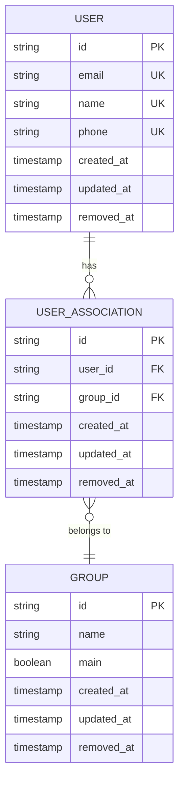

# User Entity Model

<cite>
**Referenced Files in This Document**   
- [user.entity.ts](file://packages/schema/src/entity/user.entity.ts)
- [user.dto.ts](file://packages/schema/src/dto/user.dto.ts)
- [user.prisma](file://packages/schema/prisma/schema/user.prisma)
- [user-association.entity.ts](file://packages/schema/src/entity/user-association.entity.ts)
- [user-classification.entity.ts](file://packages/schema/src/entity/user-classification.entity.ts)
- [entity-common-fields.ts](file://packages/schema/src/constant/entity-common-fields.ts)
</cite>

## Table of Contents
1. [User Entity Overview](#user-entity-overview)
2. [Field Definitions](#field-definitions)
3. [Relationships](#relationships)
4. [Soft-Delete Implementation](#soft-delete-implementation)
5. [Indexing and Query Patterns](#indexing-and-query-patterns)
6. [Constraints and Uniqueness](#constraints-and-uniqueness)

## User Entity Overview

The User entity represents the core user model in the prj-core system, serving as the primary identity for system participants. It contains essential user information and establishes relationships with various system components through association entities. The model follows a standardized structure with common metadata fields and implements soft-delete functionality for data integrity.

**Section sources**
- [user.entity.ts](file://packages/schema/src/entity/user.entity.ts#L1-L26)
- [user.prisma](file://packages/schema/prisma/schema/user.prisma#L1-L17)

## Field Definitions

The User entity comprises several fields that capture essential user information and metadata. Each field has specific data types, constraints, and purposes within the system.

### Core User Fields
- **id**: String - Primary identifier for the user, automatically generated as a UUID
- **email**: String - User's email address, stored as a unique field
- **name**: String - User's display name, stored as a unique field
- **phone**: String - User's contact phone number, stored as a unique field
- **password**: String - Hashed password for authentication

### Metadata Fields
- **createdAt**: DateTime - Timestamp of record creation, automatically set to current time
- **updatedAt**: DateTime? - Timestamp of last record update, automatically updated
- **removedAt**: DateTime? - Timestamp indicating soft deletion (null if active)
- **seq**: Int - Sequential integer identifier for ordering and indexing

**Section sources**
- [user.prisma](file://packages/schema/prisma/schema/user.prisma#L2-L15)
- [user.dto.ts](file://packages/schema/src/dto/user.dto.ts#L16-L58)
- [entity-common-fields.ts](file://packages/schema/src/constant/entity-common-fields.ts#L1-L8)

## Relationships

The User entity maintains several relationships with other entities in the system through association patterns. These relationships enable flexible user management across different organizational and functional contexts.

### Tenant Relationship (via UserAssociation)
The User-to-Tenant relationship is established through the UserAssociation entity, which creates a many-to-many relationship between users and tenants. Each UserAssociation record connects a user to a specific group (representing a tenant) within the system.



**Diagram sources**
- [user-association.entity.ts](file://packages/schema/src/entity/user-association.entity.ts#L1-L19)
- [user.prisma](file://packages/schema/prisma/schema/user.prisma#L34-L46)

### Role Relationship (via UserAssociation)
Roles are managed through the same UserAssociation pattern, where groups represent different role types within the system. The association connects users to role-bearing groups, enabling role-based access control.

### Space Relationship (via UserAssociation)
Space membership is also handled through UserAssociation, allowing users to be associated with multiple spaces through their group memberships. The spaceId field in UserDto indicates the current active space for the user.

### Classification Relationship (via UserClassification)
The User-to-Classification relationship is a one-to-one or zero-to-one relationship that categorizes users based on their type or classification. This relationship is used for user segmentation and specialized behavior.

```mermaid
erDiagram
USER {
string id PK
string email UK
string name UK
string phone UK
timestamp created_at
timestamp updated_at
timestamp removed_at
}
USER_CLASSIFICATION {
string id PK
string user_id FK UK
string category_id FK
timestamp created_at
timestamp updated_at
timestamp removed_at
}
CATEGORY {
string id PK
string name
string type
timestamp created_at
timestamp updated_at
timestamp removed_at
}
USER ||--|| USER_CLASSIFICATION : "has"
USER_CLASSIFICATION }o--|| CATEGORY : "classified as"
```

**Diagram sources**
- [user-classification.entity.ts](file://packages/schema/src/entity/user-classification.entity.ts#L1-L14)
- [user.prisma](file://packages/schema/prisma/schema/user.prisma#L19-L32)

## Soft-Delete Implementation

The User entity implements a soft-delete pattern using the removedAt field, which allows for data preservation while logically removing records from active system operations.

### Implementation Details
- The removedAt field is of type DateTime? (nullable timestamp)
- When a user is deleted, the removedAt field is set to the current timestamp
- Active users have a null value in the removedAt field
- The field is mapped to "removed_at" in the database with Timestamptz(6) type

### Querying Implications
Queries for active users must explicitly filter out records where removedAt is not null:
```sql
SELECT * FROM users WHERE removed_at IS NULL
```

Queries that need to include soft-deleted records should account for the removedAt timestamp to understand when the deletion occurred.

**Section sources**
- [user.prisma](file://packages/schema/prisma/schema/user.prisma#L6)
- [entity-common-fields.ts](file://packages/schema/src/constant/entity-common-fields.ts#L5)

## Indexing and Query Patterns

The User entity is optimized for common query patterns through strategic indexing and unique constraints.

### Email Lookup Indexing
The email field has a unique constraint, creating an implicit index that enables efficient lookups:
```prisma
email String @unique
```
This supports fast authentication and user retrieval by email address.

### Tenant Membership Queries
User-to-Tenant membership queries are optimized through the UserAssociation entity, which maintains foreign key relationships:
```prisma
userId String @map("user_id")
groupId String @map("group_id")
```
The association table allows efficient querying of users within a specific tenant (group).

### Status Filtering
Status filtering (active vs. deleted users) is supported by the removedAt field:
```prisma
removedAt DateTime? @map("removed_at") @db.Timestamptz(6)
```
An index on this field enables efficient filtering of active users (removedAt IS NULL).

**Section sources**
- [user.prisma](file://packages/schema/prisma/schema/user.prisma#L9)
- [user-association.entity.ts](file://packages/schema/src/entity/user-association.entity.ts#L13-L14)

## Constraints and Uniqueness

The User entity enforces several constraints to maintain data integrity and prevent duplicates.

### Unique Constraints
- **email**: Ensures each user has a unique email address
- **name**: Ensures each user has a unique name
- **phone**: Ensures each user has a unique phone number
- **UserClassification.userId**: Ensures a user can have only one classification

### Field Constraints
- **id**: Required, UUID format, primary key
- **seq**: Required, auto-incrementing integer, unique
- **createdAt**: Required, defaults to current timestamp
- **updatedAt**: Optional, automatically updated on record changes
- **removedAt**: Optional, set when user is soft-deleted

The unique constraints on email, name, and phone fields prevent duplicate user records and ensure data consistency across the system.

**Section sources**
- [user.prisma](file://packages/schema/prisma/schema/user.prisma#L7-L9)
- [user-classification.entity.ts](file://packages/schema/src/entity/user-classification.entity.ts#L23)