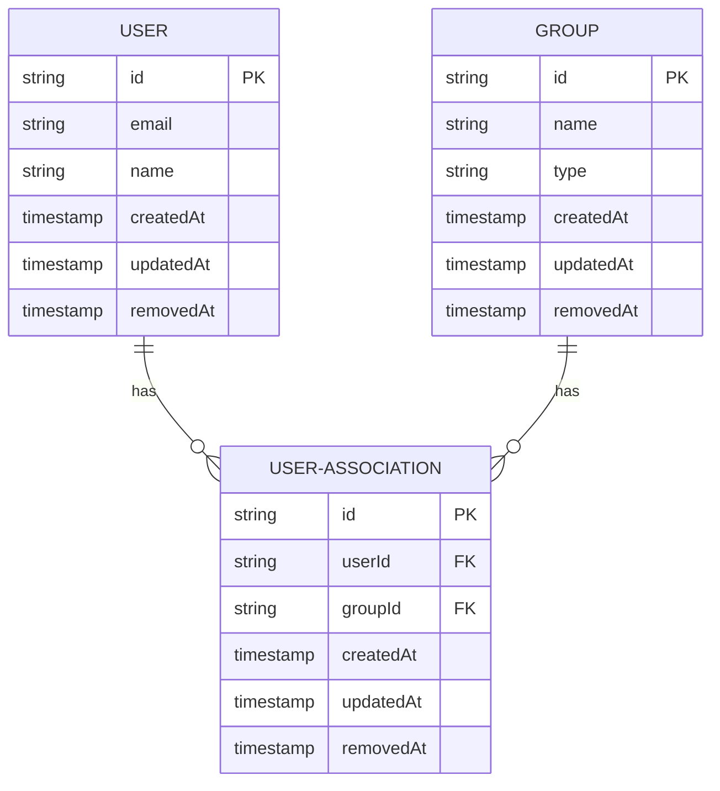
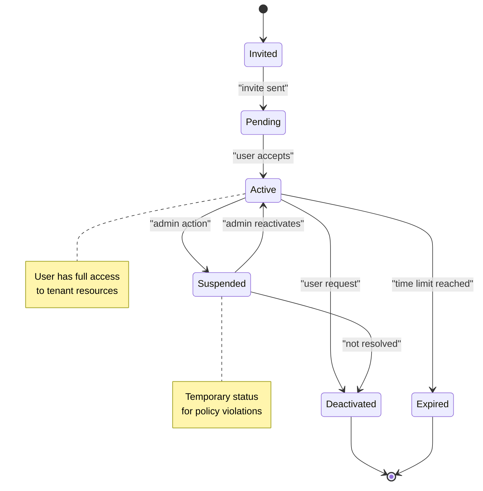
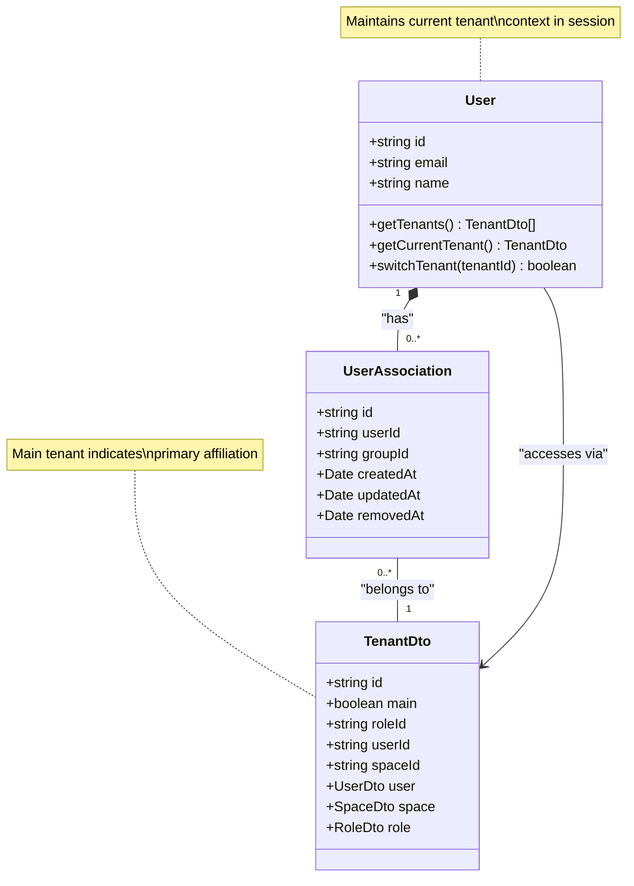
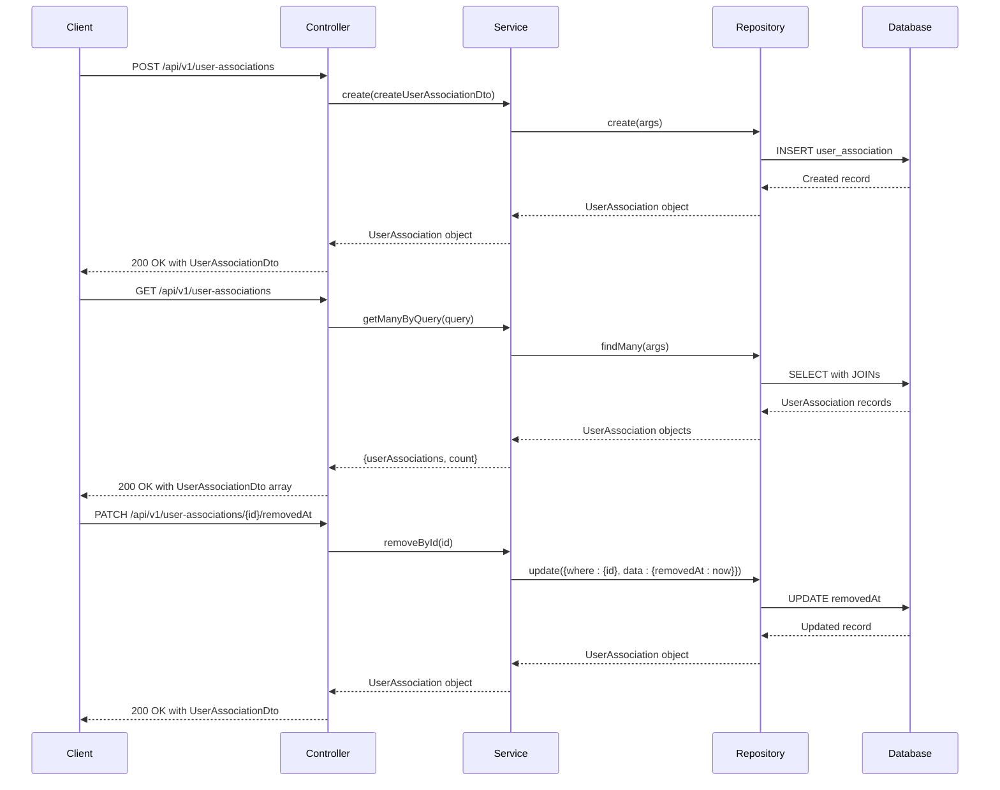

# User-Tenant Associations

<cite>
**Referenced Files in This Document**   
- [user-association.entity.ts](file://packages/schema/src/entity/user-association.entity.ts)
- [user-association.dto.ts](file://packages/schema/src/dto/user-association.dto.ts)
- [user-associations.controller.ts](file://apps/server/src/shared/controller/resources/user-associations.controller.ts)
- [user-associations.service.ts](file://apps/server/src/shared/service/resources/user-associations.service.ts)
- [user-associations.repository.ts](file://apps/server/src/shared/repository/user-associations.repository.ts)
- [tenant.entity.ts](file://packages/schema/src/entity/tenant.entity.ts)
- [tenant.dto.ts](file://packages/schema/src/dto/tenant.dto.ts)
- [user.dto.ts](file://packages/api-client/src/model/userDto.ts)
</cite>

## Table of Contents
1. [Introduction](#introduction)
2. [UserAssociation Entity Structure](#userassociation-entity-structure)
3. [Relationship Lifecycle](#relationship-lifecycle)
4. [Multiple Tenant Membership](#multiple-tenant-membership)
5. [API Endpoints](#api-endpoints)
6. [Audit Logging and Compliance](#audit-logging-and-compliance)

## Introduction
This document provides comprehensive documentation for User-Tenant associations in the prj-core system. It details the UserAssociation entity structure, relationship lifecycle from invitation to deactivation, handling of multiple tenant memberships, API endpoints for managing user-tenant relationships, and audit logging requirements for compliance.

## UserAssociation Entity Structure

The UserAssociation entity represents the relationship between users and groups within the system. It serves as a bridge entity that connects users to their respective groups, enabling fine-grained access control and membership management.

**Diagram sources**
- [user-association.entity.ts](file://packages/schema/src/entity/user-association.entity.ts)
- [user.entity.ts](file://packages/schema/src/entity/user.entity.ts)
- [group.entity.ts](file://packages/schema/src/entity/group.entity.ts)

The UserAssociation entity contains the following fields:

- **userId**: Foreign key referencing the User entity, establishing the user side of the association
- **groupId**: Foreign key referencing the Group entity, establishing the group/tenant side of the association
- **createdAt**: Timestamp indicating when the association was created
- **updatedAt**: Timestamp automatically updated when the association is modified
- **removedAt**: Timestamp used for soft deletion of the association, preserving audit trail

The entity extends AbstractEntity which provides common fields and functionality across all entities in the system. The relationship is implemented as a many-to-many association through this junction table, allowing users to belong to multiple groups and groups to have multiple users.

**Section sources**
- [user-association.entity.ts](file://packages/schema/src/entity/user-association.entity.ts)
- [user-association.dto.ts](file://packages/schema/src/dto/user-association.dto.ts)

## Relationship Lifecycle

The user-tenant relationship follows a defined lifecycle from creation through active membership to deactivation. The system implements a soft deletion pattern rather than permanent removal to maintain audit trails and compliance requirements.

**Diagram sources**
- [user-associations.service.ts](file://apps/server/src/shared/service/resources/user-associations.service.ts)
- [user-associations.controller.ts](file://apps/server/src/shared/controller/resources/user-associations.controller.ts)

The lifecycle begins with a user invitation, which creates a pending association. When the user accepts the invitation, the status transitions to active. Active members have full access to tenant resources based on their assigned roles.

Administrators can suspend memberships for policy violations or security concerns, which temporarily restricts access while preserving the association record. Users can request deactivation of their membership, which initiates the deactivation process.

The system also supports automatic expiration of memberships based on time limits, which is useful for temporary contractors or time-bound collaborations. All state transitions are logged for audit purposes, and the removedAt field is populated when an association is deactivated, rather than permanently deleting the record.

**Section sources**
- [user-associations.service.ts](file://apps/server/src/shared/service/resources/user-associations.service.ts)
- [user-associations.controller.ts](file://apps/server/src/shared/controller/resources/user-associations.controller.ts)

## Multiple Tenant Membership

The system supports multiple tenant memberships for individual users through the UserAssociation entity. This design allows users to belong to multiple groups or tenants simultaneously, facilitating cross-organizational collaboration and role-based access across different business units.

**Diagram sources**
- [user.dto.ts](file://packages/api-client/src/model/userDto.ts)
- [tenant.dto.ts](file://packages/schema/src/dto/tenant.dto.ts)
- [user-association.entity.ts](file://packages/schema/src/entity/user-association.entity.ts)

Each user can have multiple UserAssociation records, each linking to a different group (tenant). The system distinguishes between a user's main tenant and additional tenants. The main tenant typically represents the user's primary organizational affiliation, while additional tenants represent secondary affiliations or collaborative relationships.

Users can switch between their affiliated tenants through the system interface, with the current tenant context maintained in their session. Access to resources is always evaluated in the context of the current tenant, ensuring proper data isolation and security boundaries.

The UserDto model includes a tenants property that contains the list of all tenant associations for a user, allowing client applications to present tenant switching options. The associations property in UserDto contains the UserAssociationDto objects that represent these relationships.

**Section sources**
- [user.dto.ts](file://packages/api-client/src/model/userDto.ts)
- [tenant.dto.ts](file://packages/schema/src/dto/tenant.dto.ts)
- [user-association.dto.ts](file://packages/schema/src/dto/user-association.dto.ts)

## API Endpoints

The system provides a comprehensive set of API endpoints for managing user-tenant relationships, with appropriate permission requirements for each operation.

**Diagram sources**
- [user-associations.controller.ts](file://apps/server/src/shared/controller/resources/user-associations.controller.ts)
- [user-associations.service.ts](file://apps/server/src/shared/service/resources/user-associations.service.ts)
- [user-associations.repository.ts](file://apps/server/src/shared/repository/user-associations.repository.ts)

The following API endpoints are available for managing user-tenant associations:

**POST /api/v1/user-associations**
- Creates a new user-tenant association
- Requires administrative privileges or appropriate role permissions
- Accepts CreateUserAssociationDto with userId and groupId
- Returns the created UserAssociationDto object
- Permission: TenantAdmin or SystemAdmin

**GET /api/v1/user-associations**
- Retrieves user-tenant associations with query parameters
- Supports pagination, filtering, and sorting
- Returns array of UserAssociationDto objects with metadata
- Permission: TenantAdmin, SystemAdmin, or self (for own associations)

**GET /api/v1/user-associations/{userAssociationId}**
- Retrieves a specific user-tenant association by ID
- Returns UserAssociationDto object
- Permission: TenantAdmin, SystemAdmin, or self (if associated)

**PATCH /api/v1/user-associations/{userAssociationId}**
- Updates a user-tenant association
- Accepts partial updates via UpdateUserAssociationDto
- Typically used for role changes within a tenant
- Permission: TenantAdmin or SystemAdmin

**PATCH /api/v1/user-associations/{userAssociationId}/removedAt**
- Deactivates a user-tenant association (soft delete)
- Sets the removedAt timestamp without deleting the record
- Preserves audit trail while removing access
- Permission: TenantAdmin, SystemAdmin, or self (for own deactivation)

**PATCH /api/v1/user-associations/removedAt**
- Bulk deactivation of multiple user-tenant associations
- Accepts array of userAssociationIds
- Processes each deactivation individually for proper logging
- Permission: TenantAdmin or SystemAdmin

**DELETE /api/v1/user-associations/{userAssociationId}**
- Permanently deletes a user-tenant association
- Reserved for system administrators in exceptional circumstances
- Bypasses soft deletion for complete removal
- Permission: SystemAdmin only

All endpoints return standardized response entities with appropriate HTTP status codes and structured data. The system implements proper error handling and validation for all operations.

**Section sources**
- [user-associations.controller.ts](file://apps/server/src/shared/controller/resources/user-associations.controller.ts)
- [user-associations.service.ts](file://apps/server/src/shared/service/resources/user-associations.service.ts)

## Audit Logging and Compliance

The system implements comprehensive audit logging for all user-tenant association changes to meet compliance requirements and support security investigations.

The audit logging strategy includes:

1. **Soft Deletion Pattern**: Instead of permanently deleting user-tenant associations, the system sets the removedAt timestamp. This preserves the historical record of the relationship while removing active access.

2. **Timestamp Tracking**: All UserAssociation records include createdAt, updatedAt, and removedAt fields that provide a complete timeline of the relationship lifecycle.

3. **Service Layer Logging**: The UserAssociationsService and UserAssociationsRepository classes include debug-level logging for all operations, capturing the intent and outcome of each change.

4. **Immutable Records**: Once created, UserAssociation records are never modified except for the removedAt field during deactivation. This ensures the integrity of the audit trail.

5. **Compliance Requirements**: The system maintains membership records in accordance with regulatory requirements, including:
   - Data retention policies for access logs
   - Audit trail preservation for security investigations
   - Proof of access revocation for compliance reporting
   - Historical record of user affiliations

The audit logs capture the following information for each user-tenant association change:
- Timestamp of the change
- User initiating the change (actor)
- Target user and tenant involved
- Type of operation (create, update, deactivate)
- Previous and new state (where applicable)
- IP address and user agent of the requesting client

These logs are retained according to the organization's data retention policy and are available to authorized personnel for compliance audits and security investigations. The system ensures that even when a user's membership is deactivated, the complete history of their affiliations remains available for audit purposes.

**Section sources**
- [user-associations.repository.ts](file://apps/server/src/shared/repository/user-associations.repository.ts)
- [user-association.entity.ts](file://packages/schema/src/entity/user-association.entity.ts)
- [user-associations.service.ts](file://apps/server/src/shared/service/resources/user-associations.service.ts)