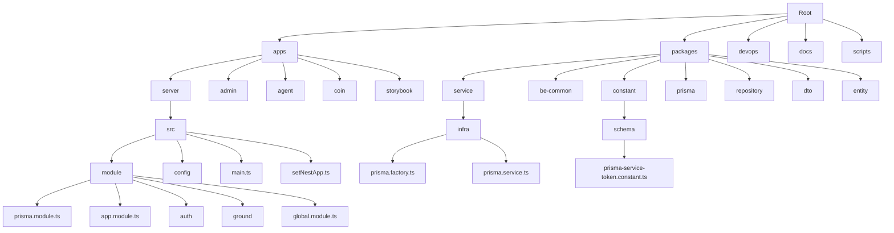
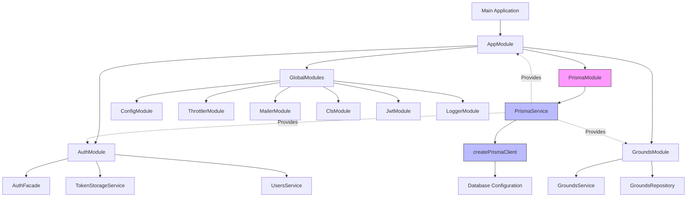
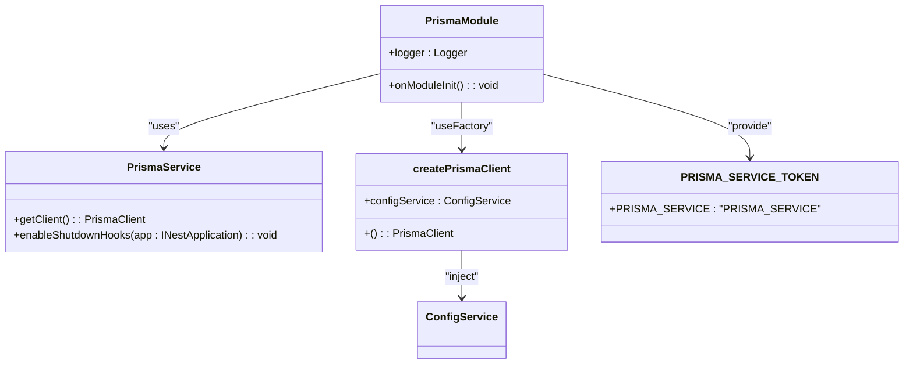
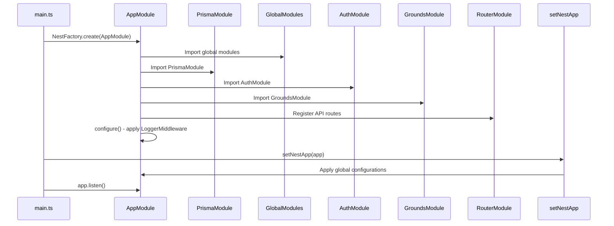
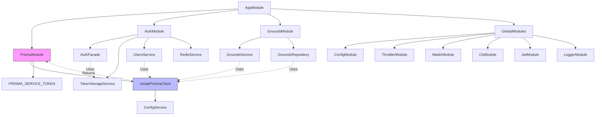
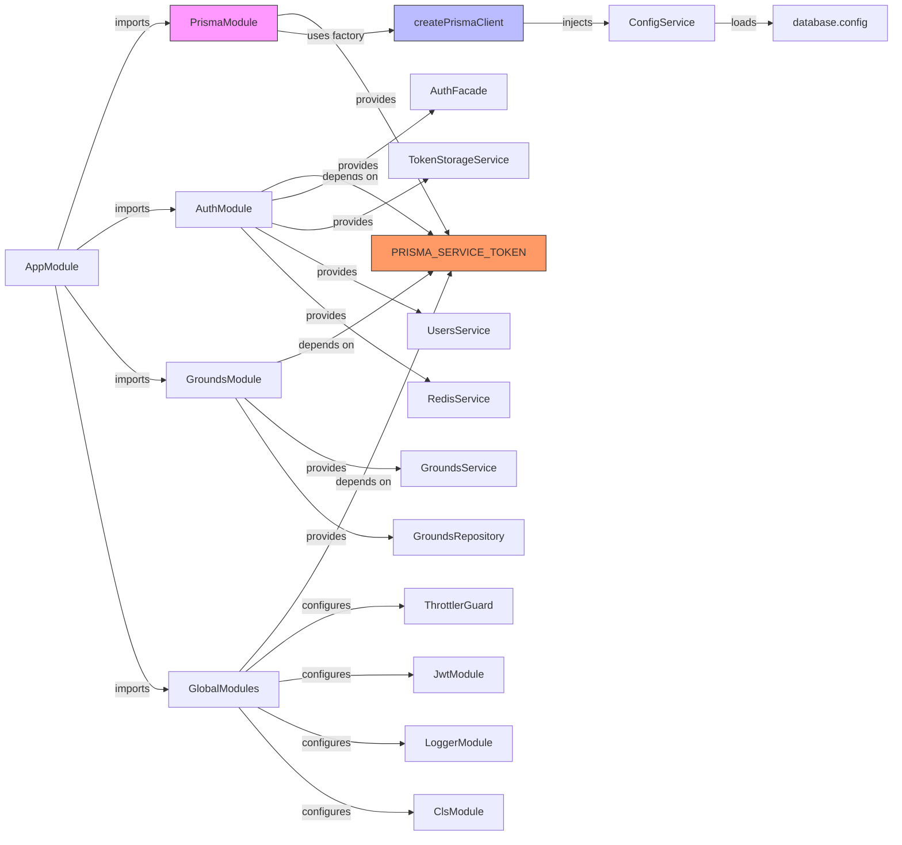

# Modular Backend Architecture with PrismaModule

<cite>
**Referenced Files in This Document**   
- [prisma.module.ts](file://apps/server/src/module/prisma.module.ts)
- [app.module.ts](file://apps/server/src/module/app.module.ts)
- [main.ts](file://apps/server/src/main.ts)
- [setNestApp.ts](file://apps/server/src/setNestApp.ts)
- [global.module.ts](file://apps/server/src/module/global.module.ts)
- [prisma.factory.ts](file://packages/service/src/infra/prisma.factory.ts)
- [prisma.service.ts](file://packages/service/src/infra/prisma.service.ts)
- [auth.module.ts](file://apps/server/src/module/auth/auth.module.ts)
- [grounds.module.ts](file://apps/server/src/module/ground/grounds.module.ts)
- [prisma-service-token.constant.ts](file://packages/constant/src/schema/prisma-service-token.constant.ts)
</cite>

## Table of Contents
1. [Introduction](#introduction)
2. [Project Structure](#project-structure)
3. [Core Components](#core-components)
4. [Architecture Overview](#architecture-overview)
5. [Detailed Component Analysis](#detailed-component-analysis)
6. [Dependency Analysis](#dependency-analysis)
7. [Performance Considerations](#performance-considerations)
8. [Troubleshooting Guide](#troubleshooting-guide)
9. [Conclusion](#conclusion)

## Introduction
This document provides a comprehensive analysis of the modular backend architecture implemented in the NestJS application, with a specific focus on the PrismaModule integration. The architecture follows a clean, modular design pattern with clear separation of concerns, leveraging NestJS modules, dependency injection, and Prisma ORM for database operations. The system is designed for scalability, maintainability, and testability, with a well-defined structure that separates configuration, services, repositories, and business logic.

## Project Structure

**Diagram sources**
- [apps/server/src/module/prisma.module.ts](file://apps/server/src/module/prisma.module.ts)
- [packages/service/src/infra/prisma.factory.ts](file://packages/service/src/infra/prisma.factory.ts)
- [packages/constant/src/schema/prisma-service-token.constant.ts](file://packages/constant/src/schema/prisma-service-token.constant.ts)

**Section sources**
- [apps/server/src/module/prisma.module.ts](file://apps/server/src/module/prisma.module.ts)
- [apps/server/src/module/app.module.ts](file://apps/server/src/module/app.module.ts)
- [packages/service/src/infra/index.ts](file://packages/service/src/infra/index.ts)

## Core Components

The core components of this modular backend architecture revolve around the PrismaModule, which serves as the central database access layer. The architecture implements a clean separation between the database client creation, service layer, and application modules. The PrismaModule is designed as a global module that provides a singleton Prisma client instance throughout the application, ensuring efficient database connection management and consistent access patterns.

The architecture leverages dependency injection to provide the Prisma service to various components, with the token `PRISMA_SERVICE_TOKEN` serving as the injection token. This approach allows for flexible configuration and easy testing, as the Prisma client can be easily mocked or replaced in different environments. The module system is organized to promote reusability and maintainability, with shared functionality extracted into reusable packages.

**Section sources**
- [prisma.module.ts](file://apps/server/src/module/prisma.module.ts)
- [app.module.ts](file://apps/server/src/module/app.module.ts)
- [global.module.ts](file://apps/server/src/module/global.module.ts)

## Architecture Overview

**Diagram sources**
- [app.module.ts](file://apps/server/src/module/app.module.ts)
- [prisma.module.ts](file://apps/server/src/module/prisma.module.ts)
- [global.module.ts](file://apps/server/src/module/global.module.ts)
- [prisma.factory.ts](file://packages/service/src/infra/prisma.factory.ts)

## Detailed Component Analysis

### Prisma Module Analysis

**Diagram sources**
- [prisma.module.ts](file://apps/server/src/module/prisma.module.ts)
- [prisma.service.ts](file://packages/service/src/infra/prisma.service.ts)
- [prisma.factory.ts](file://packages/service/src/infra/prisma.factory.ts)
- [prisma-service-token.constant.ts](file://packages/constant/src/schema/prisma-service-token.constant.ts)

**Section sources**
- [prisma.module.ts](file://apps/server/src/module/prisma.module.ts#L1-L24)
- [prisma.factory.ts](file://packages/service/src/infra/prisma.factory.ts#L1-L10)
- [prisma.service.ts](file://packages/service/src/infra/prisma.service.ts#L1-L50)

### Application Module Analysis

**Diagram sources**
- [main.ts](file://apps/server/src/main.ts#L1-L88)
- [app.module.ts](file://apps/server/src/module/app.module.ts#L1-L75)
- [setNestApp.ts](file://apps/server/src/setNestApp.ts#L1-L56)

**Section sources**
- [main.ts](file://apps/server/src/main.ts#L1-L88)
- [app.module.ts](file://apps/server/src/module/app.module.ts#L1-L75)
- [setNestApp.ts](file://apps/server/src/setNestApp.ts#L1-L56)

### Module Dependencies Analysis

**Diagram sources**
- [app.module.ts](file://apps/server/src/module/app.module.ts)
- [prisma.module.ts](file://apps/server/src/module/prisma.module.ts)
- [auth.module.ts](file://apps/server/src/module/auth/auth.module.ts)
- [grounds.module.ts](file://apps/server/src/module/ground/grounds.module.ts)

**Section sources**
- [app.module.ts](file://apps/server/src/module/app.module.ts#L1-L75)
- [prisma.module.ts](file://apps/server/src/module/prisma.module.ts#L1-L24)
- [auth.module.ts](file://apps/server/src/module/auth/auth.module.ts#L1-L28)
- [grounds.module.ts](file://apps/server/src/module/ground/grounds.module.ts#L1-L12)

## Dependency Analysis

**Diagram sources**
- [app.module.ts](file://apps/server/src/module/app.module.ts)
- [prisma.module.ts](file://apps/server/src/module/prisma.module.ts)
- [global.module.ts](file://apps/server/src/module/global.module.ts)
- [prisma.factory.ts](file://packages/service/src/infra/prisma.factory.ts)

**Section sources**
- [app.module.ts](file://apps/server/src/module/app.module.ts#L1-L75)
- [prisma.module.ts](file://apps/server/src/module/prisma.module.ts#L1-L24)
- [global.module.ts](file://apps/server/src/module/global.module.ts#L1-L153)

## Performance Considerations
The modular architecture with PrismaModule provides several performance benefits. The singleton pattern used for the Prisma client ensures that database connections are efficiently managed and reused across the application, reducing connection overhead. The global module configuration allows for centralized management of services and configurations, minimizing redundant initialization.

The use of connection pooling through Prisma's built-in connection management helps optimize database resource utilization. The architecture also supports horizontal scaling through the use of Redis for token storage and distributed caching. The modular design enables selective loading of features, which can improve startup time and memory usage in production environments.

The implementation of global guards and interceptors in a centralized manner reduces the overhead of repetitive security and logging operations. The validation pipe with whitelisting improves security while minimizing processing overhead by automatically removing undefined properties from incoming requests.

## Troubleshooting Guide

When encountering issues with the PrismaModule or database connectivity, check the following:

1. Verify that the database configuration is correctly set in environment variables or configuration files
2. Ensure that the Prisma client is properly initialized and the connection is established
3. Check that the PRISMA_SERVICE_TOKEN is correctly provided and injected in dependent modules
4. Validate that the database schema is synchronized with the Prisma schema definitions
5. Monitor connection pool usage and adjust configuration if experiencing connection timeouts

For authentication-related issues, verify that the JwtModule is properly configured with valid secrets and expiration times. Check that the TokenStorageService is correctly integrated with Redis for token management.

**Section sources**
- [prisma.module.ts](file://apps/server/src/module/prisma.module.ts#L1-L24)
- [global.module.ts](file://apps/server/src/module/global.module.ts#L1-L153)
- [setNestApp.ts](file://apps/server/src/setNestApp.ts#L1-L56)

## Conclusion
The modular backend architecture with PrismaModule demonstrates a well-structured approach to building scalable NestJS applications. The clear separation of concerns, use of dependency injection, and centralized configuration management contribute to a maintainable and extensible codebase. The PrismaModule serves as a robust foundation for database operations, providing a consistent interface across the application while abstracting the complexities of database connection management.

The architecture's modularity allows for easy addition of new features and services without disrupting existing functionality. The use of global modules for shared configuration and services promotes consistency and reduces code duplication. This design pattern facilitates team collaboration by providing clear boundaries and interfaces between different components of the system.