# Auth Module

<cite>
**Referenced Files in This Document**   
- [auth.module.ts](file://apps/server/src/module/auth.module.ts)
- [auth.controller.ts](file://apps/server/src/shared/controller/domains/auth.controller.ts)
- [jwt.strategy.ts](file://apps/server/src/shared/strategy/jwt.strategy.ts)
- [local.strategy.ts](file://apps/server/src/shared/strategy/local.strategy.ts)
- [auth.guard.ts](file://apps/server/src/shared/guard/auth.guard.ts)
- [auth.facade.ts](file://apps/server/src/shared/service/facade/auth.facade.ts)
- [auth.domain.ts](file://apps/server/src/shared/service/domain/auth.domain.ts)
- [token.service.ts](file://apps/server/src/shared/service/utils/token.service.ts)
- [password.service.ts](file://apps/server/src/shared/service/utils/password.service.ts)
- [users.service.ts](file://apps/server/src/shared/service/resources/users.service.ts)
- [users.repository.ts](file://apps/server/src/shared/repository/users.repository.ts)
- [context.service.ts](file://apps/server/src/shared/service/utils/context.service.ts)
- [token-types.constant.ts](file://packages/schema/src/constant/token-types.constant.ts)
- [tokenStore.ts](file://packages/store/src/stores/tokenStore.ts)
- [authStore.ts](file://packages/store/src/stores/authStore.ts)
</cite>

## Table of Contents
1. [Introduction](#introduction)
2. [Authentication Strategies](#authentication-strategies)
3. [Auth Module Structure](#auth-module-structure)
4. [Controller Endpoints](#controller-endpoints)
5. [Token Management](#token-management)
6. [Service Layer Implementation](#service-layer-implementation)
7. [User Entity Relationships](#user-entity-relationships)
8. [Authentication Flow](#authentication-flow)
9. [Frontend Integration](#frontend-integration)
10. [Common Issues and Solutions](#common-issues-and-solutions)
11. [Security Considerations](#security-considerations)

## Introduction

The Auth Module in prj-core provides a comprehensive authentication system built on NestJS with Passport.js integration. It implements JWT-based authentication with refresh token rotation, supporting both local email/password authentication and potential future OAuth strategies. The module follows a layered architecture with clear separation of concerns between controllers, services, domain logic, and data access layers.

The authentication system is designed to support multi-tenancy, where users can belong to multiple tenant organizations with different roles and permissions. It uses HTTP-only cookies to store tokens securely, mitigating XSS attacks while maintaining a seamless user experience.

**Section sources**
- [auth.module.ts](file://apps/server/src/module/auth.module.ts#L1-L31)

## Authentication Strategies

The Auth Module implements two primary authentication strategies using Passport.js: JWT for stateless authentication and Local for initial credential-based login.

### JWT Strategy

The JWT strategy is implemented in `JwtStrategy` class and is responsible for validating JWT tokens from incoming requests. It extracts tokens from both cookies and Authorization headers, providing flexibility for different client types. The strategy first attempts to extract the token from the `accessToken` cookie, and if not found, falls back to the Bearer token in the Authorization header.

When a token is successfully extracted, the strategy validates it using the configured secret and then calls the `validate` method to verify the user's existence in the database. The validation process retrieves the user with their associated tenants and roles, ensuring that the user account is still active and valid.

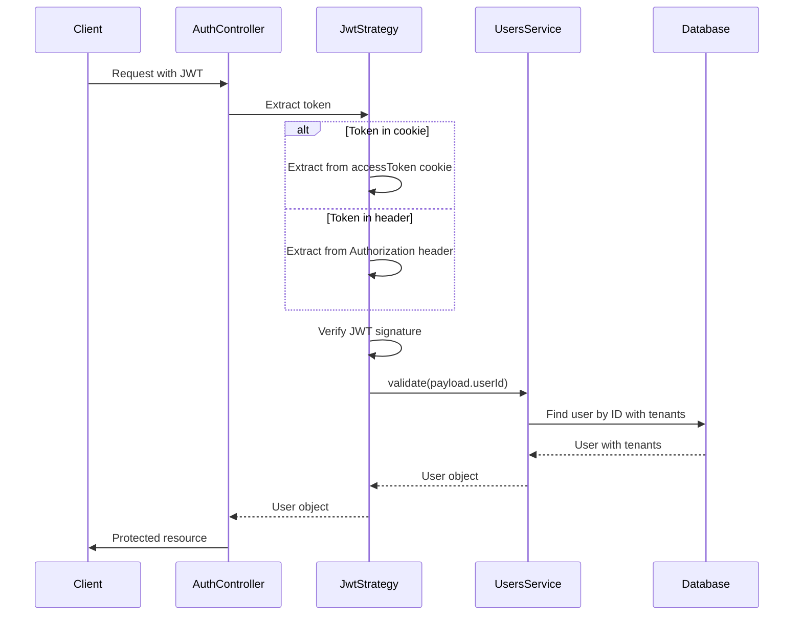

**Diagram sources**
- [jwt.strategy.ts](file://apps/server/src/shared/strategy/jwt.strategy.ts#L1-L118)
- [users.service.ts](file://apps/server/src/shared/service/resources/users.service.ts#L59-L93)

### Local Strategy

The Local strategy handles the initial authentication using email and password credentials. Implemented in the `LocalStrategy` class, it delegates the actual user validation to the `AuthFacade`, which in turn uses the `AuthDomain` to verify the credentials against the stored hashed password.

The strategy is configured to use "email" as the username field, aligning with common authentication practices. Upon successful validation, it returns the user object which is then used to generate JWT tokens for subsequent requests.

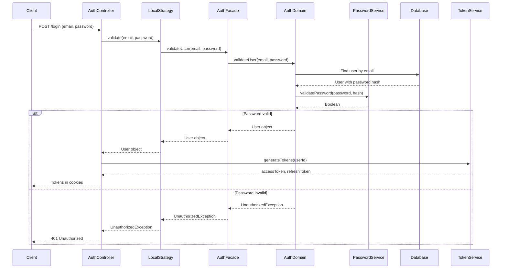

**Diagram sources**
- [local.strategy.ts](file://apps/server/src/shared/strategy/local.strategy.ts#L1-L18)
- [auth.facade.ts](file://apps/server/src/shared/service/facade/auth.facade.ts#L51-L53)
- [auth.domain.ts](file://apps/server/src/shared/service/domain/auth.domain.ts#L35-L56)

**Section sources**
- [jwt.strategy.ts](file://apps/server/src/shared/strategy/jwt.strategy.ts#L1-L118)
- [local.strategy.ts](file://apps/server/src/shared/strategy/local.strategy.ts#L1-L18)

## Auth Module Structure

The Auth Module is structured according to NestJS best practices, with a clear separation of concerns between different components. The module definition in `auth.module.ts` imports and configures all necessary providers and controllers.

The module exports the `AuthFacade` as a provider, allowing other modules to access authentication functionality without exposing the underlying implementation details. This facade pattern provides a simplified interface to the complex authentication logic, making it easier to use and test.

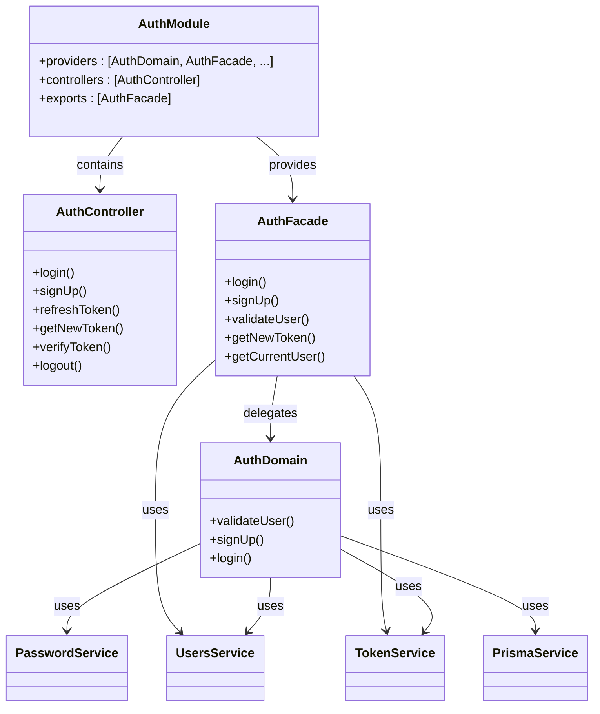

**Diagram sources**
- [auth.module.ts](file://apps/server/src/module/auth.module.ts#L1-L31)
- [auth.facade.ts](file://apps/server/src/shared/service/facade/auth.facade.ts#L1-L69)
- [auth.domain.ts](file://apps/server/src/shared/service/domain/auth.domain.ts#L1-L147)

The module imports several key services:
- `AuthDomain`: Contains pure business logic for authentication
- `AuthFacade`: Orchestrates domain logic and utility services
- `PasswordService`: Handles password hashing and verification
- `TokenService`: Manages JWT token generation and validation
- `LocalStrategy` and `JwtStrategy`: Passport.js authentication strategies
- `UsersService`: Provides user data access operations
- `UsersRepository`: Abstracts database operations for users
- `ContextService`: Manages request-scoped context data

This layered architecture ensures that each component has a single responsibility, making the codebase more maintainable and testable.

**Section sources**
- [auth.module.ts](file://apps/server/src/module/auth.module.ts#L1-L31)

## Controller Endpoints

The AuthController exposes several REST endpoints for authentication operations, each with comprehensive Swagger documentation and error handling.

### Login Endpoint

The `/login` endpoint accepts email and password credentials and returns JWT tokens in HTTP-only cookies. The endpoint is marked as `@Public()` to allow unauthenticated access. Upon successful authentication, it returns the user information along with the main tenant ID.

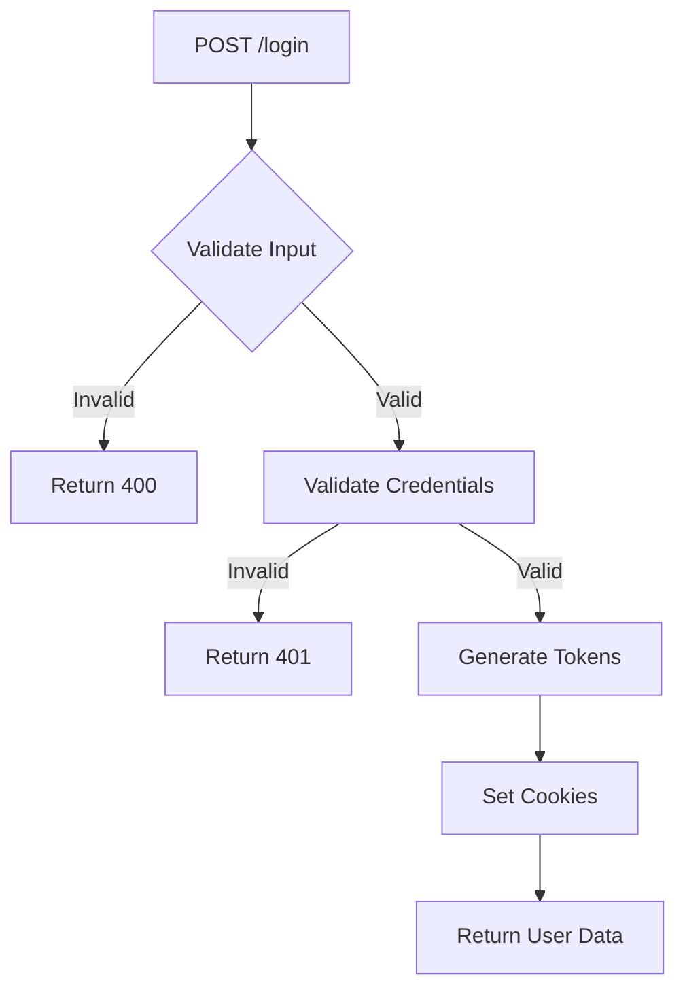

### Token Refresh Endpoint

The `/token/refresh` endpoint allows clients to obtain new access and refresh tokens using a valid refresh token. This endpoint extracts the refresh token from cookies and uses it to generate new tokens, implementing a token rotation strategy to enhance security.

### New Token Endpoint

The `/new-token` endpoint is designed for authenticated users to refresh their access token without requiring re-authentication. It requires a valid access token and uses the refresh token from cookies to generate new tokens, updating the cookies with the new values.

### Additional Endpoints

The controller also provides:
- `/sign-up`: For new user registration
- `/verify-token`: To check if the current access token is valid
- `/logout`: To clear all authentication cookies

Each endpoint includes proper error handling with specific error messages defined in the `AuthErrorMessages` constant, ensuring consistent error reporting across the application.

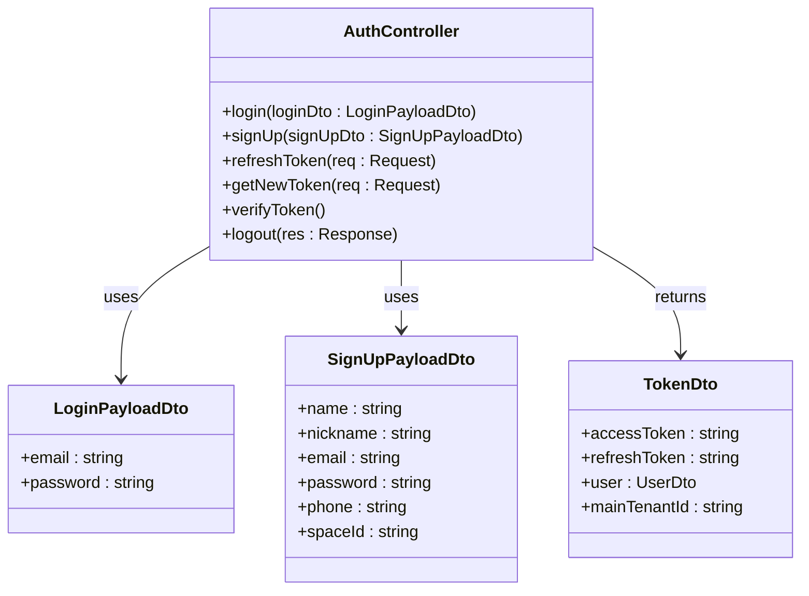

**Diagram sources**
- [auth.controller.ts](file://apps/server/src/shared/controller/domains/auth.controller.ts#L1-L254)
- [auth.facade.ts](file://apps/server/src/shared/service/facade/auth.facade.ts#L65-L68)

**Section sources**
- [auth.controller.ts](file://apps/server/src/shared/controller/domains/auth.controller.ts#L1-L254)

## Token Management

The authentication system implements a dual-token strategy using access and refresh tokens, enhancing security while maintaining a good user experience.

### Token Types

The system defines two token types in the `TokenType` enum:
- `ACCESS_TOKEN`: Short-lived token for accessing protected resources
- `REFRESH_TOKEN`: Long-lived token for obtaining new access tokens

These tokens are stored in HTTP-only cookies to prevent access via JavaScript, mitigating XSS attacks. The access token typically has a short expiration (e.g., 15 minutes), while the refresh token has a longer lifespan (e.g., 7 days).

### Token Service

The `TokenService` class handles all token operations, including generation, validation, and cookie management. It uses NestJS's JwtService for JWT operations and provides methods to set tokens in cookies with appropriate security settings.

The service generates tokens using the user's ID as the payload, ensuring that each token is tied to a specific user. When generating refresh tokens, it uses a longer expiration time configured in the application settings.

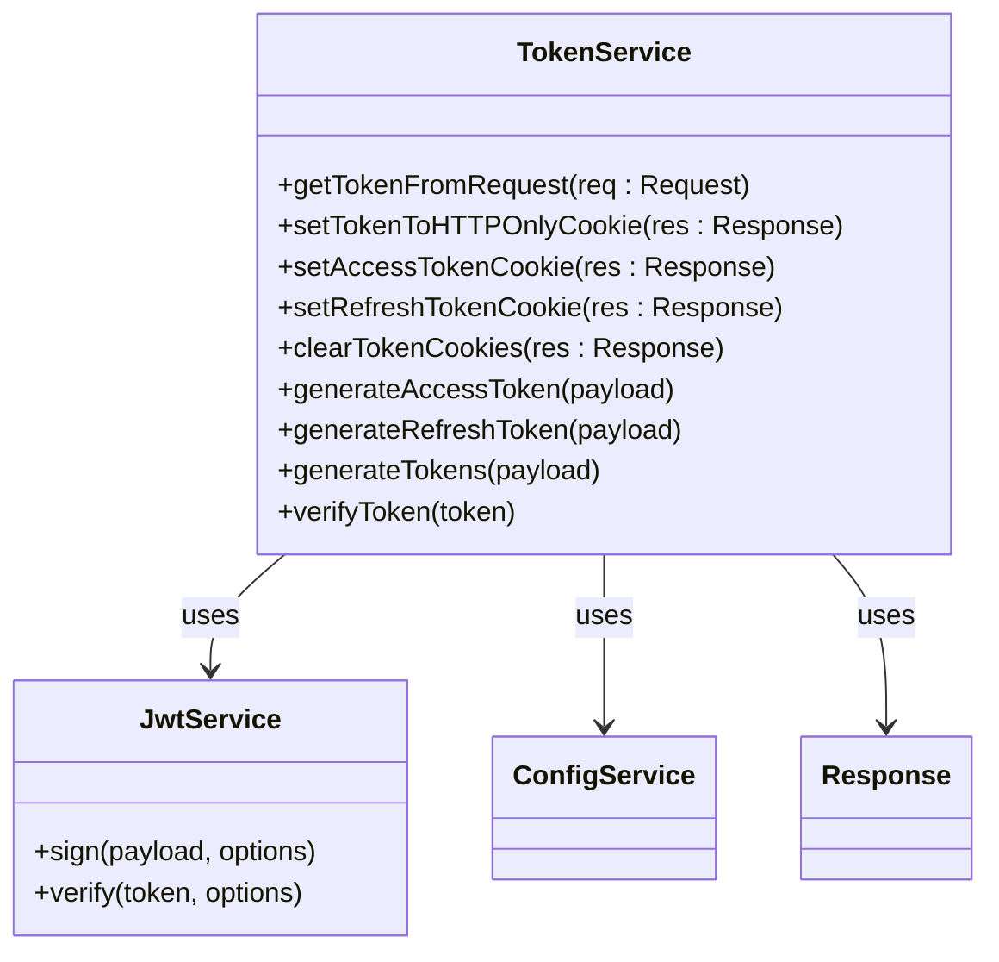

**Diagram sources**
- [token.service.ts](file://apps/server/src/shared/service/utils/token.service.ts#L1-L92)
- [jwt.strategy.ts](file://apps/server/src/shared/strategy/jwt.strategy.ts#L1-L118)

### Token Validation

Token validation occurs at multiple levels:
1. The JWT strategy verifies the token signature and expiration
2. The validate method checks if the user still exists in the database
3. The context service stores the authenticated user for the request duration

This multi-layered approach ensures that even if a token is technically valid, access is denied if the user account has been deactivated or deleted.

**Section sources**
- [token.service.ts](file://apps/server/src/shared/service/utils/token.service.ts#L1-L92)
- [token-types.constant.ts](file://packages/schema/src/constant/token-types.constant.ts#L1-L4)

## Service Layer Implementation

The authentication logic is organized into a layered service architecture, with each layer having a specific responsibility.

### Auth Facade

The `AuthFacade` serves as an orchestrator, coordinating between domain logic and utility services. It provides a simplified interface to complex authentication operations, following the Facade pattern. The facade delegates business logic to the `AuthDomain` and uses utility services for cross-cutting concerns like token generation.

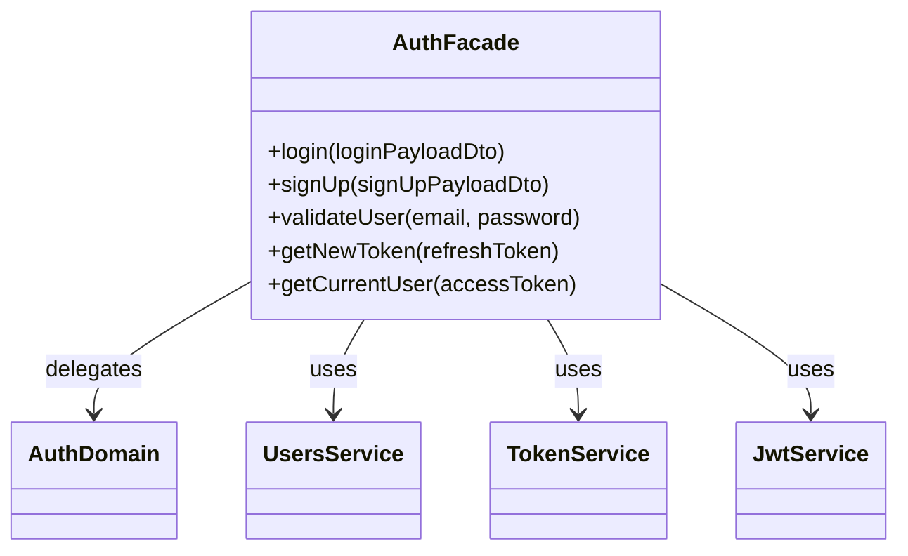

**Diagram sources**
- [auth.facade.ts](file://apps/server/src/shared/service/facade/auth.facade.ts#L1-L69)

### Auth Domain

The `AuthDomain` contains pure business logic for authentication operations, without dependencies on framework-specific features. It handles user validation, login, and registration logic, ensuring that business rules are enforced consistently.

The domain layer is responsible for:
- Validating user credentials against stored hashes
- Creating new user accounts with associated tenants
- Generating tokens for successful authentication

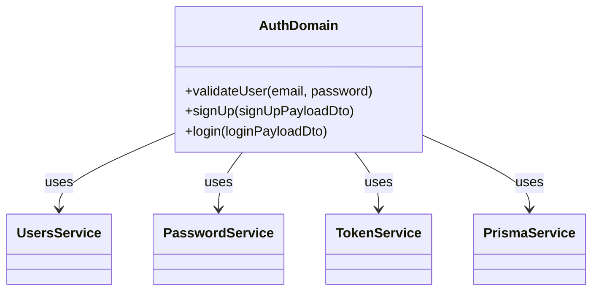

**Diagram sources**
- [auth.domain.ts](file://apps/server/src/shared/service/domain/auth.domain.ts#L1-L147)

### Password Service

The `PasswordService` handles password hashing and verification using bcrypt. It provides both instance methods for dependency injection and static methods for convenience. The service uses a configurable salt round value, allowing security levels to be adjusted based on performance requirements.

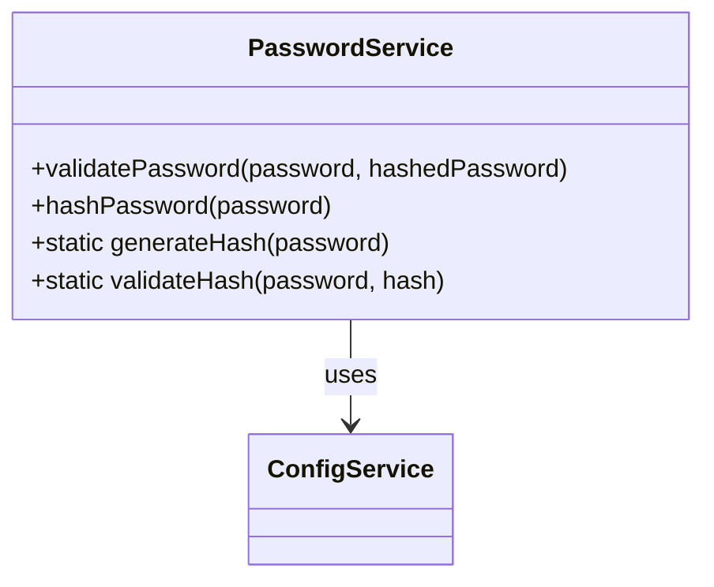

**Diagram sources**
- [password.service.ts](file://apps/server/src/shared/service/utils/password.service.ts#L1-L46)

**Section sources**
- [auth.facade.ts](file://apps/server/src/shared/service/facade/auth.facade.ts#L1-L69)
- [auth.domain.ts](file://apps/server/src/shared/service/domain/auth.domain.ts#L1-L147)
- [password.service.ts](file://apps/server/src/shared/service/utils/password.service.ts#L1-L46)

## User Entity Relationships

The authentication system is tightly integrated with the user management system, leveraging relationships between users, tenants, and roles.

### User Service

The `UsersService` provides data access operations for user entities, with specialized methods for authentication scenarios. It includes methods to retrieve users with their associated tenants and roles, which is essential for the JWT validation process.

Key methods include:
- `getByIdWithTenants()`: Retrieves a user with their tenant associations
- `getByEmail()`: Finds a user by email address for login
- `getUserWithMainTenant()`: Retrieves a user with their primary tenant

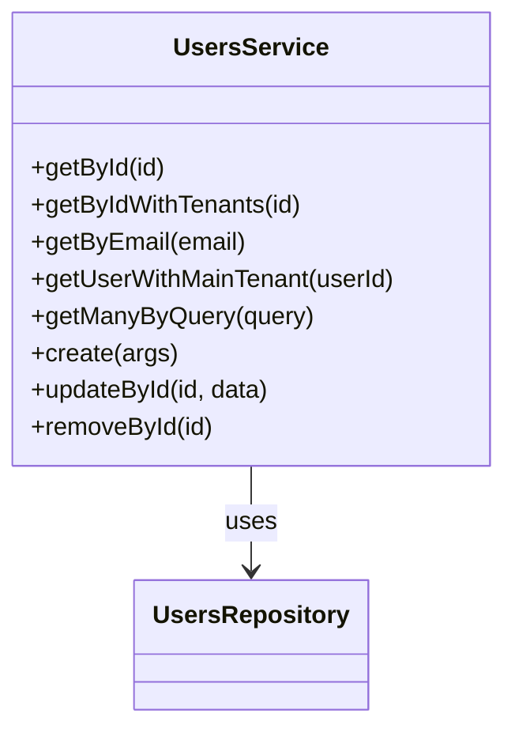

**Diagram sources**
- [users.service.ts](file://apps/server/src/shared/service/resources/users.service.ts#L1-L150)

### Users Repository

The `UsersRepository` abstracts database operations using Prisma, providing a clean interface to the underlying data store. It implements common CRUD operations and ensures that entities are properly transformed using class-transformer.

The repository pattern allows for easy testing and potential database abstraction in the future, as the service layer depends on the repository interface rather than directly on Prisma.

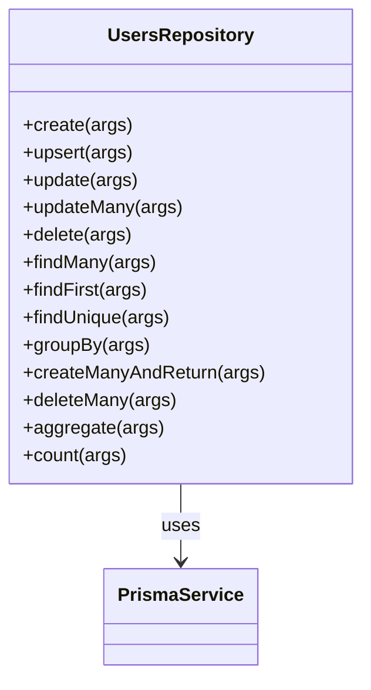

**Diagram sources**
- [users.repository.ts](file://apps/server/src/shared/repository/users.repository.ts#L1-L92)

### Entity Relationships

The user entity has the following relationships:
- One-to-many with tenants (a user can belong to multiple tenants)
- One-to-many with profiles (user profile information)
- Through the tenant relationship, indirect relationships with spaces, roles, and other entities

These relationships are eagerly loaded when needed for authentication purposes, ensuring that all required information is available during the authentication process.

**Section sources**
- [users.service.ts](file://apps/server/src/shared/service/resources/users.service.ts#L1-L150)
- [users.repository.ts](file://apps/server/src/shared/repository/users.repository.ts#L1-L92)

## Authentication Flow

The complete authentication flow involves multiple components working together to authenticate users and protect resources.

### Login Flow

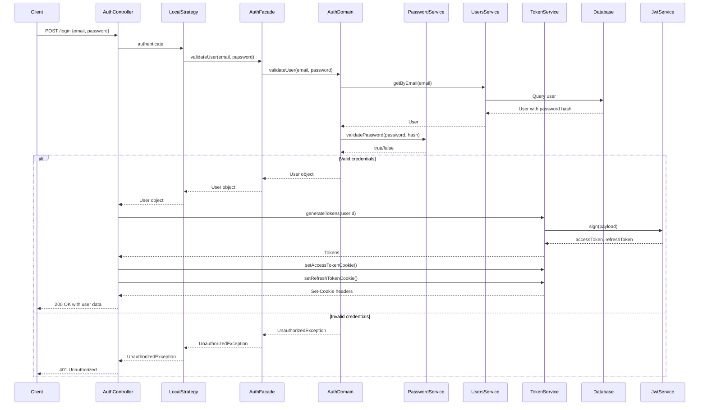

**Diagram sources**
- [auth.controller.ts](file://apps/server/src/shared/controller/domains/auth.controller.ts#L80-L97)
- [auth.facade.ts](file://apps/server/src/shared/service/facade/auth.facade.ts#L65-L68)
- [auth.domain.ts](file://apps/server/src/shared/service/domain/auth.domain.ts#L113-L145)

### Protected Route Flow

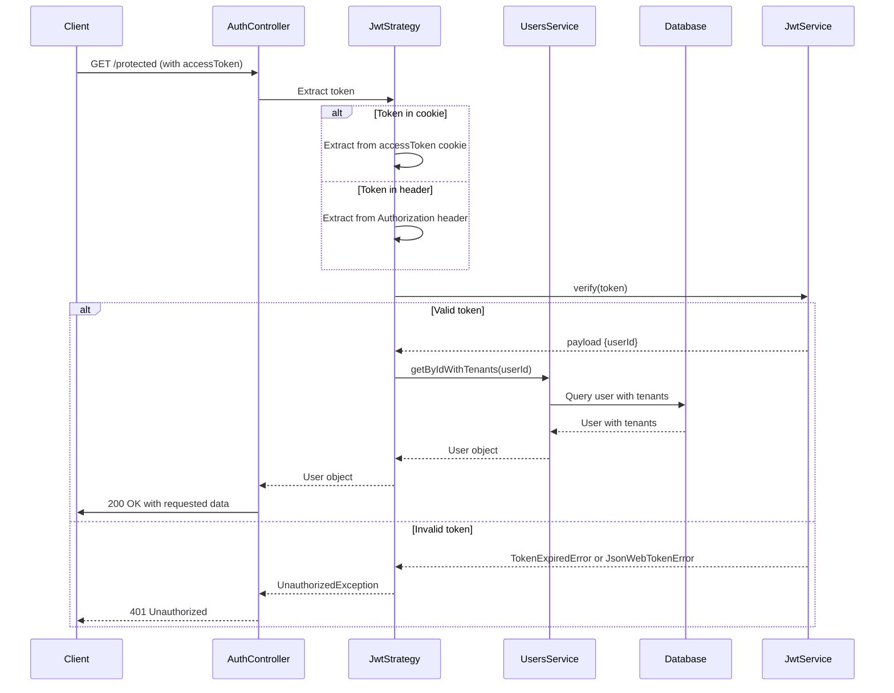

**Diagram sources**
- [jwt.strategy.ts](file://apps/server/src/shared/strategy/jwt.strategy.ts#L84-L117)
- [users.service.ts](file://apps/server/src/shared/service/resources/users.service.ts#L59-L93)

## Frontend Integration

The authentication system is designed to work seamlessly with frontend applications, particularly the admin and mobile clients in the prj-core ecosystem.

### Token Store

The frontend uses a `TokenStore` class to manage authentication tokens in the browser. This store handles reading and writing tokens to cookies, checking token expiration, and providing methods for token refresh.

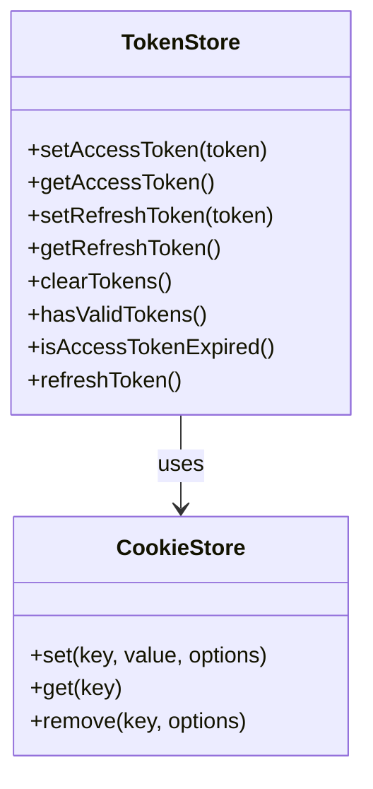

**Diagram sources**
- [tokenStore.ts](file://packages/store/src/stores/tokenStore.ts#L1-L66)

### Auth Store

The `AuthStore` provides higher-level authentication functionality for the frontend, including:
- Tracking authentication state
- Handling authentication errors
- Managing logout operations
- Intercepting HTTP requests to refresh expired tokens

The store uses axios interceptors to automatically handle token refresh when an access token expires, providing a seamless user experience without requiring manual intervention.

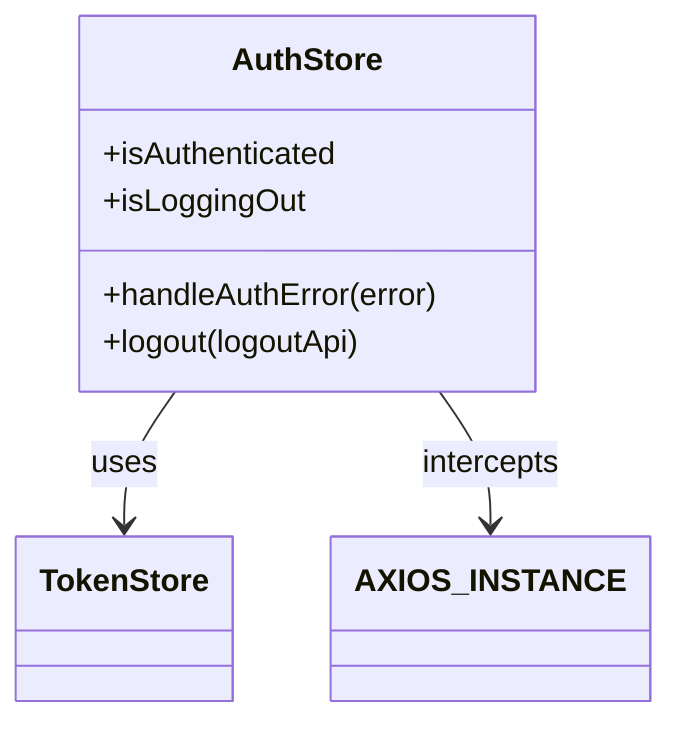

**Diagram sources**
- [authStore.ts](file://packages/store/src/stores/authStore.ts#L1-L62)

**Section sources**
- [tokenStore.ts](file://packages/store/src/stores/tokenStore.ts#L1-L66)
- [authStore.ts](file://packages/store/src/stores/authStore.ts#L1-L62)

## Common Issues and Solutions

### Token Expiration Handling

One common issue is handling token expiration gracefully. The system addresses this through:

1. **Automatic token refresh**: When an access token expires, the frontend can use the refresh token to obtain new tokens without requiring the user to log in again.

2. **Request interception**: The AuthStore intercepts HTTP responses and automatically refreshes tokens when a 401 error is received, then retries the original request.

3. **Proactive refresh**: The frontend can check token expiration before making requests and refresh tokens proactively.

### Session Management

The system uses HTTP-only cookies to store tokens, which provides several security benefits:
- Protection against XSS attacks
- Automatic inclusion in requests to the same origin
- Built-in expiration management

However, this approach requires proper CORS configuration to ensure cookies are sent with cross-origin requests when needed.

### Error Handling

The authentication system provides specific error messages for different failure scenarios:
- `INVALID_EMAIL_OR_PASSWORD_FORMAT`: Input validation failed
- `INVALID_CREDENTIALS`: Email/password mismatch
- `REFRESH_TOKEN_NOT_FOUND`: No refresh token in cookies
- `REFRESH_TOKEN_EXPIRED`: Refresh token has expired
- `TOKEN_INVALID`: Access token is invalid or expired
- `USER_NOT_FOUND`: User account not found

These specific error messages help clients handle different error scenarios appropriately.

**Section sources**
- [auth.controller.ts](file://apps/server/src/shared/controller/domains/auth.controller.ts#L31-L49)
- [authStore.ts](file://packages/store/src/stores/authStore.ts#L42-L52)

## Security Considerations

The authentication system implements several security best practices:

### Secure Token Storage

Tokens are stored in HTTP-only cookies with the Secure flag, preventing access via JavaScript and ensuring they are only transmitted over HTTPS connections. The SameSite=strict attribute prevents CSRF attacks by ensuring cookies are not sent with cross-site requests.

### Password Security

Passwords are hashed using bcrypt with a configurable salt round, providing strong protection against brute force attacks. The system uses industry-standard password hashing practices to protect user credentials.

### Token Rotation

The refresh token rotation strategy enhances security by issuing a new refresh token with each refresh request. This makes it more difficult for attackers to maintain long-term access even if they obtain a refresh token.

### Rate Limiting

While not explicitly shown in the provided code, the system should implement rate limiting on authentication endpoints to prevent brute force attacks. This would limit the number of login attempts from a single IP address within a given time period.

### Multi-tenancy Security

The system ensures that users can only access resources within their assigned tenants. The JWT payload includes the user ID, but authorization decisions are made based on the user's tenant associations retrieved from the database during token validation.

**Section sources**
- [token.service.ts](file://apps/server/src/shared/service/utils/token.service.ts#L1-L92)
- [jwt.strategy.ts](file://apps/server/src/shared/strategy/jwt.strategy.ts#L1-L118)
- [password.service.ts](file://apps/server/src/shared/service/utils/password.service.ts#L1-L46)