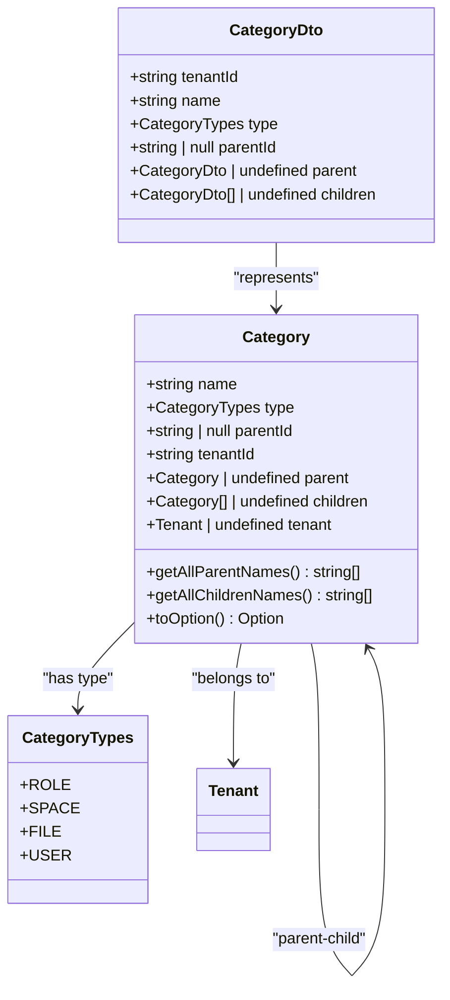
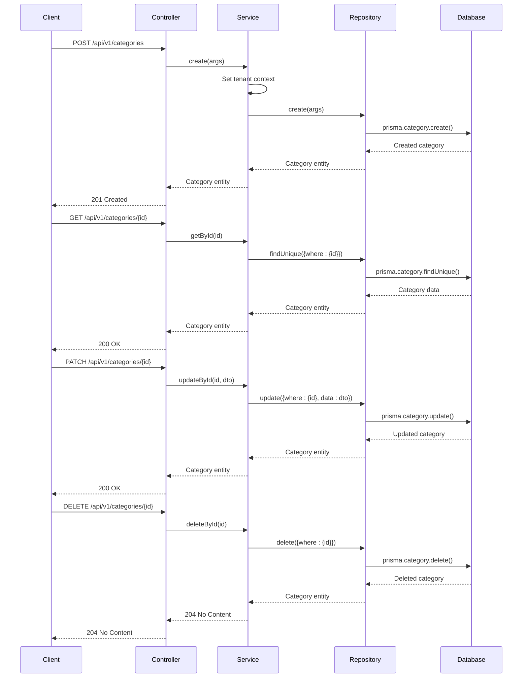
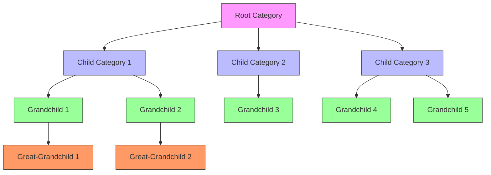
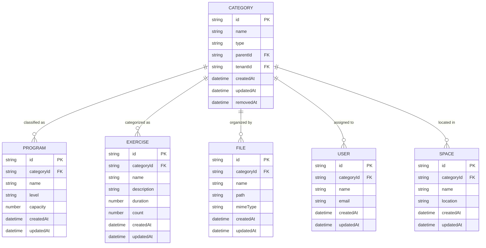
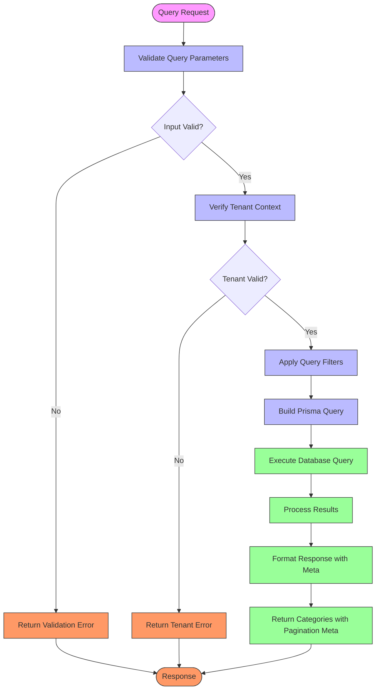
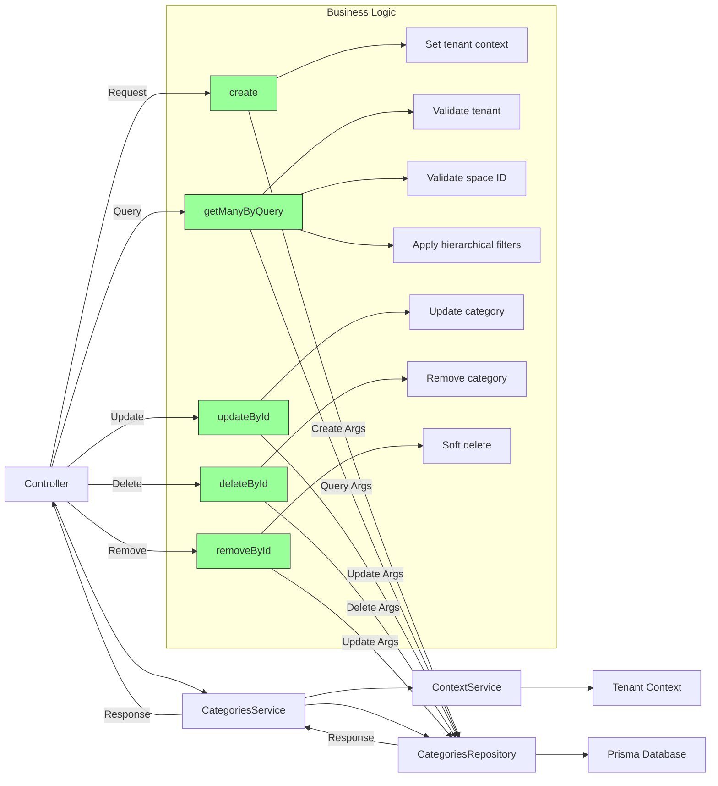

# Categories Module

<cite>
**Referenced Files in This Document**   
- [category.entity.ts](file://packages/schema/src/entity/category.entity.ts)
- [category.dto.ts](file://packages/schema/src/dto/category.dto.ts)
- [query-category.dto.ts](file://packages/schema/src/dto/query/query-category.dto.ts)
- [categories.service.ts](file://apps/server/src/shared/service/resources/categories.service.ts)
- [categories.repository.ts](file://apps/server/src/shared/repository/categories.repository.ts)
- [categories.controller.ts](file://apps/server/src/shared/controller/resources/categories.controller.ts)
- [categories.module.ts](file://apps/server/src/module/categories.module.ts)
- [category-types.enum.ts](file://packages/schema/src/enum/category-types.enum.ts)
</cite>

## Table of Contents
1. [Introduction](#introduction)
2. [Category Entity Structure](#category-entity-structure)
3. [CRUD Operations](#crud-operations)
4. [Hierarchical Classification System](#hierarchical-classification-system)
5. [Category Relationships with Other Modules](#category-relationships-with-other-modules)
6. [Querying with Filters](#querying-with-filters)
7. [Configuration Options and Validation Rules](#configuration-options-and-validation-rules)
8. [Service Layer Business Logic](#service-layer-business-logic)
9. [Common Issues and Best Practices](#common-issues-and-best-practices)

## Introduction
The Categories module provides a hierarchical classification system that organizes content across the application. It supports various category types including Role, Space, File, and User, enabling flexible organization of entities within the system. The module implements a tree-like structure with parent-child relationships, allowing for multi-level categorization. This documentation details the implementation of the Categories module, covering entity structure, CRUD operations, hierarchical relationships, and integration with other modules such as programs and exercises.

## Category Entity Structure

The Category entity is implemented as a hierarchical structure with parent-child relationships, supporting various classification types across the application. The entity extends AbstractEntity and implements the Category interface from Prisma, providing a rich set of properties and methods for category management.

**Diagram sources**
- [category.entity.ts](file://packages/schema/src/entity/category.entity.ts#L12-L69)
- [category.dto.ts](file://packages/schema/src/dto/category.dto.ts#L10-L28)
- [category-types.enum.ts](file://packages/schema/src/enum/category-types.enum.ts#L3-L25)

**Section sources**
- [category.entity.ts](file://packages/schema/src/entity/category.entity.ts#L1-L69)
- [category.dto.ts](file://packages/schema/src/dto/category.dto.ts#L1-L29)

## CRUD Operations

The Categories module provides comprehensive CRUD operations through a layered architecture consisting of controller, service, and repository components. The operations follow RESTful patterns with appropriate HTTP methods for each action.

**Diagram sources**
- [categories.controller.ts](file://apps/server/src/shared/controller/resources/categories.controller.ts#L42-L82)
- [categories.service.ts](file://apps/server/src/shared/service/resources/categories.service.ts#L15-L58)
- [categories.repository.ts](file://apps/server/src/shared/repository/categories.repository.ts#L15-L44)

**Section sources**
- [categories.controller.ts](file://apps/server/src/shared/controller/resources/categories.controller.ts#L25-L82)
- [categories.service.ts](file://apps/server/src/shared/service/resources/categories.service.ts#L15-L58)
- [categories.repository.ts](file://apps/server/src/shared/repository/categories.repository.ts#L15-L44)

## Hierarchical Classification System

The Categories module implements a hierarchical classification system that allows for tree-like organization of categories. Each category can have a parent category and multiple child categories, creating a flexible nested structure for content organization.

The hierarchical system includes utility methods for navigating the category tree:
- `getAllParentNames()`: Extracts all parent category names from the current category up to the root
- `getAllChildrenNames()`: Recursively extracts all descendant category names
- `toOption()`: Converts a category to a UI option format with key, value, and text properties

**Diagram sources**
- [category.entity.ts](file://packages/schema/src/entity/category.entity.ts#L25-L60)

**Section sources**
- [category.entity.ts](file://packages/schema/src/entity/category.entity.ts#L25-L68)

## Category Relationships with Other Modules

Categories are integrated with various modules across the application, serving as a classification system for different types of content. The relationship between categories and other entities is established through the category type system, which supports different classification purposes.

The CategoryTypes enum defines the different classification types:
- **ROLE**: For role-based categorization
- **SPACE**: For spatial organization
- **FILE**: For file classification
- **USER**: For user grouping

These types enable the same category system to be used across different domains while maintaining type safety and clear semantics.

**Diagram sources**
- [category-types.enum.ts](file://packages/schema/src/enum/category-types.enum.ts#L3-L25)
- [program.entity.ts](file://packages/schema/src/entity/program.entity.ts#L1-L22)
- [category.entity.ts](file://packages/schema/src/entity/category.entity.ts#L1-L69)

**Section sources**
- [category-types.enum.ts](file://packages/schema/src/enum/category-types.enum.ts#L3-L25)
- [program.entity.ts](file://packages/schema/src/entity/program.entity.ts#L1-L22)

## Querying with Filters

The Categories module provides flexible querying capabilities with various filter options to retrieve categories based on specific criteria. The query system supports pagination, sorting, and filtering by multiple attributes.

The QueryCategoryDto supports the following filter parameters:
- **name**: Filter by category name (string)
- **type**: Filter by category type (CategoryTypes enum)
- **parentId**: Filter by parent category ID (string)
- **tenantId**: Filter by tenant ID (string)
- **serviceId**: Filter by service ID (string)
- **nameSortOrder**: Sort order for category names (Prisma.SortOrder)

The query operation automatically applies tenant context filtering, ensuring that users only access categories within their tenant scope.

**Diagram sources**
- [query-category.dto.ts](file://packages/schema/src/dto/query/query-category.dto.ts#L5-L23)
- [categories.service.ts](file://apps/server/src/shared/service/resources/categories.service.ts#L60-L135)

**Section sources**
- [query-category.dto.ts](file://packages/schema/src/dto/query/query-category.dto.ts#L5-L23)
- [categories.service.ts](file://apps/server/src/shared/service/resources/categories.service.ts#L60-L135)

## Configuration Options and Validation Rules

The Categories module implements a comprehensive validation system to ensure data integrity and consistency. The configuration and validation rules are defined at multiple levels, including DTO validation, service-level validation, and database constraints.

### DTO Validation Rules
The CategoryDto enforces the following validation rules:
- **tenantId**: Required UUID field
- **name**: String field with default empty string
- **type**: Enum field with CategoryTypes enum, defaulting to Role
- **parentId**: Optional UUID field with default null
- **parent**: Optional reference to parent category DTO
- **children**: Optional array of child category DTOs

### Service-Level Validation
The CategoriesService implements additional validation rules:
- Tenant context validation: Ensures a valid tenant is present in the request context
- Space ID validation: Verifies that the tenant has a space ID assigned
- Hierarchical integrity: Maintains parent-child relationships and prevents circular references

### Configuration Options
The module configuration includes:
- Tenant isolation: Categories are automatically associated with the current tenant
- Soft deletion: Categories can be removed (soft delete) by setting removedAt timestamp
- Hierarchical querying: Configurable depth for retrieving child categories
- Pagination: Default and configurable pagination settings for query results

**Section sources**
- [category.dto.ts](file://packages/schema/src/dto/category.dto.ts#L10-L28)
- [categories.service.ts](file://apps/server/src/shared/service/resources/categories.service.ts#L15-L135)

## Service Layer Business Logic

The CategoriesService implements the core business logic for category management, orchestrating operations between the controller and repository layers. The service layer handles tenant context management, data transformation, and business rule enforcement.

Key business logic features:
- **Tenant Context Management**: Automatically associates categories with the current tenant from the request context
- **Hierarchical Querying**: Retrieves categories with their complete hierarchy up to three levels deep
- **Data Validation**: Validates tenant and space ID presence before processing queries
- **Error Handling**: Provides descriptive error messages for common failure scenarios
- **Logging**: Comprehensive debug and warning logging for monitoring and troubleshooting

The service layer also implements a soft deletion mechanism through the removeById method, which updates the removedAt timestamp instead of permanently deleting the category, allowing for potential restoration.

**Diagram sources**
- [categories.service.ts](file://apps/server/src/shared/service/resources/categories.service.ts#L7-L135)

**Section sources**
- [categories.service.ts](file://apps/server/src/shared/service/resources/categories.service.ts#L7-L135)

## Common Issues and Best Practices

### Category Tree Maintenance
Maintaining a healthy category tree requires attention to several common issues:

**Circular References**: The system prevents circular references by validating parent-child relationships during creation and updates. Best practice is to implement client-side validation to prevent users from creating circular references.

**Orphaned Categories**: When a parent category is deleted, its children become orphaned. The system handles this by setting the parentId to null, but regular audits are recommended to maintain tree integrity.

**Deep Hierarchies**: Excessively deep category trees can impact performance. Best practice is to limit hierarchy depth to 3-4 levels and use flat structures when possible.

### Data Consistency Across Related Entities
Ensuring data consistency when categories are modified involves several strategies:

**Cascading Updates**: When a category is renamed, related entities should be updated to reflect the change. This can be achieved through database triggers or application-level event listeners.

**Referential Integrity**: The system maintains referential integrity through foreign key constraints. When a category is deleted, related entities should either be reassigned or deleted based on business rules.

**Cache Invalidation**: Category changes should invalidate relevant caches to ensure consistency across the application.

### Best Practices
1. **Use Descriptive Names**: Category names should be clear and descriptive to aid navigation and understanding.
2. **Limit Hierarchy Depth**: Keep category hierarchies shallow (3-4 levels) for better usability and performance.
3. **Regular Audits**: Periodically review the category structure to remove unused or redundant categories.
4. **Consistent Naming Conventions**: Use consistent naming conventions across categories of the same type.
5. **Plan for Growth**: Design the category structure with future expansion in mind, avoiding overly specific categories that may become obsolete.
6. **User Permissions**: Implement appropriate permissions for category management to prevent unauthorized modifications.
7. **Backup and Recovery**: Regularly backup category data and test recovery procedures to protect against data loss.

**Section sources**
- [categories.service.ts](file://apps/server/src/shared/service/resources/categories.service.ts#L15-L135)
- [categories.repository.ts](file://apps/server/src/shared/repository/categories.repository.ts#L15-L115)
- [category.entity.ts](file://packages/schema/src/entity/category.entity.ts#L1-L69)