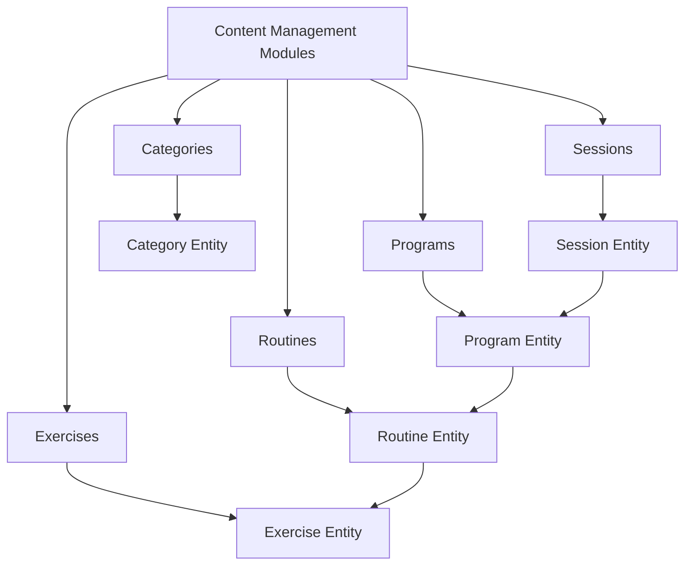
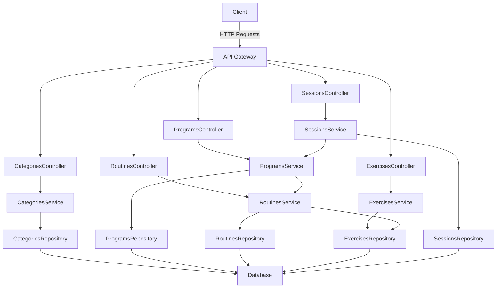
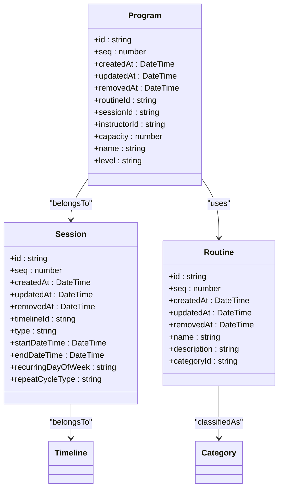
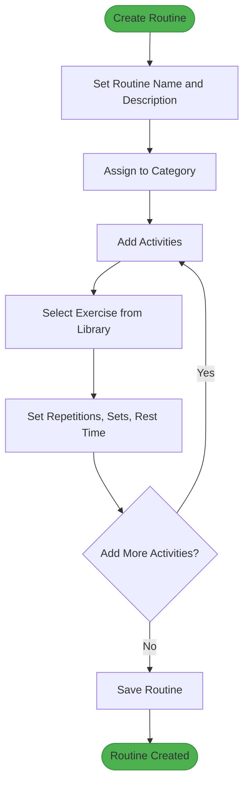
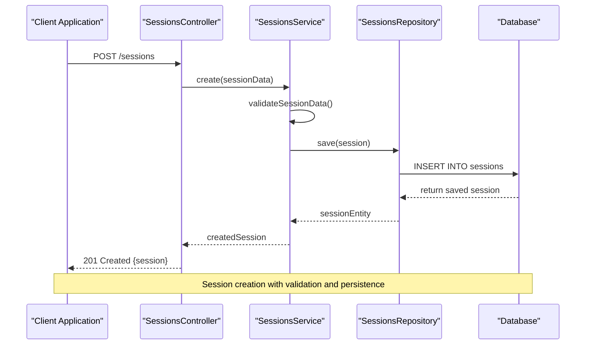
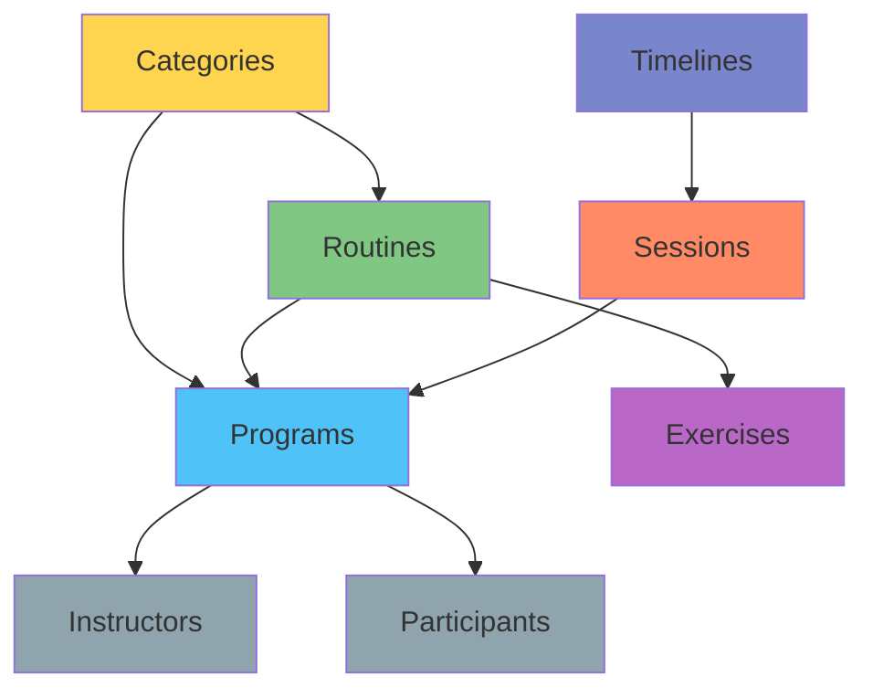

# Content Management Modules

<cite>
**Referenced Files in This Document**   
- [categories.module.ts](file://apps/server/src/module/categories.module.ts)
- [programs.module.ts](file://apps/server/src/module/programs.module.ts)
- [routines.module.ts](file://apps/server/src/module/routines.module.ts)
- [exercises.module.ts](file://apps/server/src/module/exercises.module.ts)
- [sessions.module.ts](file://apps/server/src/module/sessions.module.ts)
- [app.module.ts](file://apps/server/src/module/app.module.ts)
- [categories.controller.ts](file://apps/server/src/shared/controller/resources/categories.controller.ts)
- [programs.controller.ts](file://apps/server/src/shared/controller/resources/programs.controller.ts)
- [routines.controller.ts](file://apps/server/src/shared/controller/resources/routines.controller.ts)
- [exercises.controller.ts](file://apps/server/src/shared/controller/resources/exercises.controller.ts)
- [sessions.controller.ts](file://apps/server/src/shared/controller/resources/sessions.controller.ts)
- [category.entity.ts](file://packages/schema/src/entity/category.entity.ts)
- [program.entity.ts](file://packages/schema/src/entity/program.entity.ts)
- [routine.entity.ts](file://packages/schema/src/entity/routine.entity.ts)
- [exercise.entity.ts](file://packages/schema/src/entity/exercise.entity.ts)
- [session.entity.ts](file://packages/schema/src/entity/session.entity.ts)
- [task.example.md](file://packages/schema/prisma/schema/task.example.md)
- [task.prisma](file://packages/schema/prisma/schema/task.prisma)
</cite>

## Table of Contents
1. [Introduction](#introduction)
2. [Project Structure](#project-structure)
3. [Core Components](#core-components)
4. [Architecture Overview](#architecture-overview)
5. [Detailed Component Analysis](#detailed-component-analysis)
6. [Dependency Analysis](#dependency-analysis)
7. [Performance Considerations](#performance-considerations)
8. [Troubleshooting Guide](#troubleshooting-guide)
9. [Conclusion](#conclusion)

## Introduction
This document provides comprehensive documentation for the content management modules in prj-core, focusing on the hierarchical relationship between categories, programs, routines, exercises, and sessions. The system is designed to manage fitness and wellness content through a structured hierarchy that enables content reuse and efficient organization. The documentation explains each module's structure, controllers, services, and repositories, and details how these modules work together to create a robust content delivery system. The content management system supports complex relationships between entities, allowing for flexible scheduling, content reuse, and cascading operations while maintaining data consistency.

## Project Structure

**Diagram sources**
- [categories.module.ts](file://apps/server/src/module/categories.module.ts)
- [programs.module.ts](file://apps/server/src/module/programs.module.ts)
- [routines.module.ts](file://apps/server/src/module/routines.module.ts)
- [exercises.module.ts](file://apps/server/src/module/exercises.module.ts)
- [sessions.module.ts](file://apps/server/src/module/sessions.module.ts)

**Section sources**
- [app.module.ts](file://apps/server/src/module/app.module.ts#L120-L144)

## Core Components

The content management system in prj-core consists of several interconnected modules that work together to create a hierarchical content structure. Each module follows the NestJS pattern with controllers, services, and repositories. The core components include Categories, Programs, Routines, Exercises, and Sessions, each with their respective module definitions that register controllers and providers. These modules are imported into the main application module and exposed through API routes, creating a comprehensive content management system that supports the creation, retrieval, updating, and deletion of content entities.

**Section sources**
- [categories.module.ts](file://apps/server/src/module/categories.module.ts#L1-L14)
- [programs.module.ts](file://apps/server/src/module/programs.module.ts#L1-L13)
- [routines.module.ts](file://apps/server/src/module/routines.module.ts#L1-L13)
- [exercises.module.ts](file://apps/server/src/module/exercises.module.ts#L1-L14)
- [sessions.module.ts](file://apps/server/src/module/sessions.module.ts#L1-L13)

## Architecture Overview

**Diagram sources**
- [categories.controller.ts](file://apps/server/src/shared/controller/resources/categories.controller.ts)
- [programs.controller.ts](file://apps/server/src/shared/controller/resources/programs.controller.ts)
- [routines.controller.ts](file://apps/server/src/shared/controller/resources/routines.controller.ts)
- [exercises.controller.ts](file://apps/server/src/shared/controller/resources/exercises.controller.ts)
- [sessions.controller.ts](file://apps/server/src/shared/controller/resources/sessions.controller.ts)

## Detailed Component Analysis

### Categories Module Analysis
The Categories module provides the foundation for organizing content within the system. It allows for the creation and management of content categories that can be used to classify programs, routines, and other content types. The module follows the standard NestJS structure with a controller handling HTTP requests, a service containing business logic, and a repository managing database operations. Categories serve as a classification system that enables content discoverability and organization.

**Section sources**
- [categories.module.ts](file://apps/server/src/module/categories.module.ts#L1-L14)
- [categories.controller.ts](file://apps/server/src/shared/controller/resources/categories.controller.ts)

### Programs Module Analysis
The Programs module represents scheduled activities that combine a routine with a specific session. Programs are the executable units of content that connect the reusable routine definitions with actual time slots. Each program is associated with a session (when it occurs) and a routine (what content will be delivered), creating a bridge between scheduling and content definition. Programs also include operational details like instructor assignment and capacity limits.

**Diagram sources**
- [program.entity.ts](file://packages/schema/src/entity/program.entity.ts)
- [session.entity.ts](file://packages/schema/src/entity/session.entity.ts)
- [routine.entity.ts](file://packages/schema/src/entity/routine.entity.ts)

**Section sources**
- [programs.module.ts](file://apps/server/src/module/programs.module.ts#L1-L13)
- [programs.controller.ts](file://apps/server/src/shared/controller/resources/programs.controller.ts)
- [task.prisma](file://packages/schema/prisma/schema/task.prisma#L50-L74)

### Routines Module Analysis
The Routines module defines reusable sequences of exercises that can be incorporated into multiple programs. Routines represent the core content templates that can be scheduled across different sessions and contexts. This reusability is a key feature of the system, allowing content creators to develop standardized exercise sequences that can be deployed in various programs without duplication. Routines are composed of activities, each referencing specific exercises with defined parameters.

**Diagram sources**
- [routines.module.ts](file://apps/server/src/module/routines.module.ts#L1-L13)
- [routines.controller.ts](file://apps/server/src/shared/controller/resources/routines.controller.ts)

**Section sources**
- [routines.module.ts](file://apps/server/src/module/routines.module.ts#L1-L13)
- [routines.controller.ts](file://apps/server/src/shared/controller/resources/routines.controller.ts)

### Exercises Module Analysis
The Exercises module contains the atomic units of physical activity that can be combined into routines. Each exercise represents a specific physical movement with associated metadata such as name, description, and category. Exercises are the building blocks of routines and can be reused across multiple routines, enabling consistency in content delivery. The module provides CRUD operations for managing the exercise library, which serves as a content repository for creating new routines.

**Section sources**
- [exercises.module.ts](file://apps/server/src/module/exercises.module.ts#L1-L14)
- [exercises.controller.ts](file://apps/server/src/shared/controller/resources/exercises.controller.ts)

### Sessions Module Analysis
The Sessions module manages the temporal aspects of content delivery, representing specific time slots when programs are conducted. Sessions can be either one-time events or recurring schedules, providing flexibility in how content is delivered over time. Each session is associated with a timeline for logical grouping and contains the actual start and end times for the event. Sessions serve as the anchor points to which programs are attached, creating the complete scheduling structure.

**Diagram sources**
- [sessions.module.ts](file://apps/server/src/module/sessions.module.ts#L1-L13)
- [sessions.controller.ts](file://apps/server/src/shared/controller/resources/sessions.controller.ts)

**Section sources**
- [sessions.module.ts](file://apps/server/src/module/sessions.module.ts#L1-L13)
- [sessions.controller.ts](file://apps/server/src/shared/controller/resources/sessions.controller.ts)

## Dependency Analysis

**Diagram sources**
- [app.module.ts](file://apps/server/src/module/app.module.ts#L120-L144)
- [task.example.md](file://packages/schema/prisma/schema/task.example.md#L40-L56)

**Section sources**
- [app.module.ts](file://apps/server/src/module/app.module.ts#L120-L144)
- [task.example.md](file://packages/schema/prisma/schema/task.example.md#L40-L404)

## Performance Considerations
The content management system is designed with performance in mind, particularly regarding the hierarchical relationships between entities. The use of foreign key relationships in the database schema enables efficient querying of related content while maintaining referential integrity. Indexes are defined on commonly queried fields such as IDs, creation dates, and relationship fields to optimize retrieval performance. The service layer implements appropriate caching strategies for frequently accessed content like exercise libraries and routine templates. When creating new programs, the system leverages the reusability of routines and exercises to minimize data duplication and reduce storage requirements. For high-traffic scenarios, the API endpoints are designed to support pagination and filtering to prevent excessive data transfer.

## Troubleshooting Guide
Common issues in content management typically revolve around data consistency and relationship integrity. When creating programs, ensure that both the referenced session and routine exist before attempting to create the program to avoid foreign key constraint violations. When modifying routines that are used in multiple programs, consider the impact on scheduled content and implement appropriate versioning or change notification systems. For performance issues related to content retrieval, verify that database indexes are properly configured on frequently queried fields. If experiencing issues with content hierarchy maintenance, check that the cascading operations (such as soft deletion) are properly implemented in the repository layer to maintain referential integrity across related entities.

**Section sources**
- [programs.module.ts](file://apps/server/src/module/programs.module.ts#L1-L13)
- [routines.module.ts](file://apps/server/src/module/routines.module.ts#L1-L13)
- [task.example.md](file://packages/schema/prisma/schema/task.example.md#L384-L403)

## Conclusion
The content management modules in prj-core provide a comprehensive system for organizing and delivering fitness and wellness content through a well-defined hierarchy of categories, programs, routines, exercises, and sessions. The modular architecture following NestJS patterns ensures separation of concerns and maintainability. The hierarchical relationship between entities enables content reuse, with routines serving as reusable templates that can be incorporated into multiple programs across different sessions. This design promotes consistency in content delivery while reducing duplication. The system supports complex scheduling through the combination of one-time and recurring sessions, organized within timelines for logical grouping. By understanding the relationships and dependencies between these modules, developers can effectively create, modify, and maintain content within the system while ensuring data consistency and optimal performance.