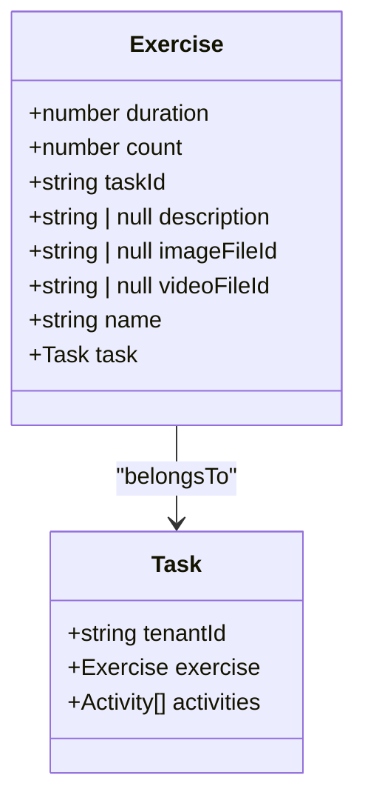
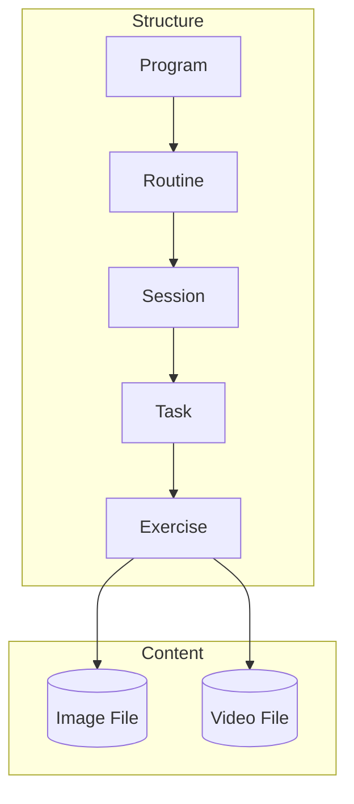
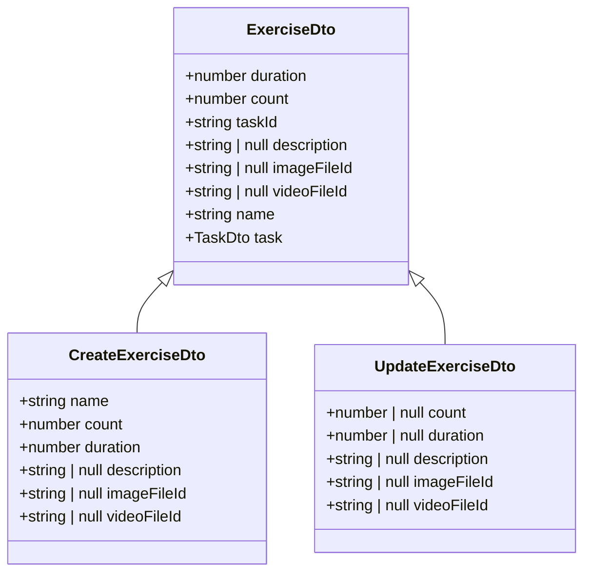
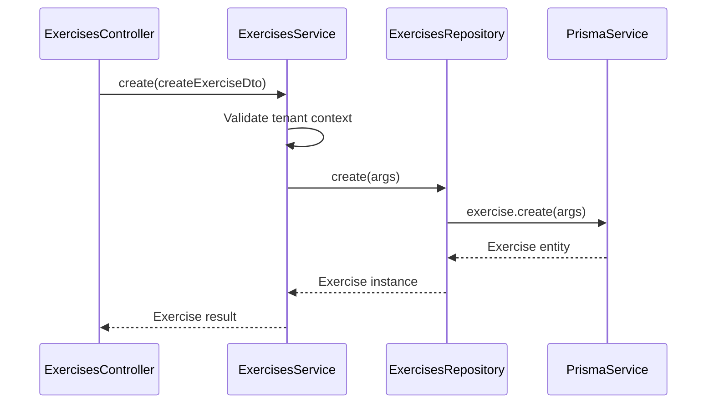

# Exercises Module

<cite>
**Referenced Files in This Document**
- [exercises.module.ts](file://apps/server/src/module/exercises.module.ts)
- [exercise.entity.ts](file://packages/schema/src/entity/exercise.entity.ts)
- [exercise.dto.ts](file://packages/schema/src/dto/exercise.dto.ts)
- [exercises.repository.ts](file://apps/server/src/shared/repository/exercises.repository.ts)
- [exercises.service.ts](file://apps/server/src/shared/service/resources/exercises.service.ts)
- [exercises.controller.ts](file://apps/server/src/shared/controller/resources/exercises.controller.ts)
- [task.entity.ts](file://packages/schema/src/entity/task.entity.ts)
</cite>

## Table of Contents
1. [Introduction](#introduction)
2. [Exercise Entity Structure](#exercise-entity-structure)
3. [Multimedia Content Handling](#multimedia-content-handling)
4. [Relationship with Routines and Sessions](#relationship-with-routines-and-sessions)
5. [Exercise Configuration Options](#exercise-configuration-options)
6. [Service Layer Logic](#service-layer-logic)
7. [Exercise Creation and Parameter Customization](#exercise-creation-and-parameter-customization)
8. [Common Issues and Solutions](#common-issues-and-solutions)
9. [Conclusion](#conclusion)

## Introduction
The Exercises module provides a comprehensive system for managing exercise entities within the application. This module handles exercise creation, configuration, multimedia associations, and integration with routines and sessions. The implementation follows a clean architectural pattern with distinct layers for entity definition, data transfer objects, repository operations, service logic, and controller endpoints.

**Section sources**
- [exercises.module.ts](file://apps/server/src/module/exercises.module.ts)

## Exercise Entity Structure
The Exercise entity is defined as a class that extends AbstractEntity and implements the Prisma-generated ExcerciseEntity interface. It contains core properties for exercise configuration including duration, count, name, and description. The entity also maintains relationships with other entities through foreign key references.

Key properties of the Exercise entity include:
- **duration**: Number representing the exercise duration in seconds
- **count**: Numeric value for repetition count or sets
- **name**: String identifier for the exercise
- **description**: Optional text field for exercise details
- **taskId**: Foreign key linking to the Task entity
- **imageFileId**: Optional reference to associated image media
- **videoFileId**: Optional reference to associated video media

The entity establishes a relationship with the Task entity through the task property, enabling exercises to be associated with specific tasks in the system.

**Diagram sources**
- [exercise.entity.ts](file://packages/schema/src/entity/exercise.entity.ts)
- [task.entity.ts](file://packages/schema/src/entity/task.entity.ts)

**Section sources**
- [exercise.entity.ts](file://packages/schema/src/entity/exercise.entity.ts)

## Multimedia Content Handling
The Exercises module supports multimedia content through file associations. Exercises can be linked to both image and video content using the imageFileId and videoFileId properties, which reference file records in the system.

The implementation allows for optional multimedia associations, meaning exercises can exist without media content. When media is associated with an exercise, the system stores UUID references to the corresponding file records rather than the actual media content within the exercise entity itself.

This approach enables:
- Efficient storage by separating media files from exercise metadata
- Reuse of media files across multiple exercises
- Independent management of media content
- Flexible media updates without modifying exercise records

The file management system integrates with the exercises module through the file associations module, which handles the relationship between exercises and their associated media files.

**Section sources**
- [exercise.entity.ts](file://packages/schema/src/entity/exercise.entity.ts)
- [exercise.dto.ts](file://packages/schema/src/dto/exercise.dto.ts)

## Relationship with Routines and Sessions
Exercises are integrated into the larger workout structure through their relationship with tasks, which are components of routines and sessions. The Exercise entity connects to the Task entity via the taskId property, establishing a one-to-one relationship where each exercise belongs to a specific task.

This relationship enables:
- Exercises to be organized within structured workout routines
- Sequencing of exercises in a specific order through task ordering
- Assignment of exercises to different sessions within a program
- Tracking of exercise performance within the context of routines

The hierarchical structure flows from programs to routines to sessions to tasks to exercises, creating a clear organization of workout content. Each exercise inherits context from its parent entities, including tenant information and scheduling data.

**Diagram sources**
- [exercise.entity.ts](file://packages/schema/src/entity/exercise.entity.ts)
- [task.entity.ts](file://packages/schema/src/entity/task.entity.ts)

**Section sources**
- [exercise.entity.ts](file://packages/schema/src/entity/exercise.entity.ts)
- [task.entity.ts](file://packages/schema/src/entity/task.entity.ts)

## Exercise Configuration Options
The Exercises module provides several configuration options for customizing exercise parameters. These options are exposed through the ExerciseDto and its related DTOs for creation and update operations.

Key configuration parameters include:
- **duration**: Configurable time duration for the exercise in seconds
- **count**: Numeric value representing repetitions, sets, or other countable metrics
- **name**: Editable name field for exercise identification
- **description**: Optional detailed description of the exercise

The module supports both creation and update operations for these parameters. When creating a new exercise, the system requires name, count, and duration values, while description and media associations are optional.

Exercise parameters can be modified after creation through update operations, allowing for adjustments to duration and count without requiring exercise recreation.

**Diagram sources**
- [exercise.dto.ts](file://packages/schema/src/dto/exercise.dto.ts)

**Section sources**
- [exercise.dto.ts](file://packages/schema/src/dto/exercise.dto.ts)
- [exercises.service.ts](file://apps/server/src/shared/service/resources/exercises.service.ts)

## Service Layer Logic
The ExercisesService provides the business logic for exercise operations, implementing methods for creation, retrieval, update, and deletion of exercise records. The service acts as an intermediary between the controller layer and the repository layer, applying business rules and context management.

Key service methods include:
- **create**: Handles exercise creation with tenant context validation
- **getManyByQuery**: Retrieves exercises with pagination support
- **getById**: Fetches a single exercise by ID
- **updateById**: Updates exercise parameters
- **deleteById**: Permanently removes an exercise
- **removeById**: Soft-deletes an exercise by setting removedAt timestamp

The service integrates with the ContextService to ensure tenant isolation, validating that operations are performed within the correct tenant context. This prevents cross-tenant data access and ensures data privacy.

The service also handles data transformation between repository entities and DTOs, ensuring consistent data format across the API boundary.

**Diagram sources**
- [exercises.service.ts](file://apps/server/src/shared/service/resources/exercises.service.ts)
- [exercises.repository.ts](file://apps/server/src/shared/repository/exercises.repository.ts)

**Section sources**
- [exercises.service.ts](file://apps/server/src/shared/service/resources/exercises.service.ts)

## Exercise Creation and Parameter Customization
Exercise creation is handled through the create method in the ExercisesService, which processes CreateExerciseDto objects. The process involves extracting core parameters (name, count, duration) and creating both the exercise record and its associated task in a single transaction.

When creating an exercise:
1. The service validates the presence of a tenant ID in the context
2. Extracts name, count, and duration from the DTO
3. Creates the exercise with an associated task using Prisma's nested write operations
4. Returns the created exercise entity

Parameter customization is supported through the updateById method, which allows modification of count and duration values. The update operation uses Prisma's update functionality to modify only the specified fields while preserving other exercise properties.

The system supports both hard deletion (deleteById) and soft deletion (removeById) of exercises, providing flexibility in data management and recovery.

**Section sources**
- [exercises.service.ts](file://apps/server/src/shared/service/resources/exercises.service.ts)
- [exercises.controller.ts](file://apps/server/src/shared/controller/resources/exercises.controller.ts)

## Common Issues and Solutions
The Exercises module addresses several common issues in exercise management:

### Exercise Versioning
The current implementation does not include explicit versioning for exercises. To maintain exercise integrity across multiple routines, the system relies on:
- Soft deletion (removeById) to preserve historical references
- Tenant isolation to prevent unintended modifications
- Transactional integrity when creating exercise-task pairs

For scenarios requiring exercise versioning, a recommended approach would be to implement a version field and create new exercise records when modifications are needed, rather than updating existing ones.

### Exercise Integrity Across Routines
To maintain exercise integrity when used across multiple routines:
- The system uses UUID references rather than duplicating exercise content
- Soft deletion preserves exercise data for historical routines
- The task-exercise relationship ensures exercises are properly scoped within routines

### Data Consistency
The module ensures data consistency through:
- Prisma transactions for related operations
- DTO validation to enforce data types
- Repository pattern to centralize data access logic
- Service layer validation for business rules

**Section sources**
- [exercises.service.ts](file://apps/server/src/shared/service/resources/exercises.service.ts)
- [exercises.repository.ts](file://apps/server/src/shared/repository/exercises.repository.ts)

## Conclusion
The Exercises module provides a robust foundation for managing exercise entities within the application. Its implementation follows a clean separation of concerns with well-defined responsibilities across entity, DTO, repository, service, and controller layers. The module supports essential exercise management features including configuration, multimedia associations, and integration with routines and sessions. By leveraging Prisma for data access and NestJS for structure, the implementation ensures type safety, maintainability, and scalability. The design allows for flexible exercise configuration while maintaining data integrity across the workout hierarchy.