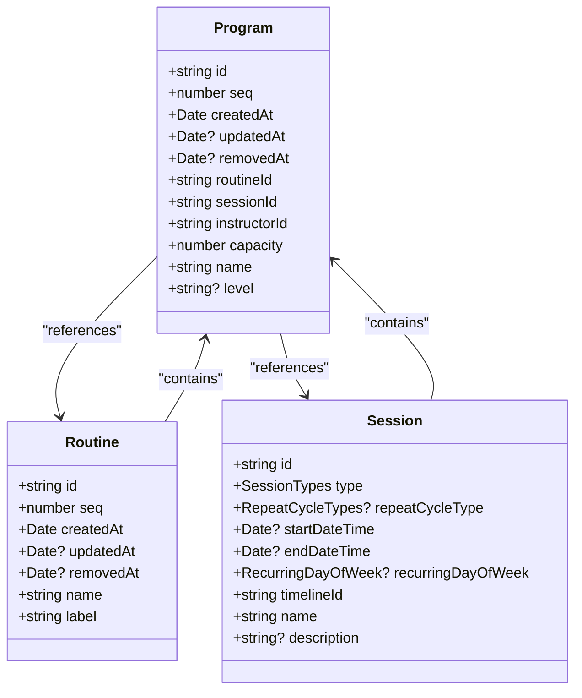
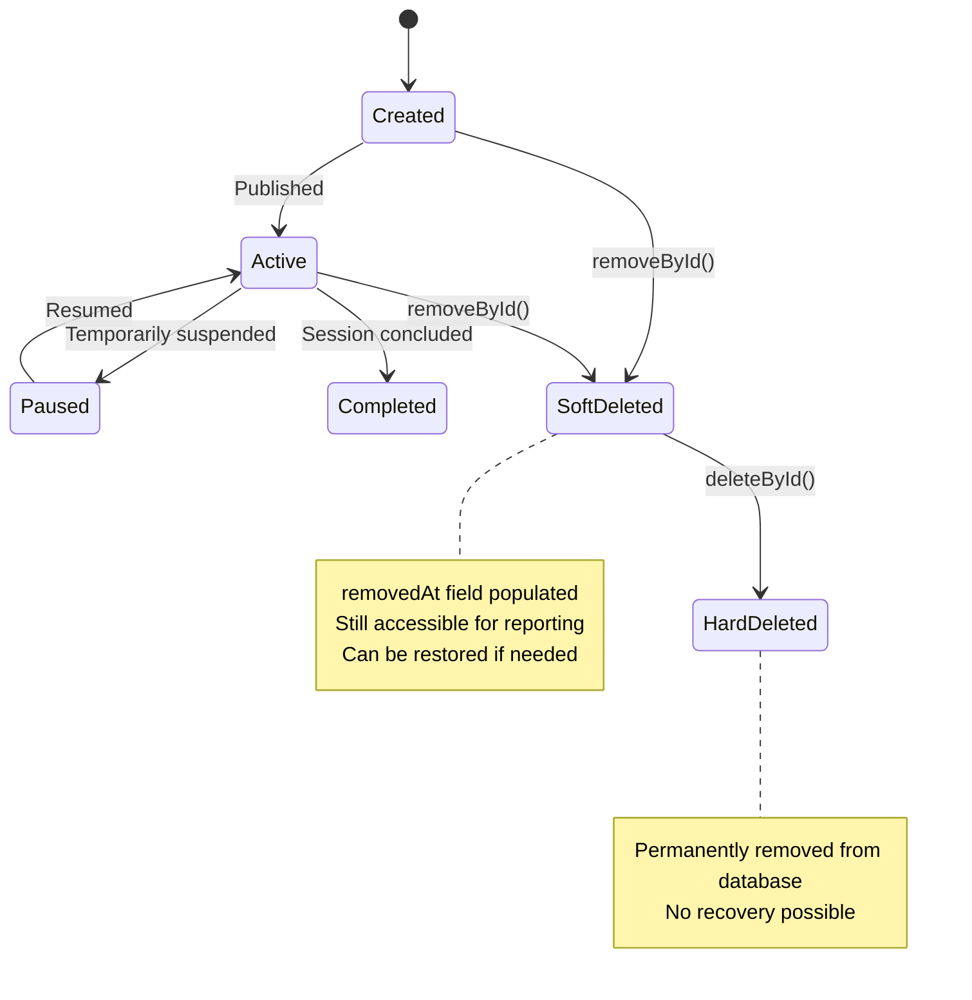
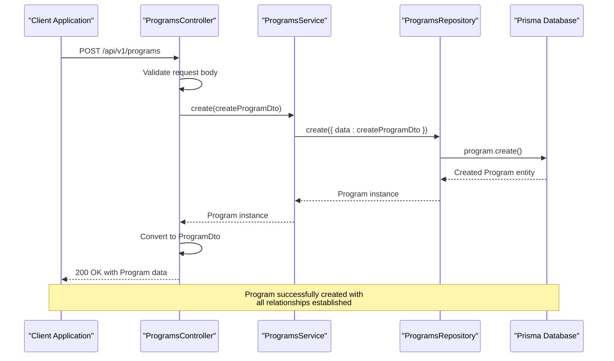
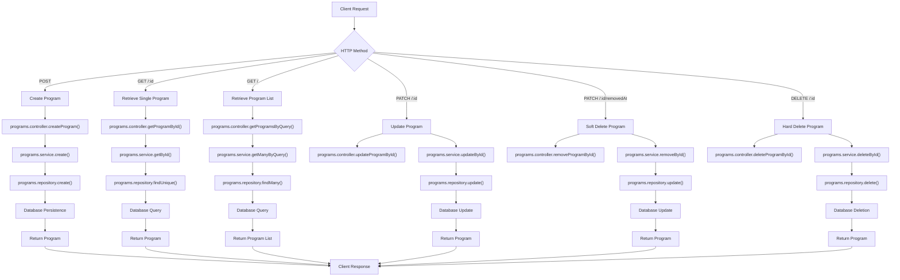
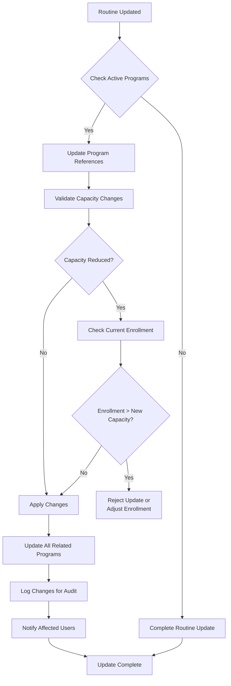

# Programs Module

<cite>
**Referenced Files in This Document**   
- [programs.controller.ts](file://apps/server/src/shared/controller/resources/programs.controller.ts)
- [programs.service.ts](file://apps/server/src/shared/service/resources/programs.service.ts)
- [programs.repository.ts](file://apps/server/src/shared/repository/programs.repository.ts)
- [program.entity.ts](file://packages/schema/src/entity/program.entity.ts)
- [program.dto.ts](file://packages/schema/src/dto/program.dto.ts)
- [routine.entity.ts](file://packages/schema/src/entity/routine.entity.ts)
- [session.entity.ts](file://packages/schema/src/entity/session.entity.ts)
- [task.prisma](file://packages/schema/prisma/schema/task.prisma)
</cite>

## Table of Contents
1. [Introduction](#introduction)
2. [Program Entity Structure](#program-entity-structure)
3. [Lifecycle Management](#lifecycle-management)
4. [Relationship with Categories and Routines](#relationship-with-categories-and-routines)
5. [Program Creation Workflow](#program-creation-workflow)
6. [API Interactions](#api-interactions)
7. [Service Layer Logic](#service-layer-logic)
8. [Cascading Operations](#cascading-operations)
9. [Program Versioning and Integrity](#program-versioning-and-integrity)
10. [Common Issues and Solutions](#common-issues-and-solutions)

## Introduction
The Programs module serves as a central component in the content delivery hierarchy, acting as a container for routines that are scheduled within specific sessions. This document provides a comprehensive analysis of the implementation details, including the program entity structure, lifecycle management, and relationships with categories and routines. The module enables the organization of fitness or educational content by linking routines to specific time slots (sessions) with designated instructors and capacity limits.

**Section sources**
- [programs.controller.ts](file://apps/server/src/shared/controller/resources/programs.controller.ts)
- [programs.service.ts](file://apps/server/src/shared/service/resources/programs.service.ts)

## Program Entity Structure
The Program entity represents a scheduled instance of a routine within a specific session, with defined capacity and instructor assignment. It serves as the bridge between reusable routines and time-bound sessions, creating a concrete offering for participants.



**Diagram sources**
- [program.entity.ts](file://packages/schema/src/entity/program.entity.ts)
- [routine.entity.ts](file://packages/schema/src/entity/routine.entity.ts)
- [session.entity.ts](file://packages/schema/src/entity/session.entity.ts)

**Section sources**
- [program.entity.ts](file://packages/schema/src/entity/program.entity.ts)
- [program.dto.ts](file://packages/schema/src/dto/program.dto.ts)

## Lifecycle Management
The Program lifecycle follows a comprehensive state management pattern with creation, modification, soft deletion, and hard deletion operations. The lifecycle is managed through a series of status transitions that ensure data integrity and provide audit trails.



**Diagram sources**
- [programs.service.ts](file://apps/server/src/shared/service/resources/programs.service.ts)
- [programs.repository.ts](file://apps/server/src/shared/repository/programs.repository.ts)

**Section sources**
- [programs.service.ts](file://apps/server/src/shared/service/resources/programs.service.ts)
- [programs.repository.ts](file://apps/server/src/shared/repository/programs.repository.ts)

## Relationship with Categories and Routines
Programs serve as containers for routines, establishing a many-to-one relationship where multiple programs can reference the same routine. This design enables content reuse while allowing for session-specific variations in scheduling, instructor assignment, and participant capacity.

```mermaid
erDiagram
ROUTINE ||--o{ PROGRAM : "contains"
SESSION ||--o{ PROGRAM : "contains"
INSTRUCTOR ||--o{ PROGRAM : "teaches"
ROUTINE {
string id PK
string name
string label
}
PROGRAM {
string id PK
string routineId FK
string sessionId FK
string instructorId FK
int capacity
string name
string? level
}
SESSION {
string id PK
datetime startDateTime
datetime endDateTime
string timelineId FK
}
INSTRUCTOR {
string id PK
string name
}
```

**Diagram sources**
- [task.prisma](file://packages/schema/prisma/schema/task.prisma)
- [program.entity.ts](file://packages/schema/src/entity/program.entity.ts)
- [routine.entity.ts](file://packages/schema/src/entity/routine.entity.ts)

**Section sources**
- [program.entity.ts](file://packages/schema/src/entity/program.entity.ts)
- [routine.entity.ts](file://packages/schema/src/entity/routine.entity.ts)

## Program Creation Workflow
The program creation workflow follows a structured process from API request to database persistence, ensuring data validation and proper entity relationships.



**Diagram sources**
- [programs.controller.ts](file://apps/server/src/shared/controller/resources/programs.controller.ts)
- [programs.service.ts](file://apps/server/src/shared/service/resources/programs.service.ts)
- [programs.repository.ts](file://apps/server/src/shared/repository/programs.repository.ts)

**Section sources**
- [programs.controller.ts](file://apps/server/src/shared/controller/resources/programs.controller.ts)
- [programs.service.ts](file://apps/server/src/shared/service/resources/programs.service.ts)

## API Interactions
The Programs module exposes a comprehensive REST API for managing program entities throughout their lifecycle. The API follows consistent patterns for creation, retrieval, update, and deletion operations.



**Diagram sources**
- [programs.controller.ts](file://apps/server/src/shared/controller/resources/programs.controller.ts)
- [programs.service.ts](file://apps/server/src/shared/service/resources/programs.service.ts)
- [programs.repository.ts](file://apps/server/src/shared/repository/programs.repository.ts)

**Section sources**
- [programs.controller.ts](file://apps/server/src/shared/controller/resources/programs.controller.ts)

## Service Layer Logic
The service layer implements the core business logic for program management, including validation, access control, and transaction management. The ProgramsService class orchestrates operations between the controller and repository layers.

```mermaid
classDiagram
class ProgramsService {
+create(createProgramDto : CreateProgramDto) Promise~Program~
+getManyByQuery(query : QueryProgramDto) Promise~{items : Program[], count : number}~
+getById(id : string) Promise~Program~
+updateById(id : string, updateProgramDto : UpdateProgramDto) Promise~Program~
+deleteById(id : string) Promise~Program~
+removeById(id : string) Promise~Program~
}
class ProgramsRepository {
+create(args : Prisma.ProgramCreateArgs) Promise~Program~
+findMany(args : Prisma.ProgramFindManyArgs) Promise~Program[]~
+findUnique(args : Prisma.ProgramFindUniqueArgs) Promise~Program~
+update(args : Prisma.ProgramUpdateArgs) Promise~Program~
+delete(args : Prisma.ProgramDeleteArgs) Promise~Program~
+count(args : Prisma.ProgramCountArgs) Promise~number~
}
class PrismaService {
+program : PrismaClient~ProgramClient~
}
ProgramsService --> ProgramsRepository : "depends on"
ProgramsRepository --> PrismaService : "uses"
```

**Diagram sources**
- [programs.service.ts](file://apps/server/src/shared/service/resources/programs.service.ts)
- [programs.repository.ts](file://apps/server/src/shared/repository/programs.repository.ts)

**Section sources**
- [programs.service.ts](file://apps/server/src/shared/service/resources/programs.service.ts)

## Cascading Operations
The Programs module implements cascading operations to maintain data integrity when modifying related entities. These operations ensure that changes to routines or sessions are properly reflected in associated programs.



**Diagram sources**
- [programs.service.ts](file://apps/server/src/shared/service/resources/programs.service.ts)
- [programs.repository.ts](file://apps/server/src/shared/repository/programs.repository.ts)

**Section sources**
- [programs.service.ts](file://apps/server/src/shared/service/resources/programs.service.ts)

## Program Versioning and Integrity
The system maintains program integrity through a combination of database constraints, application-level validation, and version tracking. The soft deletion pattern (using removedAt field) allows for data preservation while supporting logical deletion.

```mermaid
erDiagram
PROGRAM ||--o{ PROGRAM_VERSION : "has versions"
PROGRAM_VERSION {
string id PK
string programId FK
json data
string updatedBy
datetime updatedAt
string changeReason
}
PROGRAM {
string id PK
string routineId FK
string sessionId FK
string instructorId FK
int capacity
string name
string? level
datetime createdAt
datetime? updatedAt
datetime? removedAt
}
USER ||--o{ PROGRAM_VERSION : "updated by"
USER {
string id PK
string name
}
```

**Diagram sources**
- [program.entity.ts](file://packages/schema/src/entity/program.entity.ts)
- [task.prisma](file://packages/schema/prisma/schema/task.prisma)

**Section sources**
- [programs.repository.ts](file://apps/server/src/shared/repository/programs.repository.ts)
- [program.entity.ts](file://packages/schema/src/entity/program.entity.ts)

## Common Issues and Solutions
This section addresses common challenges in program management and provides solutions for maintaining data integrity and system performance.

### Issue 1: Concurrent Program Modifications
When multiple administrators attempt to modify the same program simultaneously, race conditions can occur. The solution implements optimistic locking using version numbers or timestamps.

### Issue 2: Routine Changes Affecting Active Programs
Modifying a routine that is referenced by active programs can disrupt scheduled sessions. The solution implements a validation check that prevents changes to routines with active program associations.

### Issue 3: Capacity Management
Overbooking can occur when program capacity is modified after registrations have been processed. The solution implements a pre-validation step that checks current enrollment against proposed capacity changes.

### Issue 4: Instructor Availability Conflicts
Scheduling programs with instructor time conflicts can lead to operational issues. The solution implements a scheduling conflict detection system that checks instructor availability across all programs.

### Issue 5: Data Consistency After Routine Updates
When routines are updated, associated programs may become inconsistent. The solution implements a notification system that alerts administrators to review affected programs after routine modifications.

**Section sources**
- [programs.service.ts](file://apps/server/src/shared/service/resources/programs.service.ts)
- [programs.repository.ts](file://apps/server/src/shared/repository/programs.repository.ts)
- [task.prisma](file://packages/schema/prisma/schema/task.prisma)