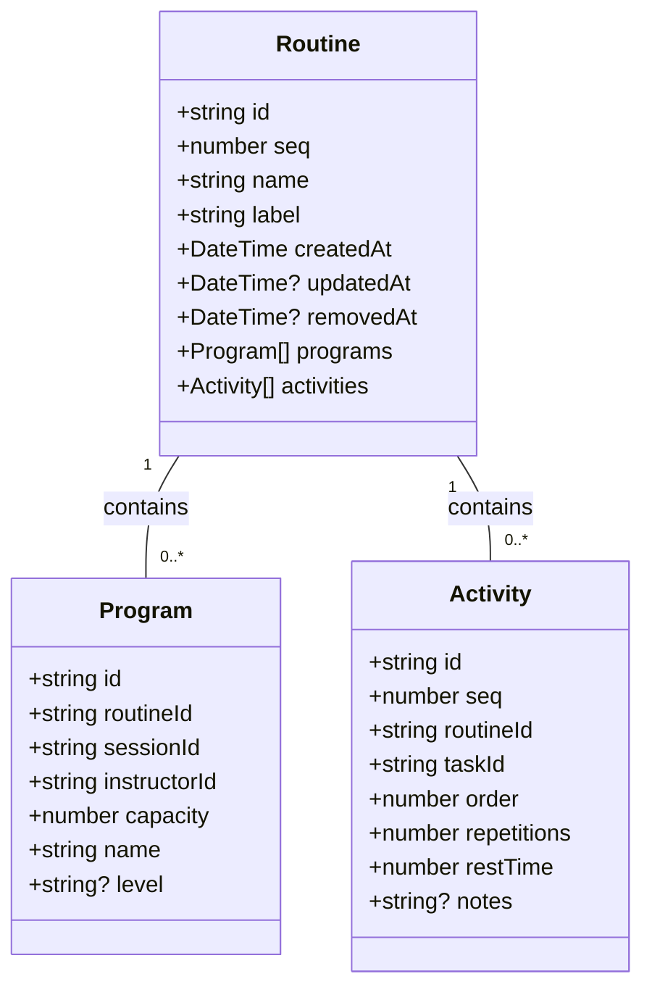
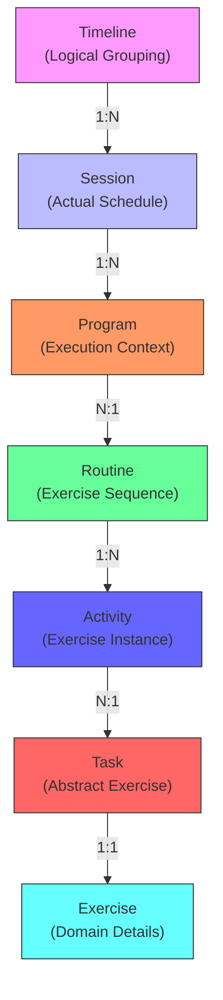
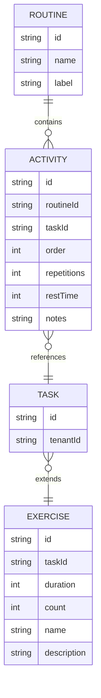
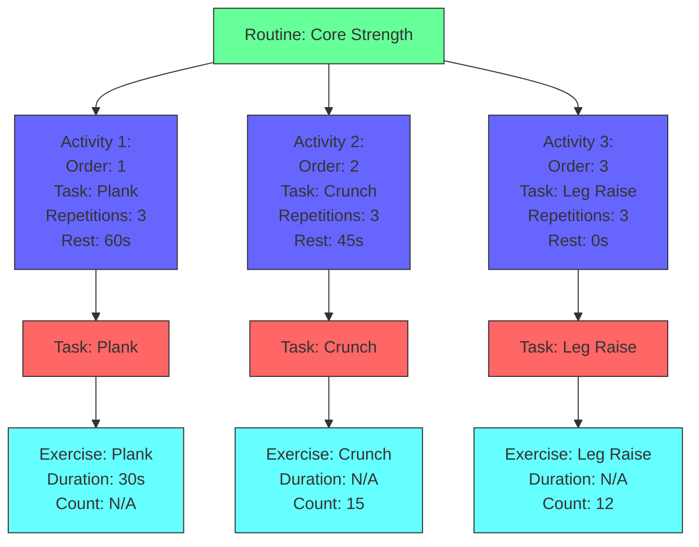
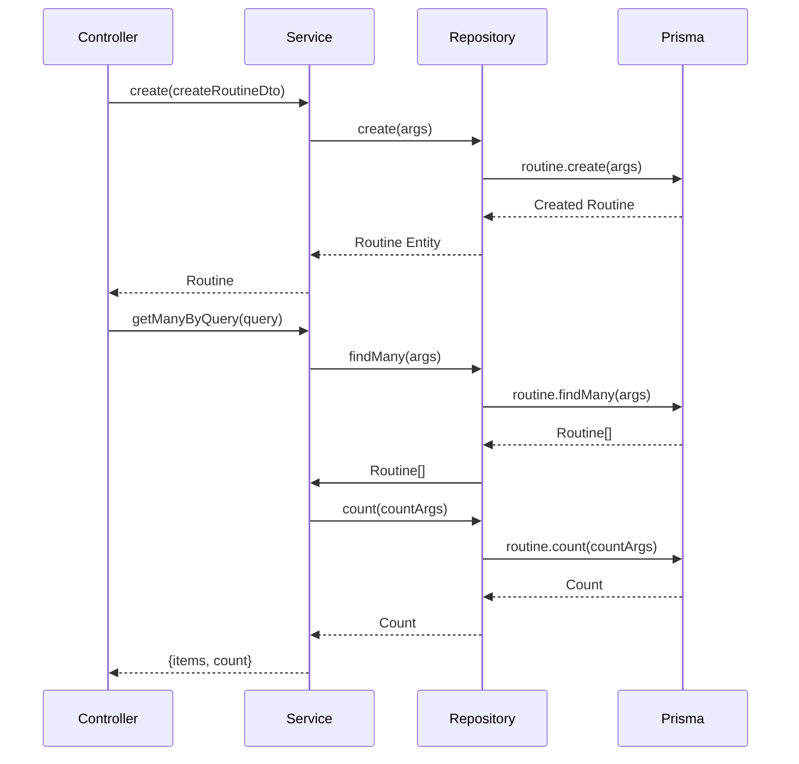
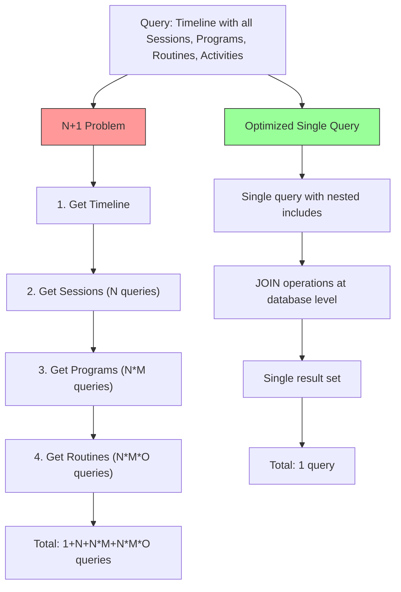
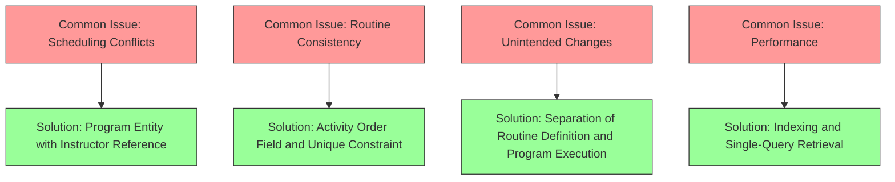

# Routines Module

<cite>
**Referenced Files in This Document**   
- [routines.module.ts](file://apps/server/src/module/routines.module.ts)
- [routines.service.ts](file://apps/server/src/shared/service/resources/routines.service.ts)
- [routines.repository.ts](file://apps/server/src/shared/repository/routines.repository.ts)
- [routines.controller.ts](file://apps/server/src/shared/controller/resources/routines.controller.ts)
- [routine.entity.ts](file://packages/schema/src/entity/routine.entity.ts)
- [routine.dto.ts](file://packages/schema/src/dto/routine.dto.ts)
- [create-routine.dto.ts](file://packages/schema/src/dto/create/create-routine.dto.ts)
- [update-routine.dto.ts](file://packages/schema/src/dto/update/update-routine.dto.ts)
- [query-routine.dto.ts](file://packages/schema/src/dto/query/query-routine.dto.ts)
- [task.prisma](file://packages/schema/prisma/schema/task.prisma)
- [task.example.md](file://packages/schema/prisma/schema/task.example.md)
- [task.performance-analysis.md](file://packages/schema/prisma/schema/task.performance-analysis.md)
</cite>

## Table of Contents
1. [Introduction](#introduction)
2. [Routine Entity Structure](#routine-entity-structure)
3. [Scheduling Capabilities](#scheduling-capabilities)
4. [Relationship with Programs and Exercises](#relationship-with-programs-and-exercises)
5. [Exercise Sequencing and Composition](#exercise-sequencing-and-composition)
6. [Service Layer Logic](#service-layer-logic)
7. [Performance Optimization](#performance-optimization)
8. [Common Issues and Solutions](#common-issues-and-solutions)
9. [Conclusion](#conclusion)

## Introduction

The Routines module is a core component of the fitness management system, designed to organize and manage exercise sequences within a structured framework. This module enables the creation, scheduling, and execution of workout routines that can be reused across multiple programs and sessions. The architecture is built around a flexible data model that supports domain independence, allowing the same routines to be applied in various contexts while maintaining data consistency and integrity.

The module follows a layered architecture with clear separation of concerns between the controller, service, and repository layers. It leverages Prisma ORM for database operations and implements a robust DTO (Data Transfer Object) pattern to ensure type safety and data validation throughout the application. The design emphasizes reusability, with routines and tasks being shareable across different programs and sessions, reducing duplication and improving maintainability.

This documentation provides a comprehensive overview of the Routines module, detailing its implementation, relationships with other entities, and best practices for usage and optimization.

## Routine Entity Structure

The Routine entity serves as the central component in the exercise management system, representing a structured sequence of activities designed to achieve specific fitness goals. The entity is defined with essential attributes that capture its identity and metadata, while establishing relationships with other key entities in the system.

The core structure of the Routine entity includes a unique identifier, sequence number, name, and label. The name provides a human-readable title for the routine, while the label serves as a shorter identifier that can be used in UI elements or API responses. These fields are essential for organizing and referencing routines within the application.

The entity maintains two primary relationships: with Programs and Activities. The relationship with Programs allows a routine to be associated with multiple programs across different sessions, enabling reuse of the same routine in various contexts. The relationship with Activities defines the sequence of exercises that comprise the routine, with each activity specifying how a particular task should be performed within the routine.

**Diagram sources**
- [routine.entity.ts](file://packages/schema/src/entity/routine.entity.ts#L8-L18)
- [task.prisma](file://packages/schema/prisma/schema/task.prisma#L90-L93)

**Section sources**
- [routine.entity.ts](file://packages/schema/src/entity/routine.entity.ts#L1-L19)
- [routine.dto.ts](file://packages/schema/src/dto/routine.dto.ts#L7-L19)

## Scheduling Capabilities

The scheduling capabilities of the Routines module are designed to support flexible and reusable workout planning across various timeframes and contexts. The system implements a hierarchical structure that separates logical grouping from actual scheduling, allowing for efficient management of recurring and one-time sessions.

At the core of the scheduling system is the Timeline entity, which serves as a logical container for grouping related sessions. Timelines do not contain time information themselves but provide a way to organize sessions into meaningful categories such as "Weekly Schedule," "Special Events," or "Seasonal Programs." This separation of concerns allows the same routine to be scheduled in different timelines without duplication.

Sessions represent actual scheduled events with specific start and end times. They can be configured as one-time events or recurring patterns using the RepeatCycleTypes enum, which supports daily, weekly, monthly, and yearly recurrence patterns. The RecurringDayOfWeek enum further enables precise scheduling by specifying which days of the week a recurring session should occur.

The relationship between routines and sessions is mediated through the Program entity, which acts as a bridge between the abstract routine and its concrete scheduling. This design allows the same routine to be used in multiple programs across different sessions, with each program potentially having different instructors, capacities, and difficulty levels.

**Diagram sources**
- [task.prisma](file://packages/schema/prisma/schema/task.prisma#L44-L74)
- [task.example.md](file://packages/schema/prisma/schema/task.example.md#L12-L38)
- [recurring-day-of-week.enum.ts](file://packages/schema/src/enum/recurring-day-of-week.enum.ts#L1-L35)
- [repeat-cycle-types.enum.ts](file://packages/schema/src/enum/repeat-cycle-types.enum.ts#L1-L32)

**Section sources**
- [task.prisma](file://packages/schema/prisma/schema/task.prisma#L44-L113)
- [task.example.md](file://packages/schema/prisma/schema/task.example.md#L1-L473)

## Relationship with Programs and Exercises

The Routines module establishes a sophisticated relationship network between programs, exercises, and other entities in the system, enabling a flexible and reusable exercise management framework. This architecture is designed to support multiple use cases while maintaining data integrity and consistency.

The relationship between routines and programs is implemented through a many-to-many association mediated by the Program entity. This design allows a single routine to be used across multiple programs, each with potentially different instructors, capacities, and difficulty levels. For example, a "Core Strength" routine can be offered as both a beginner-level program with a lower intensity and an advanced-level program with increased repetitions and shorter rest periods.

The connection between routines and exercises is more complex, involving an intermediate Activity entity that serves as a bridge between the abstract routine and the concrete exercise implementation. This three-layer architecture (Routine → Activity → Task → Exercise) provides several advantages:

1. **Domain Independence**: The Activity entity references a Task, which is an abstract representation of an exercise that is independent of any specific domain. This allows the same task to be used in different contexts (e.g., fitness, physical therapy, dance) with domain-specific implementations.

2. **Execution Metadata**: The Activity entity contains metadata about how a task should be performed within a specific routine, including order, repetitions, rest time, and special notes. This allows the same task to be executed differently in different routines or even multiple times within the same routine.

3. **Reusability**: Tasks can be reused across multiple activities and routines, reducing duplication and ensuring consistency. For example, a "Plank" task can be included in both a core strength routine and an endurance routine, with different execution parameters in each context.

**Diagram sources**
- [task.prisma](file://packages/schema/prisma/schema/task.prisma#L94-L162)
- [task.example.md](file://packages/schema/prisma/schema/task.example.md#L40-L55)
- [routine.entity.ts](file://packages/schema/src/entity/routine.entity.ts#L8-L18)

**Section sources**
- [task.prisma](file://packages/schema/prisma/schema/task.prisma#L94-L162)
- [task.example.md](file://packages/schema/prisma/schema/task.example.md#L156-L214)

## Exercise Sequencing and Composition

The exercise sequencing and composition capabilities of the Routines module provide a powerful framework for creating structured workout plans with precise control over exercise order, repetitions, and rest periods. The system is designed to support complex workout structures while maintaining flexibility and reusability.

At the heart of the sequencing mechanism is the Activity entity, which defines how a specific task should be performed within a routine. Each activity includes an order field that determines its position in the sequence, ensuring exercises are performed in the intended order. The repetitions field specifies the number of sets for the exercise, while the restTime field defines the duration of rest between this activity and the next one in the sequence.

The composition model supports both linear and branching workout structures. Linear sequences are the most common, where exercises are performed one after another in a predetermined order. However, the system also supports more complex structures through the use of conditional logic in the application layer, allowing for adaptive workouts that change based on user performance or other factors.

One of the key features of the composition system is the ability to reuse tasks across multiple activities and routines. This means that a single "Plank" task can be included in different routines with different parameters - for example, 3 sets of 30 seconds with 60 seconds rest in a beginner routine, and 4 sets of 45 seconds with 30 seconds rest in an advanced routine. This reusability reduces duplication and ensures consistency in exercise definitions across the system.

**Diagram sources**
- [task.prisma](file://packages/schema/prisma/schema/task.prisma#L100-L117)
- [task.example.md](file://packages/schema/prisma/schema/task.example.md#L173-L214)
- [routine.entity.ts](file://packages/schema/src/entity/routine.entity.ts#L8-L18)

**Section sources**
- [task.prisma](file://packages/schema/prisma/schema/task.prisma#L100-L117)
- [task.example.md](file://packages/schema/prisma/schema/task.example.md#L173-L214)

## Service Layer Logic

The service layer of the Routines module implements the core business logic for routine management, providing a clean interface between the controller and repository layers. The RoutinesService class orchestrates operations such as routine creation, retrieval, updating, and deletion, while ensuring data consistency and enforcing business rules.

The service layer follows the dependency injection pattern, receiving an instance of RoutinesRepository through its constructor. This design promotes loose coupling and makes the service easier to test and maintain. All operations are implemented as asynchronous methods, allowing for non-blocking execution and better performance in high-concurrency scenarios.

Key operations in the service layer include:

- **Routine Creation**: The `create` method accepts a CreateRoutineDto object containing the routine data and delegates to the repository for persistence. The method returns the created routine entity, which can then be transformed into a DTO for response.

- **Query Operations**: The `getManyByQuery` method supports flexible querying of routines based on various criteria. It converts the query parameters into Prisma query arguments and retrieves both the data and count for pagination purposes.

- **Update and Delete Operations**: The service provides methods for updating and deleting routines by ID. Notably, the `removeById` method implements a soft delete by setting the removedAt timestamp rather than permanently deleting the record, allowing for data recovery and audit trails.

- **Find Operations**: Methods like `getById` and `getByQuery` provide different ways to retrieve routine data, supporting both single entity retrieval and batch operations.

**Diagram sources**
- [routines.service.ts](file://apps/server/src/shared/service/resources/routines.service.ts#L10-L56)
- [routines.repository.ts](file://apps/server/src/shared/repository/routines.repository.ts#L6-L94)
- [routines.controller.ts](file://apps/server/src/shared/controller/resources/routines.controller.ts#L28-L88)

**Section sources**
- [routines.service.ts](file://apps/server/src/shared/service/resources/routines.service.ts#L1-L56)
- [routines.repository.ts](file://apps/server/src/shared/repository/routines.repository.ts#L1-L94)

## Performance Optimization

The Routines module incorporates several performance optimization strategies to ensure efficient data retrieval and manipulation, particularly when dealing with complex queries involving multiple related entities. These optimizations are implemented at both the database schema level and the application code level.

At the database level, the system employs a comprehensive indexing strategy to accelerate common query patterns. Key indexes include:

- **Routine Name Index**: An index on the routine name field to speed up searches and filtering by name
- **Activity Order Index**: A composite index on routineId and order fields to optimize retrieval of activities in sequence
- **Program Indexes**: Indexes on sessionId and routineId fields to improve performance when querying programs by session or routine
- **Session Time Indexes**: Composite indexes on timelineId and startDateTime, as well as startDateTime and endDateTime, to optimize time-based queries

The application layer implements additional optimizations through efficient query patterns. Instead of using the N+1 query pattern, which would result in multiple database round trips, the system uses Prisma's include feature to fetch related data in a single query. This approach significantly reduces database load and improves response times, especially for complex operations that require data from multiple related entities.

Caching strategies are also employed at various levels of the application. The repository layer includes logging for all operations, which can be used to identify performance bottlenecks and optimize frequently accessed data. The service layer methods are designed to be stateless and idempotent, making them suitable for caching at the API gateway or CDN level.

**Diagram sources**
- [task.performance-analysis.md](file://packages/schema/prisma/schema/task.performance-analysis.md#L202-L259)
- [task.prisma](file://packages/schema/prisma/schema/task.prisma#L91-L117)
- [routines.service.ts](file://apps/server/src/shared/service/resources/routines.service.ts#L22-L32)

**Section sources**
- [task.performance-analysis.md](file://packages/schema/prisma/schema/task.performance-analysis.md#L1-L41)
- [task.prisma](file://packages/schema/prisma/schema/task.prisma#L91-L117)

## Common Issues and Solutions

The Routines module addresses several common challenges in exercise management systems through thoughtful design decisions and implementation patterns. These solutions ensure data consistency, prevent conflicts, and maintain routine integrity when modifying exercise sequences.

One common issue is scheduling conflicts, where the same instructor or facility is double-booked for overlapping sessions. The system addresses this through the Program entity, which contains references to both the session (time and location) and the instructor. While the current schema doesn't enforce temporal constraints at the database level, the application layer can implement validation rules to prevent overlapping bookings for the same instructor or resource.

Another challenge is maintaining routine consistency when modifying exercise sequences. The Activity entity's order field ensures that exercises are always presented in the correct sequence, while the @@unique([routineId, taskId]) constraint prevents the same task from being included multiple times in a single routine. This constraint can be modified if duplicate tasks are desired in a routine, but it provides a safeguard against accidental duplication by default.

When reusing routines across multiple programs, there's a risk of unintended changes affecting all instances. The system mitigates this through the separation of routine definition and program execution. Changes to a routine's structure (adding or removing activities) will affect all programs using that routine, but changes to program-specific details (instructor, capacity, difficulty level) only affect that specific program instance.

For performance issues related to routine retrieval, the system implements several optimizations. The @@index([routineId, order]) on the Activity table ensures that activities are retrieved in the correct order efficiently. The use of Prisma's include feature allows for single-query retrieval of complex data structures, avoiding the N+1 query problem that can severely impact performance.

**Diagram sources**
- [task.example.md](file://packages/schema/prisma/schema/task.example.md#L416-L438)
- [task.prisma](file://packages/schema/prisma/schema/task.prisma#L115-L116)
- [task.performance-analysis.md](file://packages/schema/prisma/schema/task.performance-analysis.md#L202-L259)

**Section sources**
- [task.example.md](file://packages/schema/prisma/schema/task.example.md#L416-L438)
- [task.prisma](file://packages/schema/prisma/schema/task.prisma#L115-L116)

## Conclusion

The Routines module presents a comprehensive and flexible solution for managing exercise sequences in a fitness application. Its architecture balances reusability with specificity, allowing routines to be shared across multiple programs and sessions while maintaining the ability to customize execution parameters for each context.

The key strengths of the module include its domain-independent design, which separates abstract tasks from their concrete implementations, and its hierarchical structure that supports both logical grouping and actual scheduling. The three-layer architecture (Routine → Activity → Task → Exercise) provides a clean separation of concerns, making the system easier to understand, maintain, and extend.

Performance considerations have been addressed through strategic indexing and optimized query patterns, ensuring that even complex operations involving multiple related entities can be performed efficiently. The service layer provides a clean API for routine management, with well-defined methods for creation, retrieval, updating, and deletion operations.

For future enhancements, potential improvements could include versioning of routines to track changes over time, more sophisticated conflict detection for scheduling, and enhanced analytics for tracking routine effectiveness. The current design already supports these extensions through its modular architecture and clear separation of concerns.

Overall, the Routines module demonstrates a thoughtful approach to exercise management that prioritizes flexibility, reusability, and performance, making it well-suited for a wide range of fitness applications.