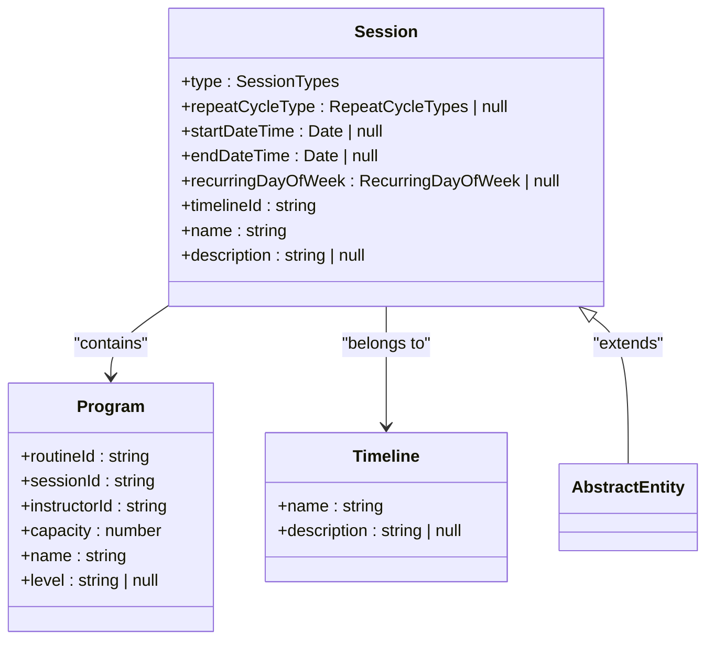
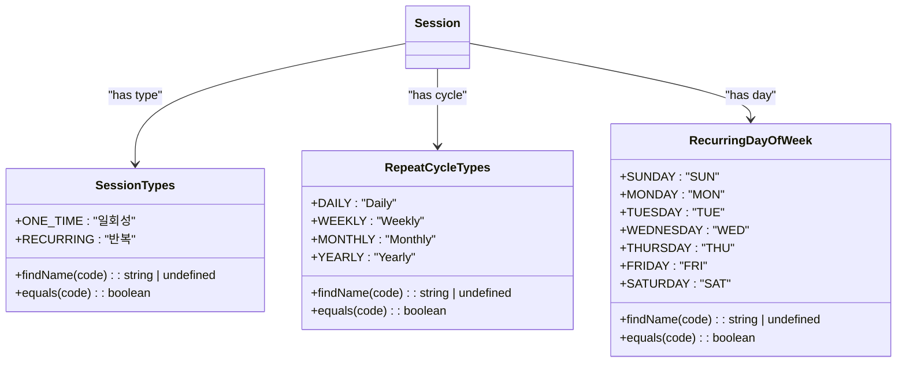
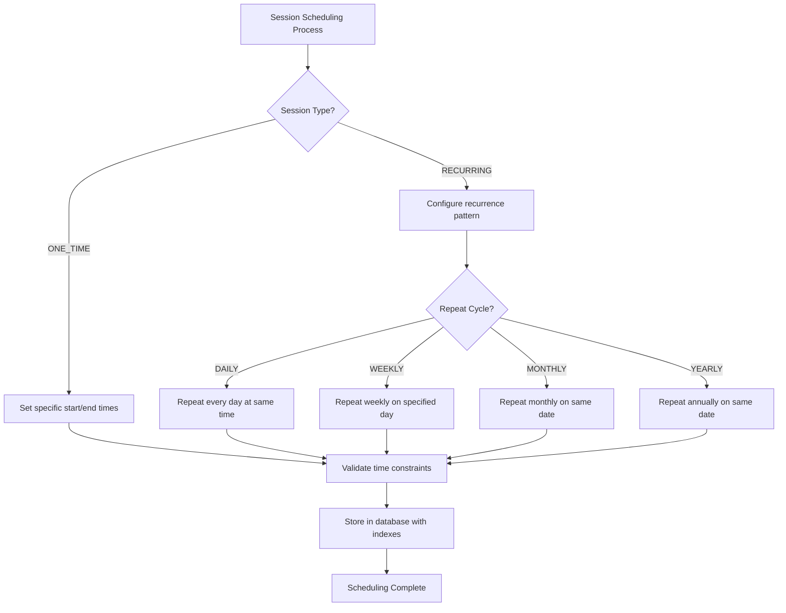
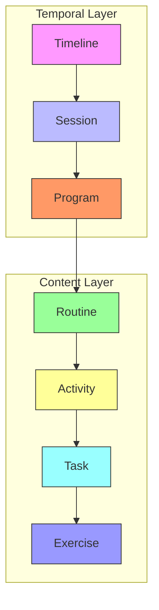
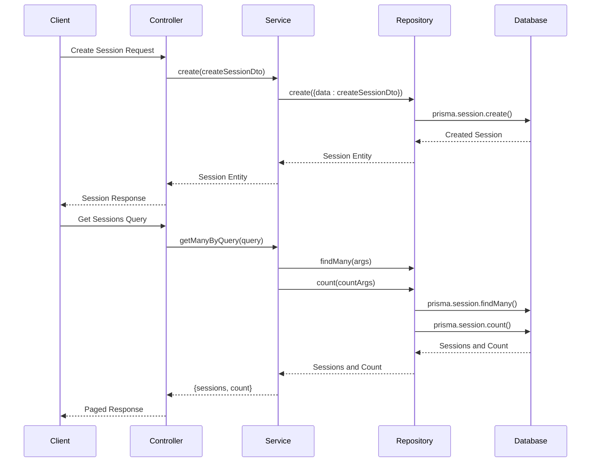
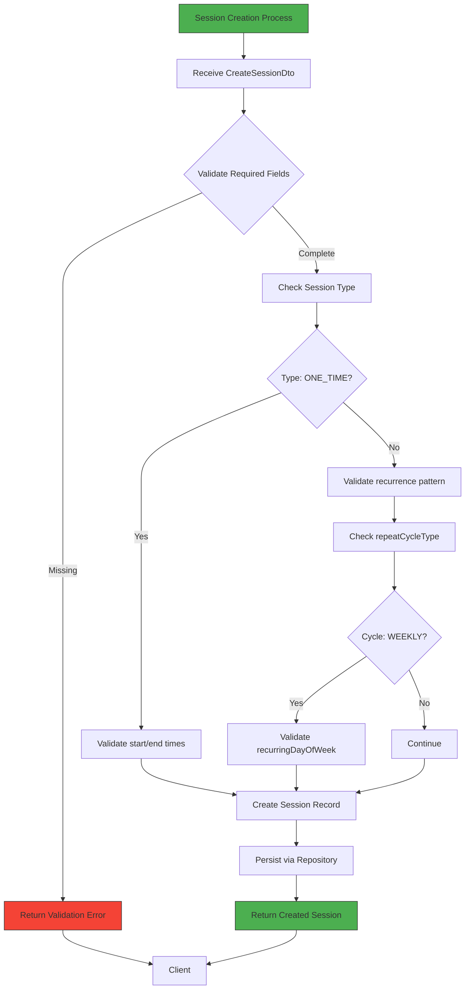
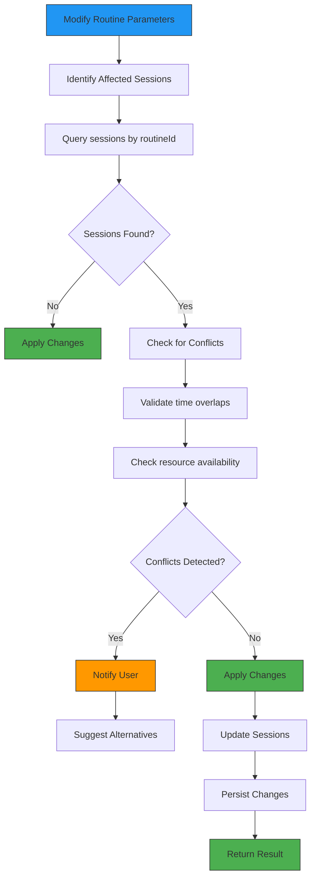
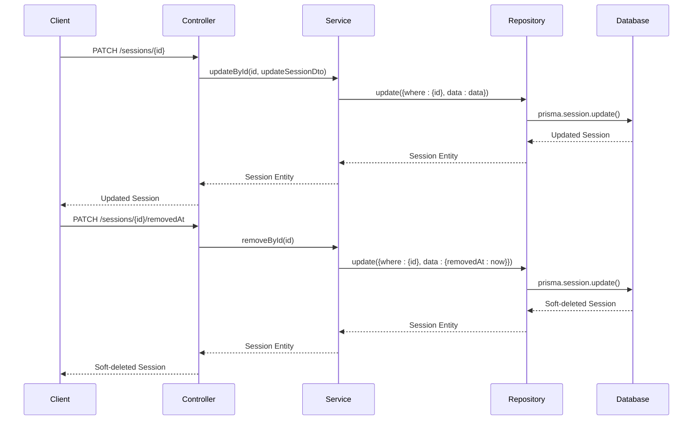

# Sessions Module

<cite>
**Referenced Files in This Document**   
- [sessions.module.ts](file://apps/server/src/module/sessions.module.ts)
- [session.entity.ts](file://packages/entity/src/session.entity.ts)
- [sessions.repository.ts](file://apps/server/src/shared/repository/sessions.repository.ts)
- [sessions.service.ts](file://apps/server/src/shared/service/resources/sessions.service.ts)
- [session.dto.ts](file://packages/dto/src/session.dto.ts)
- [create-session.dto.ts](file://packages/dto/src/create/create-session.dto.ts)
- [update-session.dto.ts](file://packages/dto/src/update/update-session.dto.ts)
- [query-session.dto](file://packages/dto/src/query/query-session.dto)
- [session-types.enum.ts](file://packages/enum/src/session-types.enum.ts)
- [repeat-cycle-types.enum.ts](file://packages/enum/src/repeat-cycle-types.enum.ts)
- [recurring-day-of-week.enum.ts](file://packages/enum/src/recurring-day-of-week.enum.ts)
- [sessions.controller.ts](file://apps/server/src/shared/controller/resources/sessions.controller.ts)
</cite>

## Table of Contents
1. [Introduction](#introduction)
2. [Session Entity Structure](#session-entity-structure)
3. [Session Types and Recurrence Patterns](#session-types-and-recurrence-patterns)
4. [Scheduling Logic and Timing Mechanisms](#scheduling-logic-and-timing-mechanisms)
5. [Relationship with Exercises and Routines](#relationship-with-exercises-and-routines)
6. [Service Layer Implementation](#service-layer-implementation)
7. [Session Creation and Configuration](#session-creation-and-configuration)
8. [Conflict Detection and Schedule Maintenance](#conflict-detection-and-schedule-maintenance)
9. [Real-time Status Updates](#real-time-status-updates)
10. [Common Issues and Solutions](#common-issues-and-solutions)

## Introduction
The Sessions module provides a comprehensive system for managing time-based events within the application's timeline structure. Sessions represent temporal units that can be either one-time or recurring events, serving as containers for programs that execute specific routines. This module enables precise scheduling, recurrence pattern configuration, and relationship management between sessions, routines, and exercises. The implementation follows a clean architectural pattern with distinct layers for entity definition, data access, service logic, and API exposure.

**Section sources**
- [session.entity.ts](file://packages/entity/src/session.entity.ts)
- [sessions.module.ts](file://apps/server/src/module/sessions.module.ts)

## Session Entity Structure
The Session entity serves as the core data model for time-based events in the system. It extends the AbstractEntity class and implements the Session interface from Prisma, providing essential temporal and organizational properties. Key attributes include type (determining if the session is one-time or recurring), timing information (startDateTime and endDateTime), recurrence configuration (repeatCycleType and recurringDayOfWeek), and relationships to timelines and programs. The entity maintains a one-to-many relationship with programs, allowing multiple programs to be scheduled within a single session, and a many-to-one relationship with timelines, which serve as logical groupings for sessions.

**Diagram sources**
- [session.entity.ts](file://packages/entity/src/session.entity.ts)
- [program.entity.ts](file://packages/entity/src/program.entity.ts)
- [timeline.entity.ts](file://packages/entity/src/timeline.entity.ts)

**Section sources**
- [session.entity.ts](file://packages/entity/src/session.entity.ts)

## Session Types and Recurrence Patterns
The system supports two primary session types defined in the SessionTypes enum: ONE_TIME and RECURRING. One-time sessions represent single occurrences at a specific time, while recurring sessions repeat according to a defined pattern. Recurrence patterns are governed by the RepeatCycleTypes enum, which includes DAILY, WEEKLY, MONTHLY, and YEARLY cycles. For weekly recurring sessions, the RecurringDayOfWeek enum specifies which day of the week the session occurs (SUNDAY through SATURDAY). This flexible type system allows the application to accommodate various scheduling needs, from one-off events to regularly scheduled programs. The type system is implemented using ts-jenum, providing type safety and convenient methods for value lookup and comparison.

**Diagram sources**
- [session-types.enum.ts](file://packages/enum/src/session-types.enum.ts)
- [repeat-cycle-types.enum.ts](file://packages/enum/src/repeat-cycle-types.enum.ts)
- [recurring-day-of-week.enum.ts](file://packages/enum/src/recurring-day-of-week.enum.ts)

**Section sources**
- [session-types.enum.ts](file://packages/enum/src/session-types.enum.ts)
- [repeat-cycle-types.enum.ts](file://packages/enum/src/repeat-cycle-types.enum.ts)
- [recurring-day-of-week.enum.ts](file://packages/enum/src/recurring-day-of-week.enum.ts)

## Scheduling Logic and Timing Mechanisms
The scheduling system combines temporal precision with flexible recurrence patterns to manage session timing. Each session contains explicit startDateTime and endDateTime fields that define its temporal boundaries. For recurring sessions, these times represent the pattern template that repeats according to the specified cycle. The system uses UTC-based Date objects to ensure consistent time handling across different time zones. The scheduling logic is implemented through a combination of database constraints and application-level validation, with indexes on timelineId and startDateTime to optimize time-based queries. The architecture separates the logical grouping (Timeline) from the temporal definition (Session), allowing for flexible organization of time-based events while maintaining precise scheduling control.

**Diagram sources**
- [session.entity.ts](file://packages/entity/src/session.entity.ts)
- [task.prisma](file://packages/prisma/schema/task.prisma)

**Section sources**
- [session.entity.ts](file://packages/entity/src/session.entity.ts)
- [task.prisma](file://packages/prisma/schema/task.prisma)

## Relationship with Exercises and Routines
Sessions establish hierarchical relationships with routines and exercises through the Program entity. A session contains multiple programs, each of which references a specific routine. Routines, in turn, are composed of activities that reference tasks, which ultimately contain exercise details. This layered architecture enables content reuse across different sessions - the same routine can be scheduled in multiple sessions, and the same task can be included in multiple routines. The relationship structure supports both temporal organization (sessions in timelines) and content organization (routines with exercises). This separation of concerns allows for flexible scheduling while maintaining consistent exercise content across different programs.

**Diagram sources**
- [session.entity.ts](file://packages/entity/src/session.entity.ts)
- [program.entity.ts](file://packages/entity/src/program.entity.ts)
- [routine.entity.ts](file://packages/entity/src/routine.entity.ts)
- [task.example.md](file://packages/prisma/schema/task.example.md)

**Section sources**
- [session.entity.ts](file://packages/entity/src/session.entity.ts)
- [task.example.md](file://packages/prisma/schema/task.example.md)

## Service Layer Implementation
The SessionsService provides the business logic layer for session management, implementing CRUD operations and specialized functionality for session planning and performance tracking. The service follows the dependency injection pattern, receiving the SessionsRepository through its constructor. Key methods include getById, create, getManyByQuery, updateById, and removeById, which delegate to the repository for data access. The service layer transforms DTOs (Data Transfer Objects) into entity objects and vice versa, maintaining separation between the API contract and the data model. The implementation emphasizes type safety through Prisma's type system and uses class-transformer for object transformation. The service also handles query parameter conversion, transforming QuerySessionDto objects into Prisma query arguments for efficient database operations.

**Diagram sources**
- [sessions.service.ts](file://apps/server/src/shared/service/resources/sessions.service.ts)
- [sessions.repository.ts](file://apps/server/src/shared/repository/sessions.repository.ts)
- [sessions.controller.ts](file://apps/server/src/shared/controller/resources/sessions.controller.ts)

**Section sources**
- [sessions.service.ts](file://apps/server/src/shared/service/resources/sessions.service.ts)

## Session Creation and Configuration
Session creation is facilitated through the create method in SessionsService, which accepts a CreateSessionDto containing all necessary configuration parameters. The DTO includes required fields such as name and type, along with optional temporal and recurrence properties. For one-time sessions, clients specify startDateTime and endDateTime directly. For recurring sessions, clients configure the repeatCycleType and, for weekly cycles, the recurringDayOfWeek. The creation process validates these parameters and persists the session through the repository layer. The system supports both immediate creation and upsert operations, allowing for flexible session management. Configuration options are exposed through well-defined DTOs that enforce type safety and provide clear documentation of available parameters.

**Diagram sources**
- [create-session.dto.ts](file://packages/dto/src/create/create-session.dto.ts)
- [sessions.service.ts](file://apps/server/src/shared/service/resources/sessions.service.ts)
- [sessions.repository.ts](file://apps/server/src/shared/repository/sessions.repository.ts)

**Section sources**
- [create-session.dto.ts](file://packages/dto/src/create/create-session.dto.ts)
- [sessions.service.ts](file://apps/server/src/shared/service/resources/sessions.service.ts)

## Conflict Detection and Schedule Maintenance
The system implements mechanisms to detect and prevent scheduling conflicts when modifying routine parameters or session schedules. While the core repository provides basic CRUD operations, conflict detection logic is implemented at the service layer through query operations that check for overlapping sessions. When modifying routine parameters that affect session timing or resources, the system queries for existing sessions that might be impacted. The updateById method in SessionsService handles partial updates while preserving relationships, and the removeById method implements soft deletion by setting the removedAt timestamp rather than permanently deleting records. This approach maintains data integrity and allows for schedule adjustments without losing historical information.

**Diagram sources**
- [sessions.service.ts](file://apps/server/src/shared/service/resources/sessions.service.ts)
- [sessions.repository.ts](file://apps/server/src/shared/repository/sessions.repository.ts)
- [update-session.dto.ts](file://packages/dto/src/update/update-session.dto.ts)

**Section sources**
- [sessions.service.ts](file://apps/server/src/shared/service/resources/sessions.service.ts)

## Real-time Status Updates
The Sessions module supports real-time status updates through a combination of database operations and API endpoints. The removeById method implements soft deletion by updating the removedAt field, allowing for reversible session cancellation. The updateById method enables modification of session properties while preserving the entity's identity. The repository layer uses Prisma's update operations to efficiently modify session records, with appropriate logging for debugging and monitoring. The controller layer exposes PATCH endpoints for partial updates, enabling clients to modify specific session properties without submitting the complete entity. This approach supports real-time schedule adjustments while maintaining data consistency and audit trails.

**Diagram sources**
- [sessions.controller.ts](file://apps/server/src/shared/controller/resources/sessions.controller.ts)
- [sessions.service.ts](file://apps/server/src/shared/service/resources/sessions.service.ts)
- [sessions.repository.ts](file://apps/server/src/shared/repository/sessions.repository.ts)

**Section sources**
- [sessions.controller.ts](file://apps/server/src/shared/controller/resources/sessions.controller.ts)

## Common Issues and Solutions
The Sessions module addresses several common scheduling challenges, particularly session overlap and schedule maintenance during routine modifications. The primary issue of session overlap is mitigated through query-based conflict detection that identifies time conflicts between sessions. When modifying routine parameters, the system maintains schedule integrity by updating all affected sessions while preserving their temporal relationships. For recurring sessions, changes to the recurrence pattern require careful handling to avoid unintended schedule disruptions. The solution involves validating new patterns against existing sessions and providing clear feedback to users about potential conflicts. The soft deletion approach prevents accidental data loss and allows for schedule recovery when needed.

**Section sources**
- [sessions.service.ts](file://apps/server/src/shared/service/resources/sessions.service.ts)
- [sessions.repository.ts](file://apps/server/src/shared/repository/sessions.repository.ts)
- [task.example.md](file://packages/prisma/schema/task.example.md)