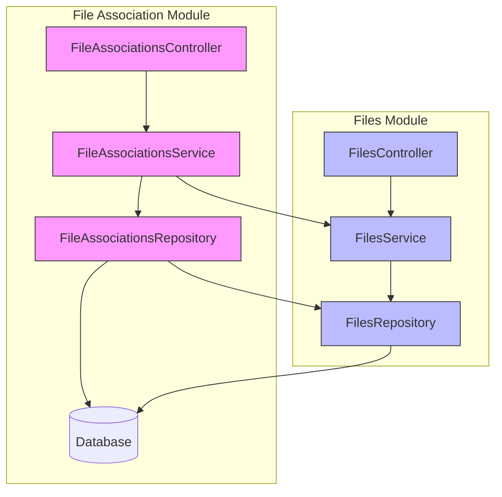
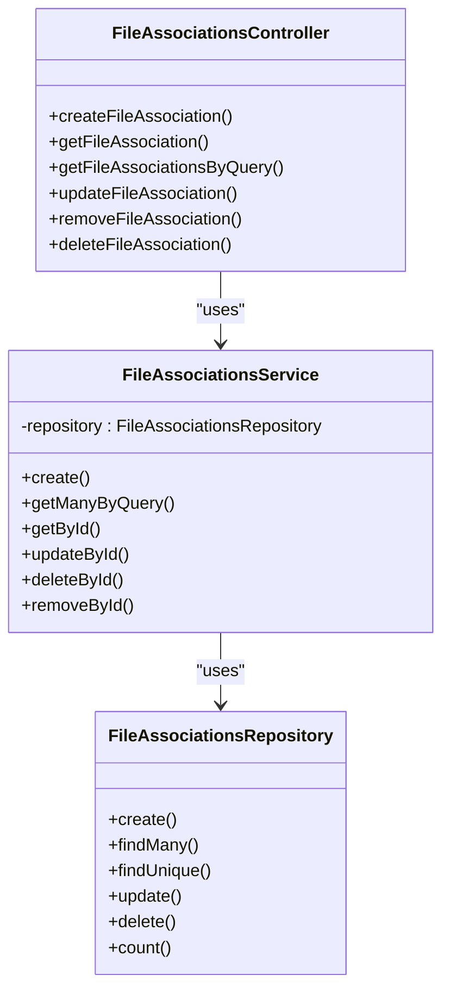
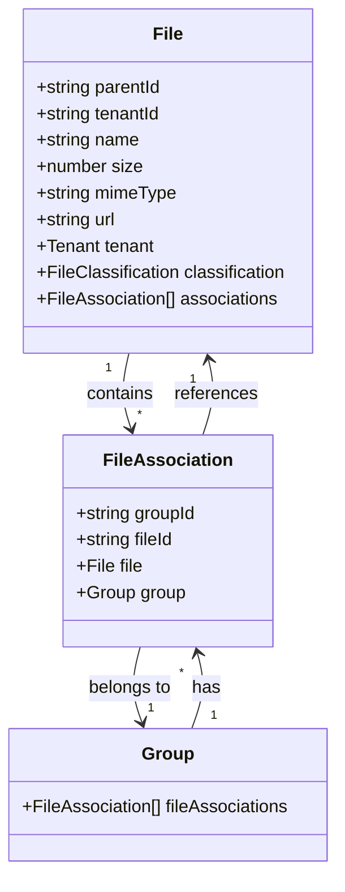
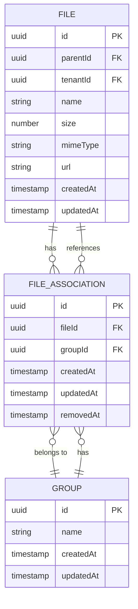
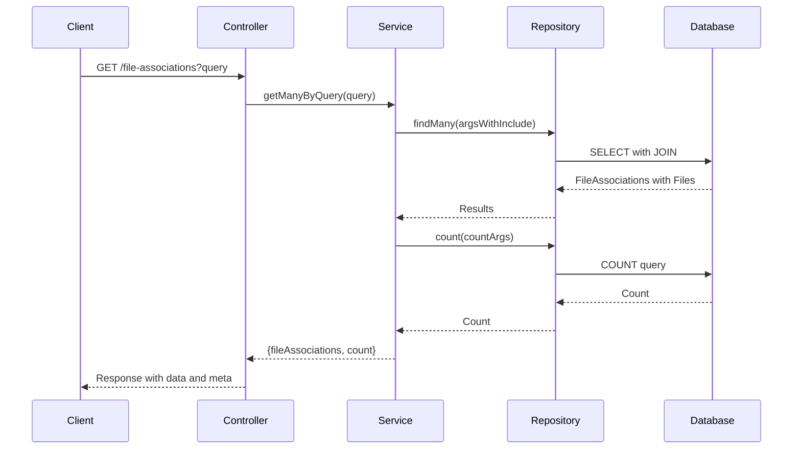
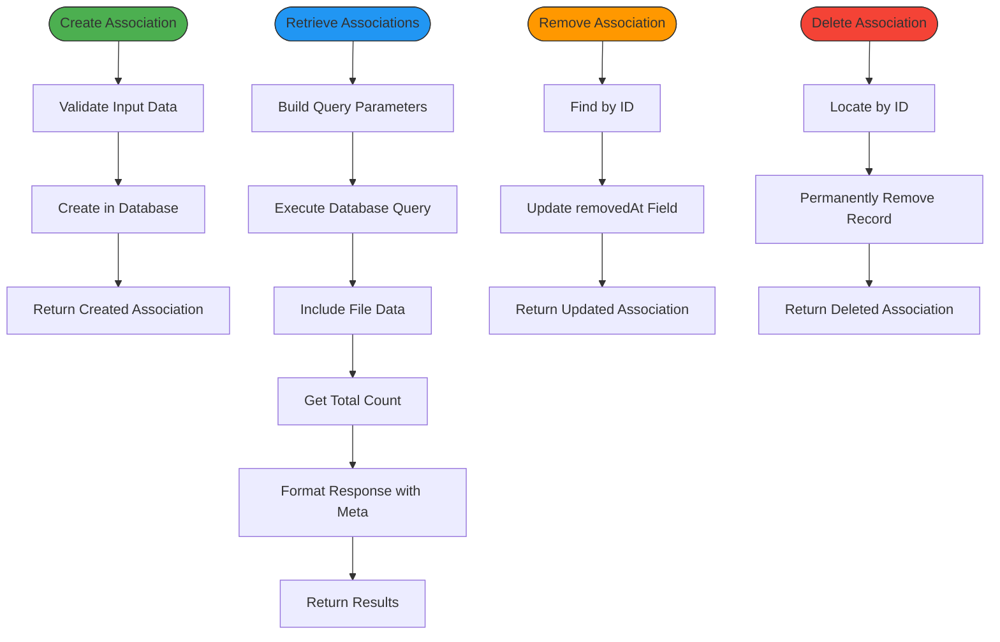

# File Association Mechanism

<cite>
**Referenced Files in This Document**   
- [file-associations.module.ts](file://apps/server/src/module/file-associations.module.ts)
- [files.module.ts](file://apps/server/src/module/files.module.ts)
- [file-association.entity.ts](file://packages/schema/src/entity/file-association.entity.ts)
- [file.entity.ts](file://packages/schema/src/entity/file.entity.ts)
- [file-association.dto.ts](file://packages/schema/src/dto/file-association.dto.ts)
- [file.dto.ts](file://packages/schema/src/dto/file.dto.ts)
- [file-associations.service.ts](file://apps/server/src/shared/service/resources/file-associations.service.ts)
- [file-associations.controller.ts](file://apps/server/src/shared/controller/resources/file-associations.controller.ts)
- [file-associations.repository.ts](file://apps/server/src/shared/repository/file-associations.repository.ts)
</cite>

## Table of Contents
1. [Introduction](#introduction)
2. [Architecture Overview](#architecture-overview)
3. [Core Components](#core-components)
4. [Entity Relationships](#entity-relationships)
5. [Database Schema Design](#database-schema-design)
6. [Query Patterns](#query-patterns)
7. [Association Lifecycle Management](#association-lifecycle-management)
8. [Integrity and Performance Considerations](#integrity-and-performance-considerations)
9. [Conclusion](#conclusion)

## Introduction

The file association mechanism in prj-core provides a flexible system for linking files to various domain entities such as users, programs, routines, and other objects. This polymorphic association pattern enables files to be reused across multiple contexts while maintaining referential integrity and supporting efficient querying. The system is designed to handle complex relationships between files and entities through a dedicated association table that acts as a junction between files and their associated objects.

**Section sources**
- [file-associations.module.ts](file://apps/server/src/module/file-associations.module.ts#L1-L13)
- [files.module.ts](file://apps/server/src/module/files.module.ts#L1-L9)

## Architecture Overview

The file association system follows a modular architecture with clear separation of concerns between the different components. The FileAssociationsModule and FilesModule work together to provide comprehensive file management capabilities, with the FileAssociationsModule specifically handling the relationships between files and other entities.

**Diagram sources**
- [file-associations.module.ts](file://apps/server/src/module/file-associations.module.ts#L1-L13)
- [files.module.ts](file://apps/server/src/module/files.module.ts#L1-L9)

**Section sources**
- [file-associations.module.ts](file://apps/server/src/module/file-associations.module.ts#L1-L13)
- [files.module.ts](file://apps/server/src/module/files.module.ts#L1-L9)

## Core Components

The file association mechanism consists of several core components that work together to manage file relationships. The FileAssociationsModule provides the primary interface for creating, querying, and managing file associations, while the underlying service, repository, and entity layers handle the business logic and data persistence.

The system follows the NestJS pattern of controllers handling HTTP requests, services implementing business logic, and repositories managing data access. The FileAssociationsService orchestrates operations by coordinating between the repository layer and potentially other services, ensuring that all business rules are enforced during association operations.

**Diagram sources**
- [file-associations.controller.ts](file://apps/server/src/shared/controller/resources/file-associations.controller.ts#L1-L108)
- [file-associations.service.ts](file://apps/server/src/shared/service/resources/file-associations.service.ts#L1-L63)
- [file-associations.repository.ts](file://apps/server/src/shared/repository/file-associations.repository.ts#L1)

**Section sources**
- [file-associations.controller.ts](file://apps/server/src/shared/controller/resources/file-associations.controller.ts#L1-L108)
- [file-associations.service.ts](file://apps/server/src/shared/service/resources/file-associations.service.ts#L1-L63)

## Entity Relationships

The file association system implements a polymorphic relationship pattern through the FileAssociation entity, which creates a many-to-many relationship between files and various domain entities. The current implementation shows a direct relationship between FileAssociation and Group entities, but the pattern is extensible to other entity types.

The File entity contains a collection of associations, allowing direct access to all relationships from the file perspective, while the FileAssociation entity maintains the foreign keys that link files to their associated entities. This bidirectional relationship enables efficient querying from both the file and entity perspectives.

**Diagram sources**
- [file.entity.ts](file://packages/schema/src/entity/file.entity.ts#L1-L15)
- [file-association.entity.ts](file://packages/schema/src/entity/file-association.entity.ts#L1-L20)

**Section sources**
- [file.entity.ts](file://packages/schema/src/entity/file.entity.ts#L1-L15)
- [file-association.entity.ts](file://packages/schema/src/entity/file-association.entity.ts#L1-L20)

## Database Schema Design

The database schema for file associations follows a junction table pattern, with the FileAssociation table serving as a bridge between files and other entities. This design enables flexible associations while maintaining referential integrity through foreign key constraints.

The schema supports soft deletion through the removedAt field, allowing for the preservation of historical data while marking associations as inactive. This approach supports audit trails and data recovery while providing the appearance of deletion to end users.

**Diagram sources**
- [file.entity.ts](file://packages/schema/src/entity/file.entity.ts#L1-L15)
- [file-association.entity.ts](file://packages/schema/src/entity/file-association.entity.ts#L1-L20)

**Section sources**
- [file.entity.ts](file://packages/schema/src/entity/file.entity.ts#L1-L15)
- [file-association.entity.ts](file://packages/schema/src/entity/file-association.entity.ts#L1-L20)

## Query Patterns

The file association system provides several query patterns for retrieving associated files efficiently. The primary method is through the getManyByQuery function in the FileAssociationsService, which accepts a QueryFileAssociationDto to filter and paginate results.

The service automatically includes file information when retrieving associations, ensuring that clients receive complete data without requiring additional requests. This optimization reduces the number of database queries and improves response times for common use cases.

**Diagram sources**
- [file-associations.service.ts](file://apps/server/src/shared/service/resources/file-associations.service.ts#L22-L38)
- [file-associations.controller.ts](file://apps/server/src/shared/controller/resources/file-associations.controller.ts#L97-L107)

**Section sources**
- [file-associations.service.ts](file://apps/server/src/shared/service/resources/file-associations.service.ts#L22-L38)
- [file-associations.controller.ts](file://apps/server/src/shared/controller/resources/file-associations.controller.ts#L97-L107)

## Association Lifecycle Management

The file association system implements a comprehensive lifecycle management approach with distinct operations for creating, updating, removing, and deleting associations. The distinction between removal and deletion supports soft deletion semantics, where removed associations are hidden from normal queries but can be restored if needed.

Creation of associations is handled through the create method, which accepts a CreateFileAssociationDto and persists the relationship to the database. Updates modify existing association properties, while removal marks an association as inactive without permanently deleting it. Hard deletion permanently removes the association record, which should be used with caution.

**Diagram sources**
- [file-associations.service.ts](file://apps/server/src/shared/service/resources/file-associations.service.ts#L14-L62)
- [file-associations.controller.ts](file://apps/server/src/shared/controller/resources/file-associations.controller.ts#L30-L95)

**Section sources**
- [file-associations.service.ts](file://apps/server/src/shared/service/resources/file-associations.service.ts#L14-L62)
- [file-associations.controller.ts](file://apps/server/src/shared/controller/resources/file-associations.controller.ts#L30-L95)

## Integrity and Performance Considerations

The file association system addresses several integrity and performance considerations to ensure reliable operation at scale. The use of foreign key constraints in the database enforces referential integrity, preventing orphaned file references by ensuring that associations only reference existing files and entities.

For performance optimization, the system includes file data by default when retrieving associations, reducing the need for additional queries. However, this approach should be monitored as the number of associated files grows, as it may lead to large result sets. Consider implementing selective inclusion options for scenarios where only association metadata is needed.

Orphaned file detection can be implemented through periodic audits that identify files without any active associations, which may indicate cleanup opportunities. The soft deletion pattern (using removedAt) helps prevent accidental data loss while allowing for efficient cleanup operations through batch processing of old removed associations.

To optimize queries across multiple entity types, consider implementing a unified association endpoint that can filter by entity type and ID, rather than requiring separate queries for each entity type. This approach reduces client complexity and enables more efficient database indexing strategies.

**Section sources**
- [file-associations.service.ts](file://apps/server/src/shared/service/resources/file-associations.service.ts#L27-L30)
- [file-association.entity.ts](file://packages/schema/src/entity/file-association.entity.ts#L15-L16)

## Conclusion

The file association mechanism in prj-core provides a robust and flexible system for linking files to various domain entities. By implementing a polymorphic association pattern through the FileAssociation entity, the system enables files to be reused across multiple contexts while maintaining data integrity and supporting efficient querying.

The modular architecture separates concerns between controllers, services, and repositories, following NestJS best practices and enabling maintainable code. The combination of hard and soft deletion options provides flexibility for different use cases, from temporary hiding of associations to permanent removal.

For optimal performance, consider implementing additional indexing on frequently queried fields and monitoring the growth of association records. The current design provides a solid foundation that can be extended to support additional entity types and more complex querying patterns as the system evolves.