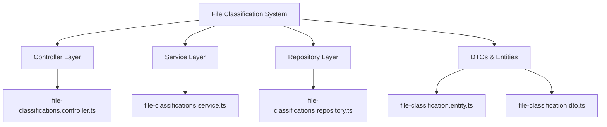
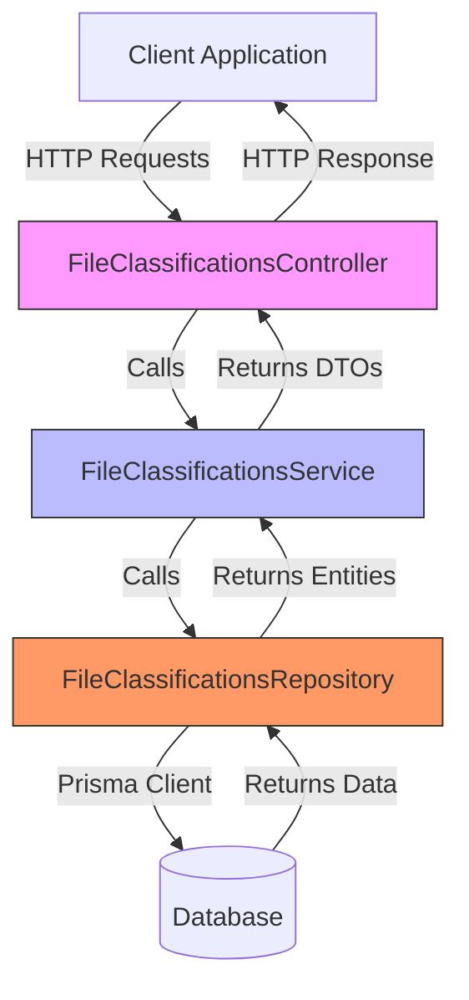
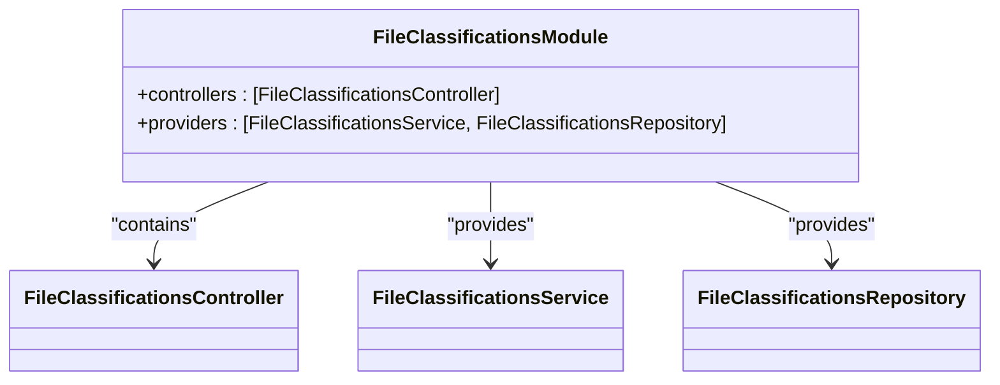
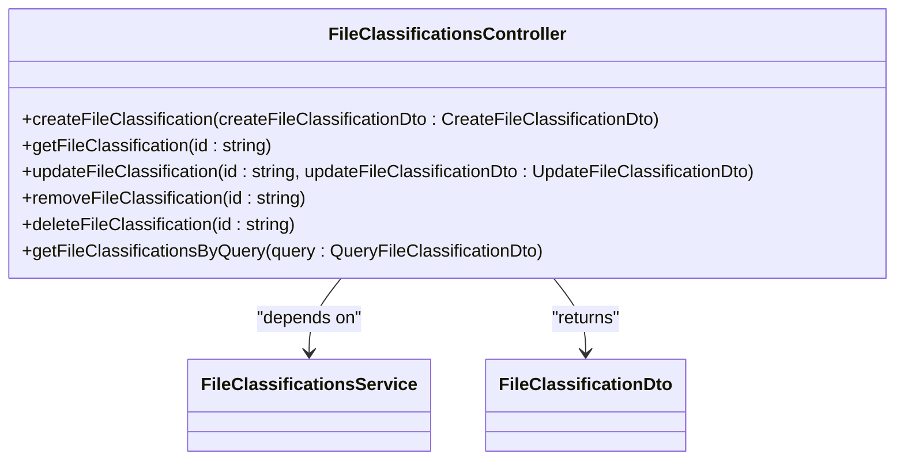
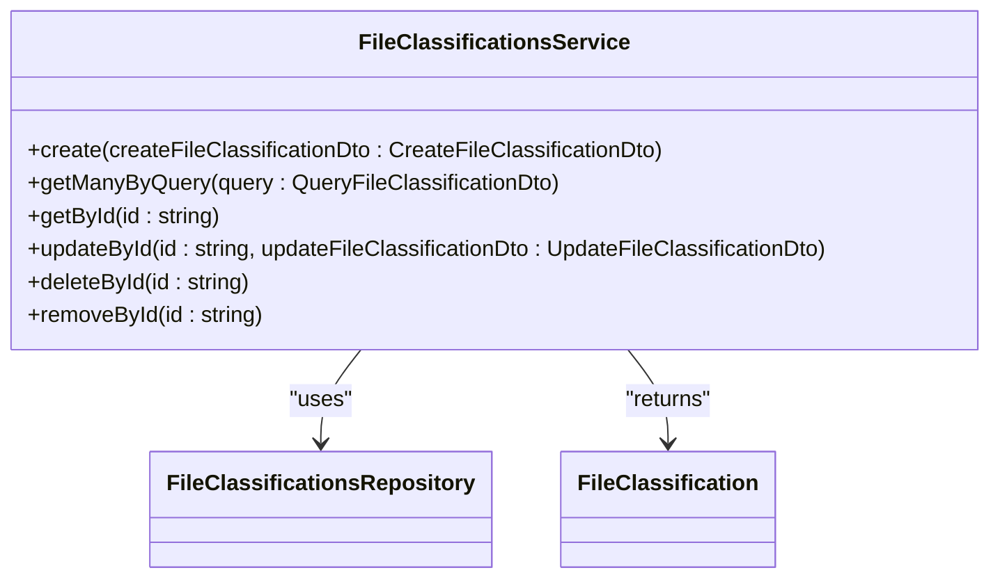
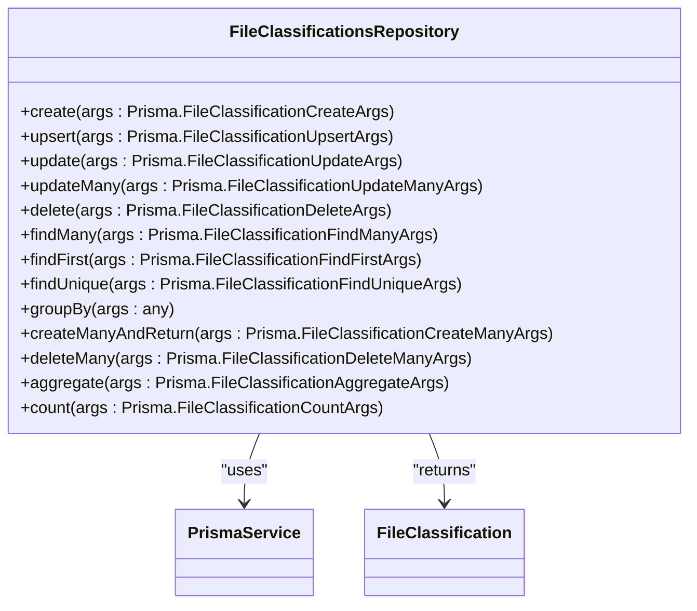
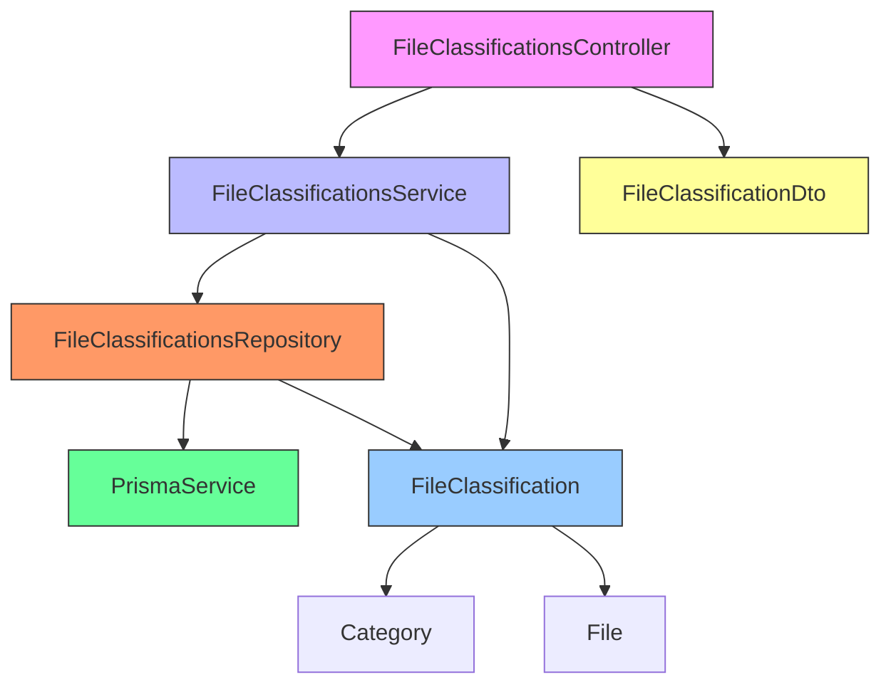

# File Classification System

<cite>
**Referenced Files in This Document**   
- [file-classifications.module.ts](file://apps/server/src/module/file-classifications.module.ts)
- [file-classifications.controller.ts](file://apps/server/src/shared/controller/resources/file-classifications.controller.ts)
- [file-classifications.service.ts](file://apps/server/src/shared/service/resources/file-classifications.service.ts)
- [file-classifications.repository.ts](file://apps/server/src/shared/repository/file-classifications.repository.ts)
- [file-classification.entity.ts](file://packages/schema/src/entity/file-classification.entity.ts)
- [file-classification.dto.ts](file://packages/schema/src/dto/file-classification.dto.ts)
- [file.entity.ts](file://packages/schema/src/entity/file.entity.ts)
- [category.entity.ts](file://packages/schema/src/entity/category.entity.ts)
</cite>

## Table of Contents
1. [Introduction](#introduction)
2. [Project Structure](#project-structure)
3. [Core Components](#core-components)
4. [Architecture Overview](#architecture-overview)
5. [Detailed Component Analysis](#detailed-component-analysis)
6. [Dependency Analysis](#dependency-analysis)
7. [Performance Considerations](#performance-considerations)
8. [Troubleshooting Guide](#troubleshooting-guide)
9. [Conclusion](#conclusion)

## Introduction
The File Classification System in prj-core provides a robust mechanism for organizing and categorizing files through a hierarchical taxonomy structure. This system enables the creation of classification hierarchies that can be applied to files, allowing for sophisticated organization, filtering, and access control. The implementation follows a clean architectural pattern with distinct controller, service, and repository layers, ensuring separation of concerns and maintainability.

## Project Structure

**Diagram sources**
- [file-classifications.controller.ts](file://apps/server/src/shared/controller/resources/file-classifications.controller.ts)
- [file-classifications.service.ts](file://apps/server/src/shared/service/resources/file-classifications.service.ts)
- [file-classifications.repository.ts](file://apps/server/src/shared/repository/file-classifications.repository.ts)
- [file-classification.entity.ts](file://packages/schema/src/entity/file-classification.entity.ts)
- [file-classification.dto.ts](file://packages/schema/src/dto/file-classification.dto.ts)

**Section sources**
- [file-classifications.module.ts](file://apps/server/src/module/file-classifications.module.ts)

## Core Components

The File Classification System consists of several core components that work together to provide file categorization functionality. The system is built on a modular architecture with clear separation between presentation, business logic, and data access layers. The controller handles HTTP requests and responses, the service implements business logic, and the repository manages data persistence operations.

**Section sources**
- [file-classifications.controller.ts](file://apps/server/src/shared/controller/resources/file-classifications.controller.ts)
- [file-classifications.service.ts](file://apps/server/src/shared/service/resources/file-classifications.service.ts)
- [file-classifications.repository.ts](file://apps/server/src/shared/repository/file-classifications.repository.ts)

## Architecture Overview

**Diagram sources**
- [file-classifications.controller.ts](file://apps/server/src/shared/controller/resources/file-classifications.controller.ts)
- [file-classifications.service.ts](file://apps/server/src/shared/service/resources/file-classifications.service.ts)
- [file-classifications.repository.ts](file://apps/server/src/shared/repository/file-classifications.repository.ts)

## Detailed Component Analysis

### FileClassificationsModule Analysis

The FileClassificationsModule is the entry point for the file classification functionality. It follows the NestJS module pattern, declaring the controller and providers (service and repository) that make up the module. This module imports and exports the necessary components to make the file classification features available throughout the application.

**Diagram sources**
- [file-classifications.module.ts](file://apps/server/src/module/file-classifications.module.ts)

**Section sources**
- [file-classifications.module.ts](file://apps/server/src/module/file-classifications.module.ts)

### FileClassificationsController Analysis

The FileClassificationsController implements RESTful endpoints for managing file classifications. It follows standard CRUD operations with additional functionality for soft deletion. The controller uses NestJS decorators to define routes, handle HTTP methods, and manage request/response cycles. It transforms entities to DTOs before returning responses to ensure consistent data formatting.

**Diagram sources**
- [file-classifications.controller.ts](file://apps/server/src/shared/controller/resources/file-classifications.controller.ts)
- [file-classification.dto.ts](file://packages/schema/src/dto/file-classification.dto.ts)

**Section sources**
- [file-classifications.controller.ts](file://apps/server/src/shared/controller/resources/file-classifications.controller.ts)

### FileClassificationsService Analysis

The FileClassificationsService contains the business logic for file classification operations. It acts as an intermediary between the controller and repository layers, handling data transformation and business rules. The service uses the repository to perform data operations and returns domain entities that are then transformed to DTOs by the controller.

**Diagram sources**
- [file-classifications.service.ts](file://apps/server/src/shared/service/resources/file-classifications.service.ts)
- [file-classification.entity.ts](file://packages/schema/src/entity/file-classification.entity.ts)

**Section sources**
- [file-classifications.service.ts](file://apps/server/src/shared/service/resources/file-classifications.service.ts)

### FileClassificationsRepository Analysis

The FileClassificationsRepository provides data access operations for file classifications. It wraps the Prisma client with additional logging and error handling, providing a clean interface for the service layer. The repository implements standard CRUD operations along with batch operations and aggregation functions, offering comprehensive data management capabilities.

**Diagram sources**
- [file-classifications.repository.ts](file://apps/server/src/shared/repository/file-classifications.repository.ts)
- [file-classification.entity.ts](file://packages/schema/src/entity/file-classification.entity.ts)

**Section sources**
- [file-classifications.repository.ts](file://apps/server/src/shared/repository/file-classifications.repository.ts)

## Dependency Analysis

**Diagram sources**
- [file-classifications.controller.ts](file://apps/server/src/shared/controller/resources/file-classifications.controller.ts)
- [file-classifications.service.ts](file://apps/server/src/shared/service/resources/file-classifications.service.ts)
- [file-classifications.repository.ts](file://apps/server/src/shared/repository/file-classifications.repository.ts)
- [file-classification.entity.ts](file://packages/schema/src/entity/file-classification.entity.ts)
- [file.entity.ts](file://packages/schema/src/entity/file.entity.ts)
- [category.entity.ts](file://packages/schema/src/entity/category.entity.ts)

**Section sources**
- [file-classifications.controller.ts](file://apps/server/src/shared/controller/resources/file-classifications.controller.ts)
- [file-classifications.service.ts](file://apps/server/src/shared/service/resources/file-classifications.service.ts)
- [file-classifications.repository.ts](file://apps/server/src/shared/repository/file-classifications.repository.ts)

## Performance Considerations

The File Classification System is designed with performance in mind. The repository layer provides efficient data access through Prisma, with support for batching operations and optimized queries. The service layer implements query parameter transformation to ensure efficient database operations. For large classification hierarchies, the system can leverage database indexing on the categoryId and fileId fields to maintain performance. Pagination is supported through the QueryFileClassificationDto, allowing clients to retrieve data in manageable chunks.

The system also implements soft deletion through the removeById method, which sets a removedAt timestamp rather than permanently deleting records. This approach preserves data integrity and allows for potential restoration while still hiding deleted items from normal queries. For optimal performance with large datasets, appropriate database indexes should be created on frequently queried fields.

**Section sources**
- [file-classifications.service.ts](file://apps/server/src/shared/service/resources/file-classifications.service.ts)
- [file-classifications.repository.ts](file://apps/server/src/shared/repository/file-classifications.repository.ts)

## Troubleshooting Guide

Common issues with the File Classification System typically involve data integrity and relationship management. When creating file classifications, ensure that both the file and category references exist to avoid foreign key constraint violations. The system prevents circular references by design, as the classification hierarchy is managed through the Category entity rather than within the FileClassification itself.

For performance issues with large classification hierarchies, verify that appropriate database indexes exist on the categoryId and fileId columns. Monitor the query patterns and consider adding composite indexes for frequently used query combinations. When experiencing issues with data retrieval, check that the Prisma client is properly configured and that the database connection is stable.

If classification assignments are not appearing as expected, verify that the data transformation from entity to DTO is working correctly, particularly the relationship loading. The system uses lazy loading for related entities, so ensure that the necessary relations are explicitly included in queries when needed.

**Section sources**
- [file-classifications.repository.ts](file://apps/server/src/shared/repository/file-classifications.repository.ts)
- [file-classification.entity.ts](file://packages/schema/src/entity/file-classification.entity.ts)

## Conclusion

The File Classification System in prj-core provides a comprehensive solution for organizing files through hierarchical taxonomies. The system's modular architecture with clear separation of concerns makes it maintainable and extensible. By leveraging NestJS patterns and Prisma for data access, the implementation achieves both developer productivity and runtime efficiency.

The system effectively manages the relationship between files and classifications through the FileClassification entity, which serves as a junction table between the File and Category entities. This design allows for flexible classification schemes while maintaining data integrity through foreign key constraints. The API design follows REST principles with comprehensive CRUD operations and support for querying with pagination.

For future enhancements, consider implementing validation rules to prevent circular references in the classification hierarchy, adding caching for frequently accessed classification trees, and providing bulk operations for managing multiple file classifications simultaneously. The current architecture provides a solid foundation for these and other extensions.