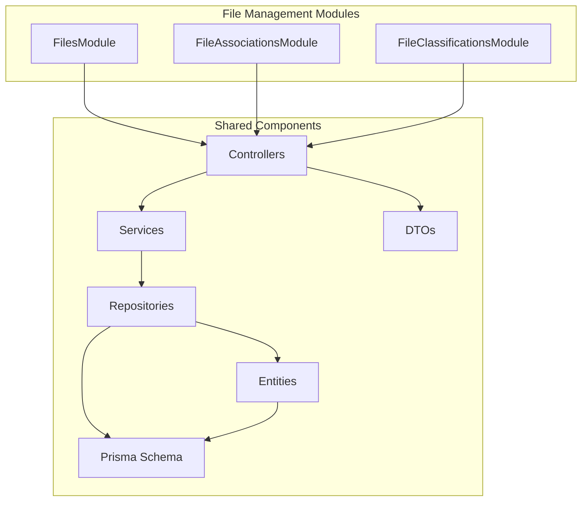
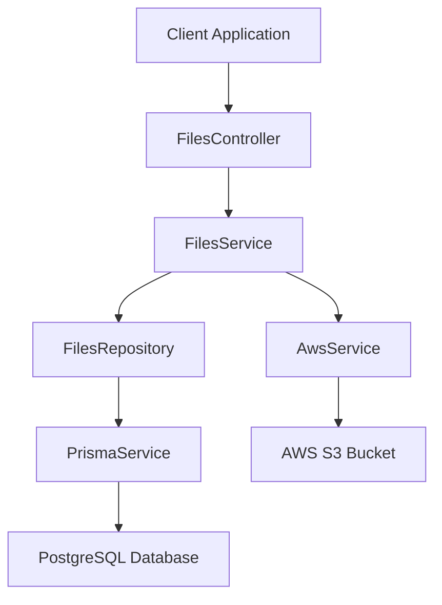
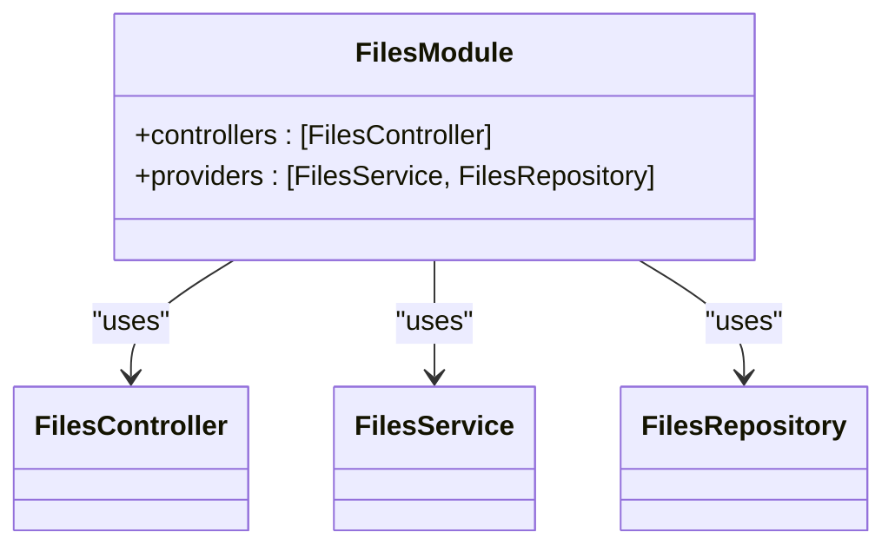
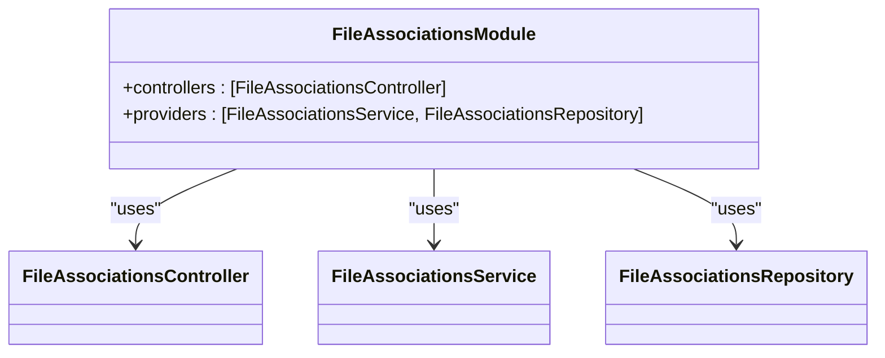
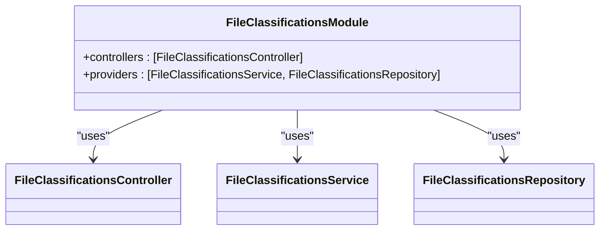
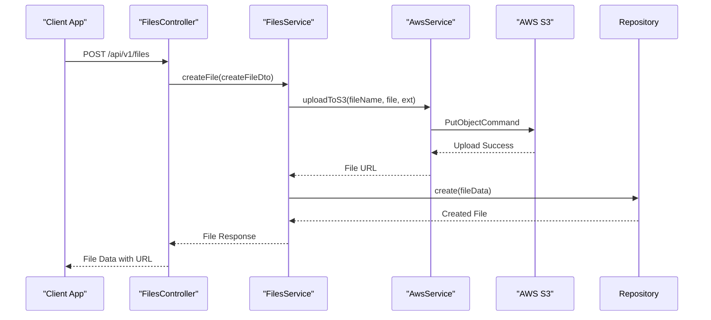
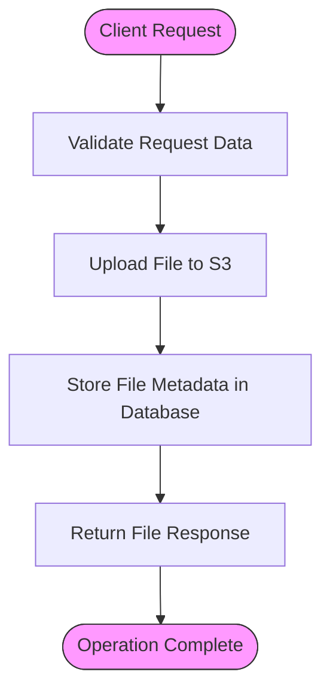
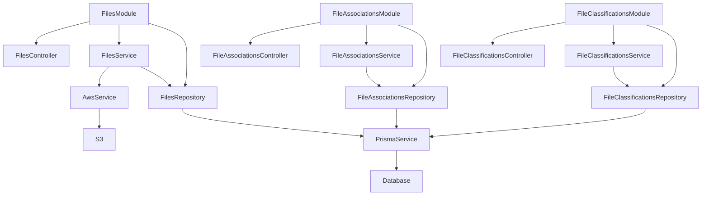

# File Management Modules

<cite>
**Referenced Files in This Document**   
- [files.module.ts](file://apps/server/src/module/files.module.ts)
- [file-associations.module.ts](file://apps/server/src/module/file-associations.module.ts)
- [file-classifications.module.ts](file://apps/server/src/module/file-classifications.module.ts)
- [aws.service.ts](file://apps/server/src/shared/service/utils/aws.service.ts)
- [aws.config.ts](file://apps/server/src/shared/config/aws.config.ts)
- [file.config.ts](file://apps/server/src/shared/config/file.config.ts)
- [files.controller.ts](file://apps/server/src/shared/controller/resources/files.controller.ts)
- [file-associations.controller.ts](file://apps/server/src/shared/controller/resources/file-associations.controller.ts)
- [file-classifications.controller.ts](file://apps/server/src/shared/controller/resources/file-classifications.controller.ts)
- [files.service.ts](file://apps/server/src/shared/service/resources/files.service.ts)
- [file-associations.service.ts](file://apps/server/src/shared/service/resources/file-associations.service.ts)
- [file-classifications.service.ts](file://apps/server/src/shared/service/resources/file-classifications.service.ts)
- [files.repository.ts](file://apps/server/src/shared/repository/files.repository.ts)
- [file-associations.repository.ts](file://apps/server/src/shared/repository/file-associations.repository.ts)
- [file-classifications.repository.ts](file://apps/server/src/shared/repository/file-classifications.repository.ts)
- [file-size-validation.pipe.ts](file://apps/server/src/shared/pipe/file-size-validation.pipe.ts)
- [file.dto.ts](file://packages/schema/src/dto/file.dto.ts)
- [file-association.dto.ts](file://packages/schema/src/dto/file-association.dto.ts)
- [file-classification.dto.ts](file://packages/schema/src/dto/file-classification.dto.ts)
- [file.entity.ts](file://packages/schema/src/entity/file.entity.ts)
- [file-association.entity.ts](file://packages/schema/src/entity/file-association.entity.ts)
- [file-classification.entity.ts](file://packages/schema/src/entity/file-classification.entity.ts)
- [file.prisma](file://packages/schema/prisma/schema/file.prisma)
</cite>

## Table of Contents
1. [Introduction](#introduction)
2. [Project Structure](#project-structure)
3. [Core Components](#core-components)
4. [Architecture Overview](#architecture-overview)
5. [Detailed Component Analysis](#detailed-component-analysis)
6. [Dependency Analysis](#dependency-analysis)
7. [Performance Considerations](#performance-considerations)
8. [Troubleshooting Guide](#troubleshooting-guide)
9. [Conclusion](#conclusion)

## Introduction
The file management system in prj-core provides a comprehensive solution for handling file uploads, storage, classification, and associations. This documentation details the implementation of the file management modules, focusing on the integration with AWS S3 for storage, metadata management, and the relationships between different file entities. The system is designed with a modular architecture using NestJS, with clear separation of concerns between modules, services, repositories, and controllers. The documentation will explain the file upload workflow, S3 integration, and how files are classified and associated with other entities in the system, making it accessible to both beginners and experienced developers.

## Project Structure
The file management system is organized into three main modules: FilesModule, FileAssociationsModule, and FileClassificationsModule. Each module follows the NestJS pattern of having controllers, services, and repositories. The modules are located in the `apps/server/src/module/` directory, with their corresponding implementation details in the `apps/server/src/shared/` directory. The shared package contains the core logic for file operations, including AWS integration, validation, and database interactions. The system also leverages Prisma for database operations and AWS SDK for S3 storage.

**Diagram sources**
- [files.module.ts](file://apps/server/src/module/files.module.ts)
- [file-associations.module.ts](file://apps/server/src/module/file-associations.module.ts)
- [file-classifications.module.ts](file://apps/server/src/module/file-classifications.module.ts)
- [files.controller.ts](file://apps/server/src/shared/controller/resources/files.controller.ts)
- [file-associations.controller.ts](file://apps/server/src/shared/controller/resources/file-associations.controller.ts)
- [file-classifications.controller.ts](file://apps/server/src/shared/controller/resources/file-classifications.controller.ts)

**Section sources**
- [files.module.ts](file://apps/server/src/module/files.module.ts)
- [file-associations.module.ts](file://apps/server/src/module/file-associations.module.ts)
- [file-classifications.module.ts](file://apps/server/src/module/file-classifications.module.ts)

## Core Components
The file management system consists of three core modules that work together to provide comprehensive file handling capabilities. The FilesModule handles the basic file operations such as upload, retrieval, and deletion. The FileAssociationsModule manages the relationships between files and other entities like groups, enabling files to be associated with specific organizational units. The FileClassificationsModule handles the categorization of files, allowing them to be classified according to predefined categories. All three modules follow the same architectural pattern with controllers handling HTTP requests, services implementing business logic, and repositories managing database operations. The system integrates with AWS S3 for file storage and uses Prisma as the ORM for database interactions.

**Section sources**
- [files.module.ts](file://apps/server/src/module/files.module.ts)
- [file-associations.module.ts](file://apps/server/src/module/file-associations.module.ts)
- [file-classifications.module.ts](file://apps/server/src/module/file-classifications.module.ts)
- [aws.service.ts](file://apps/server/src/shared/service/utils/aws.service.ts)

## Architecture Overview
The file management system follows a layered architecture with clear separation of concerns. At the top level, controllers handle HTTP requests and responses, validating input and coordinating with services. Services contain the business logic for file operations, including file upload workflows, association management, and classification logic. Repositories handle data access operations, abstracting the database interactions and providing a clean interface to the services. The system integrates with AWS S3 for file storage through the AwsService, which handles the actual upload of files to S3 and returns the file URLs. Configuration for AWS and file operations is managed through dedicated config files that load environment variables and provide type-safe access to configuration values.

**Diagram sources**
- [files.controller.ts](file://apps/server/src/shared/controller/resources/files.controller.ts)
- [files.service.ts](file://apps/server/src/shared/service/resources/files.service.ts)
- [files.repository.ts](file://apps/server/src/shared/repository/files.repository.ts)
- [aws.service.ts](file://apps/server/src/shared/service/utils/aws.service.ts)

## Detailed Component Analysis

### Files Module Analysis
The FilesModule is responsible for handling basic file operations including upload, retrieval, update, and deletion. It follows the NestJS module pattern, importing necessary controllers, services, and repositories. The module exports the FilesModule class which is then imported by other modules that need file functionality. The module structure is minimal, focusing on dependency injection and module organization rather than containing business logic.

**Diagram sources**
- [files.module.ts](file://apps/server/src/module/files.module.ts)

**Section sources**
- [files.module.ts](file://apps/server/src/module/files.module.ts)

### File Associations Module Analysis
The FileAssociationsModule manages the relationships between files and other entities in the system, specifically groups. This module allows files to be associated with organizational units or categories, enabling better organization and access control. The module follows the same pattern as other modules, with a controller handling HTTP requests, a service implementing business logic, and a repository managing database operations. The associations are stored in the database as many-to-many relationships between files and groups.

**Diagram sources**
- [file-associations.module.ts](file://apps/server/src/module/file-associations.module.ts)

**Section sources**
- [file-associations.module.ts](file://apps/server/src/module/file-associations.module.ts)

### File Classifications Module Analysis
The FileClassificationsModule handles the categorization of files, allowing them to be classified according to predefined categories. This enables better organization, searchability, and access control for files. The module follows the standard NestJS pattern with controller, service, and repository components. Classifications are stored as many-to-many relationships between files and categories in the database, allowing a single file to have multiple classifications.

**Diagram sources**
- [file-classifications.module.ts](file://apps/server/src/module/file-classifications.module.ts)

**Section sources**
- [file-classifications.module.ts](file://apps/server/src/module/file-classifications.module.ts)

### AWS Integration Analysis
The AWS integration is handled by the AwsService, which provides a clean interface for uploading files to S3. The service is configured through the aws.config.ts file, which loads AWS credentials and configuration from environment variables. The AwsService uses the AWS SDK for JavaScript to create an S3 client and provides a method for uploading files to S3. The service handles the creation of the PutObjectCommand with the appropriate bucket, key, body, and content type, then sends the command to S3 and returns the file URL.

**Diagram sources**
- [aws.service.ts](file://apps/server/src/shared/service/utils/aws.service.ts)
- [aws.config.ts](file://apps/server/src/shared/config/aws.config.ts)
- [files.service.ts](file://apps/server/src/shared/service/resources/files.service.ts)
- [files.controller.ts](file://apps/server/src/shared/controller/resources/files.controller.ts)

**Section sources**
- [aws.service.ts](file://apps/server/src/shared/service/utils/aws.service.ts)
- [aws.config.ts](file://apps/server/src/shared/config/aws.config.ts)

### File Upload Workflow
The file upload workflow begins with a client making a POST request to the FilesController with file data. The controller validates the request and passes the data to the FilesService. The service first uploads the file to AWS S3 using the AwsService, which returns a URL for the uploaded file. The service then creates a record in the database through the FilesRepository, storing metadata about the file along with the S3 URL. The repository uses Prisma to interact with the PostgreSQL database, ensuring data integrity and proper relationships.

**Diagram sources**
- [files.controller.ts](file://apps/server/src/shared/controller/resources/files.controller.ts)
- [files.service.ts](file://apps/server/src/shared/service/resources/files.service.ts)
- [aws.service.ts](file://apps/server/src/shared/service/utils/aws.service.ts)
- [files.repository.ts](file://apps/server/src/shared/repository/files.repository.ts)

**Section sources**
- [files.controller.ts](file://apps/server/src/shared/controller/resources/files.controller.ts)
- [files.service.ts](file://apps/server/src/shared/service/resources/files.service.ts)

## Dependency Analysis
The file management modules have a clear dependency hierarchy. The FilesModule is the core module that can be used independently for basic file operations. The FileAssociationsModule and FileClassificationsModule depend on the FilesModule for file entity definitions and basic file operations. All modules depend on shared components like controllers, services, repositories, DTOs, and entities. The system has external dependencies on AWS SDK for S3 integration and Prisma for database operations. The dependency graph shows a clean separation of concerns with minimal circular dependencies.

**Diagram sources**
- [files.module.ts](file://apps/server/src/module/files.module.ts)
- [file-associations.module.ts](file://apps/server/src/module/file-associations.module.ts)
- [file-classifications.module.ts](file://apps/server/src/module/file-classifications.module.ts)
- [files.service.ts](file://apps/server/src/shared/service/resources/files.service.ts)
- [file-associations.service.ts](file://apps/server/src/shared/service/resources/file-associations.service.ts)
- [file-classifications.service.ts](file://apps/server/src/shared/service/resources/file-classifications.service.ts)
- [aws.service.ts](file://apps/server/src/shared/service/utils/aws.service.ts)

**Section sources**
- [files.module.ts](file://apps/server/src/module/files.module.ts)
- [file-associations.module.ts](file://apps/server/src/module/file-associations.module.ts)
- [file-classifications.module.ts](file://apps/server/src/module/file-classifications.module.ts)

## Performance Considerations
The file management system is designed with performance in mind. File uploads are handled asynchronously, with the file being uploaded to S3 and the metadata being stored in the database in parallel where possible. The system uses efficient database queries with proper indexing on frequently queried fields like file IDs and category IDs. The AWS S3 integration ensures that file storage and retrieval are handled by a highly scalable and performant service. For large files, the system could be enhanced with multipart upload support to improve upload reliability and performance. Caching strategies could also be implemented for frequently accessed files to reduce database and S3 access.

## Troubleshooting Guide
Common issues in the file management system include file upload failures, S3 configuration errors, and database connection problems. For file upload failures, check the file size against the configured limits and ensure the file type is supported. For S3 configuration errors, verify that the AWS credentials and bucket name are correctly configured in the environment variables. Database connection issues can be diagnosed by checking the database connection string and ensuring the database service is running. The system includes validation pipes to catch common input errors, and proper error handling in the services and controllers to provide meaningful error messages to clients.

**Section sources**
- [file-size-validation.pipe.ts](file://apps/server/src/shared/pipe/file-size-validation.pipe.ts)
- [aws.config.ts](file://apps/server/src/shared/config/aws.config.ts)
- [file.config.ts](file://apps/server/src/shared/config/file.config.ts)

## Conclusion
The file management modules in prj-core provide a robust and scalable solution for handling file uploads, storage, classification, and associations. The system's modular architecture with clear separation of concerns makes it easy to maintain and extend. The integration with AWS S3 ensures reliable and scalable file storage, while the use of Prisma provides a type-safe and efficient way to interact with the database. The system is designed to be accessible to developers of all skill levels, with clear documentation and well-structured code. Future enhancements could include support for additional storage providers, improved file validation, and enhanced search capabilities for files.