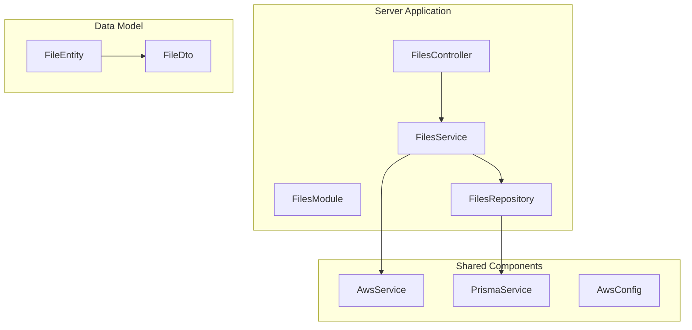
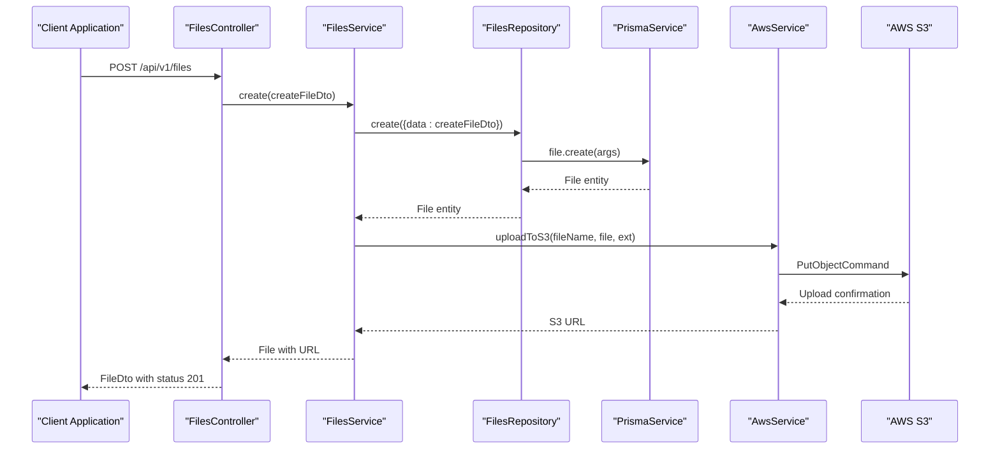
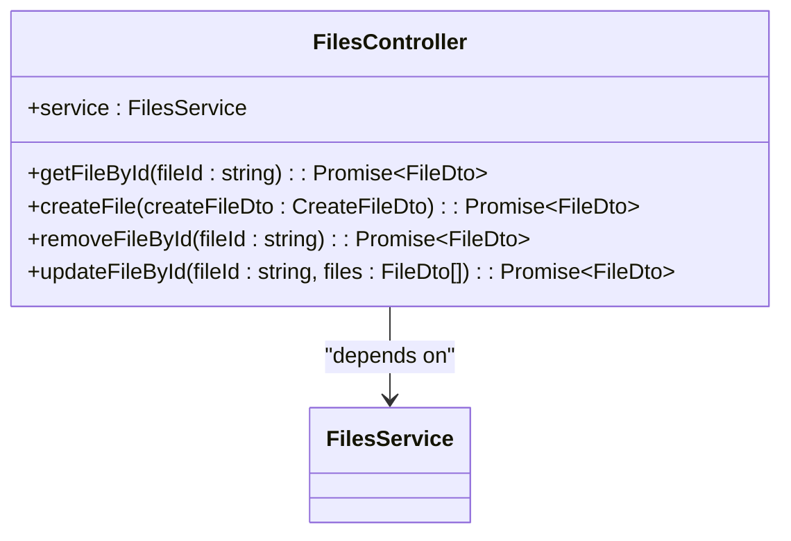
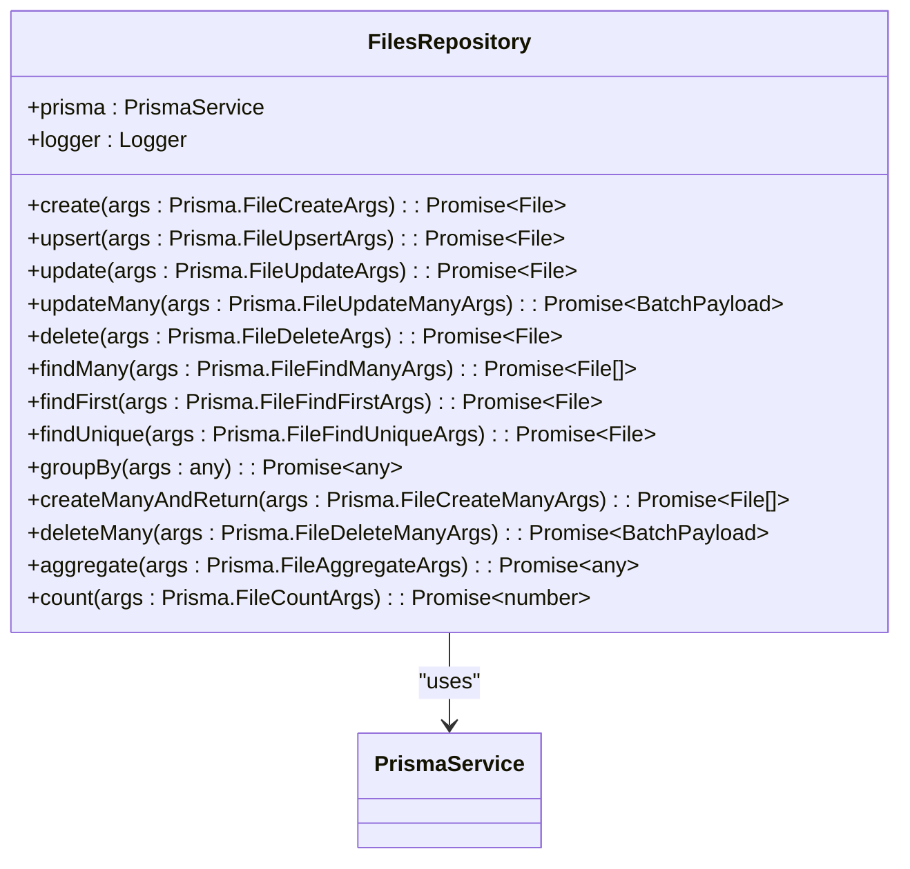
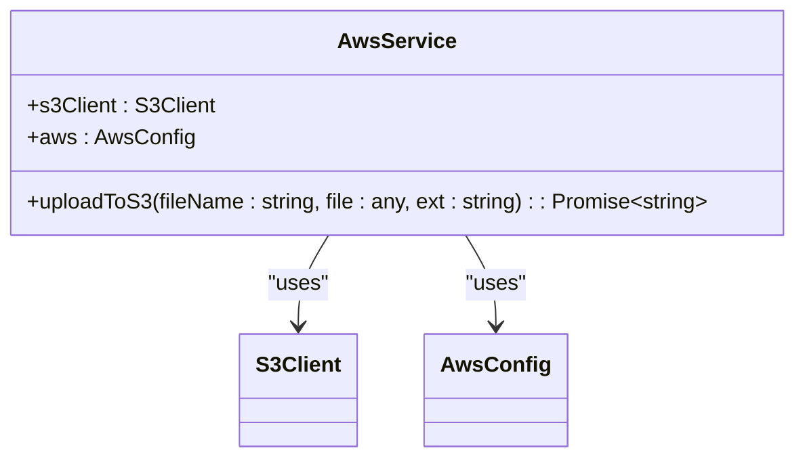
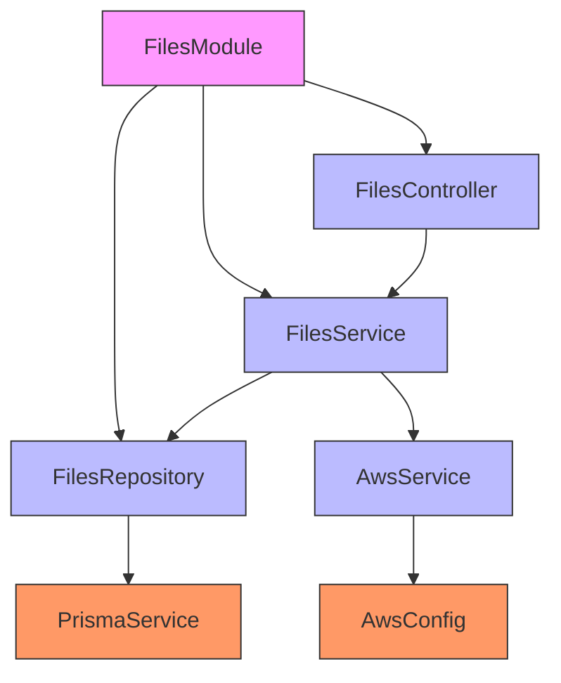

# File Upload and Storage

<cite>
**Referenced Files in This Document**   
- [files.module.ts](file://apps/server/src/module/files.module.ts)
- [files.controller.ts](file://apps/server/src/shared/controller/resources/files.controller.ts)
- [files.service.ts](file://apps/server/src/shared/service/resources/files.service.ts)
- [files.repository.ts](file://apps/server/src/shared/repository/files.repository.ts)
- [aws.service.ts](file://apps/server/src/shared/service/utils/aws.service.ts)
- [file.entity.ts](file://packages/schema/src/entity/file.entity.ts)
- [aws.config.ts](file://apps/server/src/shared/config/aws.config.ts)
- [prisma.service.ts](file://apps/server/src/shared/service/utils/prisma.service.ts)
- [file-size-validation.pipe.ts](file://apps/server/src/shared/pipe/file-size-validation.pipe.ts)
</cite>

## Table of Contents
1. [Introduction](#introduction)
2. [Project Structure](#project-structure)
3. [Core Components](#core-components)
4. [Architecture Overview](#architecture-overview)
5. [Detailed Component Analysis](#detailed-component-analysis)
6. [Dependency Analysis](#dependency-analysis)
7. [Performance Considerations](#performance-considerations)
8. [Troubleshooting Guide](#troubleshooting-guide)
9. [Conclusion](#conclusion)

## Introduction
The file upload and storage system in prj-core provides a robust solution for handling file operations in a NestJS-based application. This document details the complete workflow from HTTP request handling to AWS S3 storage, covering multipart form data processing, file validation, and cloud integration. The system is designed with a modular architecture that separates concerns between controllers, services, repositories, and external integrations, ensuring maintainability and scalability. The implementation leverages NestJS decorators, dependency injection, and Prisma ORM for database operations, while integrating with AWS S3 for reliable cloud storage.

## Project Structure



**Diagram sources**
- [files.module.ts](file://apps/server/src/module/files.module.ts#L4-L8)
- [files.controller.ts](file://apps/server/src/shared/controller/resources/files.controller.ts#L21-L70)
- [files.service.ts](file://apps/server/src/shared/service/resources/files.service.ts#L10-L55)
- [files.repository.ts](file://apps/server/src/shared/repository/files.repository.ts#L8-L91)

**Section sources**
- [files.module.ts](file://apps/server/src/module/files.module.ts#L1-L9)
- [files.controller.ts](file://apps/server/src/shared/controller/resources/files.controller.ts#L1-L71)

## Core Components

The file upload system consists of several core components that work together to handle file operations. The FilesModule serves as the entry point, importing and configuring all necessary controllers, services, and repositories. The FilesController handles HTTP requests and routes them to the appropriate service methods. The FilesService contains the business logic for file operations, coordinating between the repository and AWS service. The FilesRepository manages database interactions through Prisma, while the AwsService handles cloud storage operations with AWS S3. These components are connected through NestJS dependency injection, ensuring loose coupling and testability.

**Section sources**
- [files.module.ts](file://apps/server/src/module/files.module.ts#L4-L8)
- [files.service.ts](file://apps/server/src/shared/service/resources/files.service.ts#L11-L55)
- [aws.service.ts](file://apps/server/src/shared/service/utils/aws.service.ts#L9-L58)

## Architecture Overview



**Diagram sources**
- [files.controller.ts](file://apps/server/src/shared/controller/resources/files.controller.ts#L33-L40)
- [files.service.ts](file://apps/server/src/shared/service/resources/files.service.ts#L14-L19)
- [aws.service.ts](file://apps/server/src/shared/service/utils/aws.service.ts#L29-L47)

## Detailed Component Analysis

### Files Module Analysis
The FilesModule is a NestJS module that organizes the file upload components. It uses the @Module decorator to define the controllers and providers that make up the file upload system. The module imports the FilesController to handle HTTP requests, and registers the FilesService and FilesRepository as providers that can be injected into other components. This modular approach allows for easy configuration and dependency management within the NestJS application context.

**Section sources**
- [files.module.ts](file://apps/server/src/module/files.module.ts#L1-L9)

### Files Controller Analysis
The FilesController handles HTTP requests for file operations, implementing RESTful endpoints for creating, retrieving, updating, and removing files. It uses NestJS decorators to define routes, handle multipart form data, and specify response formats. The controller delegates business logic to the FilesService, following the separation of concerns principle. Key endpoints include POST for file creation, GET for file retrieval by ID, PATCH for file updates (including file uploads via multipart form data), and soft deletion through the removedAt field.



**Diagram sources**
- [files.controller.ts](file://apps/server/src/shared/controller/resources/files.controller.ts#L21-L70)

### Files Service Analysis
The FilesService contains the core business logic for file operations. It orchestrates interactions between the FilesRepository for database operations and the AwsService for cloud storage. The service implements methods for creating, retrieving, updating, and removing files, with proper error handling and data transformation. When creating a file, the service first persists file metadata to the database and then uploads the actual file to AWS S3, returning the generated URL. The service also handles file updates and soft deletion through the removedAt field.

```mermaid
classDiagram
class FilesService {
+repository : FilesRepository
+create(createFileDto : CreateFileDto) : Promise~File~
+getManyByQuery(query : QueryFileDto) : Promise~{items : File[], count : number}~
+getById(id : string) : Promise~File~
+updateById(id : string, updateFileDto : UpdateFileDto) : Promise~File~
+deleteById(id : string) : Promise~File~
+removeById(id : string) : Promise~File~
}
FilesService --> FilesRepository : "uses"
FilesService --> AwsService : "uses"
```

**Diagram sources**
- [files.service.ts](file://apps/server/src/shared/service/resources/files.service.ts#L11-L55)

### Files Repository Analysis
The FilesRepository provides an abstraction layer for database operations related to files. It uses Prisma ORM to interact with the underlying database, implementing methods for CRUD operations and data querying. The repository follows the repository pattern, encapsulating the logic for data access and providing a clean interface to the service layer. It includes methods for creating, updating, deleting, and querying files, with proper type safety through Prisma's generated types. The repository also handles data transformation using class-transformer to convert Prisma entities to domain objects.



**Diagram sources**
- [files.repository.ts](file://apps/server/src/shared/repository/files.repository.ts#L8-L91)

### AWS Service Analysis
The AwsService handles integration with AWS S3 for file storage. It initializes the S3 client with configuration from the application's environment and provides methods for uploading files to S3. The service validates AWS configuration on initialization, ensuring that required credentials and settings are present. The uploadToS3 method creates a PutObjectCommand with the file data and metadata, sends it to S3, and returns the generated URL. The service is marked as @Global to make it available throughout the application without explicit imports.



**Diagram sources**
- [aws.service.ts](file://apps/server/src/shared/service/utils/aws.service.ts#L9-L58)

## Dependency Analysis



**Diagram sources**
- [files.module.ts](file://apps/server/src/module/files.module.ts#L4-L8)
- [files.controller.ts](file://apps/server/src/shared/controller/resources/files.controller.ts#L23)
- [files.service.ts](file://apps/server/src/shared/service/resources/files.service.ts#L12)
- [files.repository.ts](file://apps/server/src/shared/repository/files.repository.ts#L11)
- [aws.service.ts](file://apps/server/src/shared/service/utils/aws.service.ts#L13)

## Performance Considerations
The file upload system is designed with performance in mind, using efficient patterns for handling file operations. The separation of metadata storage (in the database) from file storage (in S3) allows for optimized retrieval patterns, where metadata can be queried independently of large file data. The use of Prisma's batching operations enables efficient handling of multiple file operations. For large file uploads, the system could be enhanced with multipart upload support to improve reliability and performance. Caching strategies could be implemented for frequently accessed file metadata to reduce database load. The current implementation processes uploads synchronously, which may impact server responsiveness during large uploads; implementing asynchronous processing with background jobs could improve overall system performance.

## Troubleshooting Guide

Common issues in the file upload system include:

1. **Upload timeouts**: These can occur with large files or slow network connections. Solutions include increasing timeout settings in the server and client, and implementing multipart uploads for large files.

2. **S3 permission errors**: These typically result from incorrect AWS credentials or insufficient IAM permissions. Verify that the AWS_ACCESS_KEY_ID, AWS_SECRET_ACCESS_KEY, and AWS_REGION environment variables are correctly set, and that the IAM user has the necessary S3 permissions (s3:PutObject, s3:GetObject, etc.).

3. **Network failures**: Transient network issues can interrupt uploads. Implement retry logic with exponential backoff in the AwsService, and consider using AWS S3's built-in retry mechanisms.

4. **File validation failures**: The system should validate file size and type before upload. Currently, a FileSizeValidationPipe is implemented but may need enhancement to handle various file types and size limits.

5. **Configuration issues**: Missing or incorrect AWS configuration can prevent uploads. The AwsService throws an error if AWS configuration is missing, but additional validation could be added to verify bucket existence and accessibility.

6. **Database connection issues**: Problems with PrismaService can prevent file metadata from being stored. Ensure the database connection string is correct and the database is accessible.

**Section sources**
- [aws.service.ts](file://apps/server/src/shared/service/utils/aws.service.ts#L15-L17)
- [file-size-validation.pipe.ts](file://apps/server/src/shared/pipe/file-size-validation.pipe.ts#L1-L10)
- [prisma.service.ts](file://apps/server/src/shared/service/utils/prisma.service.ts)

## Conclusion
The file upload and storage system in prj-core provides a comprehensive solution for handling file operations in a modern web application. By leveraging NestJS's modular architecture, Prisma for database operations, and AWS S3 for cloud storage, the system achieves a clean separation of concerns and high reliability. The implementation follows best practices for API design, with RESTful endpoints and proper error handling. For future improvements, consider implementing multipart uploads for large files, adding comprehensive file validation, enhancing error handling with detailed logging, and introducing asynchronous processing for improved performance. The system's modular design makes it easy to extend and maintain, providing a solid foundation for file management in the application.