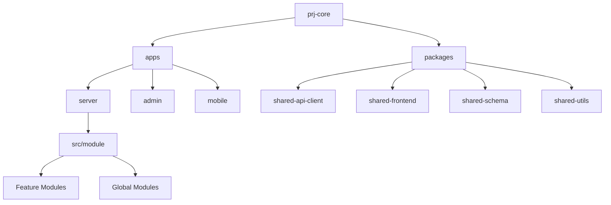
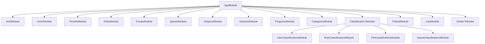
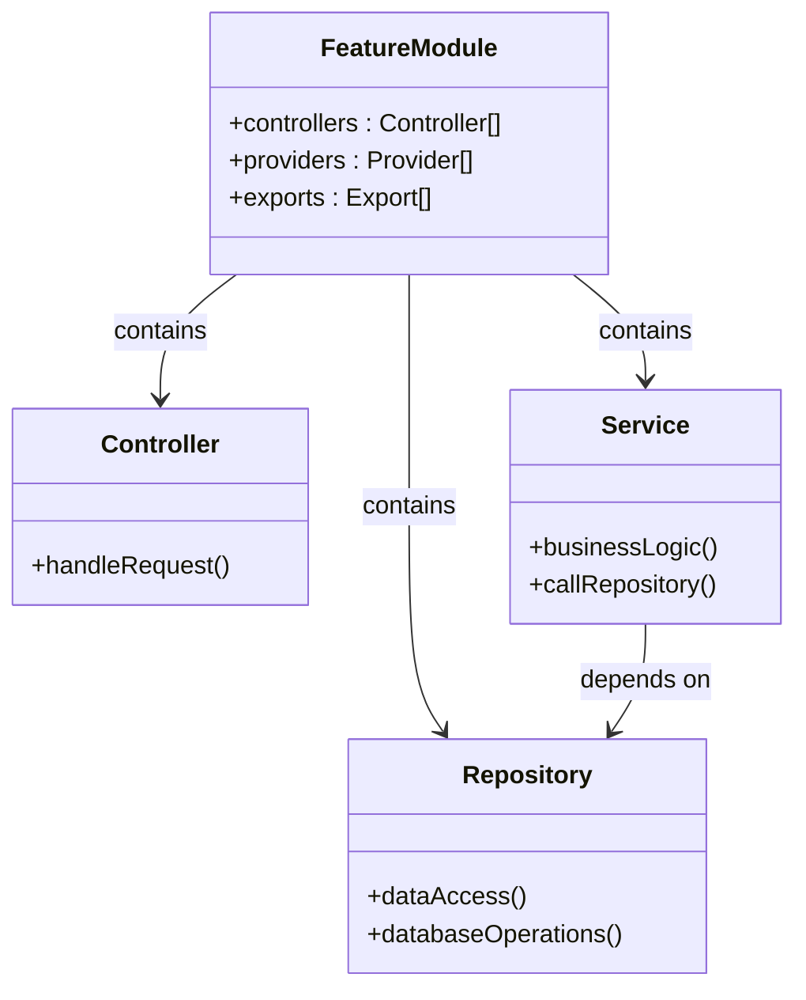
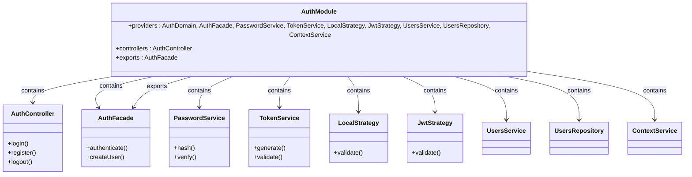
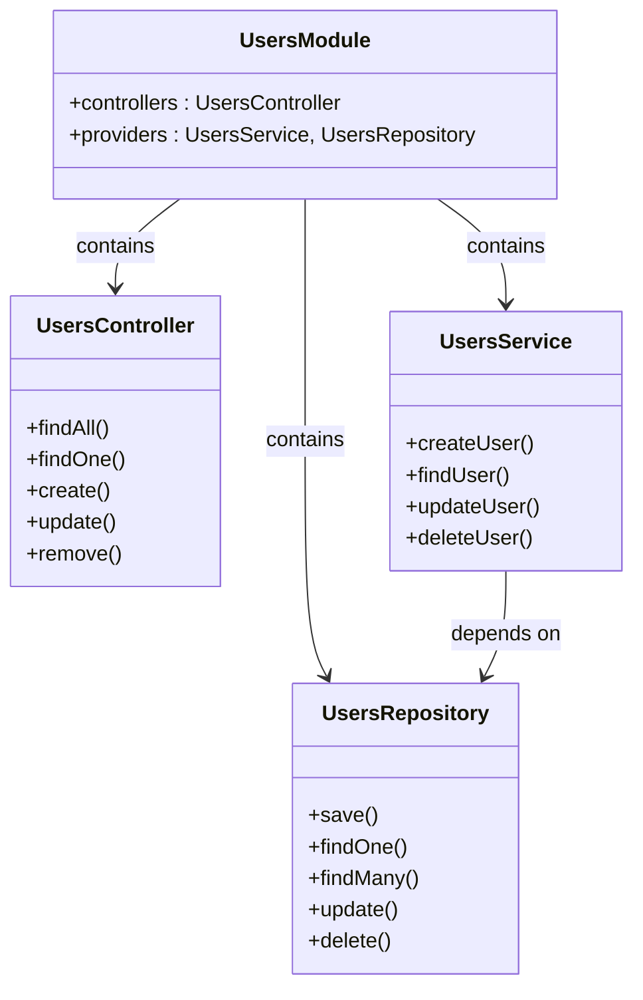
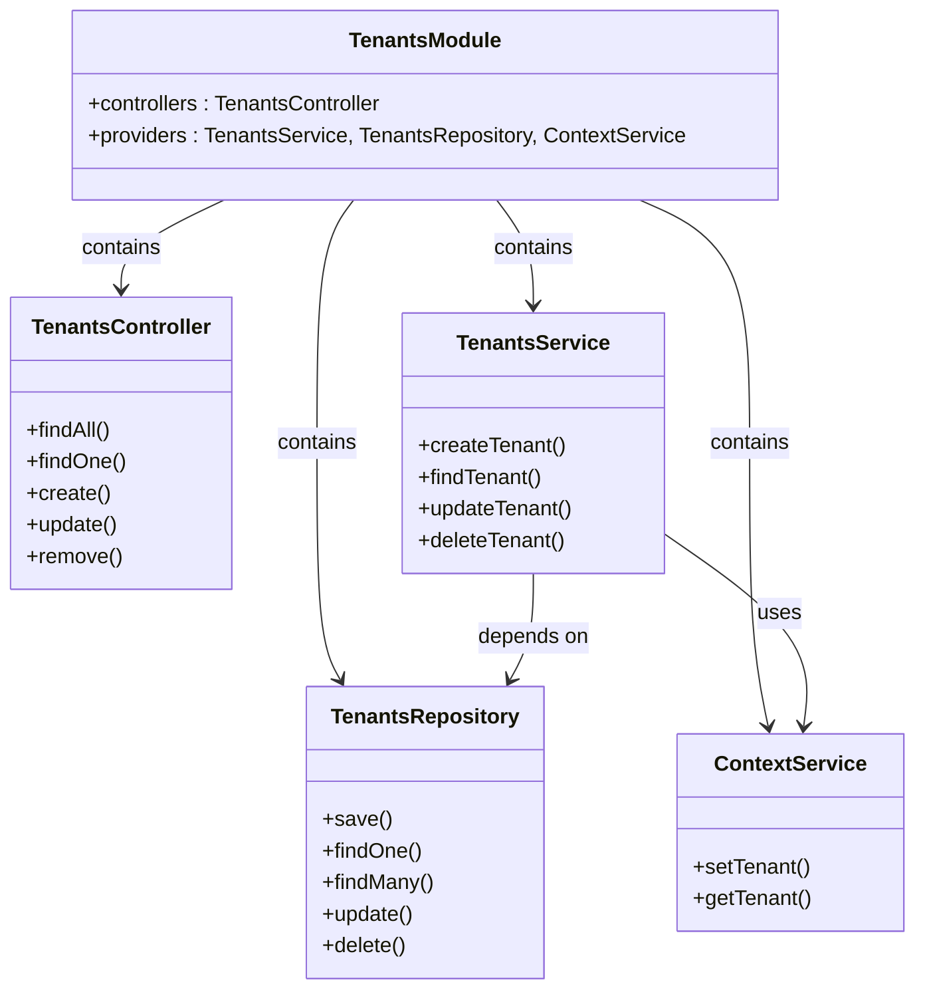
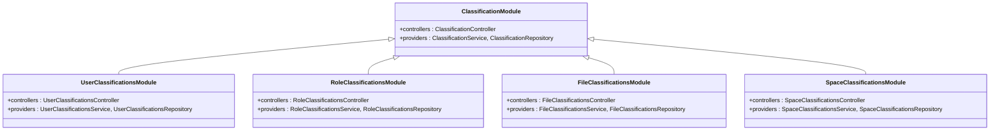
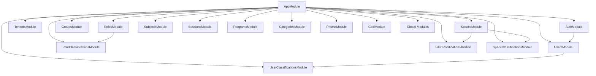

# NestJS Module Structure

<cite>
**Referenced Files in This Document**   
- [app.module.ts](file://apps/server/src/module/app.module.ts)
- [auth.module.ts](file://apps/server/src/module/auth.module.ts)
- [users.module.ts](file://apps/server/src/module/users.module.ts)
- [tenants.module.ts](file://apps/server/src/module/tenants.module.ts)
- [roles.module.ts](file://apps/server/src/module/roles.module.ts)
- [groups.module.ts](file://apps/server/src/module/groups.module.ts)
- [spaces.module.ts](file://apps/server/src/module/spaces.module.ts)
- [subjects.module.ts](file://apps/server/src/module/subjects.module.ts)
- [sessions.module.ts](file://apps/server/src/module/sessions.module.ts)
- [programs.module.ts](file://apps/server/src/module/programs.module.ts)
- [user-classifications.module.ts](file://apps/server/src/module/user-classifications.module.ts)
- [role-classifications.module.ts](file://apps/server/src/module/role-classifications.module.ts)
- [file-classifications.module.ts](file://apps/server/src/module/file-classifications.module.ts)
- [space-classifications.module.ts](file://apps/server/src/module/space-classifications.module.ts)
- [categories.module.ts](file://apps/server/src/module/categories.module.ts)
- [global.module](file://apps/server/src/global.module)
</cite>

## Table of Contents
1. [Introduction](#introduction)
2. [Project Structure](#project-structure)
3. [Core Components](#core-components)
4. [Architecture Overview](#architecture-overview)
5. [Detailed Component Analysis](#detailed-component-analysis)
6. [Dependency Analysis](#dependency-analysis)
7. [Performance Considerations](#performance-considerations)
8. [Troubleshooting Guide](#troubleshooting-guide)
9. [Conclusion](#conclusion)

## Introduction
This document provides comprehensive architectural documentation for the NestJS module structure in the prj-core application. It details how the application is organized into feature modules following NestJS best practices and domain-driven design principles. The documentation covers module hierarchy, imports, providers, controllers, and exports configuration, explaining the purpose and responsibilities of each module within the system. It also describes how modules communicate through dependency injection and demonstrates proper module organization patterns used throughout the codebase.

## Project Structure
The prj-core application follows a monorepo structure with multiple applications and shared packages. The server application, which implements the NestJS backend, is organized with a clear module structure located in `apps/server/src/module`. Each feature domain has its own module file that encapsulates related controllers, services, and repositories. The module files follow a consistent naming convention using the `.module.ts` suffix and are organized in a flat structure within the module directory.

**Diagram sources**
- [app.module.ts](file://apps/server/src/module/app.module.ts)

**Section sources**
- [app.module.ts](file://apps/server/src/module/app.module.ts)

## Core Components
The core components of the NestJS module structure include feature modules for various domain entities such as users, tenants, roles, groups, spaces, and classifications. Each module follows the NestJS `@Module` decorator pattern, defining controllers, providers, and exports. The application uses a global module pattern for shared functionality and implements dependency injection for service communication. The module structure supports domain-driven design by grouping related functionality and maintaining clear boundaries between different domain concerns.

**Section sources**
- [app.module.ts](file://apps/server/src/module/app.module.ts)
- [auth.module.ts](file://apps/server/src/module/auth.module.ts)
- [users.module.ts](file://apps/server/src/module/users.module.ts)

## Architecture Overview
The NestJS module architecture in prj-core follows a hierarchical structure with the `AppModule` serving as the root module that imports all feature modules. The architecture implements domain-driven design principles with modules organized around business capabilities. The module hierarchy is reflected in the API routing structure, with parent-child relationships between modules creating nested routes. The architecture supports cross-cutting concerns through global modules and shared providers while maintaining separation of concerns between feature domains.

**Diagram sources**
- [app.module.ts](file://apps/server/src/module/app.module.ts)

## Detailed Component Analysis

### Feature Module Pattern
The application implements a consistent feature module pattern across all domain entities. Each feature module encapsulates related functionality and follows the same structural pattern with controllers, services, and repositories.

**Diagram sources**
- [users.module.ts](file://apps/server/src/module/users.module.ts)
- [roles.module.ts](file://apps/server/src/module/roles.module.ts)
- [groups.module.ts](file://apps/server/src/module/groups.module.ts)

### Authentication Module Analysis
The AuthModule handles authentication functionality and implements security strategies. It exports the AuthFacade to make authentication services available to other modules while keeping implementation details encapsulated.

**Diagram sources**
- [auth.module.ts](file://apps/server/src/module/auth.module.ts)

**Section sources**
- [auth.module.ts](file://apps/server/src/module/auth.module.ts)

### User Management Module Analysis
The UsersModule handles user-related functionality and follows the standard feature module pattern. It includes controllers for user operations and providers for business logic and data access.

**Diagram sources**
- [users.module.ts](file://apps/server/src/module/users.module.ts)

**Section sources**
- [users.module.ts](file://apps/server/src/module/users.module.ts)

### Tenant Management Module Analysis
The TenantsModule manages tenant-related functionality and includes the ContextService as a provider to handle tenant context across operations.

**Diagram sources**
- [tenants.module.ts](file://apps/server/src/module/tenants.module.ts)

**Section sources**
- [tenants.module.ts](file://apps/server/src/module/tenants.module.ts)

### Classification Modules Analysis
The application implements a pattern of classification modules for different entity types (users, roles, files, spaces). These modules follow the same structure and are organized as child modules in the routing hierarchy.

**Diagram sources**
- [user-classifications.module.ts](file://apps/server/src/module/user-classifications.module.ts)
- [role-classifications.module.ts](file://apps/server/src/module/role-classifications.module.ts)
- [file-classifications.module.ts](file://apps/server/src/module/file-classifications.module.ts)
- [space-classifications.module.ts](file://apps/server/src/module/space-classifications.module.ts)

**Section sources**
- [user-classifications.module.ts](file://apps/server/src/module/user-classifications.module.ts)
- [role-classifications.module.ts](file://apps/server/src/module/role-classifications.module.ts)
- [file-classifications.module.ts](file://apps/server/src/module/file-classifications.module.ts)
- [space-classifications.module.ts](file://apps/server/src/module/space-classifications.module.ts)

## Dependency Analysis
The module dependency structure shows a clear hierarchy with the AppModule at the root importing all feature modules. The dependency injection system allows modules to share services while maintaining encapsulation. The architecture uses global modules for cross-cutting concerns and implements proper export configurations to control service visibility.

**Diagram sources**
- [app.module.ts](file://apps/server/src/module/app.module.ts)

**Section sources**
- [app.module.ts](file://apps/server/src/module/app.module.ts)

## Performance Considerations
The module structure supports performance optimization through lazy loading capabilities and efficient dependency injection. The flat module organization allows for selective importing of only needed modules, reducing memory footprint. The use of global modules for shared functionality minimizes redundant service instantiation. The architecture supports caching strategies through the ContextService and repository pattern, enabling efficient data access patterns.

## Troubleshooting Guide
Common issues in module organization include circular dependencies, incorrect provider registration, and improper export configurations. When creating new modules, ensure that dependencies are properly declared in the imports array and that services intended for external use are exported. Verify that controllers are registered in the controllers array and that providers are correctly instantiated. Use the NestJS CLI for generating new modules to ensure proper file structure and naming conventions.

**Section sources**
- [app.module.ts](file://apps/server/src/module/app.module.ts)
- [auth.module.ts](file://apps/server/src/module/auth.module.ts)

## Conclusion
The NestJS module structure in prj-core follows best practices for organizing a complex application into manageable, domain-focused modules. The architecture implements domain-driven design principles with clear boundaries between feature domains. The consistent module pattern across all features enhances maintainability and developer experience. The hierarchical structure with proper dependency management enables scalable growth of the application. The use of classification modules as child routes demonstrates effective API design patterns. This module organization provides a solid foundation for building and maintaining a robust enterprise application.