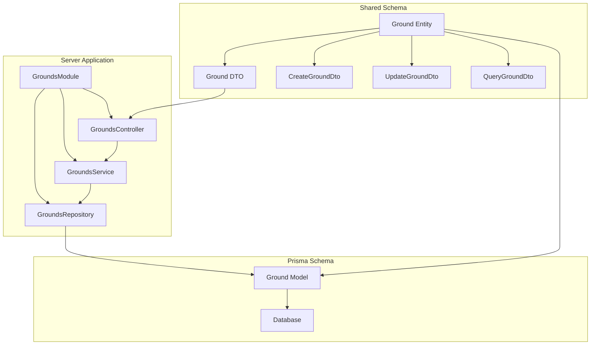
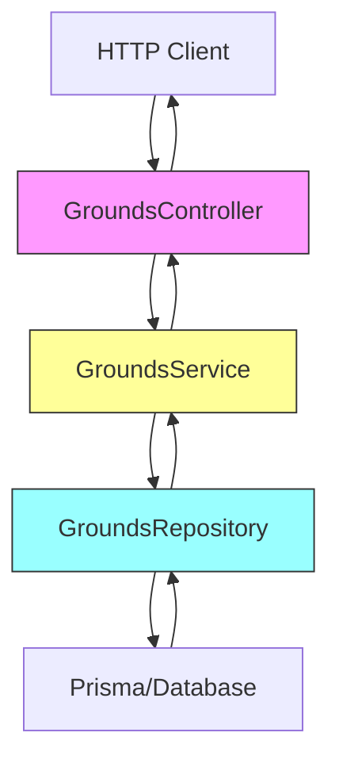
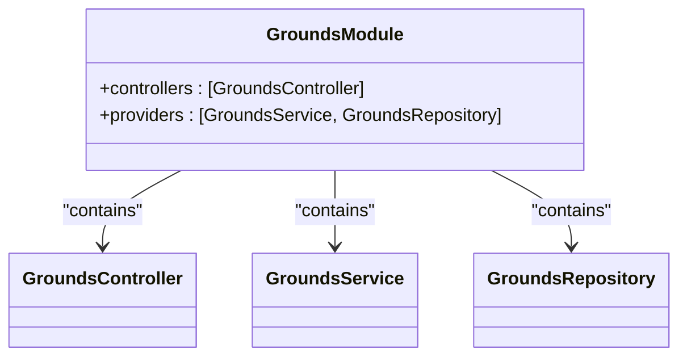
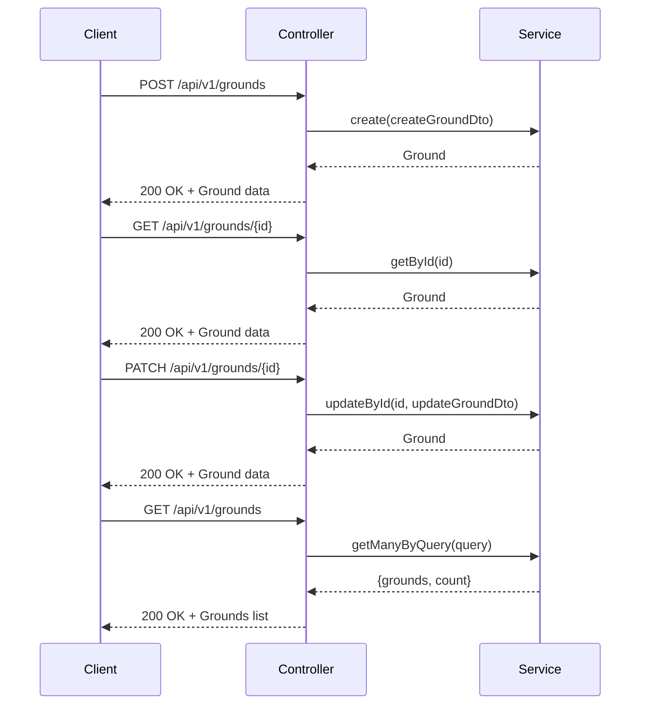
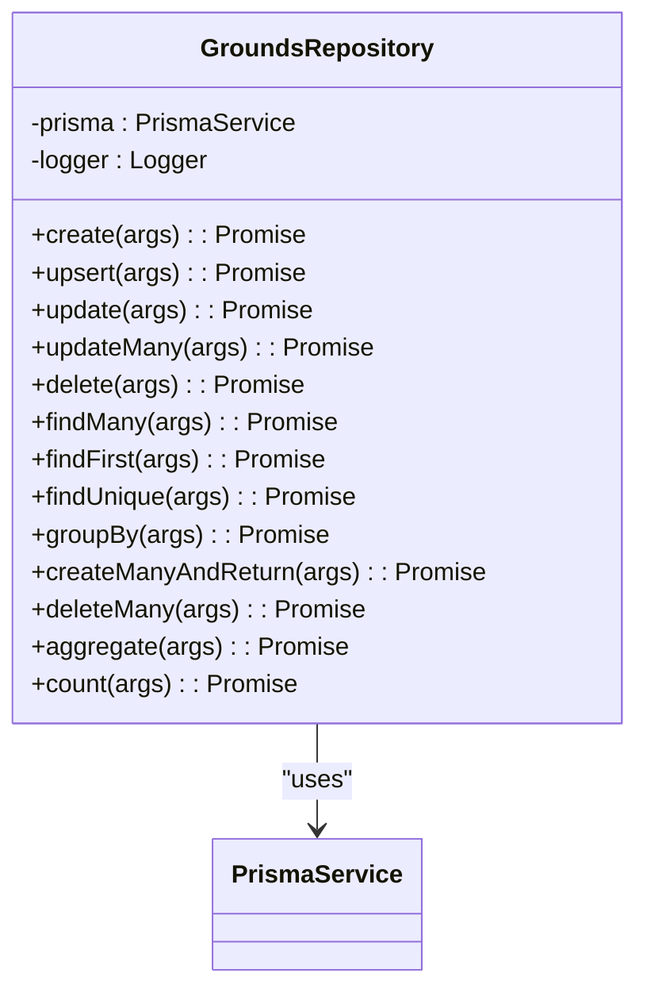
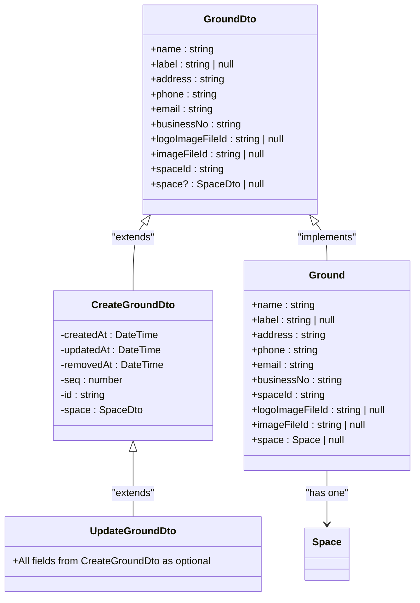
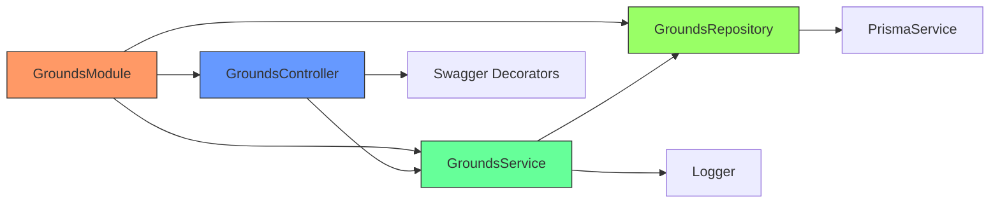

# Grounds Module

<cite>
**Referenced Files in This Document**   
- [grounds.module.ts](file://apps/server/src/module/grounds.module.ts)
- [grounds.controller.ts](file://apps/server/src/shared/controller/resources/grounds.controller.ts)
- [grounds.service.ts](file://apps/server/src/shared/service/resources/grounds.service.ts)
- [grounds.repository.ts](file://apps/server/src/shared/repository/grounds.repository.ts)
- [ground.entity.ts](file://packages/schema/src/entity/ground.entity.ts)
- [ground.dto.ts](file://packages/schema/src/dto/ground.dto.ts)
- [create-ground.dto.ts](file://packages/schema/src/dto/create/create-ground.dto.ts)
- [update-ground.dto.ts](file://packages/schema/src/dto/update/update-ground.dto.ts)
- [space.entity.ts](file://packages/schema/src/entity/space.entity.ts)
- [space.prisma](file://packages/schema/prisma/schema/space.prisma)
</cite>

## Table of Contents
1. [Introduction](#introduction)
2. [Project Structure](#project-structure)
3. [Core Components](#core-components)
4. [Architecture Overview](#architecture-overview)
5. [Detailed Component Analysis](#detailed-component-analysis)
6. [Dependency Analysis](#dependency-analysis)
7. [Performance Considerations](#performance-considerations)
8. [Troubleshooting Guide](#troubleshooting-guide)
9. [Conclusion](#conclusion)

## Introduction
The GroundsModule in prj-core provides a comprehensive system for managing physical or conceptual locations within spaces. This module implements a complete CRUD (Create, Read, Update, Delete) functionality for grounds management with a clean separation of concerns through the repository pattern. The module is tightly integrated with the SpacesModule, establishing grounds as location entities within spaces, creating a hierarchical relationship that enables spatial resource management. This documentation will explore the implementation details, relationships, and practical usage patterns of the GroundsModule.

## Project Structure
The GroundsModule follows a well-organized structure with clear separation between different architectural layers. The implementation is distributed across multiple packages and directories, with the core functionality residing in the server application module and shared components.



**Diagram sources**
- [grounds.module.ts](file://apps/server/src/module/grounds.module.ts)
- [ground.entity.ts](file://packages/schema/src/entity/ground.entity.ts)
- [space.prisma](file://packages/schema/prisma/schema/space.prisma)

**Section sources**
- [grounds.module.ts](file://apps/server/src/module/grounds.module.ts)
- [ground.entity.ts](file://packages/schema/src/entity/ground.entity.ts)

## Core Components
The GroundsModule consists of four main components that follow the NestJS architectural pattern: Module, Controller, Service, and Repository. These components work together to provide a complete grounds management system with proper dependency injection and separation of concerns. The module imports and exports necessary components, the controller handles HTTP requests, the service contains business logic, and the repository manages data access operations.

**Section sources**
- [grounds.module.ts](file://apps/server/src/module/grounds.module.ts)
- [grounds.controller.ts](file://apps/server/src/shared/controller/resources/grounds.controller.ts)
- [grounds.service.ts](file://apps/server/src/shared/service/resources/grounds.service.ts)
- [grounds.repository.ts](file://apps/server/src/shared/repository/grounds.repository.ts)

## Architecture Overview
The GroundsModule implements a clean architecture following the repository pattern, which separates the business logic from the data access logic. This pattern provides several benefits including improved testability, maintainability, and flexibility. The architecture consists of a hierarchical flow where HTTP requests are received by the controller, processed by the service layer, and executed by the repository layer which interacts with the database through Prisma.



**Diagram sources**
- [grounds.controller.ts](file://apps/server/src/shared/controller/resources/grounds.controller.ts)
- [grounds.service.ts](file://apps/server/src/shared/service/resources/grounds.service.ts)
- [grounds.repository.ts](file://apps/server/src/shared/repository/grounds.repository.ts)

## Detailed Component Analysis

### Grounds Module Analysis
The GroundsModule is implemented as a NestJS module that serves as a container for the components related to grounds management. It uses the @Module decorator to configure the module's metadata, specifying the controllers and providers that should be instantiated and made available within the module's context. The module imports the GroundsController, GroundsService, and GroundsRepository from the shared package, establishing the dependency hierarchy.



**Diagram sources**
- [grounds.module.ts](file://apps/server/src/module/grounds.module.ts)

**Section sources**
- [grounds.module.ts](file://apps/server/src/module/grounds.module.ts)

### Grounds Controller Analysis
The GroundsController handles all HTTP requests related to grounds management. It implements RESTful endpoints for creating, reading, updating, and deleting grounds, following standard HTTP methods and status codes. The controller uses NestJS decorators to define routes, validate input, and document API endpoints. Each method in the controller delegates business logic to the GroundsService, maintaining a clear separation of concerns.



**Diagram sources**
- [grounds.controller.ts](file://apps/server/src/shared/controller/resources/grounds.controller.ts)
- [grounds.service.ts](file://apps/server/src/shared/service/resources/grounds.service.ts)

**Section sources**
- [grounds.controller.ts](file://apps/server/src/shared/controller/resources/grounds.controller.ts)

### Grounds Service Analysis
The GroundsService contains the business logic for grounds management operations. It acts as an intermediary between the controller and repository layers, handling data transformation and business rules. The service methods prepare arguments for repository calls, including configuration for data relationships (such as including the associated space). The service also handles soft deletion by updating the removedAt field rather than permanently deleting records.

```mermaid
flowchart TD
A[Service Method] --> B[Prepare Args]
B --> C{Include Space?}
C --> |Yes| D[Add include: {space: true}]
C --> |No| E[Proceed without include]
D --> F[Call Repository]
E --> F
F --> G[Return Result]
```

**Diagram sources**
- [grounds.service.ts](file://apps/server/src/shared/service/resources/grounds.service.ts)

**Section sources**
- [grounds.service.ts](file://apps/server/src/shared/service/resources/grounds.service.ts)

### Grounds Repository Analysis
The GroundsRepository implements the data access layer using the repository pattern. It provides a clean API for database operations while abstracting the underlying Prisma client. The repository includes comprehensive methods for all CRUD operations, including specialized methods for counting, aggregating, and grouping grounds. Each method includes logging for debugging and monitoring purposes, and uses class-transformer to convert Prisma results to entity instances.



**Diagram sources**
- [grounds.repository.ts](file://apps/server/src/shared/repository/grounds.repository.ts)

**Section sources**
- [grounds.repository.ts](file://apps/server/src/shared/repository/grounds.repository.ts)

### Ground Entity and DTO Analysis
The Ground entity and DTOs define the data structure and validation rules for grounds. The entity extends AbstractEntity and implements the GroundEntity interface from Prisma, providing type safety and code completion. The DTO (Data Transfer Object) defines the schema for data transfer between layers, with validation decorators ensuring data integrity. The create and update DTOs extend the base GroundDto with specific configurations for their use cases.



**Diagram sources**
- [ground.dto.ts](file://packages/schema/src/dto/ground.dto.ts)
- [create-ground.dto.ts](file://packages/schema/src/dto/create/create-ground.dto.ts)
- [update-ground.dto.ts](file://packages/schema/src/dto/update/update-ground.dto.ts)
- [ground.entity.ts](file://packages/schema/src/entity/ground.entity.ts)

**Section sources**
- [ground.dto.ts](file://packages/schema/src/dto/ground.dto.ts)
- [create-ground.dto.ts](file://packages/schema/src/dto/create/create-ground.dto.ts)
- [update-ground.dto.ts](file://packages/schema/src/dto/update/update-ground.dto.ts)
- [ground.entity.ts](file://packages/schema/src/entity/ground.entity.ts)

### Grounds and Spaces Relationship Analysis
The relationship between grounds and spaces is a fundamental aspect of the system architecture. Each ground belongs to exactly one space, establishing a hierarchical structure where spaces represent higher-level organizational units and grounds represent specific physical or conceptual locations within those spaces. This one-to-one relationship is enforced at the database level with a unique constraint on the spaceId field in the Ground model.

```mermaid
erDiagram
SPACE ||--o{ GROUND : contains
SPACE {
string id PK
string name
string type
datetime createdAt
datetime updatedAt
datetime removedAt
}
GROUND }o--|| SPACE : belongs to
GROUND {
string id PK
string name
string address
string phone
string email
string businessNo
string spaceId FK
string logoImageFileId
string imageFileId
datetime createdAt
datetime updatedAt
datetime removedAt
}
```

**Diagram sources**
- [space.prisma](file://packages/schema/prisma/schema/space.prisma)
- [ground.entity.ts](file://packages/schema/src/entity/ground.entity.ts)
- [space.entity.ts](file://packages/schema/src/entity/space.entity.ts)

**Section sources**
- [space.prisma](file://packages/schema/prisma/schema/space.prisma)
- [ground.entity.ts](file://packages/schema/src/entity/ground.entity.ts)
- [space.entity.ts](file://packages/schema/src/entity/space.entity.ts)

## Dependency Analysis
The GroundsModule has well-defined dependencies that follow the dependency inversion principle. The module depends on abstractions rather than concrete implementations, allowing for flexibility and testability. The dependencies flow from the module to its components, with the controller depending on the service, and the service depending on the repository.



**Diagram sources**
- [grounds.module.ts](file://apps/server/src/module/grounds.module.ts)
- [grounds.controller.ts](file://apps/server/src/shared/controller/resources/grounds.controller.ts)
- [grounds.service.ts](file://apps/server/src/shared/service/resources/grounds.service.ts)
- [grounds.repository.ts](file://apps/server/src/shared/repository/grounds.repository.ts)

**Section sources**
- [grounds.module.ts](file://apps/server/src/module/grounds.module.ts)
- [grounds.controller.ts](file://apps/server/src/shared/controller/resources/grounds.controller.ts)
- [grounds.service.ts](file://apps/server/src/shared/service/resources/grounds.service.ts)
- [grounds.repository.ts](file://apps/server/src/shared/repository/grounds.repository.ts)

## Performance Considerations
The GroundsModule implementation includes several performance considerations. The repository pattern allows for efficient database queries with proper indexing on frequently queried fields such as id and spaceId. The use of Prisma's include feature enables efficient fetching of related data (such as the associated space) in a single query, reducing the number of database round trips. The service layer's implementation of pagination through the QueryGroundDto helps manage large datasets by limiting the amount of data transferred in each request.

## Troubleshooting Guide
Common issues with the GroundsModule typically relate to data integrity constraints and relationship management. The most frequent issue is attempting to create a ground with a spaceId that already has an associated ground, which will fail due to the unique constraint on the spaceId field in the Ground model. Another common issue is attempting to create or update a ground with invalid data that doesn't pass the validation rules defined in the DTOs.

To resolve ground allocation conflicts:
1. Check if the space already has an associated ground by querying the grounds endpoint with the spaceId
2. If a ground already exists, either update the existing ground or remove it before creating a new one
3. Use the soft delete endpoint (PATCH /grounds/{id}/removedAt) to mark a ground as removed rather than hard deleting it
4. Verify that all required fields are provided and meet the validation criteria

When debugging issues, check the server logs for messages from the GroundsRepository, which include debug statements for each operation. These logs can help identify where an operation might be failing in the request processing pipeline.

**Section sources**
- [grounds.repository.ts](file://apps/server/src/shared/repository/grounds.repository.ts)
- [grounds.service.ts](file://apps/server/src/shared/service/resources/grounds.service.ts)
- [grounds.controller.ts](file://apps/server/src/shared/controller/resources/grounds.controller.ts)

## Conclusion
The GroundsModule in prj-core provides a robust and well-structured system for managing grounds within spaces. By implementing the repository pattern and following NestJS best practices, the module achieves a clean separation of concerns, making it maintainable and extensible. The tight integration with the SpacesModule establishes a clear hierarchical relationship where grounds serve as specific locations within broader spaces, enabling effective spatial resource management. The comprehensive API endpoints, data validation, and error handling make the module reliable and developer-friendly. For future enhancements, consider adding validation to prevent allocation conflicts and implementing more sophisticated spatial querying capabilities.