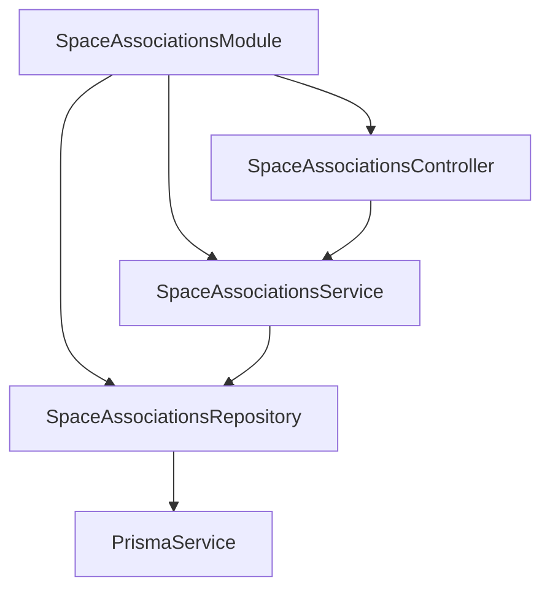
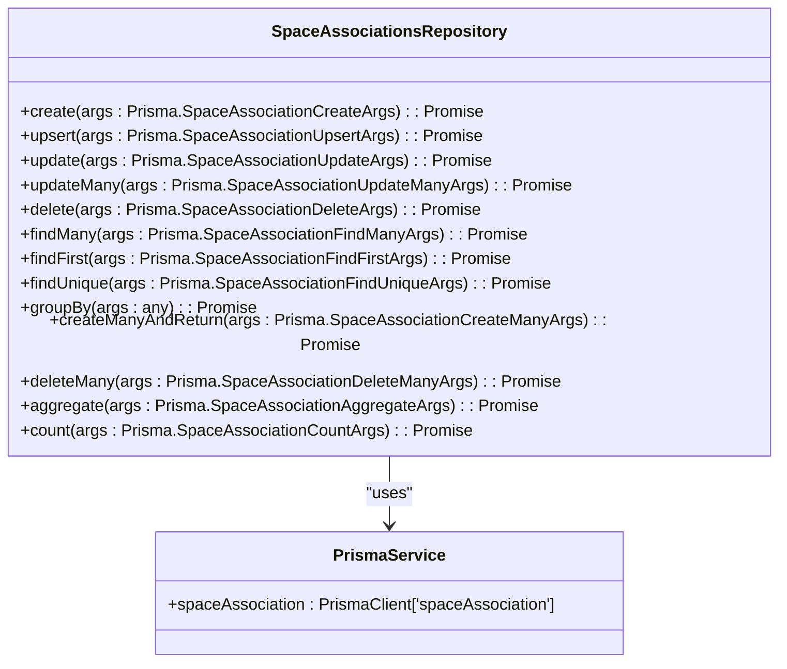
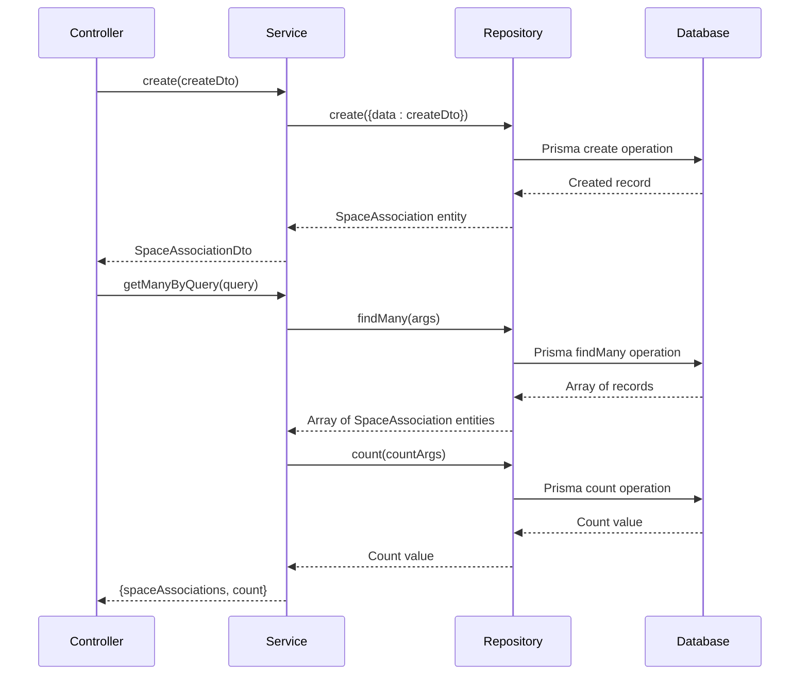
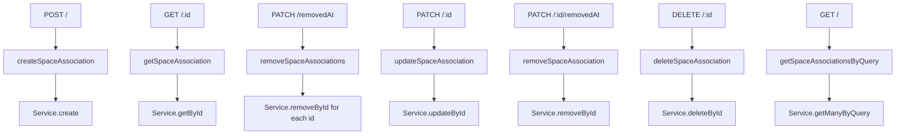
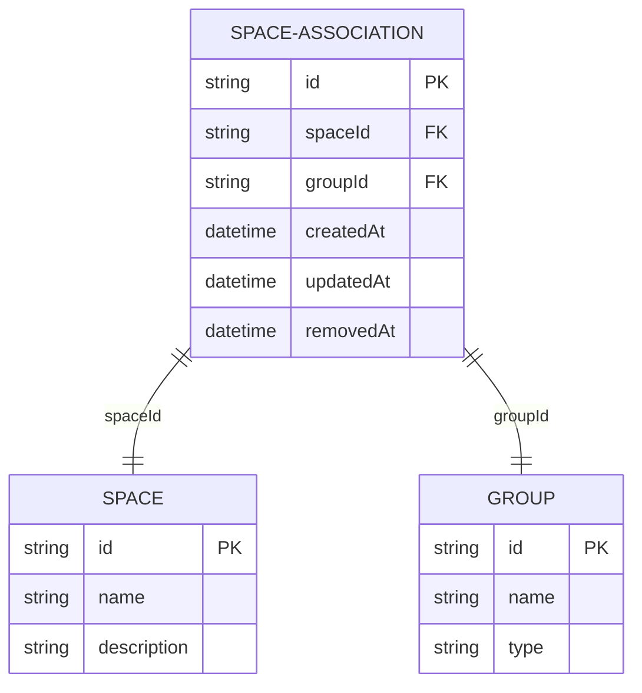
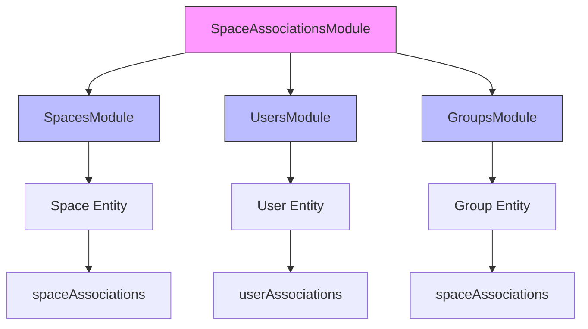

# Space Associations Module

<cite>
**Referenced Files in This Document**   
- [space-associations.module.ts](file://apps/server/src/module/space-associations.module.ts)
- [space-associations.controller.ts](file://apps/server/src/shared/controller/resources/space-associations.controller.ts)
- [space-associations.service.ts](file://apps/server/src/shared/service/resources/space-associations.service.ts)
- [space-associations.repository.ts](file://apps/server/src/shared/repository/space-associations.repository.ts)
- [space-association.dto.ts](file://packages/schema/src/dto/space-association.dto.ts)
- [space-association.entity.ts](file://packages/schema/src/entity/space-association.entity.ts)
- [spaces.module.ts](file://apps/server/src/module/spaces.module.ts)
- [users.module.ts](file://apps/server/src/module/users.module.ts)
</cite>

## Table of Contents
1. [Introduction](#introduction)
2. [Module Architecture](#module-architecture)
3. [Core Components](#core-components)
4. [Repository Pattern Implementation](#repository-pattern-implementation)
5. [Service Layer Methods](#service-layer-methods)
6. [Controller Endpoints](#controller-endpoints)
7. [Relationship Management](#relationship-management)
8. [Integration with Other Modules](#integration-with-other-modules)
9. [Common Issues and Solutions](#common-issues-and-solutions)
10. [Best Practices](#best-practices)

## Introduction
The SpaceAssociationsModule in prj-core provides a comprehensive system for managing relationships between spaces and various resources through group associations. This module implements a robust pattern for establishing, querying, and maintaining spatial relationships within the application. The implementation follows NestJS best practices with a clear separation of concerns between the controller, service, and repository layers. The module enables flexible association management that supports both soft deletion (removal) and hard deletion operations, providing developers with multiple approaches for handling space-to-entity relationships.

**Section sources**
- [space-associations.module.ts](file://apps/server/src/module/space-associations.module.ts)

## Module Architecture
The SpaceAssociationsModule follows the standard NestJS module pattern, importing and configuring the necessary components for space association management. The module declaration specifies the providers (service and repository) and controllers that comprise the functionality. This modular approach allows for dependency injection and proper encapsulation of space association logic. The architecture promotes reusability and testability by separating concerns across different layers of the application.

**Diagram sources**
- [space-associations.module.ts](file://apps/server/src/module/space-associations.module.ts)

**Section sources**
- [space-associations.module.ts](file://apps/server/src/module/space-associations.module.ts)

## Core Components
The SpaceAssociationsModule consists of four core components that work together to manage space associations: the module definition, controller, service, and repository. Each component has a specific responsibility in the request-response cycle. The DTO (Data Transfer Object) and entity classes define the structure and validation rules for space association data. This layered architecture ensures that business logic is separated from data access and presentation concerns, making the codebase more maintainable and easier to test.

**Section sources**
- [space-associations.module.ts](file://apps/server/src/module/space-associations.module.ts)
- [space-associations.controller.ts](file://apps/server/src/shared/controller/resources/space-associations.controller.ts)
- [space-associations.service.ts](file://apps/server/src/shared/service/resources/space-associations.service.ts)
- [space-associations.repository.ts](file://apps/server/src/shared/repository/space-associations.repository.ts)
- [space-association.dto.ts](file://packages/schema/src/dto/space-association.dto.ts)
- [space-association.entity.ts](file://packages/schema/src/entity/space-association.entity.ts)

## Repository Pattern Implementation
The SpaceAssociationsRepository implements the repository pattern, providing an abstraction layer between the service layer and the database. It extends Prisma's functionality with additional methods for creating, reading, updating, and deleting space associations. The repository includes comprehensive logging for debugging and monitoring purposes. Each method corresponds to a Prisma operation, with additional processing for transforming results into proper entity instances using class-transformer. The repository also implements batch operations for efficient processing of multiple records.

**Diagram sources**
- [space-associations.repository.ts](file://apps/server/src/shared/repository/space-associations.repository.ts)

**Section sources**
- [space-associations.repository.ts](file://apps/server/src/shared/repository/space-associations.repository.ts)

## Service Layer Methods
The SpaceAssociationsService provides the business logic for managing space associations. It acts as an intermediary between the controller and repository, handling data transformation and business rules. The service methods are designed to be simple and focused, delegating data access operations to the repository. Key methods include create for establishing new associations, getManyByQuery for retrieving associations with filtering and pagination, getById for fetching a single association, updateById for modifying existing associations, deleteById for permanent removal, and removeById for soft deletion (setting the removedAt timestamp).

**Diagram sources**
- [space-associations.service.ts](file://apps/server/src/shared/service/resources/space-associations.service.ts)

**Section sources**
- [space-associations.service.ts](file://apps/server/src/shared/service/resources/space-associations.service.ts)

## Controller Endpoints
The SpaceAssociationsController exposes RESTful endpoints for managing space associations. It follows standard HTTP conventions with appropriate status codes and response formats. The controller handles request validation, data transformation, and error handling. Endpoints include POST for creating associations, GET for retrieving single or multiple associations, PATCH for updating associations (including soft deletion), and DELETE for permanent removal. The controller uses Swagger decorators for API documentation and implements proper response wrapping for consistent output format.

**Diagram sources**
- [space-associations.controller.ts](file://apps/server/src/shared/controller/resources/space-associations.controller.ts)

**Section sources**
- [space-associations.controller.ts](file://apps/server/src/shared/controller/resources/space-associations.controller.ts)

## Relationship Management
The SpaceAssociationsModule manages relationships between spaces and resources through group-based associations. The core entity contains spaceId and groupId fields that establish the relationship. The implementation includes proper type definitions with UUID validation for both identifiers. The module supports including related data (such as the group object) when querying associations. This relationship model allows for flexible permission and access control systems where groups can be associated with specific spaces, enabling fine-grained resource management.

**Diagram sources**
- [space-association.dto.ts](file://packages/schema/src/dto/space-association.dto.ts)
- [space-association.entity.ts](file://packages/schema/src/entity/space-association.entity.ts)

**Section sources**
- [space-association.dto.ts](file://packages/schema/src/dto/space-association.dto.ts)
- [space-association.entity.ts](file://packages/schema/src/entity/space-association.entity.ts)

## Integration with Other Modules
The SpaceAssociationsModule integrates closely with other modules in the application, particularly the SpacesModule and UsersModule. The SpacesModule can leverage space associations to determine resource access and permissions, while the UsersModule may use these associations to establish user access to specific spaces through group membership. The modular design allows for independent development and testing while maintaining clear interfaces for cross-module communication. The shared schema package ensures consistent data definitions across modules.

**Diagram sources**
- [spaces.module.ts](file://apps/server/src/module/spaces.module.ts)
- [users.module.ts](file://apps/server/src/module/users.module.ts)

**Section sources**
- [spaces.module.ts](file://apps/server/src/module/spaces.module.ts)
- [users.module.ts](file://apps/server/src/module/users.module.ts)

## Common Issues and Solutions
One common issue in space association management is maintaining data integrity when associations are removed or modified. The current implementation addresses this through the removeById method, which performs a soft delete by setting the removedAt timestamp rather than permanently deleting the record. This approach preserves historical data and allows for potential restoration. Another consideration is the discontinued updateMany method mentioned in the controller comments, which suggests a need to update the removeSpaceAssociations endpoint to handle individual calls for better error handling and transaction management. For complex spatial relationship management, implementing proper indexing on the spaceId and groupId fields can significantly improve query performance.

**Section sources**
- [space-associations.controller.ts](file://apps/server/src/shared/controller/resources/space-associations.controller.ts)
- [space-associations.service.ts](file://apps/server/src/shared/service/resources/space-associations.service.ts)

## Best Practices
When working with the SpaceAssociationsModule, several best practices should be followed. For creating associations, use the create method with proper validation of input data. When querying associations, leverage the QuerySpaceAssociationDto for filtering and pagination to avoid performance issues with large datasets. For bulk operations, consider the performance implications of multiple individual calls versus batch operations. Implement proper error handling around association operations, particularly when dealing with foreign key constraints. When establishing relationships, ensure that both the space and group entities exist before creating the association to maintain data integrity.

**Section sources**
- [space-associations.service.ts](file://apps/server/src/shared/service/resources/space-associations.service.ts)
- [space-associations.controller.ts](file://apps/server/src/shared/controller/resources/space-associations.controller.ts)
- [space-associations.repository.ts](file://apps/server/src/shared/repository/space-associations.repository.ts)