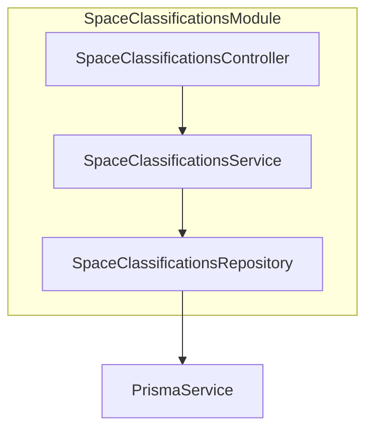
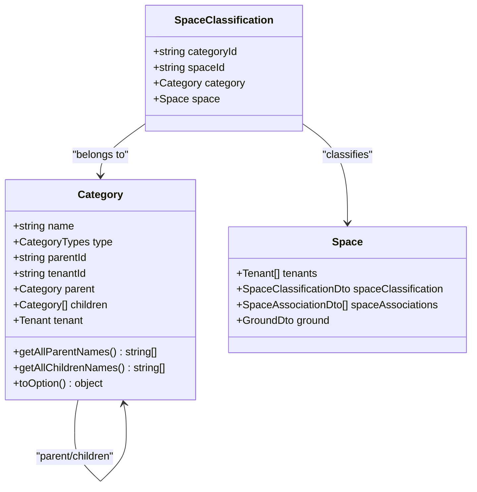
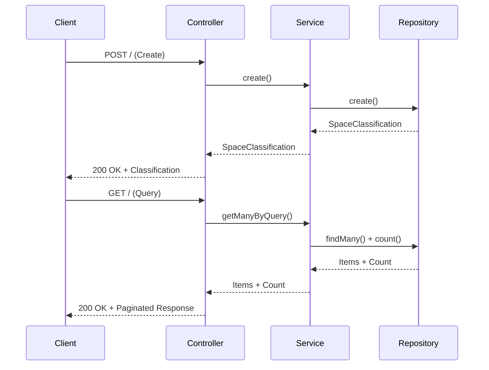
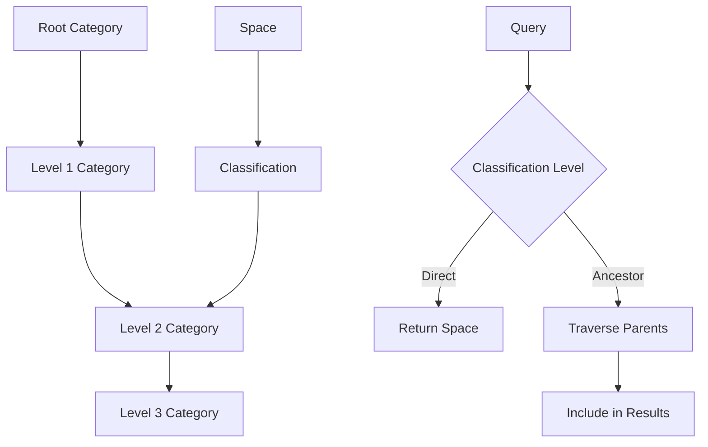

# Space Classifications Module

<cite>
**Referenced Files in This Document**   
- [space-classifications.module.ts](file://apps/server/src/module/space-classifications.module.ts)
- [space-classifications.controller.ts](file://apps/server/src/shared/controller/resources/space-classifications.controller.ts)
- [space-classifications.service.ts](file://apps/server/src/shared/service/resources/space-classifications.service.ts)
- [space-classifications.repository.ts](file://apps/server/src/shared/repository/space-classifications.repository.ts)
- [space-classification.dto.ts](file://packages/schema/src/dto/space-classification.dto.ts)
- [space-classification.entity.ts](file://packages/schema/src/entity/space-classification.entity.ts)
- [category.entity.ts](file://packages/schema/src/entity/category.entity.ts)
- [space.dto.ts](file://packages/schema/src/dto/space.dto.ts)
- [create-space-classification.dto.ts](file://packages/schema/src/dto/create/create-space-classification.dto.ts)
- [query-space-classification.dto.ts](file://packages/schema/src/dto/query/query-space-classification.dto.ts)
</cite>

## Table of Contents
1. [Introduction](#introduction)
2. [Module Architecture](#module-architecture)
3. [Type Definitions and Hierarchical Classification](#type-definitions-and-hierarchical-classification)
4. [Service Layer Methods](#service-layer-methods)
5. [Controller Endpoints](#controller-endpoints)
6. [Integration with SpacesModule](#integration-with-spacesmodule)
7. [Classification Inheritance and Taxonomy Management](#classification-inheritance-and-taxonomy-management)
8. [Common Issues and Solutions](#common-issues-and-solutions)

## Introduction

The SpaceClassificationsModule provides a robust system for categorizing and classifying spaces within the prj-core application. This module enables hierarchical organization of spaces through category-based classification, supporting complex spatial taxonomies. The implementation follows NestJS architectural patterns with a clear separation between controllers, services, repositories, and data transfer objects (DTOs). This documentation explains the implementation details, relationships between components, and practical usage patterns for space classification management.

**Section sources**
- [space-classifications.module.ts](file://apps/server/src/module/space-classifications.module.ts#L1-L12)

## Module Architecture

The SpaceClassificationsModule follows the NestJS module pattern, organizing related components for space classification functionality. The module imports and registers the controller, service, and repository components that handle classification operations. This modular approach enables dependency injection and promotes separation of concerns.



**Diagram sources**
- [space-classifications.module.ts](file://apps/server/src/module/space-classifications.module.ts#L1-L12)
- [space-classifications.controller.ts](file://apps/server/src/shared/controller/resources/space-classifications.controller.ts#L27-L91)
- [space-classifications.service.ts](file://apps/server/src/shared/service/resources/space-classifications.service.ts#L10-L58)
- [space-classifications.repository.ts](file://apps/server/src/shared/repository/space-classifications.repository.ts#L6-L108)

**Section sources**
- [space-classifications.module.ts](file://apps/server/src/module/space-classifications.module.ts#L1-L12)

## Type Definitions and Hierarchical Classification

The space classification system is built on a hierarchical category structure defined in the Category entity. Each SpaceClassification links a space to a category, enabling rich metadata organization. The Category entity supports parent-child relationships through the parentId field, allowing for multi-level classification hierarchies.

The SpaceClassification entity establishes the relationship between spaces and categories, containing foreign keys to both entities. This design enables multiple classification schemes to be applied to spaces while maintaining referential integrity.



**Diagram sources**
- [space-classification.entity.ts](file://packages/schema/src/entity/space-classification.entity.ts#L8-L18)
- [category.entity.ts](file://packages/schema/src/entity/category.entity.ts#L7-L69)
- [space.dto.ts](file://packages/schema/src/dto/space.dto.ts#L9-L31)

**Section sources**
- [space-classification.entity.ts](file://packages/schema/src/entity/space-classification.entity.ts#L1-L18)
- [category.entity.ts](file://packages/schema/src/entity/category.entity.ts#L1-L70)
- [space-classification.dto.ts](file://packages/schema/src/dto/space-classification.dto.ts#L1-L20)

## Service Layer Methods

The SpaceClassificationsService provides the business logic layer for classification operations. It implements CRUD operations through methods that delegate to the repository layer. The service acts as an intermediary between the controller and data access layers, ensuring proper separation of concerns.

Key service methods include:
- `create()`: Creates a new space classification
- `getManyByQuery()`: Retrieves multiple classifications with pagination support
- `getById()`: Retrieves a single classification by ID
- `updateById()`: Updates an existing classification
- `removeById()`: Marks a classification as removed (soft delete)
- `deleteById()`: Permanently deletes a classification

```mermaid
flowchart TD
A[Service Method] --> B{Operation Type}
B --> |Create| C[repository.create()]
B --> |Read| D[repository.findMany()/findUnique()]
B --> |Update| E[repository.update()]
B --> |Delete| F[repository.delete()/update() with removedAt]
C --> G[Return Result]
D --> G
E --> G
F --> G
```

**Diagram sources**
- [space-classifications.service.ts](file://apps/server/src/shared/service/resources/space-classifications.service.ts#L10-L58)

**Section sources**
- [space-classifications.service.ts](file://apps/server/src/shared/service/resources/space-classifications.service.ts#L1-L58)

## Controller Endpoints

The SpaceClassificationsController exposes RESTful endpoints for managing space classifications. These endpoints follow standard HTTP methods and NestJS decorators to define routes, request handling, and response formatting.

The controller implements the following endpoints:
- `POST /`: Create a new space classification
- `GET /:spaceClassificationId`: Retrieve a specific classification by ID
- `PATCH /:spaceClassificationId`: Update a classification
- `PATCH /:spaceClassificationId/removedAt`: Soft delete a classification
- `DELETE /:spaceClassificationId`: Hard delete a classification
- `GET /`: Query multiple classifications with filtering and pagination



**Diagram sources**
- [space-classifications.controller.ts](file://apps/server/src/shared/controller/resources/space-classifications.controller.ts#L27-L91)

**Section sources**
- [space-classifications.controller.ts](file://apps/server/src/shared/controller/resources/space-classifications.controller.ts#L1-L91)

## Integration with SpacesModule

The SpaceClassificationsModule integrates closely with the SpacesModule to attach classification metadata to spaces. This relationship is established through the SpaceClassification entity, which creates a many-to-one relationship between classifications and spaces.

When retrieving space information, the system can include associated classification data through the spaceClassification property in the SpaceDto. This allows clients to access both the space details and its classification hierarchy in a single request.

The integration follows a decoupled design where each module maintains its own responsibilities:
- SpacesModule manages space lifecycle operations
- SpaceClassificationsModule manages classification operations
- The relationship is established through shared entity references

```mermaid
graph TB
subgraph "SpacesModule"
SpacesController
SpacesService
SpacesRepository
end
subgraph "SpaceClassificationsModule"
ClassController
ClassService
ClassRepository
end
SpacesService --> ClassService : "Uses for classification"
ClassService --> SpacesService : "References spaces"
SpacesRepository --> Prisma
ClassRepository --> Prisma
```

**Diagram sources**
- [spaces.module.ts](file://apps/server/src/module/spaces.module.ts#L1-L13)
- [space-classifications.module.ts](file://apps/server/src/module/space-classifications.module.ts#L1-L12)
- [space.dto.ts](file://packages/schema/src/dto/space.dto.ts#L9-L31)

**Section sources**
- [spaces.module.ts](file://apps/server/src/module/spaces.module.ts#L1-L14)
- [space.dto.ts](file://packages/schema/src/dto/space.dto.ts#L1-L32)

## Classification Inheritance and Taxonomy Management

The classification system supports hierarchical taxonomies through the Category entity's parent-child relationships. Each category can have a parent category (via parentId) and multiple child categories, enabling multi-level classification schemes.

The Category entity includes utility methods for navigating the hierarchy:
- `getAllParentNames()`: Traverses up the hierarchy to collect all ancestor category names
- `getAllChildrenNames()`: Recursively collects names of all descendant categories

These methods facilitate inheritance patterns where spaces classified under a child category implicitly belong to all parent categories in the hierarchy. This enables flexible querying and reporting across classification levels.



**Diagram sources**
- [category.entity.ts](file://packages/schema/src/entity/category.entity.ts#L21-L68)

**Section sources**
- [category.entity.ts](file://packages/schema/src/entity/category.entity.ts#L1-L70)

## Common Issues and Solutions

### Classification Inheritance Challenges
When implementing hierarchical classifications, a common challenge is determining whether a space should inherit properties from parent categories. The current implementation provides utility methods on the Category entity to navigate the hierarchy, but applications must explicitly handle inheritance logic.

**Solution**: Implement service-level methods that automatically resolve inherited classifications when querying spaces. This could include a method that returns all classifications for a space, including those inherited from parent categories.

### Taxonomy Management
Managing complex classification taxonomies can become challenging as the hierarchy grows. Ensuring data consistency and preventing circular references in the category hierarchy is essential.

**Solution**: Implement validation in the service layer to prevent circular references when updating category parents. Additionally, provide administrative endpoints for reorganizing the taxonomy structure while maintaining referential integrity.

### Performance Considerations
Deep category hierarchies can impact query performance, especially when traversing multiple levels to resolve inherited classifications.

**Solution**: Implement caching strategies for frequently accessed classification hierarchies. Consider denormalizing commonly accessed path information (e.g., storing the full category path as a materialized path) to reduce traversal overhead.

**Section sources**
- [category.entity.ts](file://packages/schema/src/entity/category.entity.ts#L21-L68)
- [space-classifications.service.ts](file://apps/server/src/shared/service/resources/space-classifications.service.ts#L10-L58)
- [space-classifications.repository.ts](file://apps/server/src/shared/repository/space-classifications.repository.ts#L6-L108)