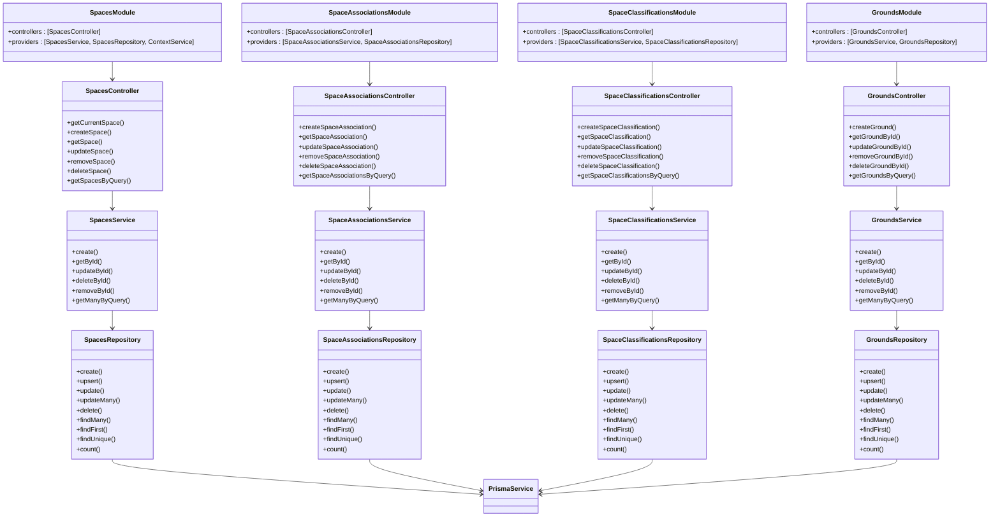

# Space Management Modules

<cite>
**Referenced Files in This Document**   
- [spaces.module.ts](file://apps/server/src/module/spaces.module.ts)
- [space-associations.module.ts](file://apps/server/src/module/space-associations.module.ts)
- [space-classifications.module.ts](file://apps/server/src/module/space-classifications.module.ts)
- [grounds.module.ts](file://apps/server/src/module/grounds.module.ts)
- [spaces.controller.ts](file://apps/server/src/shared/controller/resources/spaces.controller.ts)
- [space-associations.controller.ts](file://apps/server/src/shared/controller/resources/space-associations.controller.ts)
- [space-classifications.controller.ts](file://apps/server/src/shared/controller/resources/space-classifications.controller.ts)
- [grounds.controller.ts](file://apps/server/src/shared/controller/resources/grounds.controller.ts)
- [spaces.service.ts](file://apps/server/src/shared/service/resources/spaces.service.ts)
- [space-associations.service.ts](file://apps/server/src/shared/service/resources/space-associations.service.ts)
- [space-classifications.service.ts](file://apps/server/src/shared/service/resources/space-classifications.service.ts)
- [grounds.service.ts](file://apps/server/src/shared/service/resources/grounds.service.ts)
- [spaces.repository.ts](file://apps/server/src/shared/repository/spaces.repository.ts)
- [space-associations.repository.ts](file://apps/server/src/shared/repository/space-associations.repository.ts)
- [space-classifications.repository.ts](file://apps/server/src/shared/repository/space-classifications.repository.ts)
- [grounds.repository.ts](file://apps/server/src/shared/repository/grounds.repository.ts)
</cite>

## Table of Contents
1. [Introduction](#introduction)
2. [Project Structure](#project-structure)
3. [Core Components](#core-components)
4. [Architecture Overview](#architecture-overview)
5. [Detailed Component Analysis](#detailed-component-analysis)
6. [Dependency Analysis](#dependency-analysis)
7. [Performance Considerations](#performance-considerations)
8. [Troubleshooting Guide](#troubleshooting-guide)
9. [Conclusion](#conclusion)

## Introduction
The space management system in prj-core provides a comprehensive solution for organizing and managing hierarchical spaces within the application. This documentation details the implementation of space creation, classification, and association systems, including grounds management. The modules follow the NestJS framework's modular architecture with a clear separation of concerns between controllers, services, and repositories. The system enables organizations to structure their digital environments through spaces, classify them with metadata, and establish relationships between different entities.

## Project Structure

**Diagram sources**
- [spaces.module.ts](file://apps/server/src/module/spaces.module.ts)
- [spaces.controller.ts](file://apps/server/src/shared/controller/resources/spaces.controller.ts)
- [spaces.service.ts](file://apps/server/src/shared/service/resources/spaces.service.ts)
- [spaces.repository.ts](file://apps/server/src/shared/repository/spaces.repository.ts)

**Section sources**
- [spaces.module.ts](file://apps/server/src/module/spaces.module.ts)
- [space-associations.module.ts](file://apps/server/src/module/space-associations.module.ts)
- [space-classifications.module.ts](file://apps/server/src/module/space-classifications.module.ts)
- [grounds.module.ts](file://apps/server/src/module/grounds.module.ts)

## Core Components

The space management system consists of four primary modules that work together to provide comprehensive space management capabilities. The SpacesModule serves as the foundation for creating and managing spaces, while SpaceAssociationsModule handles relationships between spaces and other entities. SpaceClassificationsModule provides categorization capabilities for spaces, and GroundsModule manages the physical or conceptual locations associated with spaces. Each module follows the NestJS pattern of having dedicated controllers, services, and repositories that encapsulate specific functionality.

**Section sources**
- [spaces.module.ts](file://apps/server/src/module/spaces.module.ts)
- [space-associations.module.ts](file://apps/server/src/module/space-associations.module.ts)
- [space-classifications.module.ts](file://apps/server/src/module/space-classifications.module.ts)
- [grounds.module.ts](file://apps/server/src/module/grounds.module.ts)

## Architecture Overview

**Diagram sources**
- [spaces.module.ts](file://apps/server/src/module/spaces.module.ts)
- [spaces.controller.ts](file://apps/server/src/shared/controller/resources/spaces.controller.ts)
- [spaces.service.ts](file://apps/server/src/shared/service/resources/spaces.service.ts)
- [spaces.repository.ts](file://apps/server/src/shared/repository/spaces.repository.ts)

## Detailed Component Analysis

### Spaces Module Analysis

The SpacesModule is the core component for managing spaces within the application. It provides endpoints for creating, retrieving, updating, and deleting spaces, as well as querying spaces based on various criteria. The module follows the repository pattern, with a clear separation between the controller layer (handling HTTP requests), service layer (containing business logic), and repository layer (handling database operations).

#### Spaces Controller Flow

**Diagram sources**
- [spaces.controller.ts](file://apps/server/src/shared/controller/resources/spaces.controller.ts)
- [spaces.service.ts](file://apps/server/src/shared/service/resources/spaces.service.ts)
- [spaces.repository.ts](file://apps/server/src/shared/repository/spaces.repository.ts)

**Section sources**
- [spaces.controller.ts](file://apps/server/src/shared/controller/resources/spaces.controller.ts)
- [spaces.service.ts](file://apps/server/src/shared/service/resources/spaces.service.ts)
- [spaces.repository.ts](file://apps/server/src/shared/repository/spaces.repository.ts)

### Space Associations Module Analysis

The SpaceAssociationsModule manages relationships between spaces and other entities in the system. It allows for the creation of associations that link spaces to various resources, enabling complex organizational structures and access control mechanisms.

#### Space Associations Implementation

**Diagram sources**
- [space-associations.controller.ts](file://apps/server/src/shared/controller/resources/space-associations.controller.ts)
- [space-associations.service.ts](file://apps/server/src/shared/service/resources/space-associations.service.ts)
- [space-associations.repository.ts](file://apps/server/src/shared/repository/space-associations.repository.ts)

**Section sources**
- [space-associations.controller.ts](file://apps/server/src/shared/controller/resources/space-associations.controller.ts)
- [space-associations.service.ts](file://apps/server/src/shared/service/resources/space-associations.service.ts)
- [space-associations.repository.ts](file://apps/server/src/shared/repository/space-associations.repository.ts)

### Space Classifications Module Analysis

The SpaceClassificationsModule provides a system for categorizing and classifying spaces within the application. This enables organizations to group spaces by type, purpose, or other criteria, facilitating better organization and discovery.

#### Classification System Flow

**Diagram sources**
- [space-classifications.controller.ts](file://apps/server/src/shared/controller/resources/space-classifications.controller.ts)
- [space-classifications.service.ts](file://apps/server/src/shared/service/resources/space-classifications.service.ts)
- [space-classifications.repository.ts](file://apps/server/src/shared/repository/space-classifications.repository.ts)

**Section sources**
- [space-classifications.controller.ts](file://apps/server/src/shared/controller/resources/space-classifications.controller.ts)
- [space-classifications.service.ts](file://apps/server/src/shared/service/resources/space-classifications.service.ts)
- [space-classifications.repository.ts](file://apps/server/src/shared/repository/space-classifications.repository.ts)

### Grounds Module Analysis

The GroundsModule manages the physical or conceptual locations associated with spaces. This module establishes the relationship between spaces and their underlying grounds, providing a foundation for spatial organization within the application.

#### Grounds Management System

**Diagram sources**
- [grounds.controller.ts](file://apps/server/src/shared/controller/resources/grounds.controller.ts)
- [grounds.service.ts](file://apps/server/src/shared/service/resources/grounds.service.ts)
- [grounds.repository.ts](file://apps/server/src/shared/repository/grounds.repository.ts)

**Section sources**
- [grounds.controller.ts](file://apps/server/src/shared/controller/resources/grounds.controller.ts)
- [grounds.service.ts](file://apps/server/src/shared/service/resources/grounds.service.ts)
- [grounds.repository.ts](file://apps/server/src/shared/repository/grounds.repository.ts)

## Dependency Analysis

**Diagram sources**
- [spaces.module.ts](file://apps/server/src/module/spaces.module.ts)
- [spaces.controller.ts](file://apps/server/src/shared/controller/resources/spaces.controller.ts)
- [spaces.service.ts](file://apps/server/src/shared/service/resources/spaces.service.ts)
- [spaces.repository.ts](file://apps/server/src/shared/repository/spaces.repository.ts)
- [context.provider.ts](file://apps/server/src/shared/provider/context.provider.ts)

**Section sources**
- [spaces.module.ts](file://apps/server/src/module/spaces.module.ts)
- [spaces.controller.ts](file://apps/server/src/shared/controller/resources/spaces.controller.ts)
- [spaces.service.ts](file://apps/server/src/shared/service/resources/spaces.service.ts)
- [spaces.repository.ts](file://apps/server/src/shared/repository/spaces.repository.ts)

## Performance Considerations

The space management modules are designed with performance in mind, utilizing the repository pattern to separate concerns and optimize database operations. The Prisma ORM provides efficient query building and execution, while the service layer handles business logic and data transformation. For high-volume operations, the system supports batch operations through methods like updateMany and deleteMany in the repository layer. The query system includes pagination support through the QueryDto classes, which helps manage large datasets by limiting result sets and providing metadata for navigation. Caching strategies should be implemented at the service or controller level for frequently accessed data to reduce database load.

## Troubleshooting Guide

Common issues in the space management system typically relate to context handling, permission errors, and data consistency. The getCurrentSpace endpoint in SpacesController includes comprehensive logging to help diagnose context-related issues, particularly when tenant or space information is missing from the request context. For association and classification operations, ensure that the referenced entities exist before creating relationships. When encountering database errors, check the Prisma logs for specific constraint violations or foreign key issues. The soft-delete pattern (using removedAt field) means that deleted records remain in the database, which can affect query results and counts. For performance issues with large datasets, verify that appropriate indexes exist on frequently queried fields and consider implementing caching for read-heavy operations.

**Section sources**
- [spaces.controller.ts](file://apps/server/src/shared/controller/resources/spaces.controller.ts)
- [spaces.service.ts](file://apps/server/src/shared/service/resources/spaces.service.ts)
- [spaces.repository.ts](file://apps/server/src/shared/repository/spaces.repository.ts)

## Conclusion

The space management modules in prj-core provide a robust and flexible system for organizing digital spaces within the application. The modular architecture with clear separation of concerns between spaces, associations, classifications, and grounds enables scalable and maintainable code. The implementation follows NestJS best practices with controllers handling HTTP requests, services containing business logic, and repositories managing data access. The system supports both soft and hard deletion, comprehensive querying with pagination, and proper error handling with detailed logging. For future improvements, consider implementing more advanced caching strategies, adding validation rules for space hierarchies, and enhancing the association system to support more complex relationship types.