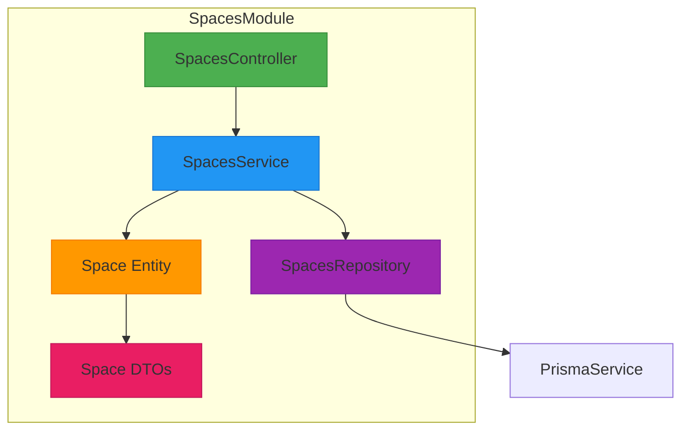
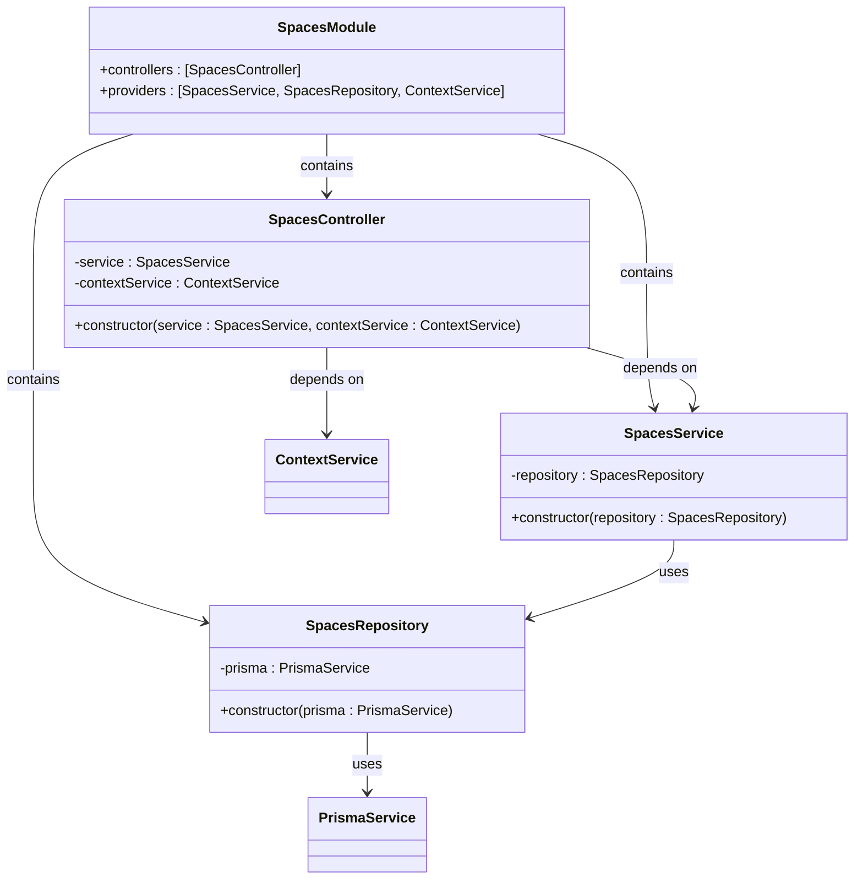
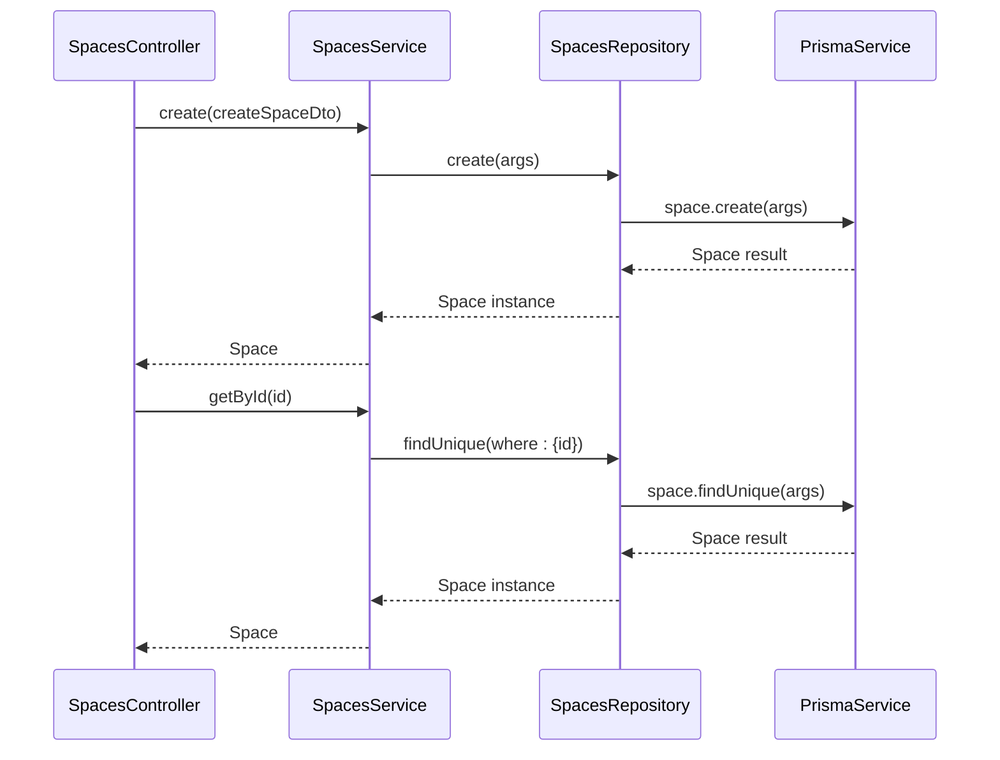
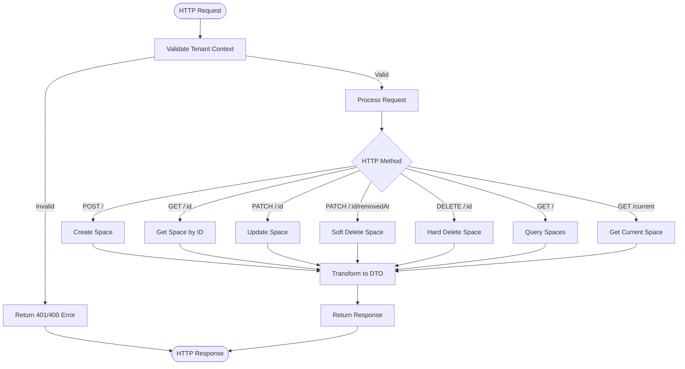
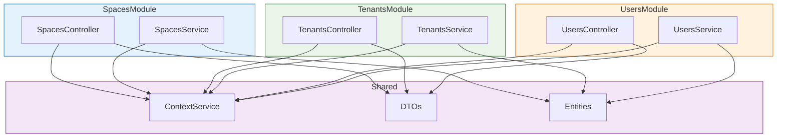

# Spaces Module

<cite>
**Referenced Files in This Document**   
- [spaces.module.ts](file://apps/server/src/module/spaces.module.ts)
- [spaces.service.ts](file://apps/server/src/shared/service/resources/spaces.service.ts)
- [spaces.controller.ts](file://apps/server/src/shared/controller/resources/spaces.controller.ts)
- [space.entity.ts](file://packages/schema/src/entity/space.entity.ts)
- [spaces.repository.ts](file://apps/server/src/shared/repository/spaces.repository.ts)
- [space.dto.ts](file://packages/schema/src/dto/space.dto.ts)
- [create-space.dto.ts](file://packages/schema/src/dto/create/create-space.dto.ts)
- [update-space.dto.ts](file://packages/schema/src/dto/update/update-space.dto.ts)
- [query-space.dto.ts](file://packages/schema/src/dto/query/query-space.dto.ts)
</cite>

## Table of Contents
1. [Introduction](#introduction)
2. [Module Architecture](#module-architecture)
3. [Dependency Injection Setup](#dependency-injection-setup)
4. [Service Layer Implementation](#service-layer-implementation)
5. [RESTful Controller Endpoints](#restful-controller-endpoints)
6. [Data Transfer Objects](#data-transfer-objects)
7. [Entity Relationships](#entity-relationships)
8. [Integration with Other Modules](#integration-with-other-modules)
9. [Common Issues and Solutions](#common-issues-and-solutions)
10. [Conclusion](#conclusion)

## Introduction

The SpacesModule is a core component of the prj-core application responsible for managing workspace environments within a multi-tenant system. This module provides comprehensive CRUD (Create, Read, Update, Delete) operations for spaces, which serve as organizational containers that group users, resources, and activities. The implementation follows NestJS architectural patterns with clear separation of concerns between controllers, services, repositories, and entities.

Spaces play a critical role in the application's tenancy model, acting as intermediaries between tenants (organizations) and users. Each space can have associated grounds, classifications, and tenant relationships, enabling complex hierarchical structures. The module is designed to support both soft deletion (removal) and hard deletion operations, providing flexibility in data management.

**Section sources**
- [spaces.module.ts](file://apps/server/src/module/spaces.module.ts#L1-L14)

## Module Architecture

The SpacesModule follows the standard NestJS module pattern, organizing related components into a cohesive unit. The module imports and exports necessary dependencies while providing a clear interface for other modules to interact with space-related functionality.



**Diagram sources**
- [spaces.module.ts](file://apps/server/src/module/spaces.module.ts#L9-L13)
- [spaces.service.ts](file://apps/server/src/shared/service/resources/spaces.service.ts#L6-L7)
- [spaces.repository.ts](file://apps/server/src/shared/repository/spaces.repository.ts#L8-L11)

**Section sources**
- [spaces.module.ts](file://apps/server/src/module/spaces.module.ts#L1-L14)

## Dependency Injection Setup

The SpacesModule implements NestJS dependency injection to manage component dependencies and lifecycle. The module declaration specifies controllers and providers that should be instantiated and made available within the module's context.

The dependency injection setup includes:
- **SpacesController**: Handles HTTP requests and routes them to appropriate service methods
- **SpacesService**: Contains business logic for space operations
- **SpacesRepository**: Manages data persistence operations through Prisma ORM
- **ContextService**: Provides contextual information such as current tenant and user

This hierarchical dependency structure ensures loose coupling between components while maintaining clear responsibility boundaries. The constructor injection in the service and controller classes guarantees that dependencies are properly resolved at runtime.



**Diagram sources**
- [spaces.module.ts](file://apps/server/src/module/spaces.module.ts#L9-L13)
- [spaces.service.ts](file://apps/server/src/shared/service/resources/spaces.service.ts#L7-L8)
- [spaces.controller.ts](file://apps/server/src/shared/controller/resources/spaces.controller.ts#L32-L35)
- [spaces.repository.ts](file://apps/server/src/shared/repository/spaces.repository.ts#L11-L13)

**Section sources**
- [spaces.module.ts](file://apps/server/src/module/spaces.module.ts#L9-L13)
- [spaces.service.ts](file://apps/server/src/shared/service/resources/spaces.service.ts#L7-L8)
- [spaces.controller.ts](file://apps/server/src/shared/controller/resources/spaces.controller.ts#L32-L35)

## Service Layer Implementation

The SpacesService provides the core business logic for space management operations. Implemented as an injectable class, it encapsulates all CRUD operations and serves as an intermediary between the controller and repository layers.

The service implementation includes the following key methods:

| Method | Parameters | Return Type | Description |
|--------|------------|-------------|-------------|
| create | CreateSpaceDto | Promise<Space> | Creates a new space with the provided data |
| getById | string | Promise<Space> | Retrieves a space by its unique identifier |
| updateById | string, UpdateSpaceDto | Promise<Space> | Updates a space with new data |
| deleteById | string | Promise<Space> | Permanently removes a space from the system |
| removeById | string | Promise<Space> | Soft deletes a space by setting removedAt timestamp |
| getManyByQuery | QuerySpaceDto | Promise<{count: number, spaces: Space[]}> | Retrieves multiple spaces based on query parameters |

The service layer abstracts the complexity of data access operations, providing a clean interface for the controller to consume. It also handles data transformation and business rule enforcement before delegating persistence operations to the repository.



**Diagram sources**
- [spaces.service.ts](file://apps/server/src/shared/service/resources/spaces.service.ts#L9-L50)
- [spaces.repository.ts](file://apps/server/src/shared/repository/spaces.repository.ts#L15-L62)

**Section sources**
- [spaces.service.ts](file://apps/server/src/shared/service/resources/spaces.service.ts#L6-L50)

## RESTful Controller Endpoints

The SpacesController exposes a comprehensive set of RESTful endpoints for client applications to interact with space resources. These endpoints follow standard HTTP methods and status codes, providing a predictable API interface.

### Available Endpoints

| HTTP Method | Endpoint | Description | Request Body | Response |
|-----------|---------|-------------|--------------|----------|
| GET | /current | Retrieves the current space from context | None | SpaceDto |
| POST | / | Creates a new space | CreateSpaceDto | SpaceDto |
| GET | /:spaceId | Retrieves a specific space by ID | None | SpaceDto |
| PATCH | /:spaceId | Updates a specific space | UpdateSpaceDto | SpaceDto |
| PATCH | /:spaceId/removedAt | Soft deletes a space | None | SpaceDto |
| DELETE | /:spaceId | Hard deletes a space | None | SpaceDto |
| GET | / | Retrieves multiple spaces by query | Query parameters | Array of SpaceDto with metadata |

The controller includes comprehensive error handling and logging, with detailed debug information for troubleshooting. The getCurrentSpace endpoint includes special validation for tenant context, ensuring that space operations only proceed when valid tenant information is available in the request context.



**Diagram sources**
- [spaces.controller.ts](file://apps/server/src/shared/controller/resources/spaces.controller.ts#L29-L168)

**Section sources**
- [spaces.controller.ts](file://apps/server/src/shared/controller/resources/spaces.controller.ts#L29-L168)

## Data Transfer Objects

The SpacesModule utilizes Data Transfer Objects (DTOs) to define the structure of data exchanged between client and server. These DTOs provide type safety, validation, and documentation for API contracts.

### Core DTOs

**CreateSpaceDto**: Defines the structure for creating new spaces
- Contains required and optional fields for space creation
- Includes validation rules and type definitions
- Used in POST / endpoint

**UpdateSpaceDto**: Defines the structure for updating existing spaces
- Contains optional fields that can be modified
- Supports partial updates
- Used in PATCH /:spaceId endpoint

**QuerySpaceDto**: Defines the structure for querying spaces
- Includes pagination parameters (page, limit)
- Supports filtering and sorting options
- Used in GET / endpoint
- Contains toArgs() method to convert query to Prisma arguments
- Contains toPageMetaDto() method to generate pagination metadata

**SpaceDto**: Defines the response structure for space entities
- Extends AbstractDto for common properties
- Includes relationships to tenants, classifications, associations, and ground
- Uses ClassField decorator for serialization control
- Supports conditional field inclusion and array handling

The DTO system ensures consistent data formatting across the API and provides clear documentation of expected request and response structures.

**Section sources**
- [space.dto.ts](file://packages/schema/src/dto/space.dto.ts#L1-L32)
- [create-space.dto.ts](file://packages/schema/src/dto/create/create-space.dto.ts)
- [update-space.dto.ts](file://packages/schema/src/dto/update/update-space.dto.ts)
- [query-space.dto.ts](file://packages/schema/src/dto/query/query-space.dto.ts)

## Entity Relationships

The Space entity is central to the application's data model, establishing relationships with multiple other entities to support complex organizational structures.

```mermaid
erDiagram
SPACE {
string id PK
string name
string description
timestamp createdAt
timestamp updatedAt
timestamp removedAt
}
TENANT {
string id PK
string name
string domain
timestamp createdAt
timestamp updatedAt
}
GROUND {
string id PK
string name
string type
timestamp createdAt
timestamp updatedAt
}
SPACE_CLASSIFICATION {
string id PK
string name
string value
timestamp createdAt
timestamp updatedAt
}
SPACE_ASSOCIATION {
string id PK
string sourceSpaceId
string targetSpaceId
string type
timestamp createdAt
timestamp updatedAt
}
SPACE ||--o{ TENANT : "has many"
SPACE ||--|| GROUND : "belongs to"
SPACE ||--o{ SPACE_CLASSIFICATION : "has many"
SPACE ||--o{ SPACE_ASSOCIATION : "source of"
SPACE ||--o{ SPACE_ASSOCIATION : "target of"
class SPACE_CLASSIFICATION <<enumeration>>
class SPACE_ASSOCIATION <<relationship>>
```

The Space entity extends AbstractEntity, inheriting common fields like id, createdAt, updatedAt, and removedAt. Key relationships include:

- **Tenants**: A space can be associated with multiple tenants, enabling shared workspaces across organizations
- **Ground**: Each space belongs to a single ground, which defines its type and characteristics
- **SpaceClassifications**: Key-value pairs that provide additional metadata and categorization for spaces
- **SpaceAssociations**: Relationships between spaces, enabling hierarchical or networked structures

These relationships are defined in the entity file and automatically handled by Prisma ORM, with proper type safety and navigation properties.

**Diagram sources**
- [space.entity.ts](file://packages/schema/src/entity/space.entity.ts#L1-L17)

**Section sources**
- [space.entity.ts](file://packages/schema/src/entity/space.entity.ts#L1-L17)

## Integration with Other Modules

The SpacesModule integrates closely with several other modules in the application, forming a cohesive system for multi-tenant workspace management.

### Key Integrations

**TenantsModule**: The SpacesModule has a bidirectional relationship with the TenantsModule. Tenants can be associated with spaces, and spaces can belong to multiple tenants. This integration enables complex organizational structures where spaces can be shared across tenant boundaries.

**UsersModule**: While not directly shown in the current files, the context service suggests integration with user management. The getCurrentSpace endpoint uses context information that likely includes user authentication data, ensuring that space operations respect user permissions and ownership.

**SpaceAssociationsModule**: This dedicated module handles relationships between spaces, allowing for hierarchical or networked space structures. The SpacesModule delegates association management to this specialized module, following the single responsibility principle.

**ContextService**: This shared service provides critical integration points, allowing the SpacesController to access tenant and user context from the request. This enables features like automatic space selection based on tenant context and permission validation.

The integration pattern follows NestJS best practices, using shared services and dependency injection to maintain loose coupling while enabling rich functionality across module boundaries.



**Diagram sources**
- [spaces.controller.ts](file://apps/server/src/shared/controller/resources/spaces.controller.ts#L34-L35)
- [spaces.module.ts](file://apps/server/src/module/spaces.module.ts#L3-L7)
- [space-associations.module.ts](file://apps/server/src/module/space-associations.module.ts#L3-L6)

**Section sources**
- [spaces.controller.ts](file://apps/server/src/shared/controller/resources/spaces.controller.ts#L34-L35)
- [spaces.module.ts](file://apps/server/src/module/spaces.module.ts#L3-L7)

## Common Issues and Solutions

### Space Ownership Validation

One common issue in multi-tenant systems is ensuring that users can only access spaces they are authorized to view or modify. The SpacesModule addresses this through the ContextService, which validates tenant and user context before processing requests.

The getCurrentSpace endpoint demonstrates this pattern with comprehensive validation:
1. Checks for tenant information in the context
2. Validates that the tenant has an associated spaceId
3. Verifies that the space exists in the database
4. Returns appropriate error messages for each failure case

This approach prevents unauthorized access while providing clear feedback to clients about authentication and authorization requirements.

### Hierarchical Space Management

Managing hierarchical relationships between spaces can be challenging. The SpacesModule addresses this through the SpaceAssociationsModule, which handles relationships between spaces separately from the core space management functionality.

Best practices for hierarchical space management include:
- Using soft deletion (removeById) for spaces that have child spaces or important historical data
- Implementing validation in the service layer to prevent circular references
- Using the QuerySpaceDto to efficiently retrieve nested space structures
- Leveraging the repository's findMany and groupBy methods for complex queries

### Performance Considerations

For large-scale deployments with many spaces, consider the following optimizations:
- Use query parameters to limit result sets and implement pagination
- Leverage Prisma's include and select options to control data loading
- Implement caching strategies for frequently accessed spaces
- Use database indexes on commonly queried fields like tenantId and removedAt

The current implementation already includes good practices such as using the count method separately from findMany to support efficient pagination.

**Section sources**
- [spaces.controller.ts](file://apps/server/src/shared/controller/resources/spaces.controller.ts#L37-L108)
- [spaces.service.ts](file://apps/server/src/shared/service/resources/spaces.service.ts#L41-L48)
- [spaces.repository.ts](file://apps/server/src/shared/repository/spaces.repository.ts)

## Conclusion

The SpacesModule provides a robust foundation for managing workspace environments in a multi-tenant application. Its clean architecture, following NestJS best practices, separates concerns between controllers, services, and repositories while maintaining clear dependencies through dependency injection.

Key strengths of the implementation include:
- Comprehensive CRUD operations with both soft and hard deletion support
- Strong integration with the tenancy model through ContextService
- Well-defined DTOs that ensure consistent API contracts
- Proper error handling and logging for troubleshooting
- Efficient data access patterns using Prisma ORM

The module is designed to be extensible, with clear separation between core space management and specialized functionality like space associations. This allows for future enhancements while maintaining stability in the core functionality.

For developers working with this module, the most important considerations are understanding the context-based security model and properly handling the difference between soft and hard deletion operations. The comprehensive logging in the controller also provides valuable insights for debugging and monitoring space-related operations.