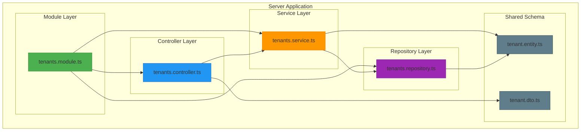
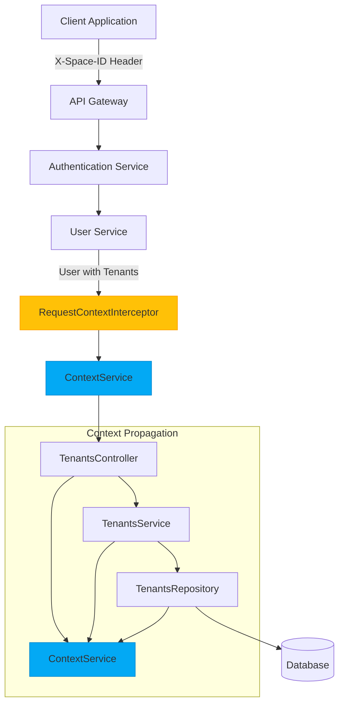
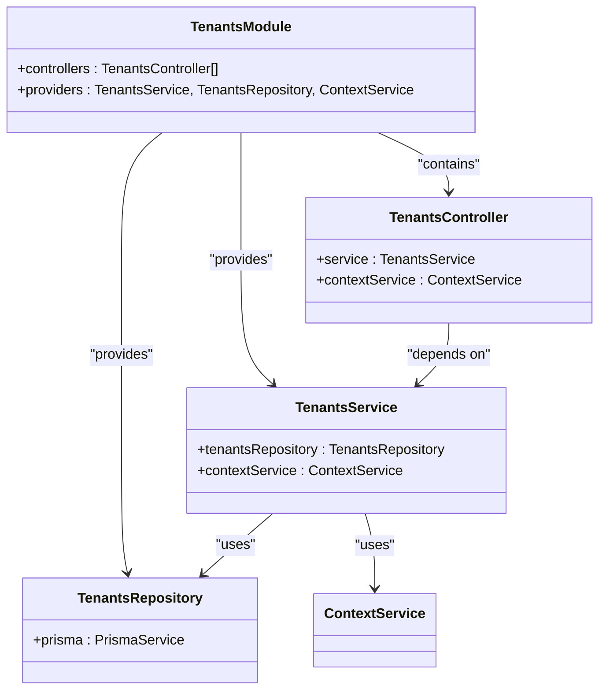
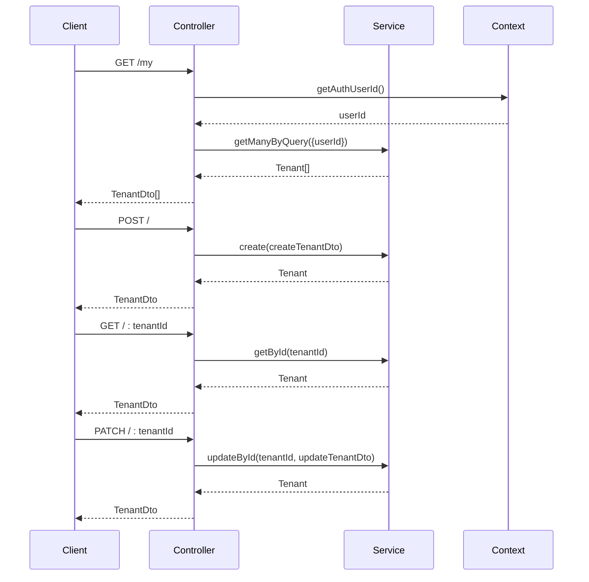
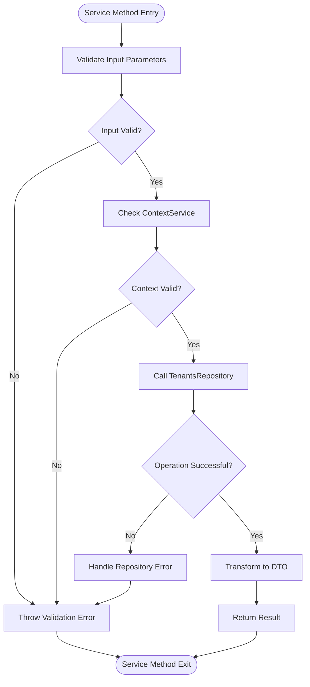
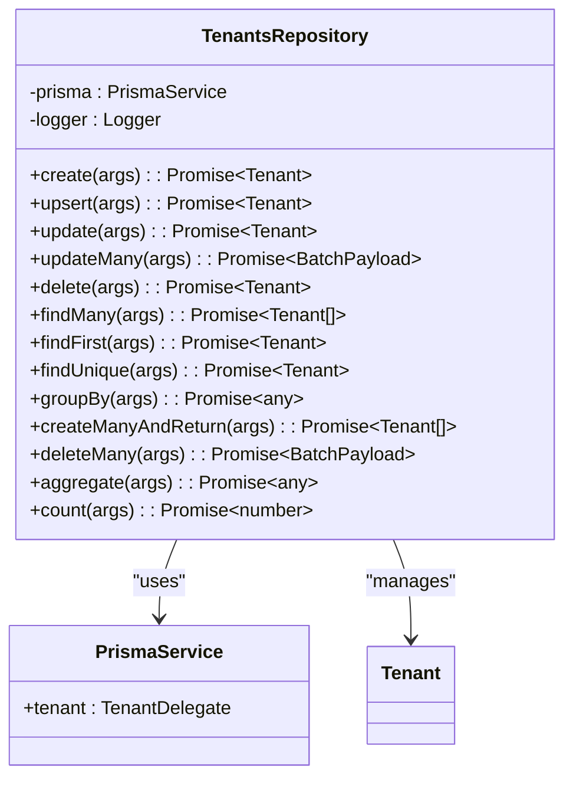
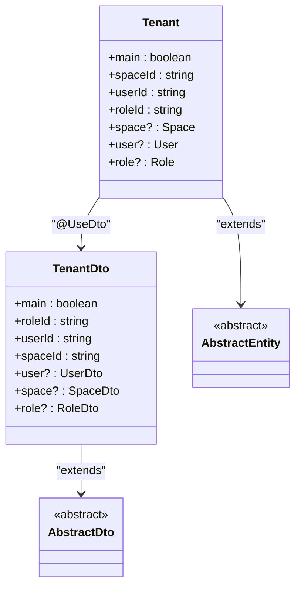
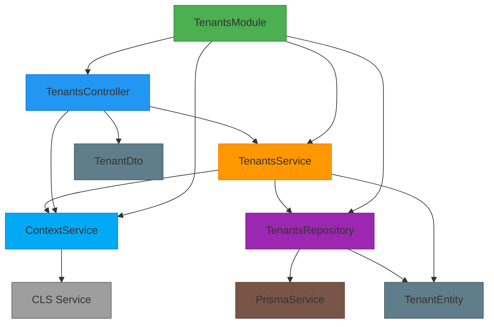

# Tenants Module

<cite>
**Referenced Files in This Document**   
- [tenants.module.ts](file://apps/server/src/module/tenants.module.ts)
- [tenants.controller.ts](file://apps/server/src/shared/controller/resources/tenants.controller.ts)
- [tenants.service.ts](file://apps/server/src/shared/service/resources/tenants.service.ts)
- [tenants.repository.ts](file://apps/server/src/shared/repository/tenants.repository.ts)
- [tenant.entity.ts](file://packages/schema/src/entity/tenant.entity.ts)
- [tenant.dto.ts](file://packages/schema/src/dto/tenant.dto.ts)
- [context.service.ts](file://apps/server/src/shared/service/utils/context.service.ts)
- [request-context.interceptor.ts](file://apps/server/src/shared/interceptor/request-context.interceptor.ts)
- [user.entity.ts](file://packages/schema/src/entity/user.entity.ts)
</cite>

## Table of Contents
1. [Introduction](#introduction)
2. [Project Structure](#project-structure)
3. [Core Components](#core-components)
4. [Architecture Overview](#architecture-overview)
5. [Detailed Component Analysis](#detailed-component-analysis)
6. [Dependency Analysis](#dependency-analysis)
7. [Performance Considerations](#performance-considerations)
8. [Troubleshooting Guide](#troubleshooting-guide)
9. [Conclusion](#conclusion)

## Introduction
The Tenants Module in prj-core implements a robust multi-tenancy architecture that enables tenant isolation, tenant lifecycle management, and tenant-user associations. This module provides the foundation for managing tenant contexts throughout the application, ensuring data separation between different tenants while allowing users to belong to multiple tenants. The implementation follows a clean architecture pattern with distinct layers for controllers, services, repositories, and entities, leveraging NestJS framework features and Prisma ORM for database operations.

## Project Structure
The Tenants Module is organized within the server application's modular structure, following a domain-driven design approach. The module components are distributed across different layers of the application architecture, with clear separation of concerns between presentation, business logic, and data access layers.

**Diagram sources**
- [tenants.module.ts](file://apps/server/src/module/tenants.module.ts)
- [tenants.controller.ts](file://apps/server/src/shared/controller/resources/tenants.controller.ts)
- [tenants.service.ts](file://apps/server/src/shared/service/resources/tenants.service.ts)
- [tenants.repository.ts](file://apps/server/src/shared/repository/tenants.repository.ts)
- [tenant.entity.ts](file://packages/schema/src/entity/tenant.entity.ts)
- [tenant.dto.ts](file://packages/schema/src/dto/tenant.dto.ts)

**Section sources**
- [tenants.module.ts](file://apps/server/src/module/tenants.module.ts)
- [tenant.entity.ts](file://packages/schema/src/entity/tenant.entity.ts)

## Core Components
The Tenants Module consists of several core components that work together to provide tenant management functionality. The module follows the repository pattern, with a clear separation between the controller layer (handling HTTP requests), service layer (implementing business logic), and repository layer (managing data persistence). The ContextService plays a crucial role in maintaining tenant context throughout the request lifecycle, enabling tenant isolation and context propagation across different parts of the application.

**Section sources**
- [tenants.module.ts](file://apps/server/src/module/tenants.module.ts)
- [tenants.service.ts](file://apps/server/src/shared/service/resources/tenants.service.ts)
- [tenants.repository.ts](file://apps/server/src/shared/repository/tenants.repository.ts)

## Architecture Overview
The Tenants Module implements a multi-tenancy architecture that supports tenant isolation through context propagation and database-level filtering. The architecture leverages NestJS dependency injection, interceptors, and guards to manage tenant context automatically across HTTP requests. When a user makes a request, the RequestContextInterceptor extracts the tenant context from the request headers and stores it in a request-scoped context service, which can be accessed by any component in the application.

**Diagram sources**
- [request-context.interceptor.ts](file://apps/server/src/shared/interceptor/request-context.interceptor.ts)
- [context.service.ts](file://apps/server/src/shared/service/utils/context.service.ts)
- [tenants.controller.ts](file://apps/server/src/shared/controller/resources/tenants.controller.ts)
- [tenants.service.ts](file://apps/server/src/shared/service/resources/tenants.service.ts)
- [tenants.repository.ts](file://apps/server/src/shared/repository/tenants.repository.ts)

## Detailed Component Analysis

### Tenants Module Analysis
The TenantsModule is a NestJS module that serves as the container for all tenant-related components. It imports and provides the necessary controllers, services, and repositories for tenant management. The module uses dependency injection to wire together the different components, ensuring loose coupling and testability.

**Diagram sources**
- [tenants.module.ts](file://apps/server/src/module/tenants.module.ts)
- [tenants.controller.ts](file://apps/server/src/shared/controller/resources/tenants.controller.ts)
- [tenants.service.ts](file://apps/server/src/shared/service/resources/tenants.service.ts)
- [tenants.repository.ts](file://apps/server/src/shared/repository/tenants.repository.ts)

**Section sources**
- [tenants.module.ts](file://apps/server/src/module/tenants.module.ts)

### Tenants Controller Analysis
The TenantsController handles HTTP requests related to tenant operations. It exposes RESTful endpoints for creating, reading, updating, and deleting tenants, as well as retrieving tenants associated with the authenticated user. The controller uses NestJS decorators for route mapping, request validation, and response formatting.

**Diagram sources**
- [tenants.controller.ts](file://apps/server/src/shared/controller/resources/tenants.controller.ts)
- [tenants.service.ts](file://apps/server/src/shared/service/resources/tenants.service.ts)
- [context.service.ts](file://apps/server/src/shared/service/utils/context.service.ts)

**Section sources**
- [tenants.controller.ts](file://apps/server/src/shared/controller/resources/tenants.controller.ts)

### Tenants Service Analysis
The TenantsService implements the business logic for tenant operations. It acts as an intermediary between the controller and repository layers, handling data transformation, business rule enforcement, and coordination of multiple operations. The service leverages the ContextService to access the current user and tenant context, ensuring that operations are performed within the appropriate tenant scope.

**Diagram sources**
- [tenants.service.ts](file://apps/server/src/shared/service/resources/tenants.service.ts)
- [tenants.repository.ts](file://apps/server/src/shared/repository/tenants.repository.ts)
- [context.service.ts](file://apps/server/src/shared/service/utils/context.service.ts)

**Section sources**
- [tenants.service.ts](file://apps/server/src/shared/service/resources/tenants.service.ts)

### Tenants Repository Analysis
The TenantsRepository implements the repository pattern for tenant data access. It provides a clean API for CRUD operations on tenant entities, abstracting the underlying Prisma ORM operations. The repository handles data persistence, transaction management, and query optimization, while ensuring type safety through TypeScript generics and decorators.

**Diagram sources**
- [tenants.repository.ts](file://apps/server/src/shared/repository/tenants.repository.ts)
- [tenant.entity.ts](file://packages/schema/src/entity/tenant.entity.ts)

**Section sources**
- [tenants.repository.ts](file://apps/server/src/shared/repository/tenants.repository.ts)

### Tenant Entity and DTO Analysis
The Tenant entity and DTO classes define the structure and behavior of tenant data in the application. The entity represents the database model, while the DTO (Data Transfer Object) represents the data as it is transferred between layers of the application. The @UseDto decorator establishes the relationship between the entity and DTO, enabling automatic transformation between the two representations.

**Diagram sources**
- [tenant.entity.ts](file://packages/schema/src/entity/tenant.entity.ts)
- [tenant.dto.ts](file://packages/schema/src/dto/tenant.dto.ts)

**Section sources**
- [tenant.entity.ts](file://packages/schema/src/entity/tenant.entity.ts)
- [tenant.dto.ts](file://packages/schema/src/dto/tenant.dto.ts)

## Dependency Analysis
The Tenants Module has well-defined dependencies that enable its functionality while maintaining loose coupling with other components. The module depends on shared services like ContextService for tenant context management, PrismaService for database operations, and various DTOs and entities from the shared schema package. The dependency graph shows a clear hierarchy from the module level down to the repository level, with each component depending only on the layers below it.

**Diagram sources**
- [tenants.module.ts](file://apps/server/src/module/tenants.module.ts)
- [tenants.controller.ts](file://apps/server/src/shared/controller/resources/tenants.controller.ts)
- [tenants.service.ts](file://apps/server/src/shared/service/resources/tenants.service.ts)
- [tenants.repository.ts](file://apps/server/src/shared/repository/tenants.repository.ts)
- [context.service.ts](file://apps/server/src/shared/service/utils/context.service.ts)
- [tenant.entity.ts](file://packages/schema/src/entity/tenant.entity.ts)
- [tenant.dto.ts](file://packages/schema/src/dto/tenant.dto.ts)

**Section sources**
- [tenants.module.ts](file://apps/server/src/module/tenants.module.ts)
- [context.service.ts](file://apps/server/src/shared/service/utils/context.service.ts)

## Performance Considerations
The Tenants Module is designed with performance in mind, leveraging several optimization techniques to ensure efficient operation. The repository layer uses Prisma's query optimization features, including batch operations and efficient filtering. The service layer implements proper error handling and validation to prevent unnecessary database calls. The context propagation mechanism using CLS (Continuation Local Storage) ensures that tenant context is available throughout the request lifecycle without the need for explicit parameter passing, reducing overhead and improving performance.

The module also implements proper indexing strategies through Prisma schema definitions, ensuring that common query patterns (such as finding tenants by user ID or space ID) are optimized for performance. The use of DTOs for data transfer helps reduce payload size and improve serialization performance, especially when dealing with complex nested objects.

## Troubleshooting Guide
When working with the Tenants Module, several common issues may arise. One frequent issue is tenant context not being properly propagated, which can occur if the X-Space-ID header is missing or invalid. This can be diagnosed by checking the RequestContextInterceptor logs and ensuring that the header is being sent correctly from the client.

Another common issue is tenant data leakage, which can occur if queries are not properly scoped to the current tenant. This can be prevented by always using the ContextService to retrieve the current tenant ID and including appropriate WHERE clauses in database queries. The module's design helps prevent this by centralizing tenant context management in the ContextService.

Authentication-related issues may occur when users attempt to access tenants they don't have permission to access. The system handles this gracefully by setting the tenant context to undefined rather than throwing an error, allowing the application to handle the situation appropriately (e.g., by redirecting to a tenant selection screen).

When debugging issues with tenant creation or updates, it's important to check the Prisma service logs for any database-level errors. The TenantsRepository includes comprehensive logging for all operations, making it easier to trace the flow of data and identify potential issues.

**Section sources**
- [request-context.interceptor.ts](file://apps/server/src/shared/interceptor/request-context.interceptor.ts)
- [context.service.ts](file://apps/server/src/shared/service/utils/context.service.ts)
- [tenants.repository.ts](file://apps/server/src/shared/repository/tenants.repository.ts)

## Conclusion
The Tenants Module in prj-core provides a comprehensive solution for multi-tenancy management, offering robust features for tenant lifecycle management, context propagation, and tenant-user associations. The module's architecture follows best practices for separation of concerns, with clear boundaries between the controller, service, and repository layers. The use of NestJS features like dependency injection, interceptors, and decorators enables a clean and maintainable codebase.

The module's integration with the ContextService ensures that tenant context is properly maintained throughout the request lifecycle, enabling tenant isolation and preventing data leakage. The repository pattern implementation provides a clean abstraction over the Prisma ORM, making it easier to manage database operations and ensuring type safety.

For developers working with this module, it's important to understand the flow of tenant context from the HTTP request through the interceptor to the service and repository layers. When implementing new features or debugging issues, always consider the tenant context and ensure that operations are performed within the appropriate tenant scope. The module's design makes it relatively straightforward to extend with new functionality while maintaining the integrity of the multi-tenancy architecture.