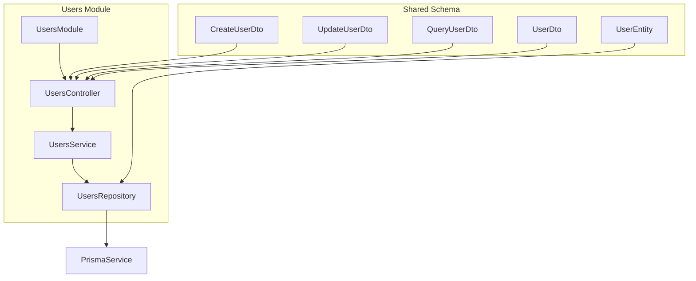
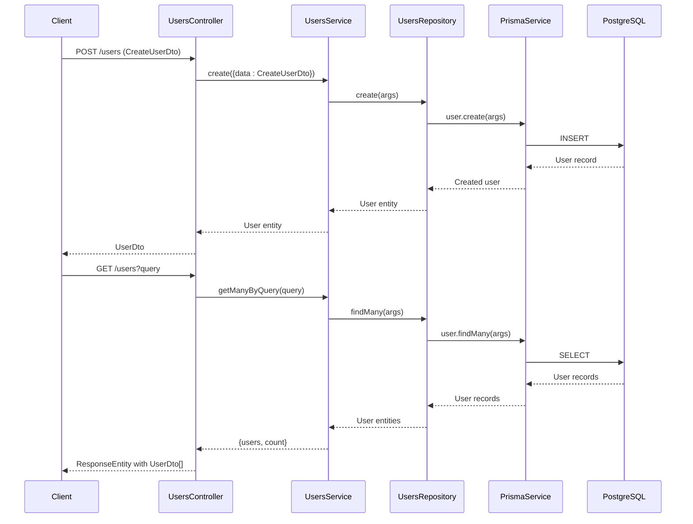
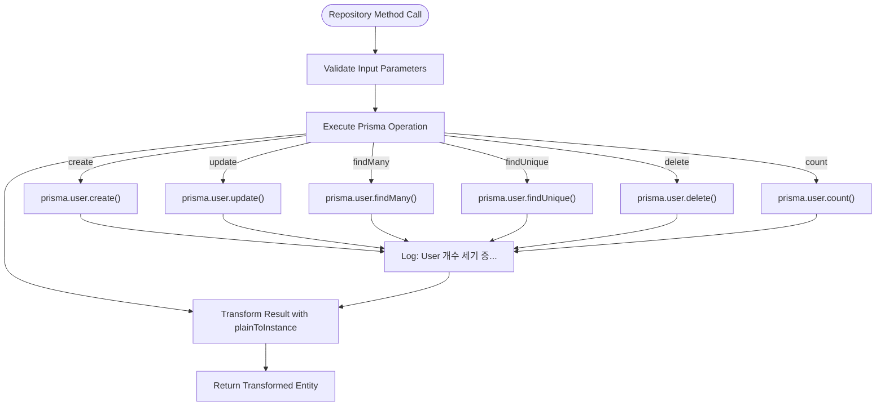
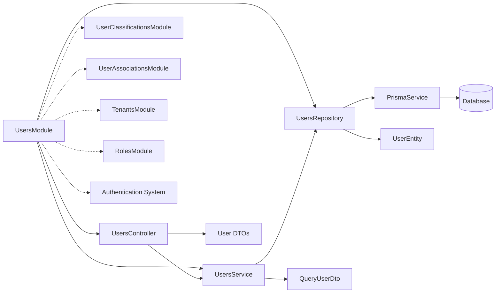

# Users Module

<cite>
**Referenced Files in This Document**   
- [users.module.ts](file://apps/server/src/module/users.module.ts)
- [users.controller.ts](file://apps/server/src/shared/controller/resources/users.controller.ts)
- [users.service.ts](file://apps/server/src/shared/service/resources/users.service.ts)
- [users.repository.ts](file://apps/server/src/shared/repository/users.repository.ts)
- [user.entity.ts](file://packages/schema/src/entity/user.entity.ts)
- [create-user.dto.ts](file://packages/schema/src/dto/create/create-user.dto.ts)
- [update-user.dto.ts](file://packages/schema/src/dto/update/update-user.dto.ts)
- [user.dto.ts](file://packages/schema/src/dto/user.dto.ts)
- [user-classifications.module.ts](file://apps/server/src/module/user-classifications.module.ts)
- [user-associations.module.ts](file://apps/server/src/module/user-associations.module.ts)
</cite>

## Table of Contents
1. [Introduction](#introduction)
2. [Project Structure](#project-structure)
3. [Core Components](#core-components)
4. [Architecture Overview](#architecture-overview)
5. [Detailed Component Analysis](#detailed-component-analysis)
6. [Dependency Analysis](#dependency-analysis)
7. [Performance Considerations](#performance-considerations)
8. [Troubleshooting Guide](#troubleshooting-guide)
9. [Conclusion](#conclusion)

## Introduction
The Users Module in prj-core provides a comprehensive user management system that handles user lifecycle operations, classification, tenant relationships, and role associations. This module implements a clean architectural pattern using NestJS with a repository pattern on top of Prisma ORM. It supports full CRUD operations, soft deletion, and complex relationship management between users, tenants, and roles. The implementation follows domain-driven design principles with clear separation of concerns between controllers, services, and repositories.

## Project Structure



**Diagram sources**
- [users.module.ts](file://apps/server/src/module/users.module.ts)
- [users.controller.ts](file://apps/server/src/shared/controller/resources/users.controller.ts)
- [users.service.ts](file://apps/server/src/shared/service/resources/users.service.ts)
- [users.repository.ts](file://apps/server/src/shared/repository/users.repository.ts)

**Section sources**
- [users.module.ts](file://apps/server/src/module/users.module.ts)
- [users.controller.ts](file://apps/server/src/shared/controller/resources/users.controller.ts)

## Core Components

The Users Module consists of several core components that follow the NestJS architectural pattern. The module exports a controller for handling HTTP requests, a service for business logic, and a repository for data access operations. The implementation uses Prisma as the ORM layer with a repository pattern abstraction. Key features include user creation, retrieval by various criteria, updating user data, and both soft and hard deletion capabilities. The module also handles complex relationships with tenants and roles, providing methods to retrieve users with their associated tenant roles and profile information.

**Section sources**
- [users.service.ts](file://apps/server/src/shared/service/resources/users.service.ts)
- [users.repository.ts](file://apps/server/src/shared/repository/users.repository.ts)

## Architecture Overview



**Diagram sources**
- [users.controller.ts](file://apps/server/src/shared/controller/resources/users.controller.ts)
- [users.service.ts](file://apps/server/src/shared/service/resources/users.service.ts)
- [users.repository.ts](file://apps/server/src/shared/repository/users.repository.ts)

## Detailed Component Analysis

### Users Controller Analysis

The UsersController implements RESTful endpoints for user management with comprehensive error handling and logging. The controller uses NestJS decorators for route definition, request validation, and response formatting. It handles user creation, retrieval, updates, and deletion operations with proper HTTP status codes. The controller also implements batch operations for removing multiple users at once. All endpoints transform entities to DTOs using class-transformer to ensure consistent response formats and hide internal implementation details.

**Section sources**
- [users.controller.ts](file://apps/server/src/shared/controller/resources/users.controller.ts)

### Users Service Analysis

```mermaid
classDiagram
class UsersService {
+getById(id : string) Promise~User~
+removeMany(ids : string[]) Promise~BatchPayload~
+deleteById(id : string) Promise~User~
+create(args : UserCreateArgs) Promise~User~
+getManyByQuery(query : QueryUserDto) Promise~{users, count}~
+updateById(id : string, data : UserUpdateInput) Promise~User~
+removeById(id : string) Promise~User~
+getByIdWithTenants(id : string) Promise~User~
+getByEmail(email : string) Promise~User~
+getUserWithMainTenant(userId : string) Promise~User~
}
class UsersRepository {
+create(args : UserCreateArgs) Promise~User~
+upsert(args : UserUpsertArgs) Promise~User~
+update(args : UserUpdateArgs) Promise~User~
+updateMany(args : UserUpdateManyArgs) Promise~BatchPayload~
+delete(args : UserDeleteArgs) Promise~User~
+findMany(args : UserFindManyArgs) Promise~User[]~
+findUnique(args : UserFindUniqueArgs) Promise~User~
+count(args : UserCountArgs) Promise~number~
}
UsersService --> UsersRepository : "uses"
```

**Diagram sources**
- [users.service.ts](file://apps/server/src/shared/service/resources/users.service.ts)
- [users.repository.ts](file://apps/server/src/shared/repository/users.repository.ts)

The UsersService contains the core business logic for user management. It orchestrates operations between the controller and repository layers, handling complex queries and data transformations. The service provides methods for retrieving users with their associated tenants and roles, supporting the application's multi-tenancy requirements. It implements both soft deletion (setting removedAt timestamp) and hard deletion (removing from database) capabilities. The service also handles batch operations for efficiency when processing multiple users.

**Section sources**
- [users.service.ts](file://apps/server/src/shared/service/resources/users.service.ts)

### Users Repository Analysis



**Diagram sources**
- [users.repository.ts](file://apps/server/src/shared/repository/users.repository.ts)

The UsersRepository implements the repository pattern on top of Prisma, providing a clean abstraction layer for data access operations. It wraps all Prisma client methods with consistent logging and result transformation using class-transformer. The repository handles all CRUD operations, including create, read, update, delete, and batch operations. Each method includes debug logging to track data access patterns. The repository transforms Prisma results into User entities using plainToInstance, ensuring type safety and consistency across the application.

**Section sources**
- [users.repository.ts](file://apps/server/src/shared/repository/users.repository.ts)

## Dependency Analysis



**Diagram sources**
- [users.module.ts](file://apps/server/src/module/users.module.ts)
- [users.controller.ts](file://apps/server/src/shared/controller/resources/users.controller.ts)
- [users.service.ts](file://apps/server/src/shared/service/resources/users.service.ts)

The Users Module has dependencies on several other modules and components within the system. It directly depends on the PrismaService for database access and uses shared DTOs and entities from the schema package. The module is related to UserClassificationsModule and UserAssociationsModule for handling user classification and association logic. It has a strong relationship with TenantsModule and RolesModule through the user-tenant-role association pattern. The authentication system integrates with the Users Module for user validation and session management. The module follows proper dependency injection principles with all dependencies provided through the constructor.

**Section sources**
- [users.module.ts](file://apps/server/src/module/users.module.ts)
- [users.service.ts](file://apps/server/src/shared/service/resources/users.service.ts)

## Performance Considerations

The Users Module implements several performance optimizations to handle user data efficiently. The repository layer includes comprehensive logging to monitor database operations and identify potential bottlenecks. The service layer uses Prisma's include feature to fetch related entities (tenants, roles, profiles) in a single query, reducing the N+1 query problem. For batch operations, the service processes multiple user removals in parallel using Promise.all, improving throughput for bulk operations. The implementation also includes proper indexing considerations through Prisma schema definitions to ensure fast lookups by ID, email, and other common query parameters. The use of DTOs for responses helps minimize payload size by excluding sensitive or unnecessary fields.

## Troubleshooting Guide

Common issues in the Users Module typically relate to data validation, relationship handling, and permission conflicts. When creating users, ensure that required fields in CreateUserDto are properly validated. For user retrieval issues, verify that the QueryUserDto parameters match the expected format and that database indexes exist for commonly queried fields. When dealing with tenant relationships, check that the user-tenant-role associations are properly established in the database. For performance issues with large user sets, consider implementing pagination and optimizing the Prisma query parameters. The extensive logging in the repository layer can help diagnose database access problems. When encountering permission conflicts, verify that the user's role in the current tenant grants the necessary permissions for the requested operation.

**Section sources**
- [users.controller.ts](file://apps/server/src/shared/controller/resources/users.controller.ts)
- [users.service.ts](file://apps/server/src/shared/service/resources/users.service.ts)
- [users.repository.ts](file://apps/server/src/shared/repository/users.repository.ts)

## Conclusion

The Users Module in prj-core provides a robust and scalable solution for user management with comprehensive features for CRUD operations, classification, and relationship handling. The implementation follows best practices with a clean separation of concerns between controller, service, and repository layers. The use of Prisma with a repository pattern abstraction provides both type safety and flexibility for database operations. The module effectively handles the complexities of multi-tenancy and role-based access control, making it suitable for enterprise applications. With proper logging, error handling, and performance optimizations, the module provides a solid foundation for user management in the application ecosystem.