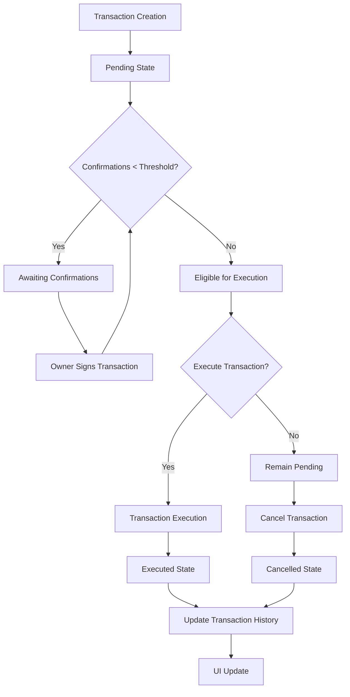
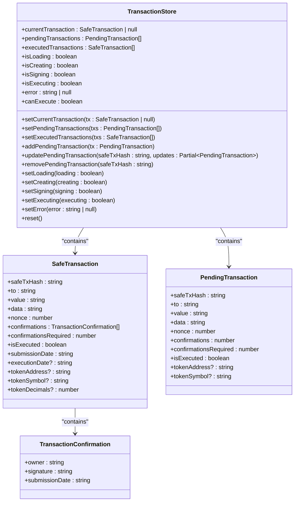
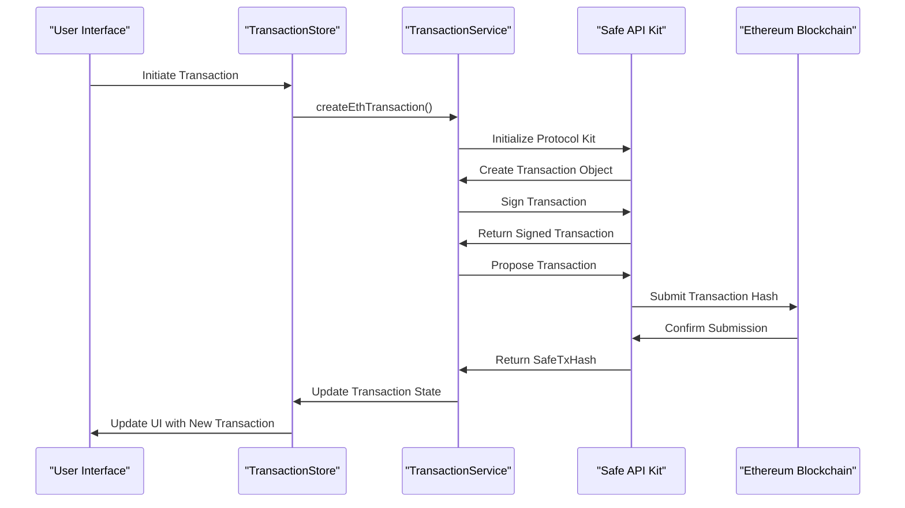
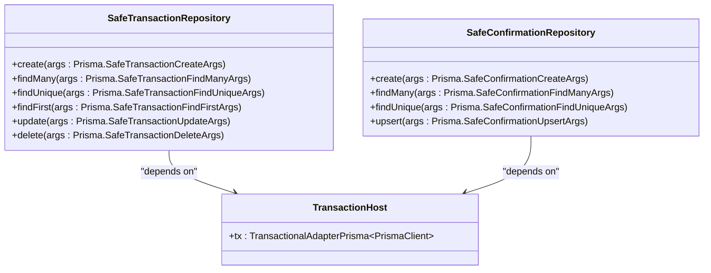
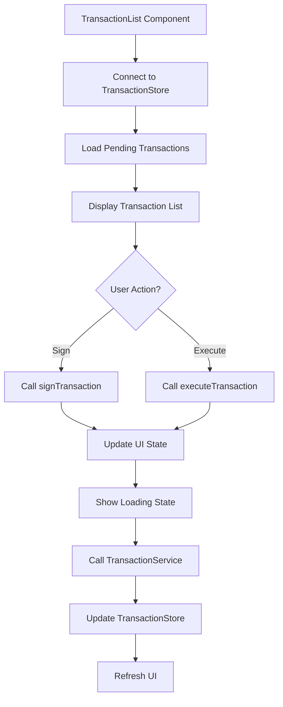

# Transaction Management

<cite>
**Referenced Files in This Document**   
- [transaction.service.ts](file://apps/coin/src/services/transaction.service.ts)
- [TransactionStore.ts](file://apps/coin/src/stores/TransactionStore.ts)
- [safe.repository.ts](file://packages/repository/src/repositories/safe.repository.ts)
- [TransactionList.tsx](file://apps/coin/src/components/safe/TransactionList.tsx)
- [web3.config.ts](file://apps/coin/src/config/web3.config.ts)
- [safe.service.ts](file://apps/coin/src/services/safe.service.ts)
- [StoreProvider.tsx](file://apps/coin/src/providers/StoreProvider.tsx)
</cite>

## Table of Contents
1. [Introduction](#introduction)
2. [Core Components](#core-components)
3. [Transaction Lifecycle Management](#transaction-lifecycle-management)
4. [State Management Architecture](#state-management-architecture)
5. [Service Layer Implementation](#service-layer-implementation)
6. [Data Persistence and Repository Pattern](#data-persistence-and-repository-pattern)
7. [User Interface Integration](#user-interface-integration)
8. [Configuration and Environment Settings](#configuration-and-environment-settings)
9. [Error Handling and State Management](#error-handling-and-state-management)
10. [Conclusion](#conclusion)

## Introduction
This document provides a comprehensive analysis of the transaction management system within the prj-core repository. The system is designed to handle multi-signature wallet transactions using the Safe (formerly Gnosis Safe) protocol, with a focus on Ethereum-based blockchain operations. The architecture combines frontend state management with backend persistence layers to provide a complete transaction lifecycle from creation to execution. The implementation supports both ETH and ERC-20 token transfers, with proper handling of multi-party approval workflows and threshold-based execution requirements.

## Core Components
The transaction management system consists of several interconnected components that work together to provide a seamless user experience for managing Safe transactions. These components include service classes for blockchain interaction, stores for client-side state management, repositories for data persistence, and UI components for user interaction. The system is built using a layered architecture with clear separation of concerns between the presentation layer, business logic layer, and data access layer.

**Section sources**
- [transaction.service.ts](file://apps/coin/src/services/transaction.service.ts)
- [TransactionStore.ts](file://apps/coin/src/stores/TransactionStore.ts)
- [safe.repository.ts](file://packages/repository/src/repositories/safe.repository.ts)

## Transaction Lifecycle Management
The transaction lifecycle in this system follows a multi-step process that begins with transaction creation and ends with execution or cancellation. When a user initiates a transaction, it is first created as a pending transaction that requires confirmations from the Safe owners. The transaction remains in a pending state until the required number of confirmations (determined by the threshold setting) is reached. Once sufficient confirmations are collected, the transaction becomes eligible for execution. The system tracks the state of each transaction through various stages including pending, awaiting confirmations, awaiting execution, executed, failed, and cancelled.

**Diagram sources**
- [transaction.service.ts](file://apps/coin/src/services/transaction.service.ts)
- [TransactionStore.ts](file://apps/coin/src/stores/TransactionStore.ts)

**Section sources**
- [transaction.service.ts](file://apps/coin/src/services/transaction.service.ts#L74-L168)
- [TransactionStore.ts](file://apps/coin/src/stores/TransactionStore.ts#L3-L9)

## State Management Architecture
The state management system is built using MobX, providing reactive state management for transaction-related data. The TransactionStore class serves as the central state container for all transaction-related information, maintaining separate collections for pending transactions, executed transactions, and the current transaction being processed. The store exposes various computed properties and actions to manage the transaction state, including methods to add, update, and remove transactions, as well as computed properties to determine execution eligibility based on confirmation thresholds.

**Diagram sources**
- [TransactionStore.ts](file://apps/coin/src/stores/TransactionStore.ts#L47-L157)

**Section sources**
- [TransactionStore.ts](file://apps/coin/src/stores/TransactionStore.ts#L47-L157)
- [StoreProvider.tsx](file://apps/coin/src/providers/StoreProvider.tsx#L1-L29)

## Service Layer Implementation
The TransactionService class provides the core business logic for interacting with the Safe protocol. It encapsulates the complexity of creating, signing, and executing transactions through the Safe SDK. The service offers methods for creating ETH and ERC-20 token transactions, signing pending transactions, executing confirmed transactions, and retrieving transaction information from the Safe Transaction Service API. The service uses the Safe API Kit and Protocol Kit to interact with the blockchain, abstracting away the low-level details of transaction construction and signature management.

**Diagram sources**
- [transaction.service.ts](file://apps/coin/src/services/transaction.service.ts#L51-L301)
- [TransactionStore.ts](file://apps/coin/src/stores/TransactionStore.ts#L47-L157)

**Section sources**
- [transaction.service.ts](file://apps/coin/src/services/transaction.service.ts#L51-L301)
- [safe.service.ts](file://apps/coin/src/services/safe.service.ts#L13-L169)

## Data Persistence and Repository Pattern
The system implements a repository pattern for data persistence, with dedicated repositories for managing Safe-related entities in the database. The SafeTransactionRepository and SafeConfirmationRepository classes provide CRUD operations for transaction and confirmation data, respectively. These repositories use Prisma as the ORM layer and are designed to work within a transactional context, ensuring data consistency across related operations. The repositories follow a consistent pattern of logging operations and handling database interactions through the Prisma client.

**Diagram sources**
- [safe.repository.ts](file://packages/repository/src/repositories/safe.repository.ts#L54-L135)

**Section sources**
- [safe.repository.ts](file://packages/repository/src/repositories/safe.repository.ts#L54-L135)

## User Interface Integration
The TransactionList component provides the user interface for viewing and interacting with pending transactions. It connects to the TransactionStore to access transaction data and provides buttons for signing and executing transactions. The component handles the user interaction flow, including displaying the current confirmation status, enabling/disabling action buttons based on transaction state, and showing loading states during operations. It integrates with the Wagmi library for wallet connectivity and uses the transaction service to perform blockchain operations.

**Diagram sources**
- [TransactionList.tsx](file://apps/coin/src/components/safe/TransactionList.tsx#L1-L259)
- [TransactionStore.ts](file://apps/coin/src/stores/TransactionStore.ts#L47-L157)

**Section sources**
- [TransactionList.tsx](file://apps/coin/src/components/safe/TransactionList.tsx#L1-L259)
- [transaction.service.ts](file://apps/coin/src/services/transaction.service.ts#L173-L190)

## Configuration and Environment Settings
The system configuration is managed through the web3.config.ts file, which defines key parameters for blockchain interaction. This includes the Safe Transaction Service URLs for different networks, Safe configuration parameters such as threshold and owner count, and Wagmi configuration for wallet connectivity. The configuration uses environment variables for RPC endpoints, allowing different settings for various deployment environments. The system supports multiple chains, with current configuration for mainnet and sepolia testnet.

**Section sources**
- [web3.config.ts](file://apps/coin/src/config/web3.config.ts#L1-L38)
- [transaction.service.ts](file://apps/coin/src/services/transaction.service.ts#L52-L57)

## Error Handling and State Management
The system implements comprehensive error handling throughout the transaction lifecycle. The TransactionStore maintains an error state that can be set by any component in the system, allowing for centralized error display. Each operation in the TransactionService includes try-catch blocks to handle potential failures, with appropriate error propagation to the UI layer. The system also manages various loading states (isLoading, isCreating, isSigning, isExecuting) to provide feedback to users during asynchronous operations. The reset method on the TransactionStore allows for clearing all state, which is useful for handling errors or navigating between different views.

**Section sources**
- [TransactionStore.ts](file://apps/coin/src/stores/TransactionStore.ts#L62-L63)
- [TransactionStore.ts](file://apps/coin/src/stores/TransactionStore.ts#L131-L134)
- [TransactionStore.ts](file://apps/coin/src/stores/TransactionStore.ts#L136-L145)
- [TransactionList.tsx](file://apps/coin/src/components/safe/TransactionList.tsx#L24-L40)

## Conclusion
The transaction management system in the prj-core repository provides a robust implementation for handling multi-signature wallet transactions using the Safe protocol. The architecture follows best practices with clear separation of concerns between the UI, state management, service, and data layers. The system effectively manages the complete transaction lifecycle from creation to execution, with proper handling of multi-party approval workflows and threshold-based execution requirements. The use of MobX for state management provides reactive updates to the UI, while the repository pattern ensures consistent data access and persistence. The integration with the Safe SDK abstracts away the complexity of blockchain interactions, providing a clean API for transaction operations. Overall, the system is well-structured and maintainable, with opportunities for future enhancements such as support for additional token types, improved error handling, and enhanced user interface features.