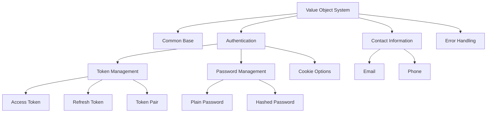
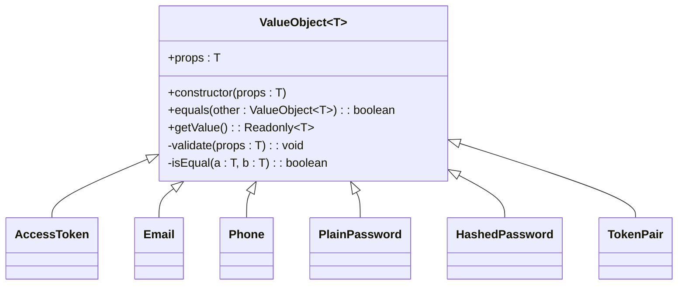
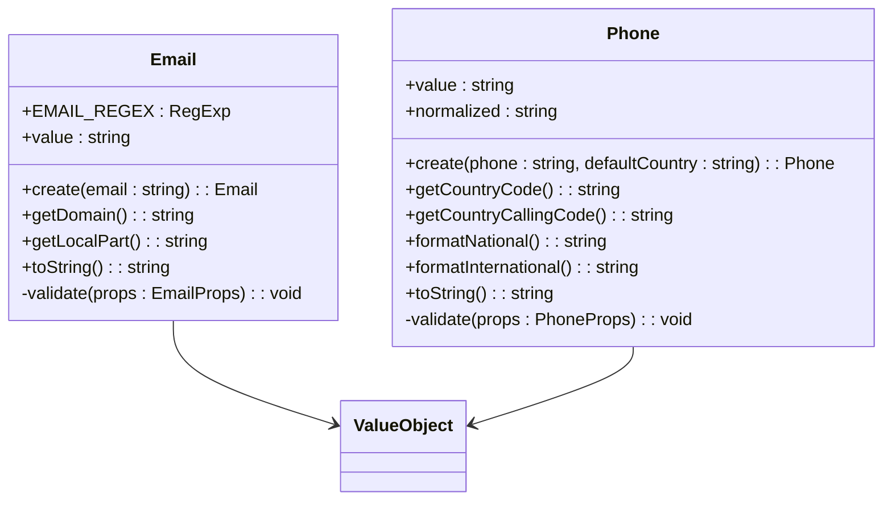
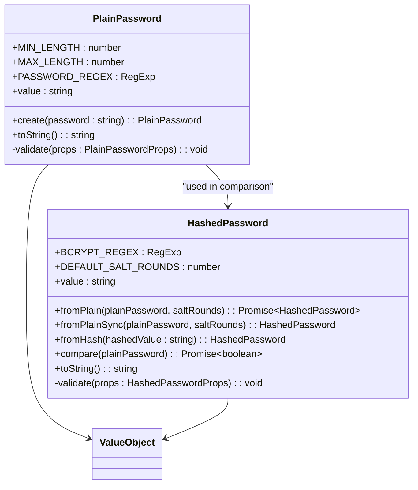
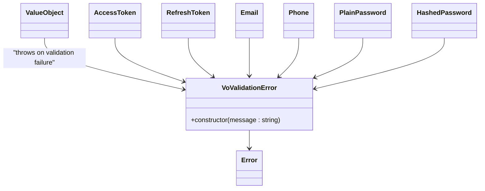
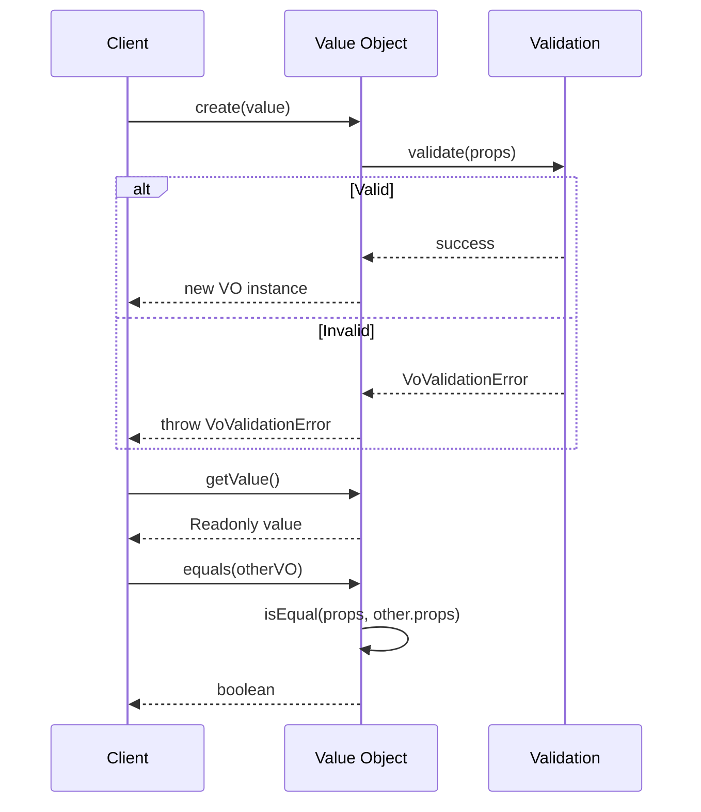

# Value Object System

<cite>
**Referenced Files in This Document**   
- [value-object.base.ts](file://packages/vo/src/common/value-object.base.ts)
- [access-token.vo.ts](file://packages/vo/src/auth/token/access-token.vo.ts)
- [refresh-token.vo.ts](file://packages/vo/src/auth/token/refresh-token.vo.ts)
- [token-pair.vo.ts](file://packages/vo/src/auth/token/token-pair.vo.ts)
- [email.vo.ts](file://packages/vo/src/contact/email.vo.ts)
- [phone.vo.ts](file://packages/vo/src/contact/phone.vo.ts)
- [plain-password.vo.ts](file://packages/vo/src/auth/password/plain-password.vo.ts)
- [hashed-password.vo.ts](file://packages/vo/src/auth/password/hashed-password.vo.ts)
- [vo.error.ts](file://packages/vo/src/errors/vo.error.ts)
</cite>

## Table of Contents
1. [Introduction](#introduction)
2. [Core Architecture](#core-architecture)
3. [Base Value Object Implementation](#base-value-object-implementation)
4. [Authentication Value Objects](#authentication-value-objects)
5. [Contact Information Value Objects](#contact-information-value-objects)
6. [Password Management Value Objects](#password-management-value-objects)
7. [Error Handling](#error-handling)
8. [Usage Patterns](#usage-patterns)
9. [Conclusion](#conclusion)

## Introduction
The Value Object System in this codebase implements domain-driven design principles through immutable, self-validating value objects. These objects encapsulate primitive data types with business rules and validation logic, ensuring data integrity across the application. The system is organized into logical domains including authentication, contact information, and security, with a consistent pattern applied throughout.

## Core Architecture
The Value Object System follows a modular structure with clear separation of concerns. The architecture is organized into domain-specific subdirectories under the main `vo` package, each containing related value objects and utilities.



**Diagram sources**
- [value-object.base.ts](file://packages/vo/src/common/value-object.base.ts)
- [access-token.vo.ts](file://packages/vo/src/auth/token/access-token.vo.ts)
- [email.vo.ts](file://packages/vo/src/contact/email.vo.ts)
- [plain-password.vo.ts](file://packages/vo/src/auth/password/plain-password.vo.ts)

**Section sources**
- [value-object.base.ts](file://packages/vo/src/common/value-object.base.ts)
- [index.ts](file://packages/vo/src/index.ts)

## Base Value Object Implementation
The foundation of the Value Object System is the abstract `ValueObject` class that provides core functionality for all derived value objects. This base class enforces the fundamental principles of value objects in domain-driven design.



**Diagram sources**
- [value-object.base.ts](file://packages/vo/src/common/value-object.base.ts)

**Section sources**
- [value-object.base.ts](file://packages/vo/src/common/value-object.base.ts)

## Authentication Value Objects
The authentication domain includes value objects for managing JWT tokens used in the authentication process. These objects ensure token format validity and provide convenient methods for token manipulation and retrieval.

```mermaid
classDiagram
class AccessToken {
+JWT_REGEX : RegExp
+create(token : string) : AccessToken
+value : string
+toString() : string
-validate(props : AccessTokenProps) : void
}
class RefreshToken {
+JWT_REGEX : RegExp
+create(token : string) : RefreshToken
+value : string
+toString() : string
-validate(props : RefreshTokenProps) : void
}
class TokenPair {
+create(accessToken, refreshToken) : TokenPair
+fromStrings(accessTokenStr, refreshTokenStr) : TokenPair
+accessToken : AccessToken
+refreshToken : RefreshToken
+toObject() : {accessToken, refreshToken}
-validate(props : TokenPairProps) : void
}
AccessToken --> TokenPair
RefreshToken --> TokenPair
```

**Diagram sources**
- [access-token.vo.ts](file://packages/vo/src/auth/token/access-token.vo.ts)
- [refresh-token.vo.ts](file://packages/vo/src/auth/token/refresh-token.vo.ts)
- [token-pair.vo.ts](file://packages/vo/src/auth/token/token-pair.vo.ts)

**Section sources**
- [access-token.vo.ts](file://packages/vo/src/auth/token/access-token.vo.ts)
- [refresh-token.vo.ts](file://packages/vo/src/auth/token/refresh-token.vo.ts)
- [token-pair.vo.ts](file://packages/vo/src/auth/token/token-pair.vo.ts)

## Contact Information Value Objects
The contact information domain includes value objects for managing email addresses and phone numbers. These objects enforce format validation and provide normalization and formatting capabilities.



**Diagram sources**
- [email.vo.ts](file://packages/vo/src/contact/email.vo.ts)
- [phone.vo.ts](file://packages/vo/src/contact/phone.vo.ts)

**Section sources**
- [email.vo.ts](file://packages/vo/src/contact/email.vo.ts)
- [phone.vo.ts](file://packages/vo/src/contact/phone.vo.ts)

## Password Management Value Objects
The password management domain includes value objects for handling both plain text and hashed passwords. These objects enforce security policies and provide safe interfaces for password operations.



**Diagram sources**
- [plain-password.vo.ts](file://packages/vo/src/auth/password/plain-password.vo.ts)
- [hashed-password.vo.ts](file://packages/vo/src/auth/password/hashed-password.vo.ts)

**Section sources**
- [plain-password.vo.ts](file://packages/vo/src/auth/password/plain-password.vo.ts)
- [hashed-password.vo.ts](file://packages/vo/src/auth/password/hashed-password.vo.ts)

## Error Handling
The Value Object System includes a dedicated error handling mechanism for validation failures. The error system provides meaningful feedback when value object creation or validation fails.



**Diagram sources**
- [vo.error.ts](file://packages/vo/src/errors/vo.error.ts)

**Section sources**
- [vo.error.ts](file://packages/vo/src/errors/vo.error.ts)

## Usage Patterns
The Value Object System follows consistent usage patterns across all implementations. These patterns ensure uniform behavior and ease of use throughout the application.



**Diagram sources**
- [value-object.base.ts](file://packages/vo/src/common/value-object.base.ts)
- [access-token.vo.ts](file://packages/vo/src/auth/token/access-token.vo.ts)

**Section sources**
- [value-object.base.ts](file://packages/vo/src/common/value-object.base.ts)

## Conclusion
The Value Object System provides a robust foundation for data integrity in the application. By encapsulating primitive values with validation rules and business logic, it prevents invalid states and reduces bugs. The system's consistent architecture makes it easy to extend with new value objects while maintaining code quality and reliability across domains.