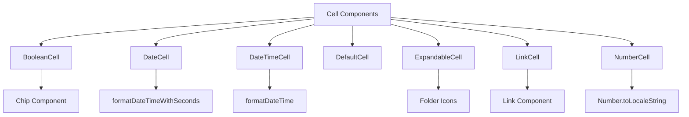
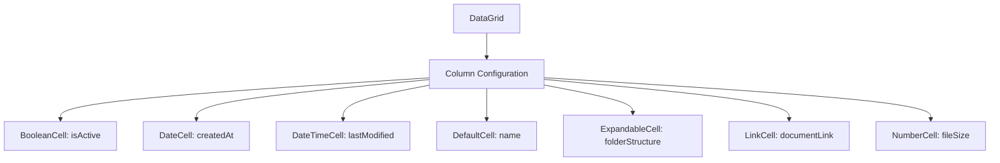
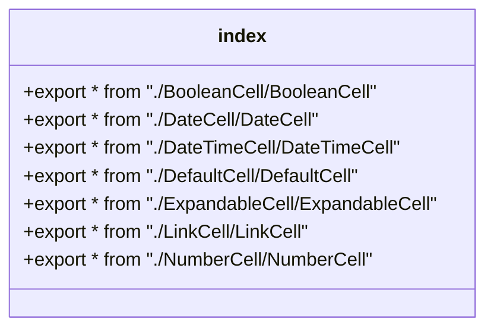

# Cell Components

<cite>
**Referenced Files in This Document**   
- [BooleanCell.tsx](file://packages/ui/src/components/cell/BooleanCell/BooleanCell.tsx)
- [DateCell.tsx](file://packages/ui/src/components/cell/DateCell/DateCell.tsx)
- [DateTimeCell.tsx](file://packages/ui/src/components/cell/DateTimeCell/DateTimeCell.tsx)
- [DefaultCell.tsx](file://packages/ui/src/components/cell/DefaultCell/DefaultCell.tsx)
- [ExpandableCell.tsx](file://packages/ui/src/components/cell/ExpandableCell/ExpandableCell.tsx)
- [LinkCell.tsx](file://packages/ui/src/components/cell/LinkCell/LinkCell.tsx)
- [NumberCell.tsx](file://packages/ui/src/components/cell/NumberCell/NumberCell.tsx)
- [index.ts](file://packages/ui/src/components/cell/index.ts)
- [DateCell.stories.tsx](file://packages/ui/src/components/cell/DateCell/DateCell.stories.tsx)
- [ExpandableCell.stories.tsx](file://packages/ui/src/components/cell/ExpandableCell/ExpandableCell.stories.tsx)
- [LinkCell.stories.tsx](file://packages/ui/src/components/cell/LinkCell/LinkCell.stories.tsx)
</cite>

## Table of Contents
1. [Introduction](#introduction)
2. [Core Cell Components](#core-cell-components)
3. [Component Architecture](#component-architecture)
4. [Implementation Details](#implementation-details)
5. [Usage Examples](#usage-examples)
6. [Export Pattern](#export-pattern)
7. [Storybook Integration](#storybook-integration)
8. [Accessibility Considerations](#accessibility-considerations)
9. [Responsive Design](#responsive-design)
10. [Conclusion](#conclusion)

## Introduction

Cell components in the prj-core's shared-frontend package serve as specialized data display units designed for use within tabular or grid layouts such as DataGrid or Table components. These components provide consistent, reusable, and accessible ways to render different types of data with appropriate formatting, visual indicators, and interactive behaviors. Each cell type is purpose-built to handle specific data types and presentation requirements, ensuring a cohesive user experience across the application.

**Section sources**
- [BooleanCell.tsx](file://packages/ui/src/components/cell/BooleanCell/BooleanCell.tsx)
- [DateCell.tsx](file://packages/ui/src/components/cell/DateCell/DateCell.tsx)
- [DateTimeCell.tsx](file://packages/ui/src/components/cell/DateTimeCell/DateTimeCell.tsx)
- [DefaultCell.tsx](file://packages/ui/src/components/cell/DefaultCell/DefaultCell.tsx)
- [ExpandableCell.tsx](file://packages/ui/src/components/cell/ExpandableCell/ExpandableCell.tsx)
- [LinkCell.tsx](file://packages/ui/src/components/cell/LinkCell/LinkCell.tsx)
- [NumberCell.tsx](file://packages/ui/src/components/cell/NumberCell/NumberCell.tsx)

## Core Cell Components

The shared-frontend package provides several specialized cell components for different data types:

- **BooleanCell**: Renders boolean values with visual indicators using Chip components
- **DateCell**: Displays date values with seconds formatting
- **DateTimeCell**: Displays date and time values without seconds
- **DefaultCell**: General-purpose cell for text and numeric values
- **ExpandableCell**: Supports hierarchical data with expand/collapse functionality
- **LinkCell**: Renders navigational elements with configurable link properties
- **NumberCell**: Formats numeric values with locale-specific formatting

Each component handles null, undefined, and empty values by displaying a consistent placeholder ("-") to maintain visual consistency in data grids.

**Section sources**
- [BooleanCell.tsx](file://packages/ui/src/components/cell/BooleanCell/BooleanCell.tsx)
- [DateCell.tsx](file://packages/ui/src/components/cell/DateCell/DateCell.tsx)
- [DateTimeCell.tsx](file://packages/ui/src/components/cell/DateTimeCell/DateTimeCell.tsx)
- [DefaultCell.tsx](file://packages/ui/src/components/cell/DefaultCell/DefaultCell.tsx)
- [ExpandableCell.tsx](file://packages/ui/src/components/cell/ExpandableCell/ExpandableCell.tsx)
- [LinkCell.tsx](file://packages/ui/src/components/cell/LinkCell/LinkCell.tsx)
- [NumberCell.tsx](file://packages/ui/src/components/cell/NumberCell/NumberCell.tsx)

## Component Architecture

The cell components follow a consistent architectural pattern with specialized implementations for different data types. The components are organized in a modular directory structure with each cell type in its own subdirectory containing the implementation and stories.

**Diagram sources**
- [BooleanCell.tsx](file://packages/ui/src/components/cell/BooleanCell/BooleanCell.tsx)
- [DateCell.tsx](file://packages/ui/src/components/cell/DateCell/DateCell.tsx)
- [DateTimeCell.tsx](file://packages/ui/src/components/cell/DateTimeCell/DateTimeCell.tsx)
- [DefaultCell.tsx](file://packages/ui/src/components/cell/DefaultCell/DefaultCell.tsx)
- [ExpandableCell.tsx](file://packages/ui/src/components/cell/ExpandableCell/ExpandableCell.tsx)
- [LinkCell.tsx](file://packages/ui/src/components/cell/LinkCell/LinkCell.tsx)
- [NumberCell.tsx](file://packages/ui/src/components/cell/NumberCell/NumberCell.tsx)

## Implementation Details

### BooleanCell
The BooleanCell component renders boolean values as Chips with color coding: green (success) for true values and gray (default) for false values. The component displays "예" for true and "아니오" for false in Korean, providing clear visual feedback.

### DateCell and DateTimeCell
Both components handle temporal data with specialized formatting functions from the @cocrepo/toolkit library. DateCell uses `formatDateTimeWithSeconds` to include seconds in the display, while DateTimeCell uses `formatDateTime` for a more concise format without seconds.

### DefaultCell
This general-purpose cell handles text and numeric values, converting them to strings for display. It includes special handling for zero values to ensure they are displayed rather than treated as empty.

### ExpandableCell
The ExpandableCell supports hierarchical data structures with visual indicators for expandable items. It includes:
- Folder icons for expandable items
- Document icons for leaf nodes
- Visual indentation based on depth level
- Connection lines between parent and child items
- Clickable toggle areas for expanding/collapsing

### LinkCell
Built on the @heroui/react Link component, LinkCell provides configurable link properties including color, size, and external link indicators. It accepts all standard Link props while adding the value prop for the link text.

### NumberCell
Formats numeric values using the browser's `toLocaleString()` method for locale-specific number formatting (e.g., thousand separators). It handles various input types including numbers, strings, null, and undefined values.

**Section sources**
- [BooleanCell.tsx](file://packages/ui/src/components/cell/BooleanCell/BooleanCell.tsx)
- [DateCell.tsx](file://packages/ui/src/components/cell/DateCell/DateCell.tsx)
- [DateTimeCell.tsx](file://packages/ui/src/components/cell/DateTimeCell/DateTimeCell.tsx)
- [DefaultCell.tsx](file://packages/ui/src/components/cell/DefaultCell/DefaultCell.tsx)
- [ExpandableCell.tsx](file://packages/ui/src/components/cell/ExpandableCell/ExpandableCell.tsx)
- [LinkCell.tsx](file://packages/ui/src/components/cell/LinkCell/LinkCell.tsx)
- [NumberCell.tsx](file://packages/ui/src/components/cell/NumberCell/NumberCell.tsx)

## Usage Examples

### In DataGrid Context

**Diagram sources**
- [BooleanCell.tsx](file://packages/ui/src/components/cell/BooleanCell/BooleanCell.tsx)
- [DateCell.tsx](file://packages/ui/src/components/cell/DateCell/DateCell.tsx)
- [DateTimeCell.tsx](file://packages/ui/src/components/cell/DateTimeCell/DateTimeCell.tsx)
- [DefaultCell.tsx](file://packages/ui/src/components/cell/DefaultCell/DefaultCell.tsx)
- [ExpandableCell.tsx](file://packages/ui/src/components/cell/ExpandableCell/ExpandableCell.tsx)
- [LinkCell.tsx](file://packages/ui/src/components/cell/LinkCell/LinkCell.tsx)
- [NumberCell.tsx](file://packages/ui/src/components/cell/NumberCell/NumberCell.tsx)

### Practical Implementation
When using these components within a DataGrid or Table, they are typically configured as cell renderers in column definitions:

- **BooleanCell**: For status flags, active/inactive indicators
- **DateCell/DateTimeCell**: For timestamps, creation dates, modification times
- **DefaultCell**: For general text content, names, descriptions
- **ExpandableCell**: For file/folder structures, hierarchical categories
- **LinkCell**: For navigable items, document references, external resources
- **NumberCell**: For counts, sizes, prices, percentages

## Export Pattern

The cell components follow a clean export pattern through the index.ts file, which re-exports all cell components for convenient importing:

This barrel export pattern allows consumers to import components directly from the parent directory without specifying the full path to individual component files.

**Diagram sources**
- [index.ts](file://packages/ui/src/components/cell/index.ts)

**Section sources**
- [index.ts](file://packages/ui/src/components/cell/index.ts)

## Storybook Integration

The cell components are integrated with Storybook for visual testing and documentation. Each component has corresponding stories that demonstrate various states and configurations:

- **DateCell**: Shows different date formats, null/undefined values
- **ExpandableCell**: Demonstrates various states including expanded/collapsed, different depths, and document vs folder types
- **LinkCell**: Shows different colors, sizes, and external/internal link configurations

The Storybook integration provides:
- Interactive controls for component props
- Visual documentation of component states
- Accessibility testing capabilities
- Responsive design testing

**Section sources**
- [DateCell.stories.tsx](file://packages/ui/src/components/cell/DateCell/DateCell.stories.tsx)
- [ExpandableCell.stories.tsx](file://packages/ui/src/components/cell/ExpandableCell/ExpandableCell.stories.tsx)
- [LinkCell.stories.tsx](file://packages/ui/src/components/cell/LinkCell/LinkCell.stories.tsx)

## Accessibility Considerations

The cell components incorporate several accessibility features:

- **Screen Reader Support**: Proper semantic HTML elements and ARIA attributes
- **Keyboard Navigation**: ExpandableCell supports keyboard interaction for expand/collapse functionality
- **Focus Indicators**: Visible focus states for interactive elements
- **Color Contrast**: Sufficient contrast ratios for text and interactive elements
- **Alternative Text**: SVG icons include title elements for screen readers
- **Meaningful Labels**: Boolean values use clear text labels ("예"/"아니오") rather than just visual indicators

The ExpandableCell component provides particular attention to accessibility with proper focus management and keyboard navigation support for hierarchical data structures.

**Section sources**
- [ExpandableCell.tsx](file://packages/ui/src/components/cell/ExpandableCell/ExpandableCell.tsx)
- [BooleanCell.tsx](file://packages/ui/src/components/cell/BooleanCell/BooleanCell.tsx)

## Responsive Design

The cell components are designed to work effectively across different screen sizes:

- **ExpandableCell**: Uses relative units (rem) for indentation and spacing, ensuring consistent layout at different scales
- **All Components**: Employ flexible layouts that adapt to container width
- **Text Truncation**: Implicit support through parent DataGrid/Table components
- **Touch Targets**: ExpandableCell provides adequate touch target size (44px minimum) for mobile devices
- **Visual Hierarchy**: Clear visual distinction between different cell types and states

The components maintain their functionality and readability on both desktop and mobile devices, with particular attention to the ExpandableCell's hierarchical visualization on smaller screens.

**Section sources**
- [ExpandableCell.tsx](file://packages/ui/src/components/cell/ExpandableCell/ExpandableCell.tsx)

## Conclusion

The cell components in prj-core's shared-frontend package provide a comprehensive set of specialized data display units for tabular and grid layouts. Each component is purpose-built for specific data types with appropriate formatting, visual indicators, and interactive behaviors. The consistent architecture, clean export pattern, and Storybook integration make these components easy to use and maintain. With attention to accessibility and responsive design, these components ensure a high-quality user experience across different devices and user needs.