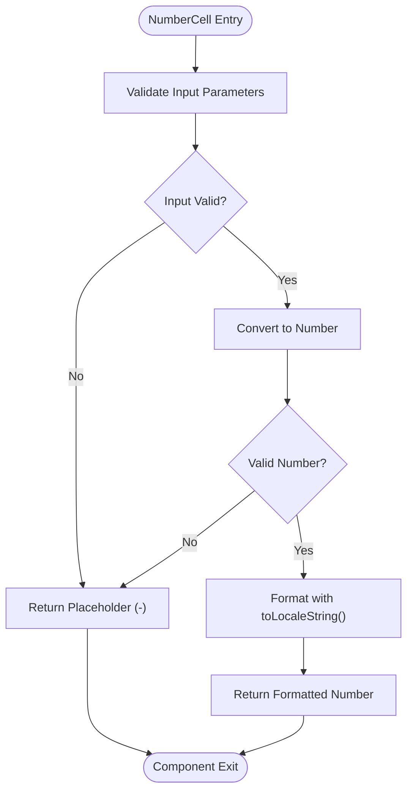
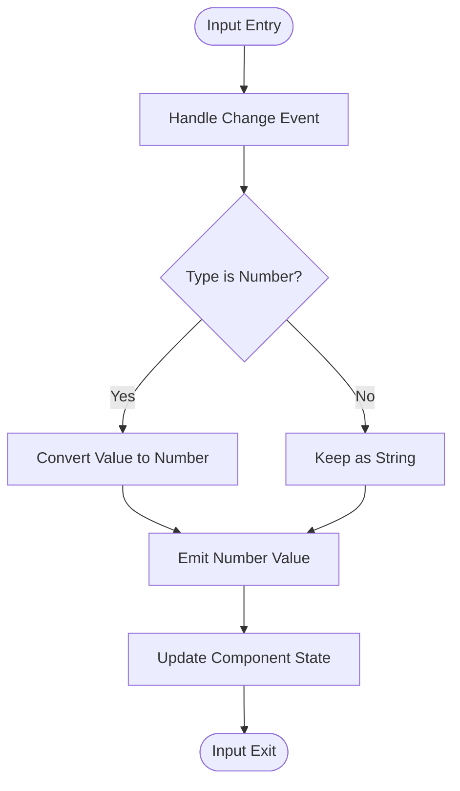
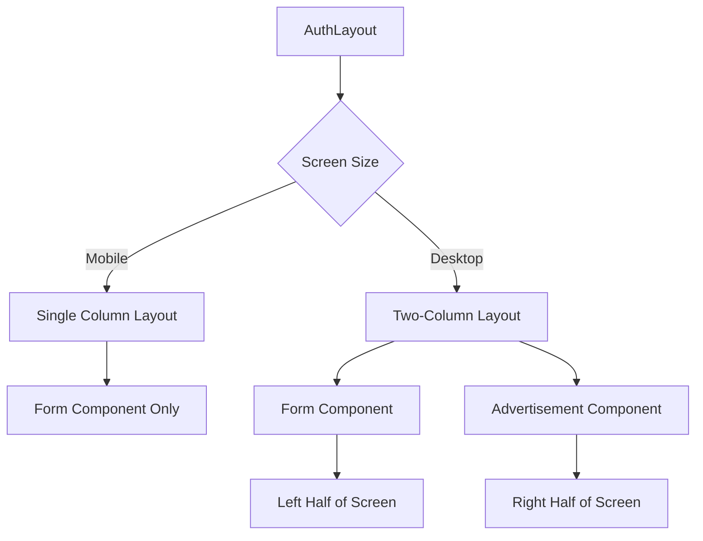
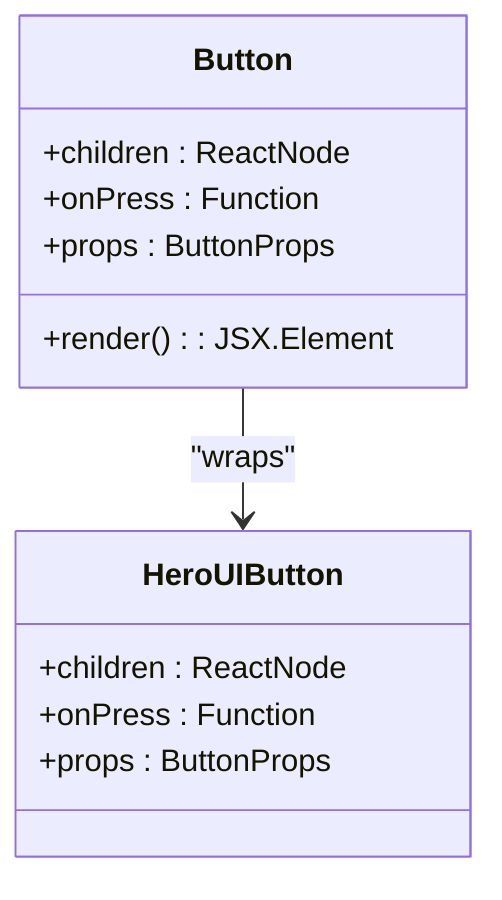
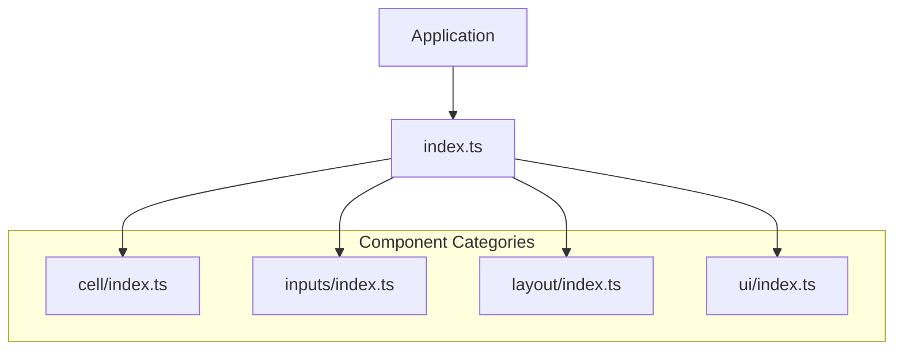
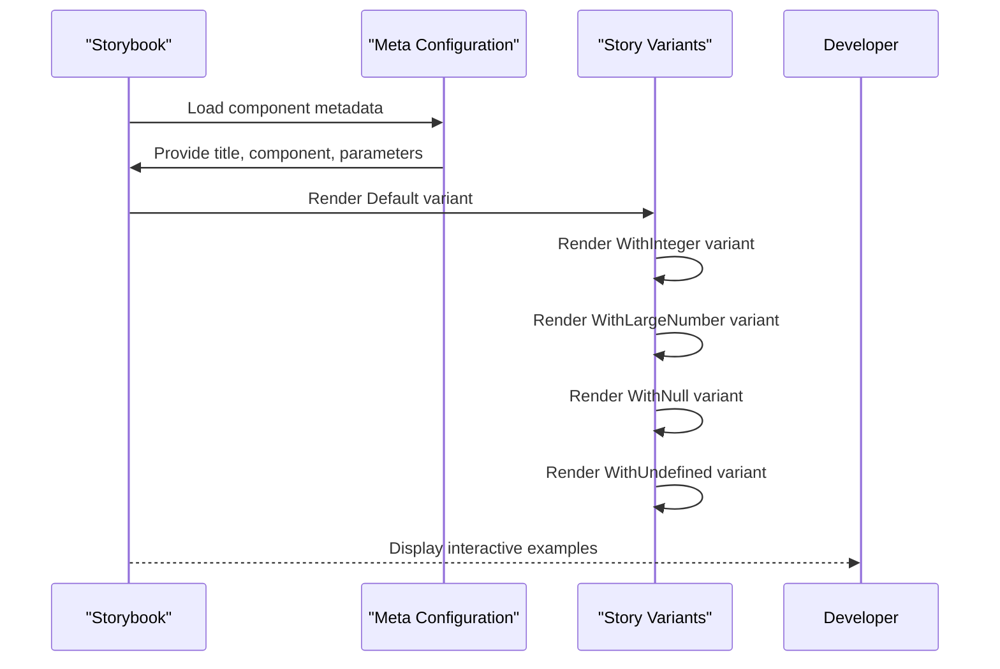

# Component Categories

<cite>
**Referenced Files in This Document**   
- [index.ts](file://packages/ui/src/components/index.ts)
- [cell/index.ts](file://packages/ui/src/components/cell/index.ts)
- [inputs/index.ts](file://packages/ui/src/components/inputs/index.ts)
- [layout/index.ts](file://packages/ui/src/components/layout/index.ts)
- [ui/index.ts](file://packages/ui/src/components/ui/index.ts)
- [NumberCell.tsx](file://packages/ui/src/components/cell/NumberCell/NumberCell.tsx)
- [Input.tsx](file://packages/ui/src/components/inputs/Input/Input.tsx)
- [AuthLayout.tsx](file://packages/ui/src/components/layout/Auth/AuthLayout.tsx)
- [Button.tsx](file://packages/ui/src/components/ui/Button/Button.tsx)
- [NumberCell.stories.tsx](file://packages/ui/src/components/cell/NumberCell/NumberCell.stories.tsx)
</cite>

## Table of Contents
1. [Introduction](#introduction)
2. [Component Categorization System](#component-categorization-system)
3. [Cell Components](#cell-components)
4. [Inputs Components](#inputs-components)
5. [Layout Components](#layout-components)
6. [UI Components](#ui-components)
7. [Index Export Pattern](#index-export-pattern)
8. [Storybook Integration](#storybook-integration)
9. [Best Practices](#best-practices)

## Introduction
The shared-frontend package in prj-core implements a structured component categorization system designed to enhance maintainability and discoverability. This documentation details the architecture, implementation, and usage patterns of the component categories (cell, inputs, layout, ui) within the shared-frontend package. The system follows consistent patterns across all categories, enabling developers to quickly locate and utilize appropriate components for specific use cases.

## Component Categorization System
The component categorization system organizes UI elements into logical groups based on their primary function and usage context. This organization improves code discoverability, reduces duplication, and establishes clear patterns for component usage. The four main categories—cell, inputs, layout, and ui—represent distinct functional domains within the application's user interface.

The categorization follows the principle of separation of concerns, where each category addresses specific UI challenges:
- **cell**: Data presentation in tabular or grid contexts
- **inputs**: User input collection and form interactions
- **layout**: Structural organization of application screens
- **ui**: General-purpose UI elements and utilities

This structure enables teams to maintain consistency across applications while providing clear guidance on component selection based on use case requirements.

**Section sources**
- [index.ts](file://packages/ui/src/components/index.ts#L1-L7)

## Cell Components
The cell category contains specialized components designed for displaying data within table cells and grid layouts. These components handle data formatting, null/undefined value rendering, and accessibility concerns specific to tabular data presentation.

The NumberCell component exemplifies the pattern used throughout this category, accepting various input types (number, string, null, undefined) and providing consistent formatting through toLocaleString(). The component gracefully handles invalid inputs by displaying a standardized placeholder ("–") rather than error states.

**Diagram sources**
- [NumberCell.tsx](file://packages/ui/src/components/cell/NumberCell/NumberCell.tsx#L1-L16)

**Section sources**
- [cell/index.ts](file://packages/ui/src/components/cell/index.ts#L1-L7)
- [NumberCell.tsx](file://packages/ui/src/components/cell/NumberCell/NumberCell.tsx#L1-L16)

## Inputs Components
The inputs category provides form controls and input elements that handle user interaction and data collection. These components wrap lower-level UI primitives with enhanced functionality, including type handling, change event normalization, and integration with form state management systems.

The Input component demonstrates the wrapper pattern used in this category, extending HeroUI's Input component while normalizing value handling for both string and number types. It automatically converts numeric string inputs to numbers when the type is set to "number", ensuring consistent data types in form state.

**Diagram sources**
- [Input.tsx](file://packages/ui/src/components/inputs/Input/Input.tsx#L1-L54)

**Section sources**
- [inputs/index.ts](file://packages/ui/src/components/inputs/index.ts#L1-L20)
- [Input.tsx](file://packages/ui/src/components/inputs/Input/Input.tsx#L1-L54)

## Layout Components
The layout category contains structural components that define the overall organization of application screens and pages. These components handle responsive design patterns, screen real estate allocation, and consistent spacing across different device sizes.

The AuthLayout component illustrates the responsive layout pattern, providing different arrangements for mobile and desktop views. On mobile, it displays content in a single column, while on desktop it splits the screen into two sections—one for form content and another for supplementary information or advertisements.

**Diagram sources**
- [AuthLayout.tsx](file://packages/ui/src/components/layout/Auth/AuthLayout.tsx#L1-L49)

**Section sources**
- [layout/index.ts](file://packages/ui/src/components/layout/index.ts#L1-L8)
- [AuthLayout.tsx](file://packages/ui/src/components/layout/Auth/AuthLayout.tsx#L1-L49)

## UI Components
The ui category contains general-purpose UI elements that can be used across various contexts within the application. These components include buttons, navigation elements, data displays, and other interactive controls that don't fit into the more specialized categories.

The Button component represents the wrapper pattern used throughout this category, providing a thin abstraction over HeroUI's Button component while maintaining compatibility with the existing API. This approach allows for consistent styling and behavior across the application while preserving the underlying component's functionality.

**Diagram sources**
- [Button.tsx](file://packages/ui/src/components/ui/Button/Button.tsx#L1-L12)

**Section sources**
- [ui/index.ts](file://packages/ui/src/components/ui/index.ts#L1-L27)
- [Button.tsx](file://packages/ui/src/components/ui/Button/Button.tsx#L1-L12)

## Index Export Pattern
The shared-frontend package implements a consistent index export pattern across all component categories. Each category directory contains an index.ts file that re-exports all components within that category, enabling convenient bulk imports and simplified usage patterns.

The main components/index.ts file aggregates exports from all categories, providing a single entry point for the entire component library. This pattern supports both selective imports (importing specific components) and bulk imports (importing entire categories), giving developers flexibility in how they consume the components.

**Diagram sources**
- [index.ts](file://packages/ui/src/components/index.ts#L1-L7)
- [cell/index.ts](file://packages/ui/src/components/cell/index.ts#L1-L7)
- [inputs/index.ts](file://packages/ui/src/components/inputs/index.ts#L1-L20)
- [layout/index.ts](file://packages/ui/src/components/layout/index.ts#L1-L8)
- [ui/index.ts](file://packages/ui/src/components/ui/index.ts#L1-L27)

**Section sources**
- [index.ts](file://packages/ui/src/components/index.ts#L1-L7)

## Storybook Integration
Each component in the shared-frontend package includes Storybook integration through dedicated .stories.tsx files. These stories provide visual testing, documentation, and interactive examples for component usage. The NumberCell stories demonstrate various input scenarios including integers, large numbers, decimals, negative values, and edge cases like null and undefined.

Storybook stories follow a consistent pattern with multiple export variants, each representing a different usage scenario or state. This approach enables comprehensive visual testing and serves as living documentation for component behavior under different conditions.

**Diagram sources**
- [NumberCell.stories.tsx](file://packages/ui/src/components/cell/NumberCell/NumberCell.stories.tsx#L1-L81)

**Section sources**
- [NumberCell.stories.tsx](file://packages/ui/src/components/cell/NumberCell/NumberCell.stories.tsx#L1-L81)

## Best Practices
When working with the component categorization system, consider the following best practices:

1. **Component Selection**: Choose components based on their intended category and use case. Use cell components for tabular data, inputs for form controls, layout for structural organization, and ui components for general interface elements.

2. **Import Patterns**: Utilize the index export pattern for cleaner imports. Import specific components when only a few are needed, or use category-level imports when multiple components from the same category are required.

3. **Accessibility**: All components in the shared-frontend package follow accessibility best practices. Ensure proper labeling, keyboard navigation, and screen reader support when implementing these components.

4. **Responsive Design**: Leverage layout components that automatically adapt to different screen sizes. Test components across mobile and desktop views to ensure consistent user experience.

5. **Consistent Styling**: While components support custom styling through className props, maintain consistency with the overall design system unless specific customization is required.

6. **Storybook Usage**: Refer to Storybook examples when implementing components to understand available props, variants, and expected behavior.

**Section sources**
- [index.ts](file://packages/ui/src/components/index.ts#L1-L7)
- [cell/index.ts](file://packages/ui/src/components/cell/index.ts#L1-L7)
- [inputs/index.ts](file://packages/ui/src/components/inputs/index.ts#L1-L20)
- [layout/index.ts](file://packages/ui/src/components/layout/index.ts#L1-L8)
- [ui/index.ts](file://packages/ui/src/components/ui/index.ts#L1-L27)