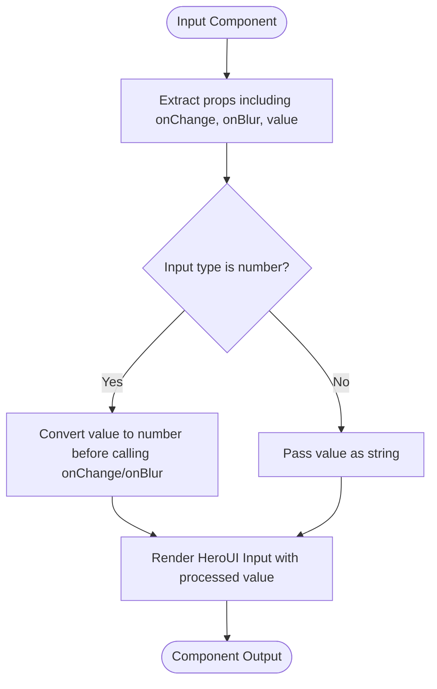
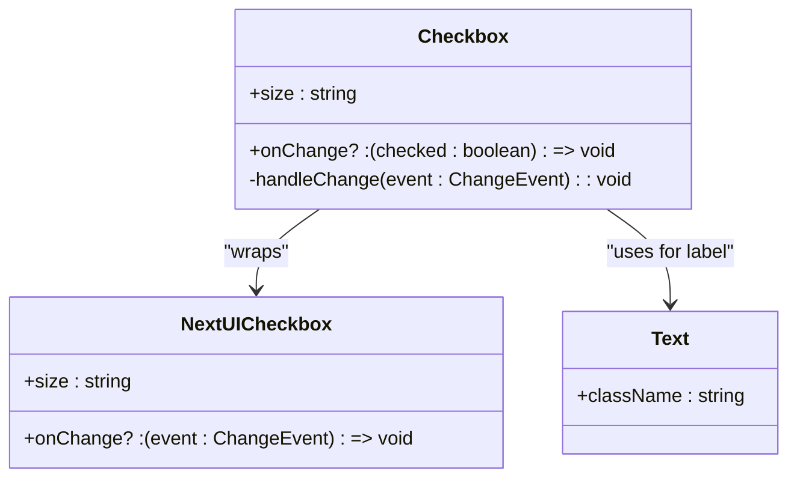
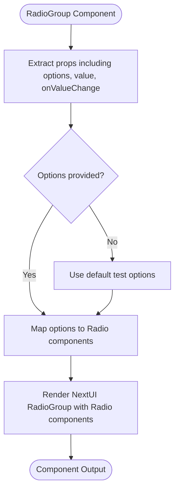
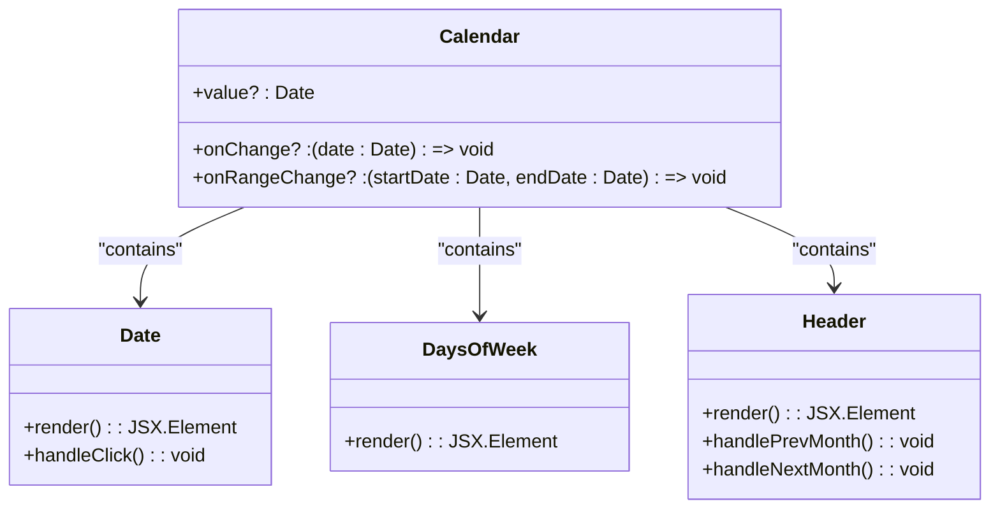
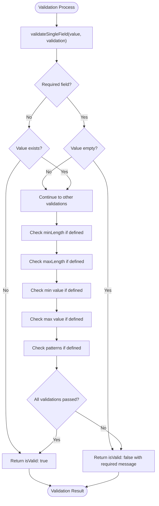
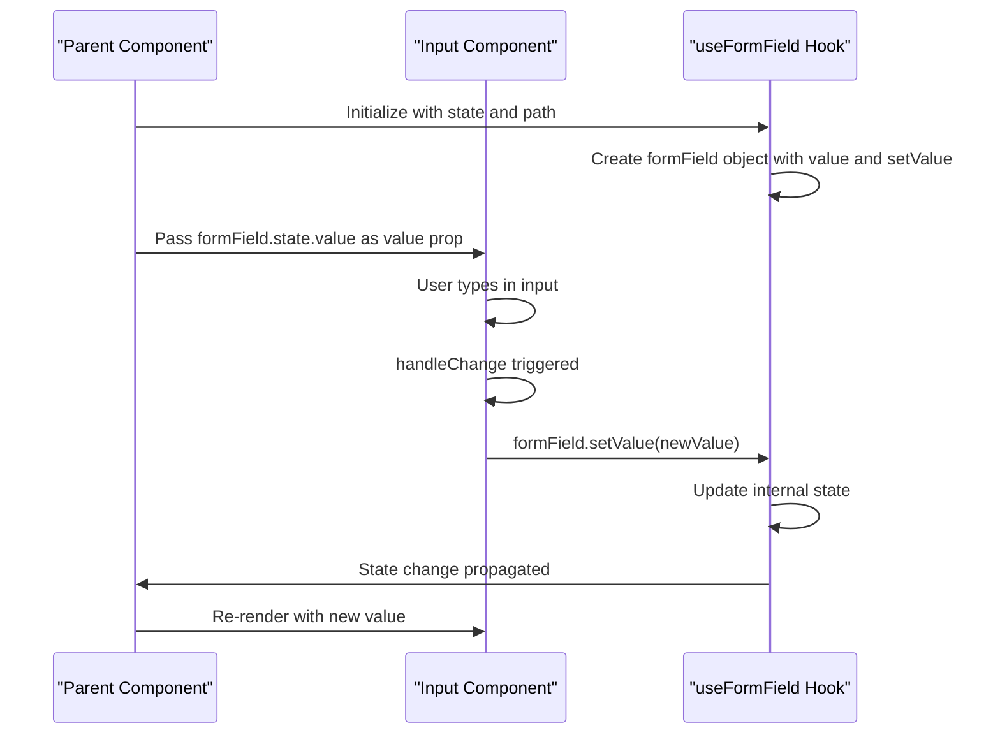
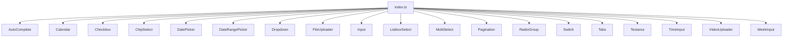
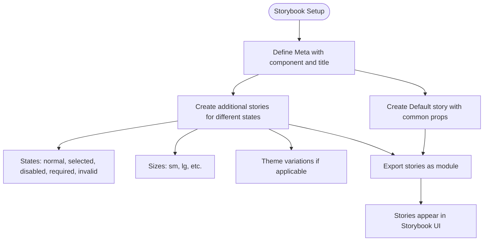

# Input Components

<cite>
**Referenced Files in This Document**   
- [Input.tsx](file://packages/ui/src/components/inputs/Input/Input.tsx)
- [Input.stories.tsx](file://packages/ui/src/components/inputs/Input/Input.stories.tsx)
- [Textarea.tsx](file://packages/ui/src/components/inputs/Textarea/Textarea.tsx)
- [Checkbox.tsx](file://packages/ui/src/components/inputs/Checkbox/Checkbox.tsx)
- [RadioGroup.tsx](file://packages/ui/src/components/inputs/RadioGroup/RadioGroup.tsx)
- [Switch.tsx](file://packages/ui/src/components/inputs/Switch/Switch.tsx)
- [Dropdown.tsx](file://packages/ui/src/components/inputs/Dropdown/Dropdown.tsx)
- [AutoComplete.tsx](file://packages/ui/src/components/inputs/AutoComplete/AutoComplete.tsx)
- [MultiSelect.tsx](file://packages/ui/src/components/inputs/MultiSelect/MultiSelect.tsx)
- [ListboxSelect.tsx](file://packages/ui/src/components/inputs/ListboxSelect/ListboxSelect.tsx)
- [ChipSelect.tsx](file://packages/ui/src/components/inputs/ChipSelect/ChipSelect.tsx)
- [DatePicker.tsx](file://packages/ui/src/components/inputs/DatePicker/DatePicker.tsx)
- [DateRangePicker.tsx](file://packages/ui/src/components/inputs/DateRangePicker/DateRangePicker.tsx)
- [TimeInput.tsx](file://packages/ui/src/components/inputs/TimeInput/TimeInput.tsx)
- [WeekInput.tsx](file://packages/ui/src/components/inputs/WeekInput/WeekInput.tsx)
- [Calendar.tsx](file://packages/ui/src/components/inputs/Calendar/Calendar.tsx)
- [Tabs.tsx](file://packages/ui/src/components/inputs/Tabs/Tabs.tsx)
- [FileUploader.tsx](file://packages/ui/src/components/inputs/FileUploader/FileUploader.tsx)
- [VideoUploader.tsx](file://packages/ui/src/components/inputs/VideoUploader/VideoUploader.tsx)
- [index.ts](file://packages/ui/src/components/inputs/index.ts)
- [Form.ts](file://packages/toolkit/src/Form.ts)
- [useFormField.ts](file://packages/hooks/src/useFormField.ts)
</cite>

## Table of Contents
1. [Introduction](#introduction)
2. [Form Controls](#form-controls)
3. [Selection Components](#selection-components)
4. [Date and Time Inputs](#date-and-time-inputs)
5. [File and Media Inputs](#file-and-media-inputs)
6. [Validation and Error Handling](#validation-and-error-handling)
7. [Controlled and Uncontrolled Patterns](#controlled-and-uncontrolled-patterns)
8. [Accessibility and Responsive Design](#accessibility-and-responsive-design)
9. [Index Export Pattern](#index-export-pattern)
10. [Storybook Integration](#storybook-integration)
11. [Best Practices](#best-practices)

## Introduction
Input components in the prj-core's shared UI package serve as essential user interaction elements for data entry and selection within web applications. These components provide a consistent, accessible, and reusable interface for collecting user input across various forms and interactive elements. The input component library is designed to support both simple data entry and complex selection scenarios, with comprehensive validation, accessibility features, and responsive behavior.

The components are built on top of the HeroUI React library, extending its base components with additional functionality specific to the prj-core ecosystem. Each input component follows a consistent architecture pattern, providing both controlled and uncontrolled usage options, proper validation states, and integration with the application's form state management system.

**Section sources**
- [Input.tsx](file://packages/ui/src/components/inputs/Input/Input.tsx)
- [Textarea.tsx](file://packages/ui/src/components/inputs/Textarea/Textarea.tsx)
- [Checkbox.tsx](file://packages/ui/src/components/inputs/Checkbox/Checkbox.tsx)

## Form Controls
The form controls category includes basic input elements for text entry and binary selection. These components provide the foundation for user data input in forms and interactive interfaces.

### Input
The Input component is a text input field that supports various types including text, number, email, password, and more. It extends the base HeroUI Input component with additional functionality for value handling, particularly for number inputs which automatically convert string values to numbers when appropriate.

**Diagram sources**
- [Input.tsx](file://packages/ui/src/components/inputs/Input/Input.tsx)

### Textarea
The Textarea component provides a multi-line text input field for longer text entries. It follows the same pattern as the Input component but is specifically designed for larger text content. The component handles text input changes and passes the current value to the onChange callback.

**Section sources**
- [Textarea.tsx](file://packages/ui/src/components/inputs/Textarea/Textarea.tsx)

### Checkbox
The Checkbox component allows users to select one or more options from a set. It wraps the HeroUI Checkbox component and standardizes the onChange event to pass a boolean value indicating whether the checkbox is checked. The component also integrates with the Text component to provide consistent styling for the checkbox label.

**Diagram sources**
- [Checkbox.tsx](file://packages/ui/src/components/inputs/Checkbox/Checkbox.tsx)

### RadioGroup
The RadioGroup component provides a set of mutually exclusive options where only one can be selected at a time. It accepts an array of options with text and value properties, rendering a Radio component for each option. The component manages the selected value and notifies the parent component of changes through the onValueChange callback.

**Diagram sources**
- [RadioGroup.tsx](file://packages/ui/src/components/inputs/RadioGroup/RadioGroup.tsx)

### Switch
The Switch component provides a toggle control for binary states (on/off, true/false). It wraps the HeroUI Switch component and standardizes the API to use value and onValueChange props instead of isSelected and onValueChange. This creates a consistent interface with other form controls in the library.

**Section sources**
- [Switch.tsx](file://packages/ui/src/components/inputs/Switch/Switch.tsx)

## Selection Components
Selection components provide various interfaces for choosing from predefined options, ranging from simple dropdowns to complex multi-selection interfaces.

### Dropdown
The Dropdown component allows users to select one option from a list that appears when the control is activated. It provides a compact way to present multiple choices without taking up significant screen space.

**Section sources**
- [Dropdown.tsx](file://packages/ui/src/components/inputs/Dropdown/Dropdown.tsx)

### AutoComplete
The AutoComplete component combines a text input with a dropdown list of suggestions that appear as the user types. This component is particularly useful for large datasets where users can quickly find the desired option by typing a portion of its name.

**Section sources**
- [AutoComplete.tsx](file://packages/ui/src/components/inputs/AutoComplete/AutoComplete.tsx)

### MultiSelect
The MultiSelect component enables users to select multiple options from a list. It typically displays selected items as chips or badges and provides an interface for adding or removing selections from the available options.

**Section sources**
- [MultiSelect.tsx](file://packages/ui/src/components/inputs/MultiSelect/MultiSelect.tsx)

### ListboxSelect
The ListboxSelect component presents options in a list format, allowing users to select one or more items. It provides a clear view of all available options and supports keyboard navigation for accessibility.

**Section sources**
- [ListboxSelect.tsx](file://packages/ui/src/components/inputs/ListboxSelect/ListboxSelect.tsx)

### ChipSelect
The ChipSelect component displays options as chips or tags that users can select. Selected chips are typically highlighted, and the component may support multi-selection or single selection modes.

**Section sources**
- [ChipSelect.tsx](file://packages/ui/src/components/inputs/ChipSelect/ChipSelect.tsx)

## Date and Time Inputs
These components provide specialized interfaces for selecting dates, times, and date ranges, with user-friendly visual calendars and time pickers.

### DatePicker
The DatePicker component allows users to select a single date using a calendar interface. It typically includes navigation controls for moving between months and years, and highlights the selected date.

**Section sources**
- [DatePicker.tsx](file://packages/ui/src/components/inputs/DatePicker/DatePicker.tsx)

### DateRangePicker
The DateRangePicker component enables users to select a range of dates by choosing both a start and end date. It often displays two calendar panels side by side for easy range selection.

**Section sources**
- [DateRangePicker.tsx](file://packages/ui/src/components/inputs/DateRangePicker/DateRangePicker.tsx)

### TimeInput
The TimeInput component provides an interface for selecting a specific time of day. It may include separate controls for hours, minutes, and optionally seconds, with support for both 12-hour and 24-hour formats.

**Section sources**
- [TimeInput.tsx](file://packages/ui/src/components/inputs/TimeInput/TimeInput.tsx)

### WeekInput
The WeekInput component allows users to select a specific week of the year. It typically displays the week number and the range of dates that week encompasses.

**Section sources**
- [WeekInput.tsx](file://packages/ui/src/components/inputs/WeekInput/WeekInput.tsx)

### Calendar
The Calendar component provides a full calendar view for date selection. It displays days of the month in a grid format and supports navigation between months and years. The component may include additional features like event markers or range selection.

**Diagram sources**
- [Calendar.tsx](file://packages/ui/src/components/inputs/Calendar/Calendar.tsx)

### Tabs
The Tabs component provides a way to organize content into separate sections that can be viewed one at a time. Each tab header activates its associated content panel, allowing users to switch between different views without leaving the current page.

**Section sources**
- [Tabs.tsx](file://packages/ui/src/components/inputs/Tabs/Tabs.tsx)

## File and Media Inputs
These components handle file uploads, including both general files and specific media types like videos.

### FileUploader
The FileUploader component provides an interface for users to upload files from their device. It typically includes drag-and-drop functionality, file selection through a file dialog, and visual feedback about the upload status.

**Section sources**
- [FileUploader.tsx](file://packages/ui/src/components/inputs/FileUploader/FileUploader.tsx)

### VideoUploader
The VideoUploader component is specialized for uploading video files. It may include additional features like video preview, format validation, and size restrictions specific to video content.

**Section sources**
- [VideoUploader.tsx](file://packages/ui/src/components/inputs/VideoUploader/VideoUploader.tsx)

## Validation and Error Handling
Input components in the prj-core library support comprehensive validation and error handling to ensure data quality and provide clear feedback to users.

The validation system is implemented in the Form utility module, which defines a Validation interface with various validation rules including required fields, minimum and maximum length, numerical ranges, and pattern matching. Each validation rule can specify custom error messages that are displayed when validation fails.

**Diagram sources**
- [Form.ts](file://packages/toolkit/src/Form.ts)

The validation process occurs at the field level with the validateSingleField function, which checks a single value against a set of validation rules. For form-level validation, the validateFields function iterates through all fields in a form state, applying the appropriate validation rules to each field based on its path in the state object.

Error states are visually represented in input components through the errorMessage prop, which displays error messages below the input field. Components also support an invalid state that changes the visual appearance to indicate an error condition.

**Section sources**
- [Form.ts](file://packages/toolkit/src/Form.ts)
- [Input.tsx](file://packages/ui/src/components/inputs/Input/Input.tsx)

## Controlled and Uncontrolled Patterns
Input components support both controlled and uncontrolled usage patterns to accommodate different application architectures and state management approaches.

In the controlled pattern, the component's value is managed by the parent component through props. The parent passes the current value and a callback function to handle changes. This pattern provides complete control over the input state and is recommended for forms with complex validation or when integrating with state management libraries.

The uncontrolled pattern allows the input component to manage its own state internally. This pattern is simpler to implement for basic use cases but provides less control over the input state from the parent component.

Many components in the library also integrate with the useFormField hook from the shared-hooks package, which provides a middle ground between controlled and uncontrolled patterns. This hook manages form field state and validation, connecting individual input components to a centralized form state object.

**Diagram sources**
- [Input.tsx](file://packages/ui/src/components/inputs/Input/Input.tsx)
- [useFormField.ts](file://packages/hooks/src/useFormField.ts)

**Section sources**
- [Input.tsx](file://packages/ui/src/components/inputs/Input/Input.tsx)
- [useFormField.ts](file://packages/hooks/src/useFormField.ts)

## Accessibility and Responsive Design
Input components are designed with accessibility and responsive behavior as core requirements, ensuring they work well across different devices and for users with various needs.

All input components include proper ARIA attributes to enhance accessibility for screen readers and other assistive technologies. Labels are properly associated with their corresponding inputs using the htmlFor and id attributes. Interactive elements support keyboard navigation, including tabbing between fields and using arrow keys to navigate through options in selection components.

For responsive design, components adapt their layout and behavior based on screen size. On mobile devices, date pickers and other complex inputs may use native controls or optimized touch interfaces. The layout system works with form components to stack inputs vertically on smaller screens while allowing horizontal arrangements on larger screens.

Each component supports focus states, hover effects, and active states that provide visual feedback to users. Error states are clearly indicated with both visual styling and text messages to help users understand and correct input errors.

**Section sources**
- [Input.tsx](file://packages/ui/src/components/inputs/Input/Input.tsx)
- [Checkbox.tsx](file://packages/ui/src/components/inputs/Checkbox/Checkbox.tsx)
- [RadioGroup.tsx](file://packages/ui/src/components/inputs/RadioGroup/RadioGroup.tsx)

## Index Export Pattern
The input components follow a consistent index export pattern that enables easy importing and tree-shaking. Each component has its own directory with the component file, stories file, and an index file that exports the component.

The main index.ts file in the inputs directory re-exports all components, creating a single entry point for importing any input component. This pattern allows developers to import components either individually from their specific paths or collectively from the main inputs index.

**Diagram sources**
- [index.ts](file://packages/ui/src/components/inputs/index.ts)

This export pattern supports both named imports for specific components and facilitates automated tooling for component discovery and documentation generation.

**Section sources**
- [index.ts](file://packages/ui/src/components/inputs/index.ts)

## Storybook Integration
All input components are integrated with Storybook for interactive testing and documentation. Each component has a corresponding stories file that demonstrates various states and usage patterns.

The Storybook integration includes stories for default states, different sizes, disabled states, error states, and various configuration options. This allows developers and designers to see how components behave under different conditions and ensures consistent implementation across the application.

Stories are written using the Component Story Format (CSF) with Meta and StoryObj types from Storybook. Each story defines the component, its title in the Storybook hierarchy, and various examples that showcase the component's capabilities.

**Diagram sources**
- [Input.stories.tsx](file://packages/ui/src/components/inputs/Input/Input.stories.tsx)

The Storybook integration serves as both a development tool and living documentation, allowing team members to explore component capabilities without needing to implement them in the actual application.

**Section sources**
- [Input.stories.tsx](file://packages/ui/src/components/inputs/Input/Input.stories.tsx)
- [Checkbox.stories.tsx](file://packages/ui/src/components/inputs/Checkbox/Checkbox.stories.tsx)

## Best Practices
When using input components in forms, several best practices should be followed to ensure a consistent and accessible user experience.

Always pair inputs with appropriate labels using the label prop or separate Label components. For complex forms, group related inputs using fieldset and legend elements. Use the appropriate input type for the data being collected to enable browser optimizations and mobile keyboard layouts.

When combining inputs with form layout components, use consistent spacing and alignment. On desktop layouts, consider placing labels above or to the left of inputs, while on mobile layouts, labels should typically be above inputs to maximize screen space.

Implement validation at both the field level and form level, providing clear error messages that explain how to correct issues. Use the loading state when form submission is in progress to prevent multiple submissions.

For accessibility, ensure all interactive elements are keyboard navigable and have visible focus states. Use ARIA attributes appropriately to enhance the experience for assistive technology users. Test components with screen readers and keyboard-only navigation to identify potential issues.

Finally, leverage the centralized state management pattern using the useFormField hook for complex forms, as it provides built-in validation, error handling, and state synchronization across related components.

**Section sources**
- [Input.tsx](file://packages/ui/src/components/inputs/Input/Input.tsx)
- [Form.ts](file://packages/toolkit/src/Form.ts)
- [useFormField.ts](file://packages/hooks/src/useFormField.ts)