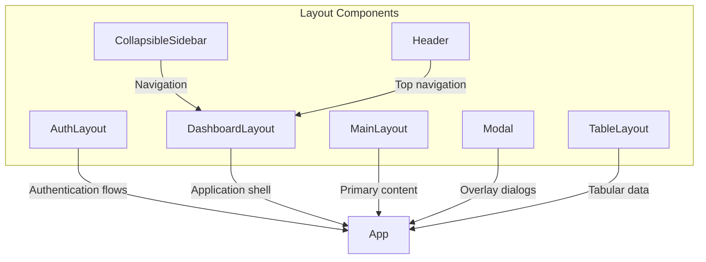
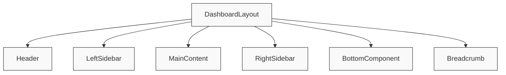
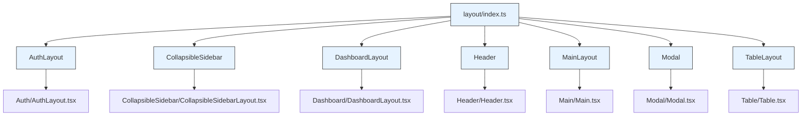

# Layout Components

<cite>
**Referenced Files in This Document**   
- [AuthLayout.tsx](file://packages/ui/src/components/layout/Auth/AuthLayout.tsx)
- [CollapsibleSidebarLayout.tsx](file://packages/ui/src/components/layout/CollapsibleSidebar/CollapsibleSidebarLayout.tsx)
- [DashboardLayout.tsx](file://packages/ui/src/components/layout/Dashboard/DashboardLayout.tsx)
- [Header.tsx](file://packages/ui/src/components/layout/Header/Header.tsx)
- [Main.tsx](file://packages/ui/src/components/layout/Main/Main.tsx)
- [Modal.tsx](file://packages/ui/src/components/layout/Modal/Modal.tsx)
- [Table.tsx](file://packages/ui/src/components/layout/Table/Table.tsx)
- [index.ts](file://packages/ui/src/components/layout/index.ts)
- [DashboardLayout.stories.tsx](file://packages/ui/src/components/layout/Dashboard/DashboardLayout.stories.tsx)
- [AuthLayout.stories.tsx](file://packages/ui/src/components/layout/Auth/AuthLayout.stories.tsx)
</cite>

## Table of Contents
1. [Introduction](#introduction)
2. [Layout Component Architecture](#layout-component-architecture)
3. [Component Details](#component-details)
4. [Responsive Design Patterns](#responsive-design-patterns)
5. [Composition and Usage](#composition-and-usage)
6. [Export Pattern](#export-pattern)
7. [Storybook Integration](#storybook-integration)
8. [Accessibility Considerations](#accessibility-considerations)
9. [Conclusion](#conclusion)

## Introduction
The layout components in the prj-core's shared UI package provide structural containers that organize UI content and define application architecture. These components serve as foundational building blocks for creating consistent, responsive, and accessible user interfaces across different applications within the ecosystem. The layout system is designed to support various application types including authentication flows, dashboards, and data-intensive interfaces.

**Section sources**
- [index.ts](file://packages/ui/src/components/layout/index.ts)

## Layout Component Architecture
The layout components are organized in a modular architecture within the shared UI package, providing specialized containers for different UI patterns. Each component is designed as a pure function that renders provided components with appropriate structural styling and responsive behavior. The architecture follows a consistent pattern of accepting React nodes as props and composing them within predefined layout structures.

**Diagram sources**
- [index.ts](file://packages/ui/src/components/layout/index.ts)
- [DashboardLayout.tsx](file://packages/ui/src/components/layout/Dashboard/DashboardLayout.tsx)

**Section sources**
- [index.ts](file://packages/ui/src/components/layout/index.ts)

## Component Details

### Auth Layout
The AuthLayout component is designed for authentication flows, providing a responsive layout that adapts to different screen sizes. It supports a form component and an advertisement component, with the ability to display an image-based advertisement when no custom ad component is provided. On mobile devices, the layout stacks components vertically, while on desktop it displays them side by side.

**Section sources**
- [AuthLayout.tsx](file://packages/ui/src/components/layout/Auth/AuthLayout.tsx)

### Collapsible Sidebar
The CollapsibleSidebar component provides a navigation sidebar that can be toggled between collapsed and expanded states. It includes a header with parent menu information and a toggle button, with smooth transitions between states. The component accepts navigation items as children and supports icon integration through the renderLucideIcon utility.

**Section sources**
- [CollapsibleSidebarLayout.tsx](file://packages/ui/src/components/layout/CollapsibleSidebar/CollapsibleSidebarLayout.tsx)

### Dashboard Layout
The DashboardLayout component implements a comprehensive application shell with multiple configurable regions. It supports header, left sidebar, right sidebar, bottom navigation, breadcrumb, and main content areas. The layout is responsive, with the right sidebar and bottom component adapting to different breakpoints (hidden on mobile, visible on desktop).

**Diagram sources**
- [DashboardLayout.tsx](file://packages/ui/src/components/layout/Dashboard/DashboardLayout.tsx)

**Section sources**
- [DashboardLayout.tsx](file://packages/ui/src/components/layout/Dashboard/DashboardLayout.tsx)

### Header
The Header component provides top navigation with flexible content placement. It supports left, center, and right content areas, allowing for logo placement, navigation menus, and user controls. The component uses a Navbar from the UI library with backdrop blur effects and border styling for visual separation.

**Section sources**
- [Header.tsx](file://packages/ui/src/components/layout/Header/Header.tsx)

### Main Layout
The MainLayout component serves as a container for primary content areas. It wraps content in a VStack (vertical stack) with consistent padding, border, and rounded corners. This component provides visual distinction for main content while maintaining alignment with the overall design system.

**Section sources**
- [Main.tsx](file://packages/ui/src/components/layout/Main/Main.tsx)

### Modal
The Modal component provides an overlay dialog system built on top of a base modal implementation. It accepts header, body, and footer props with their respective configuration options, allowing for flexible modal content composition. The modal is configured with inside scroll behavior and a large size by default.

**Section sources**
- [Modal.tsx](file://packages/ui/src/components/layout/Modal/Modal.tsx)

### Table Layout
The TableLayout component provides a container for tabular data presentations. It wraps content in a VStack with consistent padding, ensuring proper spacing and alignment for table components. This layout component helps maintain visual consistency across different table implementations.

**Section sources**
- [Table.tsx](file://packages/ui/src/components/layout/Table/Table.tsx)

## Responsive Design Patterns
The layout components implement responsive design patterns using CSS classes and conditional rendering based on screen size. The DashboardLayout, for example, uses the following responsive behavior:
- Desktop (≥1280px): Full 3-column layout with header, left sidebar, main content, and right sidebar
- Tablet/Mobile (<1280px): Header, main content, and bottom component (right sidebar hidden)
- Mobile-specific bottom navigation is hidden on desktop via the xl:hidden class

The AuthLayout also demonstrates responsive behavior:
- Mobile: Form component displayed in a single column
- Desktop: Form and advertisement components displayed side by side

These responsive patterns ensure optimal user experience across different device types and screen sizes.

**Section sources**
- [DashboardLayout.tsx](file://packages/ui/src/components/layout/Dashboard/DashboardLayout.tsx)
- [AuthLayout.tsx](file://packages/ui/src/components/layout/Auth/AuthLayout.tsx)

## Composition and Usage
The layout components are designed to be composed together to create complete application views. For example, a typical dashboard view might combine the DashboardLayout with Header, CollapsibleSidebar, and MainLayout components. The components use flexbox and grid layouts to create flexible, responsive structures that adapt to content and screen size.

Integration with routing is achieved by passing route-specific components as props to the layout components. For instance, breadcrumb navigation can be passed to the DashboardLayout, while specific form components can be passed to the AuthLayout based on the current route.

**Section sources**
- [DashboardLayout.tsx](file://packages/ui/src/components/layout/Dashboard/DashboardLayout.tsx)
- [AuthLayout.tsx](file://packages/ui/src/components/layout/Auth/AuthLayout.tsx)

## Export Pattern
The layout components follow a consistent export pattern through the index.ts file, which re-exports all layout components from their respective modules. This barrel file pattern simplifies imports for consumers of the library, allowing them to import components directly from the layout directory without needing to specify individual file paths.

**Diagram sources**
- [index.ts](file://packages/ui/src/components/layout/index.ts)

**Section sources**
- [index.ts](file://packages/ui/src/components/layout/index.ts)

## Storybook Integration
The layout components are integrated with Storybook for visual testing and documentation. Each component has corresponding stories that demonstrate different states and usage patterns. The stories allow developers to preview components in isolation and verify their appearance and behavior across different configurations.

The Storybook integration supports component-driven development by providing a living style guide that showcases the layout components and their various configurations, making it easier for teams to understand and use the components consistently.

**Section sources**
- [DashboardLayout.stories.tsx](file://packages/ui/src/components/layout/Dashboard/DashboardLayout.stories.tsx)
- [AuthLayout.stories.tsx](file://packages/ui/src/components/layout/Auth/AuthLayout.stories.tsx)

## Accessibility Considerations
The layout components incorporate several accessibility features:
- The Modal component includes proper focus management and ARIA attributes
- The CollapsibleSidebar provides appropriate aria-labels for the toggle button
- Semantic HTML elements are used where appropriate (e.g., header, main, aside)
- Landmark roles are implicitly provided through proper element usage
- Keyboard navigation is supported through the underlying UI library components
- Sufficient color contrast is maintained in the default styling

These accessibility considerations ensure that applications built with these layout components are usable by people with various disabilities and assistive technologies.

**Section sources**
- [Modal.tsx](file://packages/ui/src/components/layout/Modal/Modal.tsx)
- [CollapsibleSidebarLayout.tsx](file://packages/ui/src/components/layout/CollapsibleSidebar/CollapsibleSidebarLayout.tsx)

## Conclusion
The layout components in the prj-core shared UI package provide a robust foundation for building consistent, responsive, and accessible user interfaces. By offering specialized containers for different UI patterns, these components enable rapid development of applications while maintaining design consistency across the ecosystem. The modular architecture, responsive design patterns, and Storybook integration make these components easy to use and maintain, supporting both current and future application requirements.