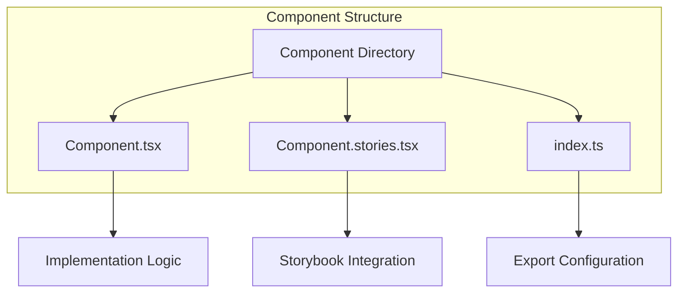
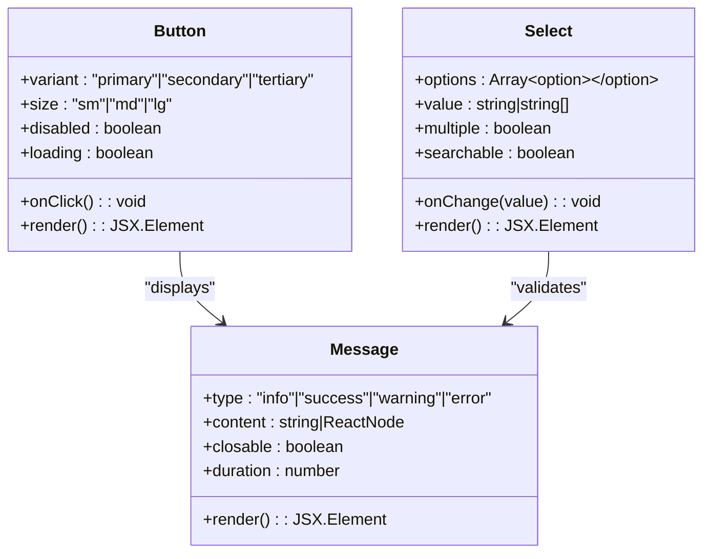
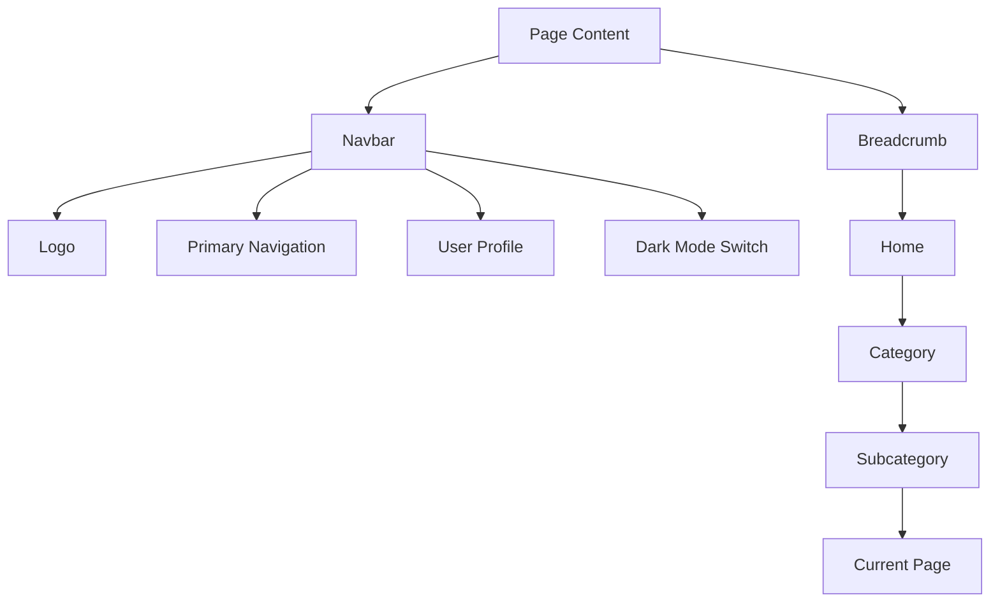
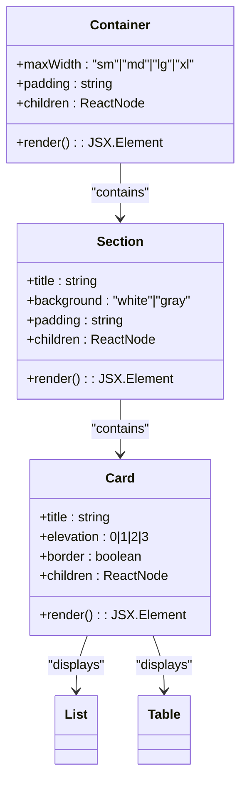
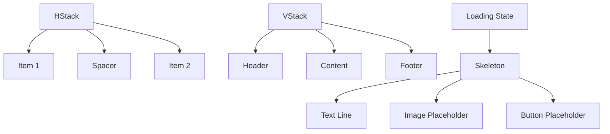
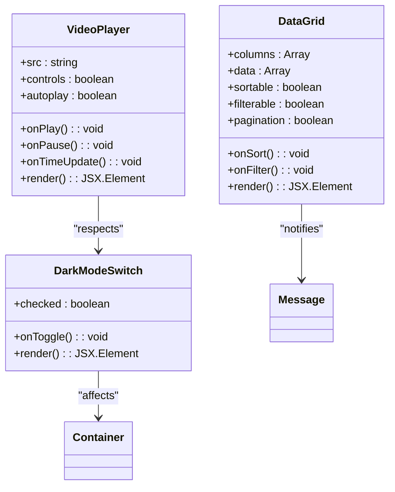
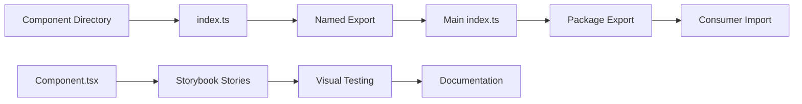
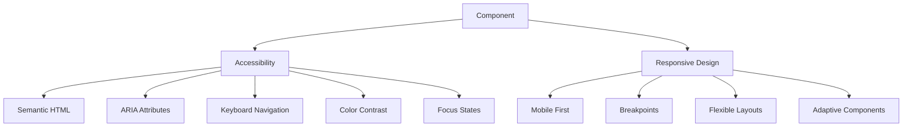
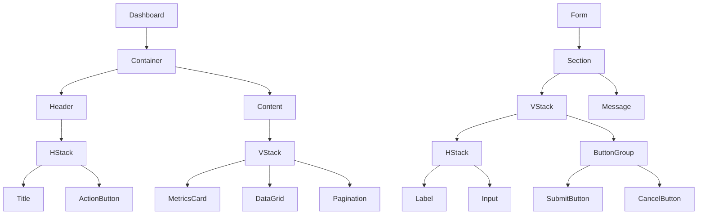

# UI Components

<cite>
**Referenced Files in This Document**   
- [index.ts](file://packages/ui/src/components/ui/index.ts)
- [Button.tsx](file://packages/ui/src/components/ui/Button/Button.tsx)
- [Button.stories.tsx](file://packages/ui/src/components/ui/Button/Button.stories.tsx)
- [Select.tsx](file://packages/ui/src/components/ui/Select/Select.tsx)
- [Select.stories.tsx](file://packages/ui/src/components/ui/Select/Select.stories.tsx)
- [Navbar.tsx](file://packages/ui/src/components/ui/Navbar/Navbar.tsx)
- [Navbar.stories.tsx](file://packages/ui/src/components/ui/Navbar/Navbar.stories.tsx)
- [Card.tsx](file://packages/ui/src/components/ui/Card/Card.tsx)
- [Card.stories.tsx](file://packages/ui/src/components/ui/Card/Card.stories.tsx)
- [HStack.tsx](file://packages/ui/src/components/ui/HStack/HStack.tsx)
- [VStack.tsx](file://packages/ui/src/components/ui/VStack/VStack.tsx)
- [DarkModeSwitch.tsx](file://packages/ui/src/components/ui/DarkModeSwitch/DarkModeSwitch.tsx)
- [DataGrid.tsx](file://packages/ui/src/components/ui/DataGrid/DataGrid.tsx)
- [Table.tsx](file://packages/ui/src/components/ui/Table/Table.tsx)
- [VideoPlayer.tsx](file://packages/ui/src/components/ui/VideoPlayer/VideoPlayer.tsx)
- [package.json](file://packages/ui/package.json)
</cite>

## Table of Contents
1. [Introduction](#introduction)
2. [Component Architecture](#component-architecture)
3. [Interactive Elements](#interactive-elements)
4. [Navigation Components](#navigation-components)
5. [Content Containers](#content-containers)
6. [Layout Helpers](#layout-helpers)
7. [Specialized Components](#specialized-components)
8. [Export Pattern and Integration](#export-pattern-and-integration)
9. [Accessibility and Responsive Design](#accessibility-and-responsive-design)
10. [Component Composition Examples](#component-composition-examples)

## Introduction
The UI components package serves as the foundational building block for user interface construction across the prj-core ecosystem. This comprehensive library provides a rich collection of reusable components organized into logical categories, enabling consistent and efficient UI development. The components are designed with modularity, accessibility, and responsiveness in mind, following modern React patterns and best practices.

**Section sources**
- [index.ts](file://packages/ui/src/components/ui/index.ts)
- [package.json](file://packages/ui/package.json)

## Component Architecture
The UI component library follows a well-structured architecture with components organized in a logical hierarchy. Each component resides in its own directory with a consistent structure that includes the main component file, stories for visual testing, and an index file for exports. The architecture promotes separation of concerns and makes components easy to locate, understand, and maintain.

**Diagram sources**
- [Button.tsx](file://packages/ui/src/components/ui/Button/Button.tsx)
- [Button.stories.tsx](file://packages/ui/src/components/ui/Button/Button.stories.tsx)
- [index.ts](file://packages/ui/src/components/ui/index.ts)

**Section sources**
- [index.ts](file://packages/ui/src/components/ui/index.ts)

## Interactive Elements
Interactive elements form the core of user engagement in the UI component library. These components handle user input and provide immediate feedback, creating a responsive and intuitive interface.

### Button and ButtonGroup
The Button component provides a versatile interactive element with multiple variants, sizes, and states. It supports primary, secondary, and tertiary styles, as well as loading and disabled states. The ButtonGroup component allows for logical grouping of related buttons, maintaining consistent spacing and visual hierarchy.

### Select and Input Components
The Select component offers a customizable dropdown interface with support for single and multiple selection modes. It includes features like search filtering, loading states, and custom rendering of options. The component library also includes various input components such as Textarea, Checkbox, RadioGroup, and Switch, each designed with accessibility and user experience as priorities.

**Diagram sources**
- [Button.tsx](file://packages/ui/src/components/ui/Button/Button.tsx)
- [Select.tsx](file://packages/ui/src/components/ui/Select/Select.tsx)
- [Message.tsx](file://packages/ui/src/components/ui/Message/Message.tsx)

**Section sources**
- [Button.tsx](file://packages/ui/src/components/ui/Button/Button.tsx)
- [Button.stories.tsx](file://packages/ui/src/components/ui/Button/Button.stories.tsx)
- [Select.tsx](file://packages/ui/src/components/ui/Select/Select.tsx)
- [Select.stories.tsx](file://packages/ui/src/components/ui/Select/Select.stories.tsx)

## Navigation Components
Navigation components provide the structural framework for moving through the application and understanding the user's current location within the information architecture.

### Navbar and NavbarItem
The Navbar component creates a horizontal navigation bar typically placed at the top of the application. It contains NavbarItem components that represent individual navigation destinations. The Navbar supports responsive behavior, collapsing into a hamburger menu on smaller screens.

### Breadcrumb
The Breadcrumb component shows the user's current location within a hierarchical structure, typically displayed below the navbar. It provides clickable links to parent pages, allowing users to navigate upward in the information hierarchy with a single click.

**Diagram sources**
- [Navbar.tsx](file://packages/ui/src/components/ui/Navbar/Navbar.tsx)
- [NavbarItem.tsx](file://packages/ui/src/components/ui/NavbarItem/NavbarItem.tsx)

**Section sources**
- [Navbar.tsx](file://packages/ui/src/components/ui/Navbar/Navbar.tsx)
- [Navbar.stories.tsx](file://packages/ui/src/components/ui/Navbar/Navbar.stories.tsx)

## Content Containers
Content containers provide the structural framework for organizing and presenting information in a clear and visually appealing manner.

### Container, Section, and Card
The Container component establishes the maximum width for content and provides consistent horizontal padding across the application. The Section component groups related content with appropriate spacing and optional background styling. The Card component presents information in a bordered container with padding, often used for displaying summaries or related data points.

### List and Table
The List component displays a collection of items in a vertical arrangement, supporting various item types and interactions. The Table component presents structured data in rows and columns, with features like sorting, filtering, and pagination.

**Diagram sources**
- [Container.tsx](file://packages/ui/src/components/ui/Container/Container.tsx)
- [Section.tsx](file://packages/ui/src/components/ui/Section/Section.tsx)
- [Card.tsx](file://packages/ui/src/components/ui/Card/Card.tsx)
- [List.tsx](file://packages/ui/src/components/ui/List/List.tsx)
- [Table.tsx](file://packages/ui/src/components/ui/Table/Table.tsx)

**Section sources**
- [Container.tsx](file://packages/ui/src/components/ui/Container/Container.tsx)
- [Section.tsx](file://packages/ui/src/components/ui/Section/Section.tsx)
- [Card.tsx](file://packages/ui/src/components/ui/Card/Card.tsx)
- [Card.stories.tsx](file://packages/ui/src/components/ui/Card/Card.stories.tsx)

## Layout Helpers
Layout helpers provide flexible tools for arranging components and creating responsive interfaces without writing custom CSS.

### HStack and VStack
The HStack (Horizontal Stack) and VStack (Vertical Stack) components create flexible containers that align their children in horizontal and vertical arrangements respectively. They support configurable spacing, alignment, and distribution of child elements.

### Spacer and Skeleton
The Spacer component creates flexible space between elements in a stack, pushing adjacent elements to the edges. The Skeleton component provides loading state placeholders that mimic the shape and size of content before it loads, improving perceived performance.

**Diagram sources**
- [HStack.tsx](file://packages/ui/src/components/ui/HStack/HStack.tsx)
- [VStack.tsx](file://packages/ui/src/components/ui/VStack/VStack.tsx)
- [Skeleton.tsx](file://packages/ui/src/components/ui/Skeleton/Skeleton.tsx)

**Section sources**
- [HStack.tsx](file://packages/ui/src/components/ui/HStack/HStack.tsx)
- [VStack.tsx](file://packages/ui/src/components/ui/VStack/VStack.tsx)
- [Spacer.tsx](file://packages/ui/src/components/ui/Spacer/Spacer.tsx)
- [Skeleton.tsx](file://packages/ui/src/components/ui/Skeleton/Skeleton.tsx)

## Specialized Components
Specialized components address specific use cases and provide enhanced functionality beyond basic UI elements.

### Avatar, Chip, and Logo
The Avatar component displays user profile images with support for fallback initials and various sizes. The Chip component represents compact pieces of information, often used for tags or contact representations. The Logo component displays the application logo with consistent sizing and spacing.

### DataGrid and VideoPlayer
The DataGrid component provides an advanced table interface with features like column resizing, sorting, filtering, and virtualized rendering for large datasets. The VideoPlayer component offers a customizable video playback interface with controls for play, pause, volume, and fullscreen.

### DarkModeSwitch and SplashScreen
The DarkModeSwitch component allows users to toggle between light and dark color schemes, with persistent preference storage. The SplashScreen component displays a branded loading screen during application startup or transitions.

**Diagram sources**
- [DataGrid.tsx](file://packages/ui/src/components/ui/DataGrid/DataGrid.tsx)
- [VideoPlayer.tsx](file://packages/ui/src/components/ui/VideoPlayer/VideoPlayer.tsx)
- [DarkModeSwitch.tsx](file://packages/ui/src/components/ui/DarkModeSwitch/DarkModeSwitch.tsx)

**Section sources**
- [DataGrid.tsx](file://packages/ui/src/components/ui/DataGrid/DataGrid.tsx)
- [DataGrid.stories.tsx](file://packages/ui/src/components/ui/DataGrid/DataGrid.stories.tsx)
- [VideoPlayer.tsx](file://packages/ui/src/components/ui/VideoPlayer/VideoPlayer.tsx)
- [DarkModeSwitch.tsx](file://packages/ui/src/components/ui/DarkModeSwitch/DarkModeSwitch.tsx)

## Export Pattern and Integration
The UI component library follows a consistent export pattern that enables easy importing and tree-shaking. The main index.ts file re-exports all components, allowing consumers to import directly from the package root.

### Index Export Pattern
The index.ts file in the ui directory uses named exports to expose all components, making them available for import in consuming applications. This pattern supports both default and named imports, providing flexibility for different use cases.

### Storybook Integration
Each component includes Storybook stories that demonstrate its various states, variants, and usage patterns. These stories serve as both documentation and a testing environment, allowing developers to visualize components in isolation.

**Diagram sources**
- [index.ts](file://packages/ui/src/components/ui/index.ts)
- [Button.stories.tsx](file://packages/ui/src/components/ui/Button/Button.stories.tsx)

**Section sources**
- [index.ts](file://packages/ui/src/components/ui/index.ts)

## Accessibility and Responsive Design
The UI component library prioritizes accessibility and responsive design to ensure an inclusive user experience across devices and assistive technologies.

### Accessibility Considerations
Components are designed with accessibility in mind, following WCAG guidelines. This includes proper semantic HTML usage, appropriate ARIA attributes, keyboard navigation support, and sufficient color contrast. Interactive elements have visible focus states, and screen reader users receive appropriate context.

### Responsive Patterns
The library implements responsive design patterns using a mobile-first approach. Components adapt their layout and behavior based on screen size, with breakpoints defined in the design system. Layout helpers like HStack and VStack automatically adjust their behavior on smaller screens.

**Diagram sources**
- [Button.tsx](file://packages/ui/src/components/ui/Button/Button.tsx)
- [HStack.tsx](file://packages/ui/src/components/ui/HStack/HStack.tsx)

**Section sources**
- [Button.tsx](file://packages/ui/src/components/ui/Button/Button.tsx)
- [HStack.tsx](file://packages/ui/src/components/ui/HStack/HStack.tsx)

## Component Composition Examples
The true power of the UI component library emerges when components are combined to create complex, cohesive interfaces. The following examples demonstrate common composition patterns.

### Dashboard Layout
A typical dashboard combines multiple components to present information effectively:
- Container sets the maximum width
- HStack organizes the header with title and action buttons
- VStack arranges sections vertically
- Cards display individual data points
- DataGrid presents tabular data
- Pagination controls data navigation

### Form Interface
A form interface combines interactive elements with layout helpers:
- Section groups related fields
- VStack arranges form elements vertically
- HStack aligns labels and inputs
- Spacer creates appropriate spacing
- ButtonGroup positions action buttons
- Message displays validation feedback

**Diagram sources**
- [Container.tsx](file://packages/ui/src/components/ui/Container/Container.tsx)
- [HStack.tsx](file://packages/ui/src/components/ui/HStack/HStack.tsx)
- [VStack.tsx](file://packages/ui/src/components/ui/VStack/VStack.tsx)
- [Card.tsx](file://packages/ui/src/components/ui/Card/Card.tsx)
- [DataGrid.tsx](file://packages/ui/src/components/ui/DataGrid/DataGrid.tsx)
- [Button.tsx](file://packages/ui/src/components/ui/Button/Button.tsx)
- [Message.tsx](file://packages/ui/src/components/ui/Message/Message.tsx)

**Section sources**
- [Container.tsx](file://packages/ui/src/components/ui/Container/Container.tsx)
- [HStack.tsx](file://packages/ui/src/components/ui/HStack/HStack.tsx)
- [VStack.tsx](file://packages/ui/src/components/ui/VStack/VStack.tsx)
- [Card.tsx](file://packages/ui/src/components/ui/Card/Card.tsx)
- [DataGrid.tsx](file://packages/ui/src/components/ui/DataGrid/DataGrid.tsx)
- [Button.tsx](file://packages/ui/src/components/ui/Button/Button.tsx)
- [Message.tsx](file://packages/ui/src/components/ui/Message/Message.tsx)