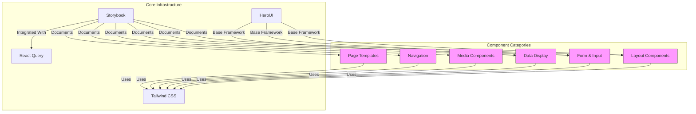
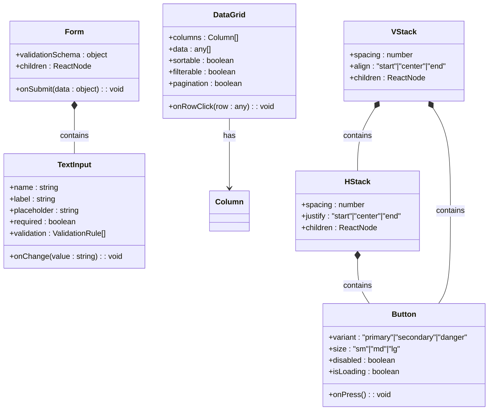
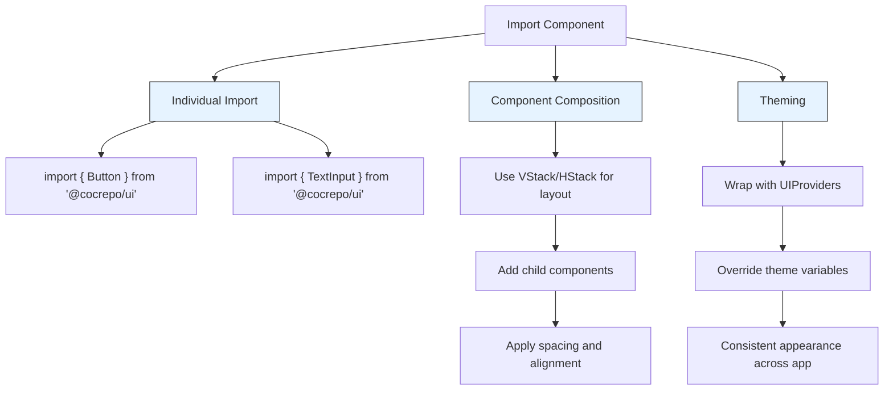
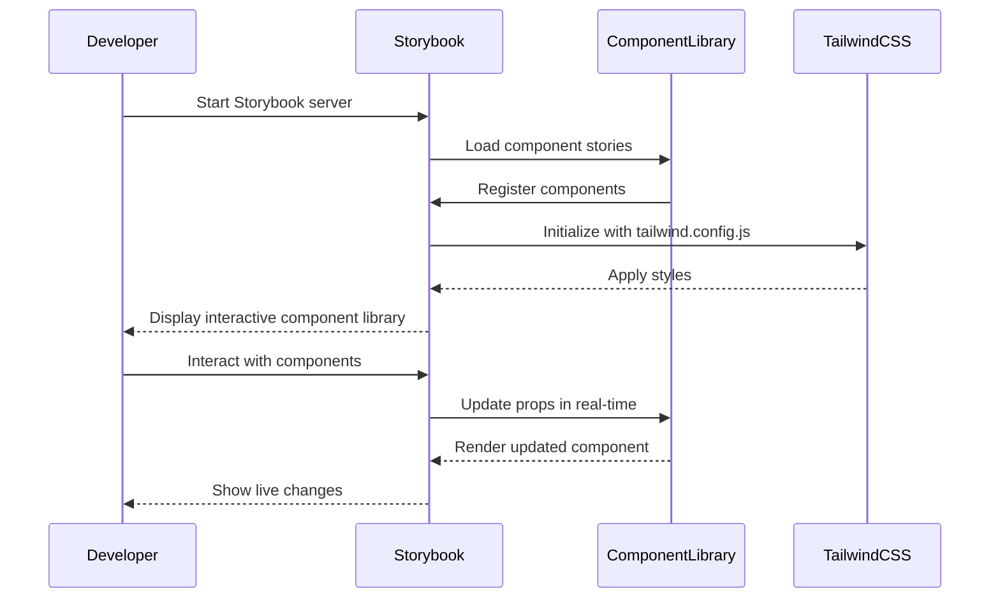

# Component Library

<cite>
**Referenced Files in This Document**   
- [README.md](file://packages/ui/README.md)
- [index.ts](file://packages/ui/index.ts)
- [main.js](file://apps/storybook/.storybook/main.js)
- [main.ts](file://apps/admin/.storybook/main.ts)
- [BooleanCell.tsx](file://packages/ui/src/components/cell/BooleanCell/BooleanCell.tsx)
- [LoginForm.tsx](file://packages/ui/src/components/form/LoginForm/LoginForm.tsx)
- [AutoComplete.tsx](file://packages/ui/src/components/inputs/AutoComplete/AutoComplete.tsx)
- [Button.tsx](file://packages/ui/src/components/ui/Button/Button.tsx)
- [DataGrid.tsx](file://packages/ui/src/components/ui/DataGrid/DataGrid.tsx)
- [VStack.tsx](file://packages/ui/src/components/ui/VStack/VStack.tsx)
- [HStack.tsx](file://packages/ui/src/components/ui/HStack/HStack.tsx)
- [Section.tsx](file://packages/ui/src/components/layout/Section/Section.tsx)
- [Navbar.tsx](file://packages/ui/src/components/layout/Navbar/Navbar.tsx)
- [AdminAuthLoginPage.tsx](file://packages/ui/src/components/page/AdminAuthLoginPage.tsx)
</cite>

## Table of Contents
1. [Introduction](#introduction)
2. [Architecture Overview](#architecture-overview)
3. [Core Components](#core-components)
4. [Usage Patterns](#usage-patterns)
5. [Theming System](#theming-system)
6. [Accessibility Features](#accessibility-features)
7. [Responsive Design Patterns](#responsive-design-patterns)
8. [Storybook Integration](#storybook-integration)
9. [Performance Considerations](#performance-considerations)
10. [Troubleshooting Guide](#troubleshooting-guide)

## Introduction

The component library in prj-core serves as a shared UI component system designed to maintain visual and functional consistency across all applications within the monorepo. Built on top of HeroUI and Tailwind CSS, this library provides a comprehensive collection of reusable React components that follow modern design patterns and accessibility standards. The library is structured to support both mobile and desktop experiences with a mobile-first approach, ensuring consistent user experiences across devices.

The component library is published under the `@cocrepo/ui` package name and is consumed by various applications including admin, mobile, and server interfaces. It follows a composable architecture where simple components can be combined to create complex UIs, promoting reusability and maintainability. The library includes form management components with built-in validation, advanced data display components like DataGrid, and media components for handling video and image content.

**Section sources**
- [README.md](file://packages/ui/README.md)

## Architecture Overview

The component library follows a modular architecture with components organized into logical categories based on their functionality. This structure enables easy discovery and import of components while maintaining separation of concerns. The architecture is designed to be tree-shakeable, ensuring that applications only bundle the components they actually use, which optimizes bundle size and performance.

**Diagram sources**
- [README.md](file://packages/ui/README.md)
- [index.ts](file://packages/ui/src/components/index.ts)

**Section sources**
- [README.md](file://packages/ui/README.md)
- [index.ts](file://packages/ui/src/components/index.ts)

## Core Components

The component library contains several key component categories that address different UI needs. Layout components such as VStack, HStack, Section, and Navbar provide the structural foundation for applications. Form and input components including TextInput, SelectInput, DateInput, and FileInput offer comprehensive form management capabilities with built-in validation. Data display components like DataGrid, Chip, and Message enable effective presentation of information, while media components such as VideoPlayer and SortableMedia handle rich media content.

The library also includes pre-built page templates for common scenarios such as authentication pages (Login, TenantSelect) and admin dashboard layouts. These page components combine various UI elements into cohesive experiences, accelerating development of standard application screens. All components are fully typed with TypeScript, providing excellent developer experience with autocomplete and type checking.

**Diagram sources**
- [Button.tsx](file://packages/ui/src/components/ui/Button/Button.tsx)
- [TextInput.tsx](file://packages/ui/src/components/inputs/Input/Input.tsx)
- [DataGrid.tsx](file://packages/ui/src/components/ui/DataGrid/DataGrid.tsx)
- [Form.tsx](file://packages/ui/src/components/form/Form/Form.tsx)
- [VStack.tsx](file://packages/ui/src/components/ui/VStack/VStack.tsx)
- [HStack.tsx](file://packages/ui/src/components/ui/HStack/HStack.tsx)

**Section sources**
- [README.md](file://packages/ui/README.md)
- [index.ts](file://packages/ui/src/components/index.ts)

## Usage Patterns

The component library supports several key usage patterns that promote consistency and efficiency across applications. Components can be imported individually to minimize bundle size, following tree-shaking best practices. The library provides both standalone components and composite patterns where multiple components work together to create complex UIs.

For layout construction, the library offers VStack and HStack components that create vertical and horizontal stacks respectively, with configurable spacing and alignment. These components serve as the foundation for responsive layouts that adapt to different screen sizes. The Section component provides consistent page section styling with appropriate padding and margins, while the Navbar component offers a standardized navigation experience.

**Diagram sources**
- [VStack.tsx](file://packages/ui/src/components/ui/VStack/VStack.tsx)
- [HStack.tsx](file://packages/ui/src/components/ui/HStack/HStack.tsx)
- [Section.tsx](file://packages/ui/src/components/layout/Section/Section.tsx)
- [Navbar.tsx](file://packages/ui/src/components/layout/Navbar/Navbar.tsx)

**Section sources**
- [README.md](file://packages/ui/README.md)
- [index.ts](file://packages/ui/index.ts)

## Theming System

The component library implements a comprehensive theming system using Tailwind CSS that allows for consistent styling across all applications. The theme is configured through Tailwind's configuration system, providing a design system with defined color palettes, spacing scales, typography rules, and component variants. Applications can extend or override the default theme to match specific branding requirements while maintaining overall consistency.

The theming system supports both light and dark modes, with components automatically adapting their appearance based on the user's preferred color scheme. Theme variables are defined for colors (primary, secondary, danger, etc.), spacing (using a consistent scale), typography (font families, sizes, weights), and component-specific styles (button variants, input appearances). This ensures that all components have a cohesive look and feel while allowing for necessary variations.

The UIProviders component wraps the application and injects the theme context, making theme values available to all components. This provider system also integrates with React Query for data fetching and other UI-related contexts, creating a unified provider stack for the application.

**Section sources**
- [README.md](file://packages/ui/README.md)
- [tailwind.config.js](file://apps/storybook/tailwind.css)

## Accessibility Features

The component library prioritizes accessibility, ensuring that all components comply with WCAG 2.1 AA standards. Each component is designed with keyboard navigation support, proper focus management, and appropriate ARIA labels and roles. Screen reader compatibility is a core requirement, with semantic HTML elements used wherever possible to provide meaningful structure to assistive technologies.

Interactive components such as buttons, form inputs, and navigation elements include proper keyboard event handling, allowing users to navigate and interact with the interface using only a keyboard. Focus indicators are clearly visible and follow consistent patterns across components. Form components provide accessible error messages and validation feedback, ensuring users understand how to correct input errors.

The library also supports high contrast modes and respects user preferences for reduced motion. Components that include animations use the prefers-reduced-motion media query to disable or simplify animations when requested by the user. This comprehensive approach to accessibility ensures that applications built with the component library are usable by the widest possible audience.

**Section sources**
- [README.md](file://packages/ui/README.md)
- [Button.tsx](file://packages/ui/src/components/ui/Button/Button.tsx)
- [TextInput.tsx](file://packages/ui/src/components/inputs/Input/Input.tsx)

## Responsive Design Patterns

The component library implements responsive design patterns using a mobile-first approach, ensuring optimal user experiences across devices of all sizes. The layout system is built on Flexbox and CSS Grid principles, with components like VStack and HStack providing flexible container options that adapt to available space.

Breakpoints are defined in the constants package and used consistently throughout the library, enabling responsive behavior at specific screen widths. The library supports common breakpoints for mobile, tablet, and desktop views, with components able to adjust their layout, spacing, and functionality based on the current viewport size.

For complex layouts, the library provides responsive grid systems and container components that automatically adjust their behavior. Data display components like DataGrid switch to a card-based layout on smaller screens, while navigation components transform from horizontal menus to hamburger-style menus. This adaptive approach ensures that applications remain usable and visually appealing regardless of the device being used.

**Section sources**
- [README.md](file://packages/ui/README.md)
- [constants/README.md](file://packages/constants/README.md)
- [VStack.tsx](file://packages/ui/src/components/ui/VStack/VStack.tsx)

## Storybook Integration

The component library is integrated with Storybook, providing a comprehensive documentation and development environment for UI components. Storybook is configured in both the dedicated storybook application and individual applications like admin, allowing developers to view and interact with components in isolation.

The Storybook configuration in the storybook app includes specific stories for components from the shared-frontend package, with the stories path configured to include "../../../packages/shared-frontend/src/**/*.stories.@(js|jsx|mjs|ts|tsx)". This setup enables centralized documentation of all shared components while allowing individual applications to also document their specific component usage.

Storybook addons enhance the development experience with features like accessibility testing (addon-a11y), documentation generation (addon-docs), and visual testing (chromatic-com/storybook). The Vite build configuration includes Tailwind CSS integration, ensuring that components render with the correct styles in the Storybook environment.

**Diagram sources**
- [main.js](file://apps/storybook/.storybook/main.js)
- [main.ts](file://apps/admin/.storybook/main.ts)
- [tailwind.css](file://apps/storybook/tailwind.css)

**Section sources**
- [main.js](file://apps/storybook/.storybook/main.js)
- [main.ts](file://apps/admin/.storybook/main.ts)

## Performance Considerations

The component library is designed with performance as a key consideration, implementing several optimization strategies to ensure fast rendering and minimal bundle sizes. The library is fully tree-shakeable, meaning that applications only include the components they actually import, reducing overall bundle size.

Components are implemented with React best practices, including memoization of functional components, useCallback for event handlers, and useMemo for expensive calculations. This prevents unnecessary re-renders and improves application performance, especially in complex UIs with many interactive elements.

The library leverages CSS-in-JS with minimal runtime overhead, using Tailwind CSS's utility-first approach to generate highly optimized CSS. This results in smaller CSS bundles and faster style application compared to traditional CSS-in-JS solutions. The build process includes tree-shaking and minification, further optimizing the final bundle size.

For data-intensive components like DataGrid, the library implements virtualization to only render visible rows, significantly improving performance when displaying large datasets. Images and media are lazy-loaded by default, reducing initial page load times and bandwidth usage.

**Section sources**
- [README.md](file://packages/ui/README.md)
- [DataGrid.tsx](file://packages/ui/src/components/ui/DataGrid/DataGrid.tsx)
- [package.json](file://packages/ui/package.json)

## Troubleshooting Guide

When working with the component library, several common issues may arise that can be addressed through specific troubleshooting steps. If components are not rendering correctly, verify that the UIProviders wrapper is properly implemented in the application root, as this provides necessary context for styling and functionality.

For styling issues, ensure that Tailwind CSS is properly configured and that the global styles are imported in the application entry point. Missing styles often result from incorrect Tailwind configuration or missing imports of the global styles file.

If encountering TypeScript errors, verify that the correct version of the component library is installed and that the TypeScript configuration is compatible. The library provides comprehensive type definitions, but version mismatches can cause type resolution issues.

For performance problems with data-intensive components, check that virtualization is enabled and that data is properly formatted for the component's expectations. Large datasets should be paginated or virtualized to maintain smooth scrolling and interaction.

When components don't respond to user interaction, verify that event handlers are correctly bound and that there are no parent components intercepting events. Accessibility issues can often be diagnosed using the Storybook a11y addon, which highlights potential problems with keyboard navigation, focus management, and ARIA attributes.

**Section sources**
- [README.md](file://packages/ui/README.md)
- [UIProviders.tsx](file://packages/ui/src/provider/UIProviders/UIProviders.tsx)
- [tailwind.config.js](file://apps/storybook/tailwind.css)