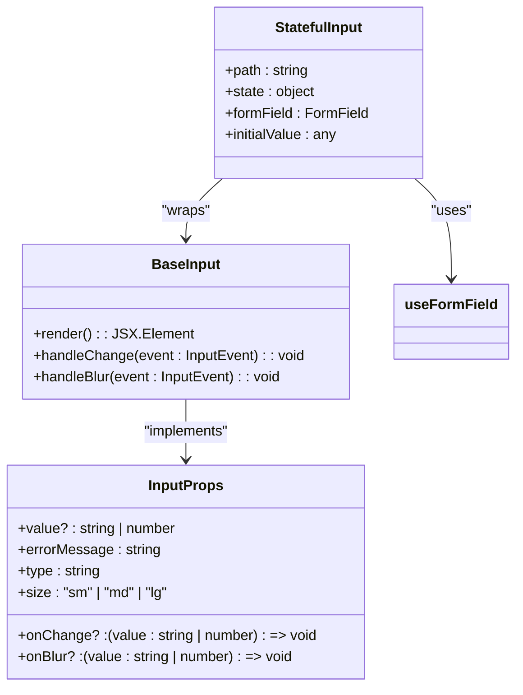
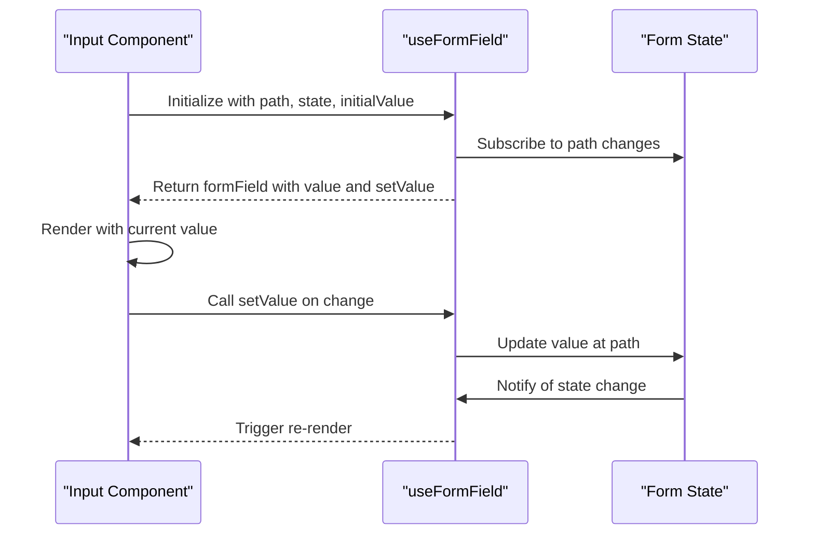
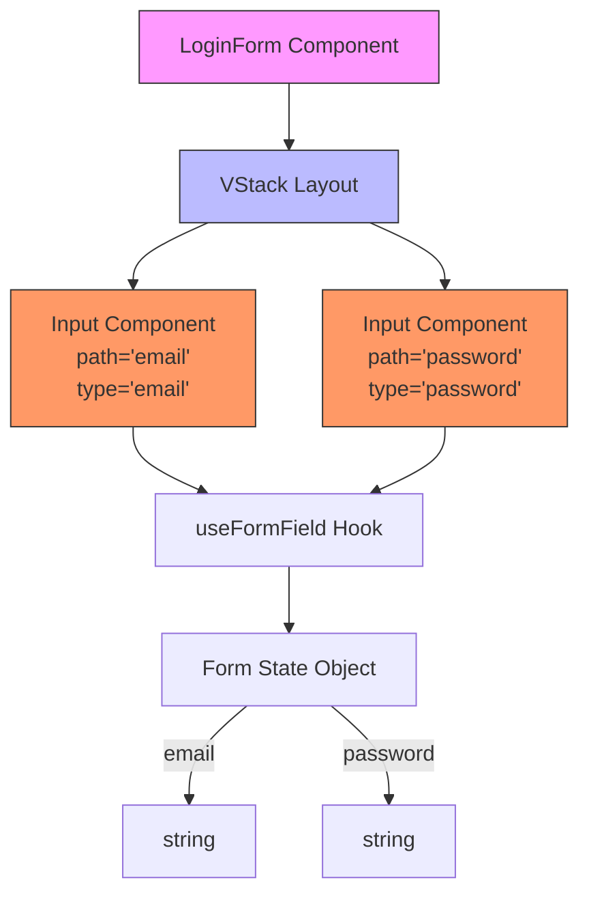

# Form Components

<cite>
**Referenced Files in This Document**   
- [Input.tsx](file://packages/ui/src/components/inputs/Input/Input.tsx)
- [index.tsx](file://packages/ui/src/components/inputs/Input/index.tsx)
- [LoginForm.tsx](file://packages/ui/src/components/form/LoginForm/LoginForm.tsx)
- [Form.ts](file://packages/toolkit/src/Form.ts)
- [useFormField.ts](file://packages/hooks/src/useFormField.ts)
- [Checkbox.tsx](file://packages/ui/src/components/inputs/Checkbox/Checkbox.tsx)
- [RadioGroup.tsx](file://packages/ui/src/components/inputs/RadioGroup/RadioGroup.tsx)
- [Textarea.tsx](file://packages/ui/src/components/inputs/Textarea/Textarea.tsx)
</cite>

## Table of Contents
1. [Introduction](#introduction)
2. [Core Form Components](#core-form-components)
3. [Form State Management](#form-state-management)
4. [Validation System](#validation-system)
5. [LoginForm Implementation](#loginform-implementation)
6. [Accessibility and ARIA Support](#accessibility-and-aria-support)
7. [Styling and Visual States](#styling-and-visual-states)
8. [Controlled vs Uncontrolled Patterns](#controlled-vs-uncontrolled-patterns)
9. [Responsive Form Layout](#responsive-form-layout)
10. [Extending Form Components](#extending-form-components)

## Introduction
This document provides comprehensive documentation for the form components within the prj-core's shared-frontend package. The form system is designed to provide a consistent, accessible, and reusable set of input components that integrate seamlessly with MobX state management. The components follow a pattern of wrapping base UI elements with state-aware functionality, enabling developers to build robust forms with minimal boilerplate code. This documentation covers the architecture, implementation details, and usage patterns for core form controls including Input, Checkbox, RadioGroup, and Textarea, along with their integration in composite components like LoginForm.

## Core Form Components

The shared-frontend package provides a suite of form input components designed for consistency and reusability. Each component follows a similar architectural pattern: a base UI component wrapped with state management functionality.

### Input Component Architecture
The Input component is structured in a layered architecture with two main files:
1. **Base Input**: Implements the visual and interactive aspects of the input field
2. **State-aware Input**: Wraps the base component with form state integration

The component supports various input types (text, email, password, number) and provides consistent styling through the "size" and "variant" props. It handles value transformation for number inputs automatically, converting string values to numbers when appropriate.



**Diagram sources**
- [Input.tsx](file://packages/ui/src/components/inputs/Input/Input.tsx#L7-L54)
- [index.tsx](file://packages/ui/src/components/inputs/Input/index.tsx#L7-L38)

**Section sources**
- [Input.tsx](file://packages/ui/src/components/inputs/Input/Input.tsx)
- [index.tsx](file://packages/ui/src/components/inputs/Input/index.tsx)

### Checkbox Component
The Checkbox component provides a controlled input for boolean values. It integrates with the form state system through the same useFormField hook used by other input components. The component handles both visual rendering and state synchronization, ensuring that the checked state is properly reflected in the form's state object.

**Section sources**
- [Checkbox.tsx](file://packages/ui/src/components/inputs/Checkbox/Checkbox.tsx)

### RadioGroup Component
The RadioGroup component manages a set of related radio inputs, ensuring that only one option can be selected at a time. It provides a grouping mechanism that maintains the relationship between individual radio buttons while still allowing each to integrate with the form state system.

**Section sources**
- [RadioGroup.tsx](file://packages/ui/src/components/inputs/RadioGroup/RadioGroup.tsx)

### Textarea Component
The Textarea component extends the input pattern to multi-line text entry. It follows the same state management pattern as the Input component but provides additional props for controlling rows and resize behavior. The component handles text input and synchronization with form state.

**Section sources**
- [Textarea.tsx](file://packages/ui/src/components/inputs/Textarea/Textarea.tsx)

## Form State Management

The form components utilize a centralized state management approach through MobX and a custom useFormField hook. This system enables reactive updates and maintains consistency across form elements.

### useFormField Hook
The useFormField hook is the core mechanism for connecting input components to form state. It provides a standardized interface for managing field values, validation, and state updates.



**Diagram sources**
- [index.tsx](file://packages/ui/src/components/inputs/Input/index.tsx#L16)
- [useFormField.ts](file://packages/hooks/src/useFormField.ts)

**Section sources**
- [index.tsx](file://packages/ui/src/components/inputs/Input/index.tsx)
- [useFormField.ts](file://packages/hooks/src/useFormField.ts)

### State Synchronization Pattern
The state management follows a path-based addressing system where each input component specifies its location within the form state object using a "path" prop. This enables:
- Deep property access (e.g., "user.profile.email")
- Automatic state binding without manual onChange handlers
- Consistent state updates across all form components

The pattern leverages MobX's reactivity system to ensure that state changes trigger immediate UI updates, providing a responsive user experience.

## Validation System

The form validation system is implemented across multiple layers, providing both client-side validation and error state management.

### Validation Rules Structure
Validation rules are defined as a configuration object that can include:
- Required field validation
- Minimum and maximum length constraints
- Numeric range validation
- Regular expression pattern matching
- Custom validation timing (onBlur, onChange, onFocus)

```mermaid
classDiagram
class Validation {
+timings : ("onBlur" | "onChange" | "onFocus")[]
+required : {value : boolean, message : string}
+minLength : {value : number, message : string}
+maxLength : {value : number, message : string}
+min : {value : number, message : string}
+max : {value : number, message : string}
+patterns : {value : RegExp | string, message : string}[]
}
class ValidationResult {
+isValid : boolean
+errorMessage? : string
}
class FormValidator {
+validateSingleField(value : any, validation : Validation) : ValidationResult
+validateFields(state : any, validationFields : Record<string, Validation>) : ValidationResult
}
FormValidator --> Validation : "uses"
FormValidator --> ValidationResult : "returns"
```

**Diagram sources**
- [Form.ts](file://packages/toolkit/src/Form.ts#L1-L96)

**Section sources**
- [Form.ts](file://packages/toolkit/src/Form.ts)

### Validation Execution Flow
The validation system follows a specific execution flow:
1. Validation rules are defined at the form or field level
2. Validation triggers based on specified timings (blur, change, focus)
3. Individual field validation occurs first
4. Field results are aggregated for form-level validation
5. Error messages are displayed in the UI

The system supports both synchronous validation (immediate feedback) and asynchronous validation (for server-side checks), though the current implementation focuses on client-side validation.

## LoginForm Implementation

The LoginForm component demonstrates how individual form controls are composed into a complete form interface.

### Component Composition
The LoginForm is a simple yet effective example of form composition using the shared input components:



**Diagram sources**
- [LoginForm.tsx](file://packages/ui/src/components/form/LoginForm/LoginForm.tsx#L1-L33)
- [index.tsx](file://packages/ui/src/components/inputs/Input/index.tsx)

**Section sources**
- [LoginForm.tsx](file://packages/ui/src/components/form/LoginForm/LoginForm.tsx)

### Usage Pattern
The LoginForm demonstrates the standard usage pattern for form components:
- Each input is bound to a specific path in the form state
- The form state is passed as a prop to all input components
- Visual properties (variant, placeholder, label) are configured per input
- Layout is managed by container components (VStack)

This pattern ensures consistency across forms while allowing for customization of individual fields.

## Accessibility and ARIA Support

The form components include built-in accessibility features to ensure compliance with WCAG standards.

### Label Association
Each input component automatically associates with its label through proper htmlFor/id pairing. When a label is provided via the "label" prop, the component generates a unique ID and links the label to the input element, enabling screen readers to properly identify form fields.

### Keyboard Navigation
The components support standard keyboard navigation:
- Tab key moves between form fields in logical order
- Enter key submits forms when focused on submit buttons
- Space bar toggles checkbox and radio button states
- Arrow keys navigate between radio button options

### ARIA Attributes
The components implement appropriate ARIA attributes:
- aria-invalid is set to true when a field has validation errors
- aria-describedby links to error message elements
- role attributes are used appropriately for complex input types
- aria-live regions could be implemented for dynamic error messages

**Section sources**
- [Input.tsx](file://packages/ui/src/components/inputs/Input/Input.tsx)
- [Checkbox.tsx](file://packages/ui/src/components/inputs/Checkbox/Checkbox.tsx)
- [RadioGroup.tsx](file://packages/ui/src/components/inputs/RadioGroup/RadioGroup.tsx)

## Styling and Visual States

The form components follow a consistent styling system with defined visual states for different conditions.

### State Visualization
The components display different visual states based on user interaction and validation results:
- **Default state**: Standard appearance when the field is untouched
- **Focus state**: Enhanced styling when the field has keyboard focus
- **Error state**: Distinct visual indicators when validation fails
- **Disabled state**: Reduced opacity and cursor changes when disabled

### Focus Management
Focus states are implemented with subtle visual enhancements:
- Border color changes
- Subtle shadow effects
- Optional animation transitions
- Consistent across all input types

The focus indicators meet WCAG 2.1 requirements for visibility and contrast.

### Error Visualization
Error states are communicated through multiple channels:
- Red border around the input field
- Error message displayed below the input
- Optional error icon
- ARIA attributes for screen readers

The error message area maintains consistent height even when no error is present, preventing layout shifts.

**Section sources**
- [Input.tsx](file://packages/ui/src/components/inputs/Input/Input.tsx)
- [Checkbox.tsx](file://packages/ui/src/components/inputs/Checkbox/Checkbox.tsx)

## Controlled vs Uncontrolled Patterns

The form components implement a controlled component pattern, which differs from uncontrolled components in several key ways.

### Controlled Component Advantages
The controlled pattern used by these components provides:
- Single source of truth in the form state
- Immediate access to current values
- Ability to validate on every change
- Easy integration with state management systems
- Consistent behavior across different input types

### Implementation Details
Each input component is fully controlled:
- The value is always read from the form state
- onChange handlers update the state rather than local component state
- The component re-renders whenever the state changes
- No internal state is maintained within the input component itself

This approach ensures that the UI always reflects the current state and that all state changes are tracked and predictable.

**Section sources**
- [index.tsx](file://packages/ui/src/components/inputs/Input/index.tsx)
- [Input.tsx](file://packages/ui/src/components/inputs/Input/Input.tsx)

## Responsive Form Layout

The form components are designed to work within responsive layouts that adapt to different screen sizes.

### Layout Components
The system includes layout components like VStack that help organize form elements:
- Vertical stacking on mobile devices
- Horizontal alignment options for desktop
- Full-width or constrained width options
- Spacing consistency between fields

### Responsive Behavior
The components respond to viewport changes:
- Input width adjusts to container size
- Label positioning may change based on screen size
- Error messages wrap appropriately
- Touch targets remain accessible on mobile

The responsive design follows mobile-first principles, ensuring usability across devices.

**Section sources**
- [LoginForm.tsx](file://packages/ui/src/components/form/LoginForm/LoginForm.tsx)
- [VStack.tsx](file://packages/ui/src/components/ui/VStack/VStack.tsx)

## Extending Form Components

The form component system is designed to be extensible for custom use cases.

### Custom Validation
Developers can extend the validation system by:
- Adding custom validation rules to the Validation object
- Implementing custom validation functions
- Integrating with external validation libraries
- Adding asynchronous validation for server-side checks

### Integration with Form Libraries
The components can be integrated with popular form libraries:
- React Hook Form through custom register functions
- Formik via custom field components
- Custom form libraries using the same state management patterns

The modular design allows for relatively straightforward integration with external form management solutions.

### Custom Input Types
New input types can be created by following the same architectural pattern:
1. Create a base UI component
2. Wrap it with state management using useFormField
3. Ensure consistent styling and accessibility
4. Implement proper validation integration

This pattern ensures that custom components maintain consistency with the existing form system.

**Section sources**
- [Form.ts](file://packages/toolkit/src/Form.ts)
- [useFormField.ts](file://packages/hooks/src/useFormField.ts)
- [index.tsx](file://packages/ui/src/components/inputs/Input/index.tsx)