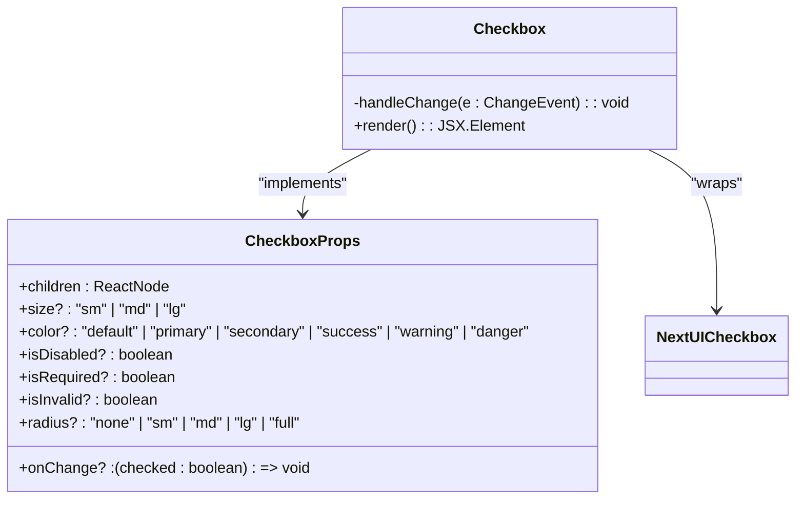
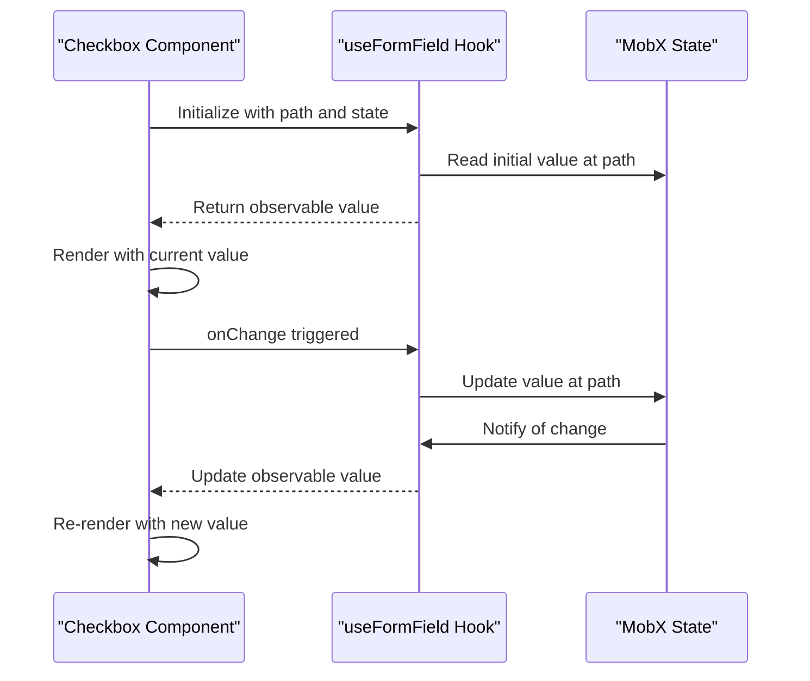
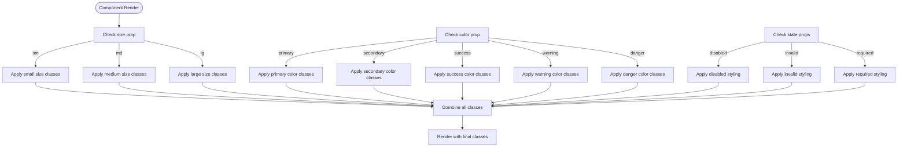
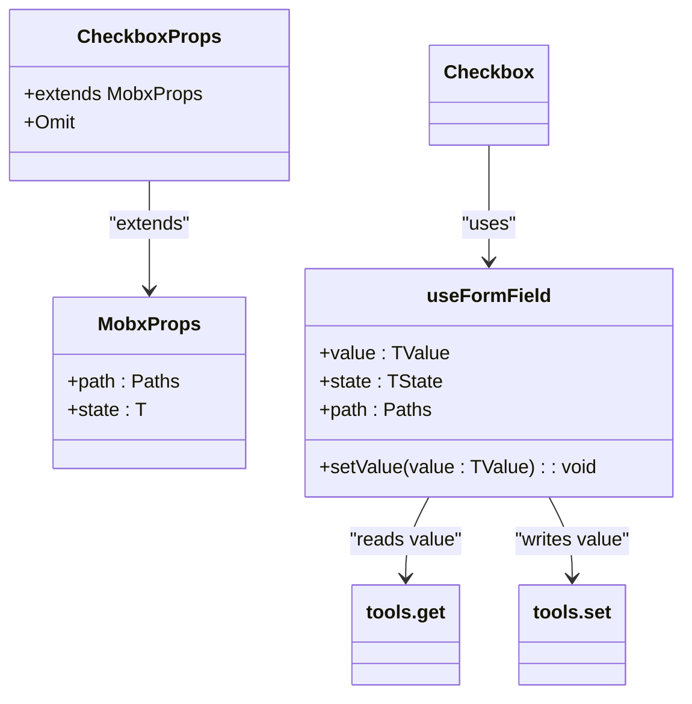

# Checkbox

<cite>
**Referenced Files in This Document**   
- [Checkbox.tsx](file://packages/ui/src/components/inputs/Checkbox/Checkbox.tsx)
- [index.tsx](file://packages/ui/src/components/inputs/Checkbox/index.tsx)
- [Checkbox.stories.tsx](file://packages/ui/src/components/inputs/Checkbox/Checkbox.stories.tsx)
- [useFormField.ts](file://packages/hooks/src/useFormField.ts)
- [types.ts](file://packages/types/src/index.ts)
</cite>

## Table of Contents
1. [Introduction](#introduction)
2. [Core Implementation](#core-implementation)
3. [State Management](#state-management)
4. [Accessibility Features](#accessibility-features)
5. [Props Documentation](#props-documentation)
6. [Styling System](#styling-system)
7. [Keyboard Navigation](#keyboard-navigation)
8. [Integration with Form Libraries](#integration-with-form-libraries)
9. [Common Issues and Solutions](#common-issues-and-solutions)
10. [Customization Guide](#customization-guide)

## Introduction
The Checkbox component in prj-core's shared-frontend package provides a reusable and accessible checkbox implementation with support for controlled state management, various visual states, and comprehensive accessibility features. Built on top of the NextUI (heroui) component library, this wrapper component enhances the base functionality with MobX integration and additional styling options.

The component is designed to be used in various contexts, from simple boolean toggles to complex form scenarios requiring validation and state synchronization. It supports different sizes, colors, and states while maintaining accessibility standards and providing a consistent user experience across the application.

**Section sources**
- [Checkbox.tsx](file://packages/ui/src/components/inputs/Checkbox/Checkbox.tsx)
- [index.tsx](file://packages/ui/src/components/inputs/Checkbox/index.tsx)

## Core Implementation
The Checkbox component is implemented as a wrapper around the NextUI Checkbox component, providing an additional layer of abstraction and functionality. The implementation consists of two main files: the base Checkbox component and a MobX-integrated version.

The base implementation handles the core functionality, including event handling and prop forwarding, while the MobX-integrated version provides seamless state management for applications using MobX for state management.

**Diagram sources**
- [Checkbox.tsx](file://packages/ui/src/components/inputs/Checkbox/Checkbox.tsx)

## State Management
The Checkbox component supports two state management patterns: controlled and MobX-integrated. The controlled pattern allows direct management of the checkbox state through the `checked` and `onChange` props, while the MobX-integrated version automatically synchronizes with a MobX state tree.

The MobX integration is achieved through the `useFormField` hook, which creates a two-way binding between the component and the state object. This allows for automatic state updates when the checkbox value changes and vice versa.

**Diagram sources**
- [index.tsx](file://packages/ui/src/components/inputs/Checkbox/index.tsx)
- [useFormField.ts](file://packages/hooks/src/useFormField.ts)

**Section sources**
- [index.tsx](file://packages/ui/src/components/inputs/Checkbox/index.tsx)
- [useFormField.ts](file://packages/hooks/src/useFormField.ts)

## Accessibility Features
The Checkbox component includes comprehensive accessibility features to ensure it is usable by all users, including those using screen readers or keyboard navigation. The component automatically manages ARIA attributes and supports standard keyboard interactions.

Key accessibility features include:
- Proper role assignment with `role="checkbox"`
- Dynamic `aria-checked` attribute that reflects the current state
- Support for keyboard navigation with Space and Enter keys
- Proper focus management and visual focus indicators
- Label association through implicit or explicit labeling

The component inherits accessibility features from the NextUI Checkbox component, which implements the WAI-ARIA Authoring Practices for checkboxes. This includes proper announcement of state changes to screen readers and keyboard operability.

**Section sources**
- [Checkbox.tsx](file://packages/ui/src/components/inputs/Checkbox/Checkbox.tsx)
- [pnpm-lock.yaml](file://pnpm-lock.yaml)

## Props Documentation
The Checkbox component supports a comprehensive set of props for controlling its appearance, behavior, and integration with form systems.

### Core Props
| Prop | Type | Default | Description |
|------|------|---------|-------------|
| children | ReactNode | - | The label text or content for the checkbox |
| onChange | (checked: boolean) => void | - | Callback function called when the checkbox state changes |
| isSelected | boolean | - | Controls the checked state of the checkbox |
| isDisabled | boolean | false | Disables the checkbox and prevents interaction |
| isRequired | boolean | false | Indicates the checkbox is required for form submission |
| isInvalid | boolean | false | Displays the checkbox in an error state |

### Styling Props
| Prop | Type | Default | Description |
|------|------|---------|-------------|
| size | "sm" \| "md" \| "lg" | "lg" | Controls the size of the checkbox |
| color | "default" \| "primary" \| "secondary" \| "success" \| "warning" \| "danger" | "default" | Controls the color theme of the checkbox |
| radius | "none" \| "sm" \| "md" \| "lg" \| "full" | - | Controls the border radius of the checkbox |

### Integration Props (MobX)
| Prop | Type | Description |
|------|------|-------------|
| state | T | The MobX state object containing the checkbox value |
| path | Paths<T, 4> | The path to the checkbox value in the state object |

**Section sources**
- [Checkbox.tsx](file://packages/ui/src/components/inputs/Checkbox/Checkbox.tsx)
- [index.tsx](file://packages/ui/src/components/inputs/Checkbox/index.tsx)
- [Checkbox.stories.tsx](file://packages/ui/src/components/inputs/Checkbox/Checkbox.stories.tsx)

## Styling System
The Checkbox component uses Tailwind CSS for styling, with additional theme-based styling options. The component's appearance is controlled through a combination of Tailwind utility classes and theme-specific CSS variables.

The styling system supports multiple color variants and sizes, allowing the checkbox to be adapted to different contexts within the application. The default styling includes bold text for the label and appropriate spacing between the checkbox and its label.

The component also supports custom styling through the standard React `className` prop, allowing additional Tailwind classes to be applied to the root element. This enables further customization without requiring changes to the component implementation.

**Diagram sources**
- [Checkbox.tsx](file://packages/ui/src/components/inputs/Checkbox/Checkbox.tsx)

**Section sources**
- [Checkbox.tsx](file://packages/ui/src/components/inputs/Checkbox/Checkbox.tsx)

## Keyboard Navigation
The Checkbox component supports standard keyboard navigation patterns for accessibility. Users can interact with the checkbox using the following keyboard controls:

- **Space key**: Toggles the checkbox state between checked and unchecked
- **Enter key**: Toggles the checkbox state (alternative to Space key)
- **Tab key**: Moves focus to the checkbox, allowing keyboard interaction
- **Arrow keys**: Not applicable for single checkboxes, but supported in checkbox groups

The component inherits keyboard navigation behavior from the NextUI Checkbox component, which implements the WAI-ARIA keyboard interaction patterns for checkboxes. When focused, the checkbox displays a visual focus indicator to show its active state.

The keyboard navigation is fully accessible and works seamlessly with screen readers, which announce the current state and available actions when the checkbox receives focus.

**Section sources**
- [Checkbox.tsx](file://packages/ui/src/components/inputs/Checkbox/Checkbox.tsx)
- [pnpm-lock.yaml](file://pnpm-lock.yaml)

## Integration with Form Libraries
The Checkbox component is designed to integrate seamlessly with form libraries, particularly those using MobX for state management. The component provides two interfaces: a basic controlled component and a MobX-integrated version.

The MobX integration is achieved through the `useFormField` hook, which creates a two-way binding between the component and a MobX state tree. This allows the checkbox to automatically read its initial value from the state and update the state when its value changes.

**Diagram sources**
- [index.tsx](file://packages/ui/src/components/inputs/Checkbox/index.tsx)
- [useFormField.ts](file://packages/hooks/src/useFormField.ts)
- [types.ts](file://packages/types/src/index.ts)

**Section sources**
- [index.tsx](file://packages/ui/src/components/inputs/Checkbox/index.tsx)
- [useFormField.ts](file://packages/hooks/src/useFormField.ts)

## Common Issues and Solutions
When working with the Checkbox component, several common issues may arise. This section addresses these issues and provides solutions.

### State Synchronization Issues
One common issue is state desynchronization between the component and the parent state. This can occur when the state is updated outside of the normal onChange flow. The solution is to ensure all state updates go through the onChange callback or use the MobX integration which automatically handles two-way binding.

### Accessibility Compliance
Ensuring the checkbox is fully accessible requires proper label association. The component supports both implicit and explicit labeling. For implicit labeling, wrap the checkbox and label text in the component's children. For explicit labeling, use the htmlFor attribute on a separate label element.

### Event Handling
The onChange callback receives a boolean value indicating the new checked state. It's important to handle this value appropriately in the parent component. When using the MobX integration, the state update is handled automatically by the useFormField hook.

### Performance Considerations
When rendering large numbers of checkboxes, consider using React.memo or similar optimization techniques to prevent unnecessary re-renders. The MobX integration already includes optimization through the useLocalObservable hook.

**Section sources**
- [Checkbox.tsx](file://packages/ui/src/components/inputs/Checkbox/Checkbox.tsx)
- [index.tsx](file://packages/ui/src/components/inputs/Checkbox/index.tsx)
- [useFormField.ts](file://packages/hooks/src/useFormField.ts)

## Customization Guide
The Checkbox component can be extended and customized in several ways to meet specific requirements.

### Custom Icons
While the component uses the default NextUI checkbox icon, custom icons can be implemented by creating a custom wrapper component that overrides the default rendering. This can be achieved by using the base NextUI Checkbox component directly and applying custom styles.

### Custom Styling
Additional styling can be applied using the className prop with Tailwind CSS classes. For more extensive customization, create a custom theme or override the default styles using CSS variables.

### Extending Functionality
The component can be extended to support additional features such as indeterminate states, although this requires modifying the base implementation. The current implementation focuses on binary checked/unchecked states, but could be extended to support tri-state checkboxes.

### Integration with Other State Management Libraries
While the component is optimized for MobX, it can be integrated with other state management libraries like Redux or React Context by using the controlled component pattern with the checked and onChange props.

**Section sources**
- [Checkbox.tsx](file://packages/ui/src/components/inputs/Checkbox/Checkbox.tsx)
- [index.tsx](file://packages/ui/src/components/inputs/Checkbox/index.tsx)