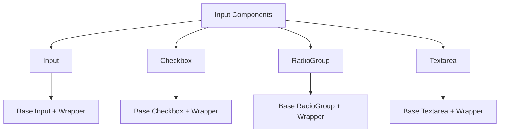
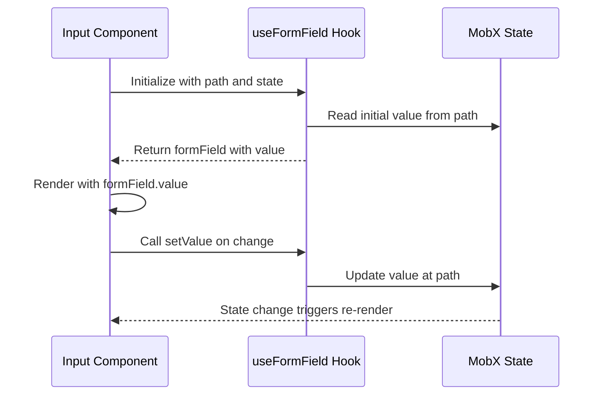
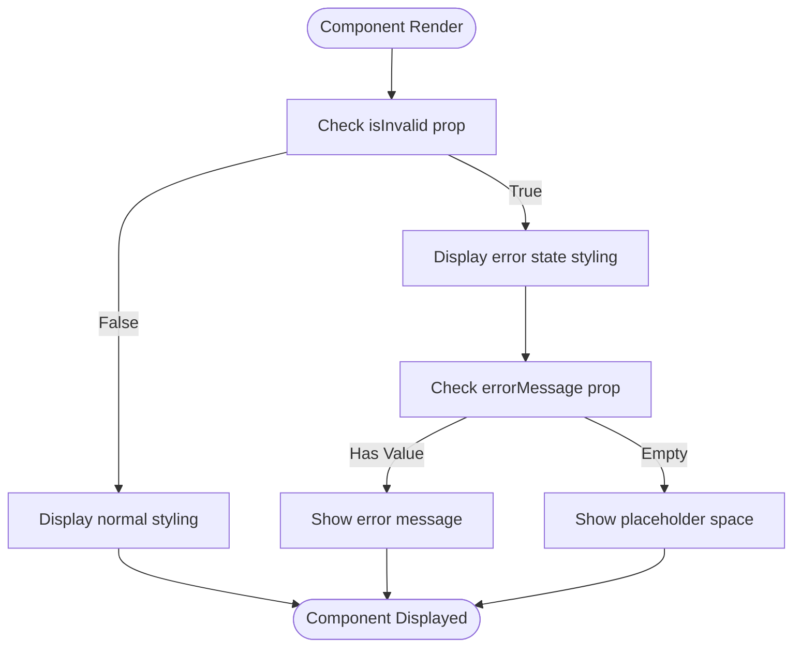
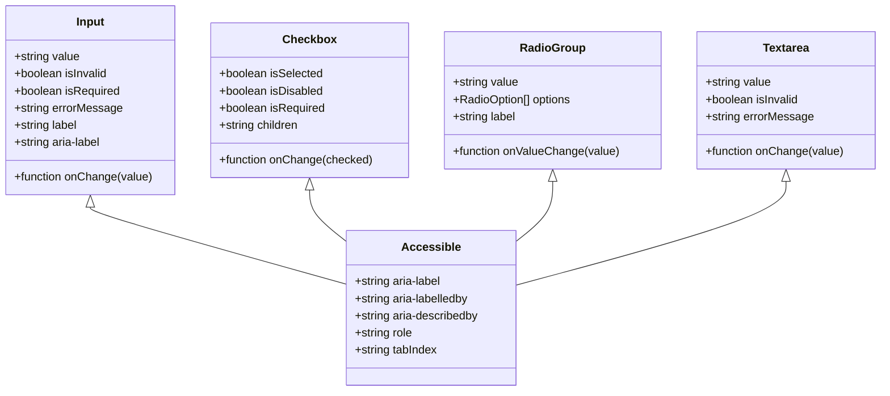
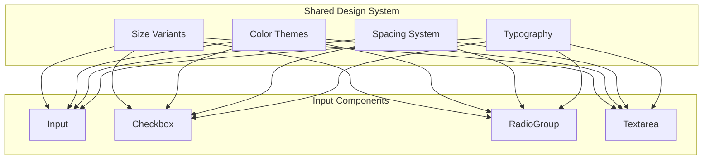

# Input Components

<cite>
**Referenced Files in This Document**   
- [Input.tsx](file://packages/ui/src/components/inputs/Input/Input.tsx)
- [index.tsx](file://packages/ui/src/components/inputs/Input/index.tsx)
- [Checkbox.tsx](file://packages/ui/src/components/inputs/Checkbox/Checkbox.tsx)
- [index.tsx](file://packages/ui/src/components/inputs/Checkbox/index.tsx)
- [RadioGroup.tsx](file://packages/ui/src/components/inputs/RadioGroup/RadioGroup.tsx)
- [index.tsx](file://packages/ui/src/components/inputs/RadioGroup/index.tsx)
- [Textarea.tsx](file://packages/ui/src/components/inputs/Textarea/Textarea.tsx)
- [index.tsx](file://packages/ui/src/components/inputs/Textarea/index.tsx)
- [useFormField.ts](file://packages/hooks/src/useFormField.ts)
</cite>

## Table of Contents
1. [Introduction](#introduction)
2. [Core Components](#core-components)
3. [Controlled and Uncontrolled Patterns](#controlled-and-uncontrolled-patterns)
4. [Validation States and Error Visualization](#validation-states-and-error-visualization)
5. [Accessibility Attributes](#accessibility-attributes)
6. [Shared Design System](#shared-design-system)
7. [Component-Specific Implementation Details](#component-specific-implementation-details)
8. [Common Issues and Solutions](#common-issues-and-solutions)
9. [Integration with Form Libraries](#integration-with-form-libraries)
10. [Conclusion](#conclusion)

## Introduction
The input components in the prj-core's shared-frontend package provide a comprehensive set of form controls designed for consistent user experience and developer productivity. These components follow a unified design system while offering flexibility for various use cases. The implementation leverages a wrapper pattern that enhances base UI components with additional functionality for state management, validation, and accessibility.

**Section sources**
- [Input.tsx](file://packages/ui/src/components/inputs/Input/Input.tsx#L1-L53)
- [Checkbox.tsx](file://packages/ui/src/components/inputs/Checkbox/Checkbox.tsx#L1-L24)
- [RadioGroup.tsx](file://packages/ui/src/components/inputs/RadioGroup/RadioGroup.tsx#L1-L46)
- [Textarea.tsx](file://packages/ui/src/components/inputs/Textarea/Textarea.tsx#L1-L20)

## Core Components
The shared-frontend package includes four primary input components: Input, Checkbox, RadioGroup, and Textarea. Each component follows a consistent architectural pattern with a base implementation and a MobX-connected wrapper. The base components handle visual rendering and basic interaction logic, while the wrapper components integrate with the application's state management system.

**Diagram sources**
- [Input.tsx](file://packages/ui/src/components/inputs/Input/Input.tsx#L1-L53)
- [index.tsx](file://packages/ui/src/components/inputs/Input/index.tsx#L1-L37)
- [Checkbox.tsx](file://packages/ui/src/components/inputs/Checkbox/Checkbox.tsx#L1-L24)
- [index.tsx](file://packages/ui/src/components/inputs/Checkbox/index.tsx#L1-L39)

## Controlled and Uncontrolled Patterns
The input components support both controlled and uncontrolled patterns through their implementation architecture. The wrapper components (exported as Input, Checkbox, RadioGroup, Textarea) implement a controlled pattern by connecting to MobX state via the useFormField hook. These components automatically synchronize their values with the application state based on the provided path parameter.

The base components (imported as BaseInput, BaseCheckbox, etc.) can be used as uncontrolled components when direct state management is required. This dual approach provides flexibility for different use cases while maintaining a consistent API surface.

**Diagram sources**
- [index.tsx](file://packages/ui/src/components/inputs/Input/index.tsx#L11-L34)
- [index.tsx](file://packages/ui/src/components/inputs/Checkbox/index.tsx#L14-L35)
- [index.tsx](file://packages/ui/src/components/inputs/RadioGroup/index.tsx#L14-L34)
- [index.tsx](file://packages/ui/src/components/inputs/Textarea/index.tsx#L14-L32)

**Section sources**
- [index.tsx](file://packages/ui/src/components/inputs/Input/index.tsx#L11-L37)
- [index.tsx](file://packages/ui/src/components/inputs/Checkbox/index.tsx#L14-L39)
- [index.tsx](file://packages/ui/src/components/inputs/RadioGroup/index.tsx#L14-L42)
- [index.tsx](file://packages/ui/src/components/inputs/Textarea/index.tsx#L14-L38)
- [useFormField.ts](file://packages/hooks/src/useFormField.ts)

## Validation States and Error Visualization
The input components support validation states through specific props that control visual appearance and accessibility attributes. The components accept isInvalid, isRequired, and errorMessage props to manage validation states. When isInvalid is set to true, the component displays visual indicators of an error state, and the errorMessage is exposed to assistive technologies.

The Input component specifically sets a default errorMessage of " " (a single space) to maintain consistent height even when no error message is provided, preventing layout shifts during validation state changes.

**Diagram sources**
- [Input.tsx](file://packages/ui/src/components/inputs/Input/Input.tsx#L18-L22)
- [Checkbox.tsx](file://packages/ui/src/components/inputs/Checkbox/Checkbox.tsx#L8-L10)
- [RadioGroup.tsx](file://packages/ui/src/components/inputs/RadioGroup/RadioGroup.tsx#L12-L17)

**Section sources**
- [Input.tsx](file://packages/ui/src/components/inputs/Input/Input.tsx#L18-L22)
- [Checkbox.tsx](file://packages/ui/src/components/inputs/Checkbox/Checkbox.tsx#L8-L10)
- [RadioGroup.tsx](file://packages/ui/src/components/inputs/RadioGroup/RadioGroup.tsx#L12-L17)

## Accessibility Attributes
The input components are designed with accessibility as a core requirement. Each component properly associates labels with their controls and exposes appropriate ARIA attributes to assistive technologies. The Checkbox component wraps its children in a Text component with a "font-bold" className, ensuring proper text rendering for screen readers.

All components support keyboard navigation and focus management according to WCAG guidelines. The RadioGroup component implements proper group semantics, ensuring that screen readers announce the number of options and the currently selected option.

**Diagram sources**
- [Input.tsx](file://packages/ui/src/components/inputs/Input/Input.tsx#L7-L12)
- [Checkbox.tsx](file://packages/ui/src/components/inputs/Checkbox/Checkbox.tsx#L8-L10)
- [RadioGroup.tsx](file://packages/ui/src/components/inputs/RadioGroup/RadioGroup.tsx#L12-L17)
- [Textarea.tsx](file://packages/ui/src/components/inputs/Textarea/Textarea.tsx#L5-L9)

## Shared Design System
The input components follow a unified design system that ensures visual consistency across the application. This system includes standardized props for size, color, and state management. The components accept a size prop with values "sm", "md", and "lg" to control their visual scale.

The design system also includes consistent handling of required indicators and helper text rendering. The components support integration with form layouts through proper spacing and alignment properties. The styling system is built on top of the HeroUI React library, extending its components with additional functionality while maintaining visual consistency.

**Diagram sources**
- [Input.tsx](file://packages/ui/src/components/inputs/Input/Input.tsx#L20-L21)
- [Checkbox.tsx](file://packages/ui/src/components/inputs/Checkbox/Checkbox.tsx#L13-L14)
- [RadioGroup.tsx](file://packages/ui/src/components/inputs/RadioGroup/RadioGroup.tsx#L20-L34)
- [Textarea.tsx](file://packages/ui/src/components/inputs/Textarea/Textarea.tsx#L12-L13)

## Component-Specific Implementation Details

### Input Component
The Input component handles both text and number input types with specialized processing for numeric values. When the type is set to "number", the component converts the input value to a number before passing it to the onChange callback. This ensures type consistency for numeric inputs while maintaining the flexibility of string inputs for other types.

**Section sources**
- [Input.tsx](file://packages/ui/src/components/inputs/Input/Input.tsx#L25-L40)

### Checkbox Component
The Checkbox component implements a controlled pattern by converting the native HTML checkbox change event to a boolean value passed to the onChange callback. It wraps its children in a Text component with bold styling, ensuring consistent label presentation across the application.

**Section sources**
- [Checkbox.tsx](file://packages/ui/src/components/inputs/Checkbox/Checkbox.tsx#L15-L17)

### RadioGroup Component
The RadioGroup component accepts an array of RadioOption objects, each containing a text label and value. It maps these options to Radio components from the base UI library, creating a cohesive group of radio buttons. The component maintains selection state and notifies the parent component of value changes through the onValueChange callback.

**Section sources**
- [RadioGroup.tsx](file://packages/ui/src/components/inputs/RadioGroup/RadioGroup.tsx#L38-L43)

### Textarea Component
The Textarea component provides a multi-line text input with the same controlled pattern as other input components. It handles text input events and passes the current value to the onChange callback, enabling real-time state synchronization.

**Section sources**
- [Textarea.tsx](file://packages/ui/src/components/inputs/Textarea/Textarea.tsx#L14-L16)

## Common Issues and Solutions

### Uncontrolled Input Warnings
When mixing controlled and uncontrolled states, React may issue warnings about changing components from controlled to uncontrolled. This is prevented in the wrapper components by ensuring a consistent initial value from the MobX state or providing an empty string as a fallback.

### Checked/Unchecked State Management
The Checkbox component properly manages its checked state by using the isSelected prop from the base component rather than the checked prop. This follows the controlled component pattern and prevents state desynchronization between the component and the application state.

### Textarea Auto-Resizing
While the current implementation does not include auto-resizing functionality, this could be added by monitoring the scrollHeight of the textarea element and adjusting the height prop accordingly. The component structure supports such enhancements without breaking the existing API.

## Integration with Form Libraries
The input components are designed to integrate seamlessly with form libraries through their consistent API and state management patterns. The useFormField hook provides a bridge between the component's internal state and external form state management solutions. Developers can extend these components with custom validation by adding validation rules to the formField configuration or by wrapping them with higher-order components that provide additional validation logic.

## Conclusion
The input components in the shared-frontend package provide a robust foundation for building accessible and consistent forms. Their architecture balances flexibility with convention, allowing developers to use them in various contexts while maintaining a unified user experience. The components' adherence to accessibility standards and support for both controlled and uncontrolled patterns make them suitable for a wide range of use cases within the application ecosystem.