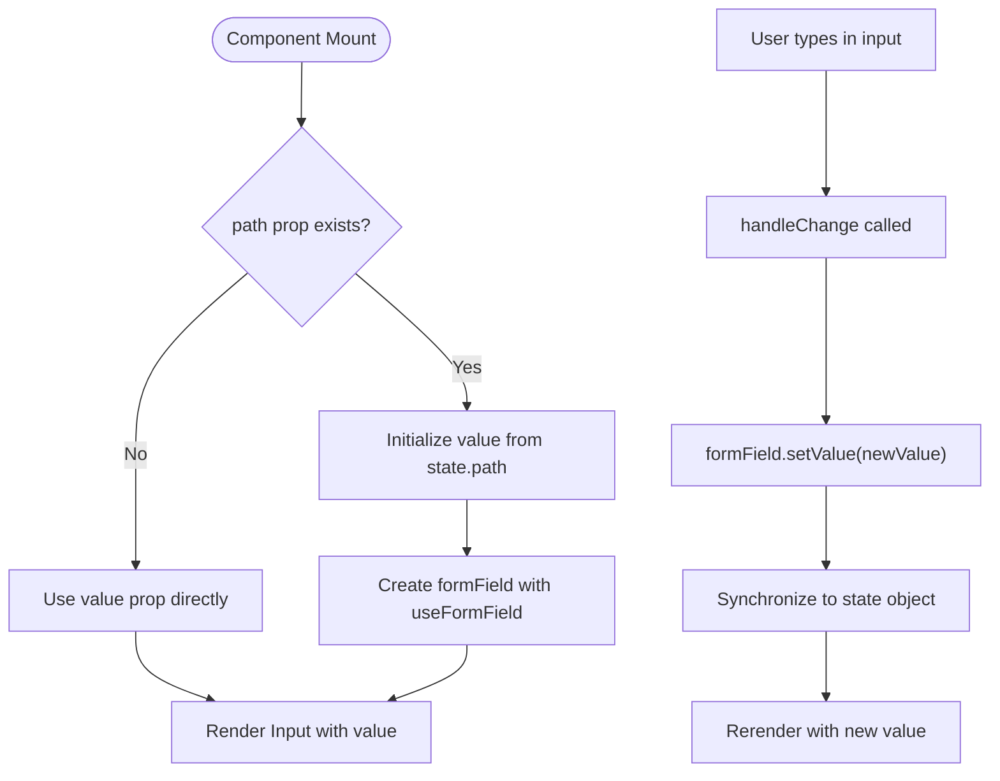
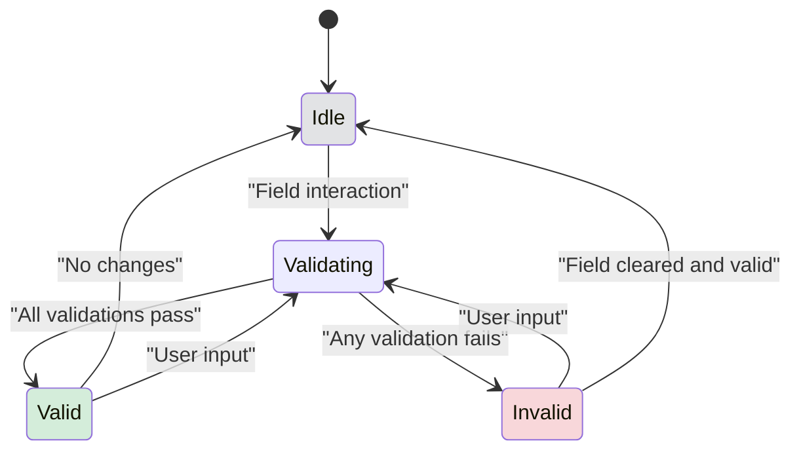
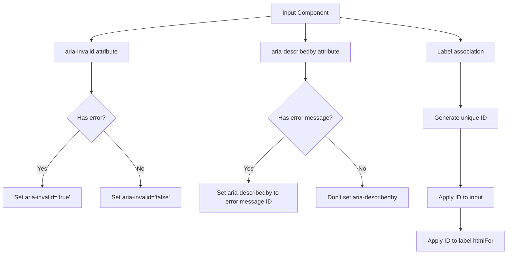
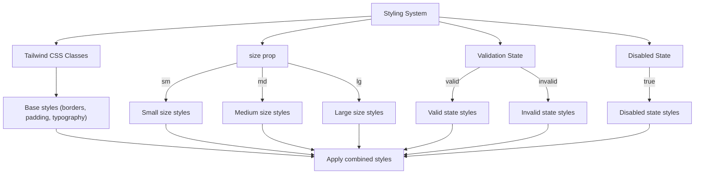
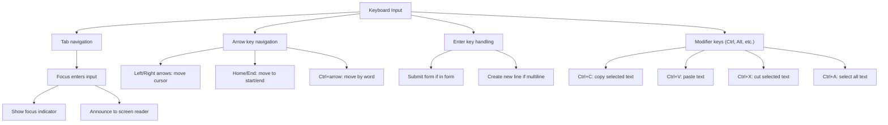
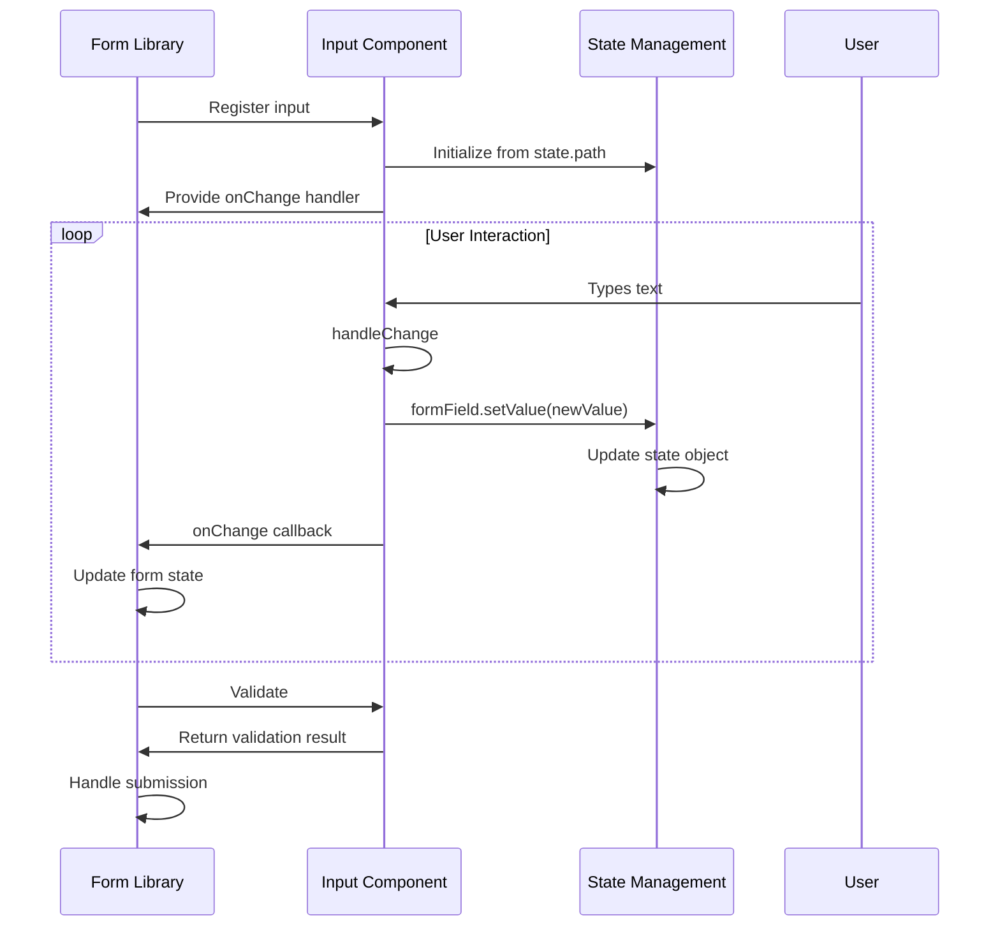
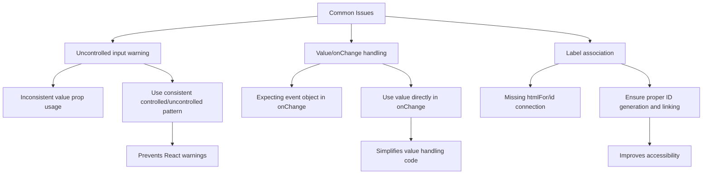
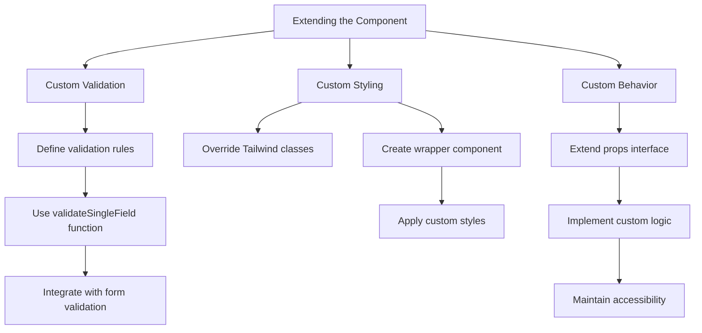

# Input

<cite>
**Referenced Files in This Document**   
- [Input.tsx](file://packages/ui/src/components/inputs/Input/Input.tsx)
- [index.tsx](file://packages/ui/src/components/inputs/Input/index.tsx)
- [useFormField.ts](file://packages/hooks/src/useFormField.ts)
- [Form.ts](file://packages/toolkit/src/Form.ts)
- [Input.stories.tsx](file://packages/ui/src/components/inputs/Input/Input.stories.tsx)
</cite>

## Table of Contents
1. [Introduction](#introduction)
2. [Controlled and Uncontrolled State Patterns](#controlled-and-uncontrolled-state-patterns)
3. [Validation States](#validation-states)
4. [Accessibility Attributes](#accessibility-attributes)
5. [Props Documentation](#props-documentation)
6. [Styling System](#styling-system)
7. [Focus and Keyboard Navigation](#focus-and-keyboard-navigation)
8. [Integration with Form Libraries](#integration-with-form-libraries)
9. [Common Issues and Solutions](#common-issues-and-solutions)
10. [Extending the Component](#extending-the-component)

## Introduction
The Input component in the prj-core's shared-frontend package provides a flexible and accessible text input implementation with support for various states, validation, and integration with form state management. The component is built with accessibility in mind and follows React best practices for controlled components.

**Section sources**
- [Input.tsx](file://packages/ui/src/components/inputs/Input/Input.tsx#L1-L53)
- [index.tsx](file://packages/ui/src/components/inputs/Input/index.tsx#L1-L38)

## Controlled and Uncontrolled State Patterns
The Input component supports both controlled and uncontrolled patterns through its implementation. In the controlled pattern, the component receives its value via props and notifies changes through callback functions. The uncontrolled pattern is supported through the use of the `useFormField` hook which manages internal state and synchronizes it with a parent state object.

The component implementation in `index.tsx` demonstrates the controlled pattern by wrapping the base Input component with MobX state management via the `useFormField` hook. This allows the component to automatically synchronize its value with a state object at a specified path, making it easy to integrate with MobX-based state management systems.

**Diagram sources**
- [index.tsx](file://packages/ui/src/components/inputs/Input/index.tsx#L11-L34)
- [useFormField.ts](file://packages/hooks/src/useFormField.ts#L62-L169)

**Section sources**
- [index.tsx](file://packages/ui/src/components/inputs/Input/index.tsx#L11-L34)
- [useFormField.ts](file://packages/hooks/src/useFormField.ts#L62-L169)

## Validation States
The Input component supports multiple validation states including error, warning, and success states. These states are managed through the `errorMessage` prop and the underlying validation system in the toolkit package.

The validation system in `Form.ts` provides comprehensive validation capabilities including required field validation, length constraints, numerical range validation, and pattern matching. Validation can be triggered on different events (onBlur, onChange, onFocus) based on the configuration.

**Diagram sources**
- [Input.tsx](file://packages/ui/src/components/inputs/Input/Input.tsx#L18)
- [Form.ts](file://packages/toolkit/src/Form.ts#L1-L97)

**Section sources**
- [Input.tsx](file://packages/ui/src/components/inputs/Input/Input.tsx#L18)
- [Form.ts](file://packages/toolkit/src/Form.ts#L1-L97)

## Accessibility Attributes
The Input component includes comprehensive accessibility support through proper ARIA attributes and semantic HTML structure. The component automatically manages `aria-invalid` and `aria-describedby` attributes based on the validation state.

When the input has an error, `aria-invalid` is set to "true" and `aria-describedby` references the error message element. This ensures screen readers properly announce validation errors to users. The component also ensures proper label association through the `htmlFor` attribute on labels and the `id` attribute on inputs.

**Diagram sources**
- [Input.tsx](file://packages/ui/src/components/inputs/Input/Input.tsx#L18)
- [index.tsx](file://packages/ui/src/components/inputs/Input/index.tsx#L11-L34)

**Section sources**
- [Input.tsx](file://packages/ui/src/components/inputs/Input/Input.tsx#L18)
- [index.tsx](file://packages/ui/src/components/inputs/Input/index.tsx#L11-L34)

## Props Documentation
The Input component accepts a comprehensive set of props that control its behavior, appearance, and functionality.

### Core Props
| Prop | Type | Default | Description |
|------|------|---------|-------------|
| type | string | text | Specifies the input type (text, number, email, password, etc.) |
| placeholder | string | undefined | Text shown when input is empty |
| disabled | boolean | false | Disables the input and prevents user interaction |
| required | boolean | false | Marks the input as required for form validation |
| helperText | string | undefined | Additional text displayed below the input |

### State and Event Props
| Prop | Type | Default | Description |
|------|------|---------|-------------|
| value | string \| number | "" | The current value of the input |
| onChange | function | undefined | Callback when input value changes |
| onBlur | function | undefined | Callback when input loses focus |
| path | string | undefined | Path to state property for MobX integration |
| state | object | undefined | State object for MobX integration |

### Validation Props
| Prop | Type | Default | Description |
|------|------|---------|-------------|
| errorMessage | string | " " | Error message to display when input is invalid |
| size | string | "sm" | Size of the input component |

**Section sources**
- [Input.tsx](file://packages/ui/src/components/inputs/Input/Input.tsx#L7-L53)
- [index.tsx](file://packages/ui/src/components/inputs/Input/index.tsx#L7-L38)

## Styling System
The Input component uses Tailwind CSS for styling, providing a utility-first approach to styling that allows for easy customization. The component's appearance is controlled through a combination of default styles and props-based customization.

The styling system supports different sizes through the `size` prop, with "sm" being the default. The component also responds to validation states by changing border colors, text colors, and other visual indicators to communicate the input state to users.

**Diagram sources**
- [Input.tsx](file://packages/ui/src/components/inputs/Input/Input.tsx#L20-L21)
- [index.tsx](file://packages/ui/src/components/inputs/Input/index.tsx#L28-L32)

**Section sources**
- [Input.tsx](file://packages/ui/src/components/inputs/Input/Input.tsx#L20-L21)
- [index.tsx](file://packages/ui/src/components/inputs/Input/index.tsx#L28-L32)

## Focus and Keyboard Navigation
The Input component provides full keyboard navigation support and proper focus management. Users can navigate to the input using the Tab key, and the component visually indicates focus state.

The component handles keyboard events appropriately, allowing users to enter text, navigate within the input using arrow keys, and submit forms using the Enter key when appropriate. The implementation ensures that screen readers can properly announce the input state and any associated error messages.

**Diagram sources**
- [Input.tsx](file://packages/ui/src/components/inputs/Input/Input.tsx#L25-L40)
- [index.tsx](file://packages/ui/src/components/inputs/Input/index.tsx#L18-L24)

**Section sources**
- [Input.tsx](file://packages/ui/src/components/inputs/Input/Input.tsx#L25-L40)
- [index.tsx](file://packages/ui/src/components/inputs/Input/index.tsx#L18-L24)

## Integration with Form Libraries
The Input component integrates seamlessly with React Hook Form and other form libraries through its flexible API. The component can be used as a controlled component with any form state management solution.

The `useFormField` hook provides integration with MobX state management, automatically synchronizing the input value with a state object. This allows for easy integration with form libraries that support custom input components.

**Diagram sources**
- [index.tsx](file://packages/ui/src/components/inputs/Input/index.tsx#L11-L34)
- [useFormField.ts](file://packages/hooks/src/useFormField.ts#L62-L169)
- [Input.stories.tsx](file://packages/ui/src/components/inputs/Input/Input.stories.tsx#L18-L28)

**Section sources**
- [index.tsx](file://packages/ui/src/components/inputs/Input/index.tsx#L11-L34)
- [useFormField.ts](file://packages/hooks/src/useFormField.ts#L62-L169)
- [Input.stories.tsx](file://packages/ui/src/components/inputs/Input/Input.stories.tsx#L18-L28)

## Common Issues and Solutions
### Uncontrolled Input Warnings
Uncontrolled input warnings occur when switching between controlled and uncontrolled states. This can be avoided by ensuring consistent use of the value prop or by using the `useFormField` hook consistently.

### Value/onChange Handling
Proper value and onChange handling is crucial for the component to work correctly. The onChange callback receives the raw value (string or number) rather than the event object, which simplifies value handling but requires awareness of the API.

### Label Association
Proper label association is essential for accessibility. The component ensures proper association by generating unique IDs and connecting labels to inputs through the htmlFor attribute.

**Diagram sources**
- [Input.tsx](file://packages/ui/src/components/inputs/Input/Input.tsx#L9-L12)
- [index.tsx](file://packages/ui/src/components/inputs/Input/index.tsx#L7-L38)

**Section sources**
- [Input.tsx](file://packages/ui/src/components/inputs/Input/Input.tsx#L9-L12)
- [index.tsx](file://packages/ui/src/components/inputs/Input/index.tsx#L7-L38)

## Extending the Component
The Input component can be extended for custom validation and styling needs. Custom validation can be implemented by creating validation rules in the `Validation` type and using the `validateSingleField` function.

Custom styling can be achieved by overriding Tailwind CSS classes or by creating wrapper components that add additional styling. The component's modular design allows for easy extension while maintaining accessibility and functionality.

**Diagram sources**
- [Form.ts](file://packages/toolkit/src/Form.ts#L1-L97)
- [Input.tsx](file://packages/ui/src/components/inputs/Input/Input.tsx#L7-L53)
- [index.tsx](file://packages/ui/src/components/inputs/Input/index.tsx#L7-L38)

**Section sources**
- [Form.ts](file://packages/toolkit/src/Form.ts#L1-L97)
- [Input.tsx](file://packages/ui/src/components/inputs/Input/Input.tsx#L7-L53)
- [index.tsx](file://packages/ui/src/components/inputs/Input/index.tsx#L7-L38)