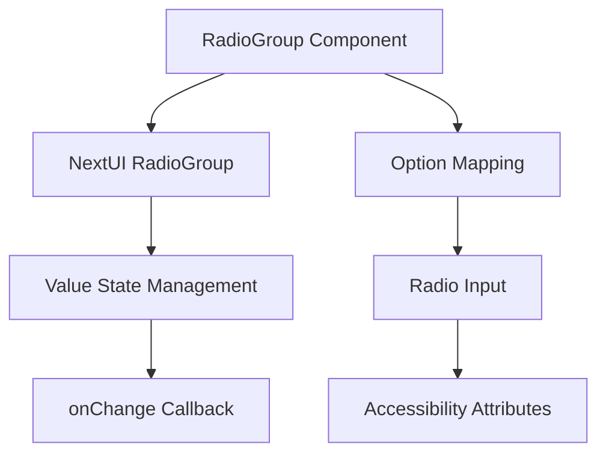
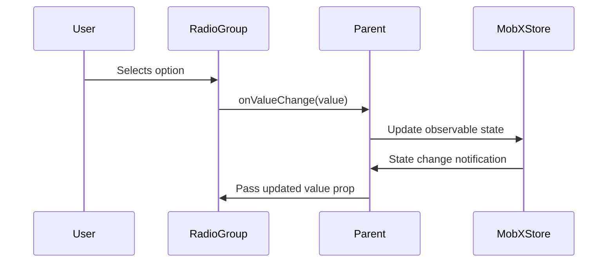
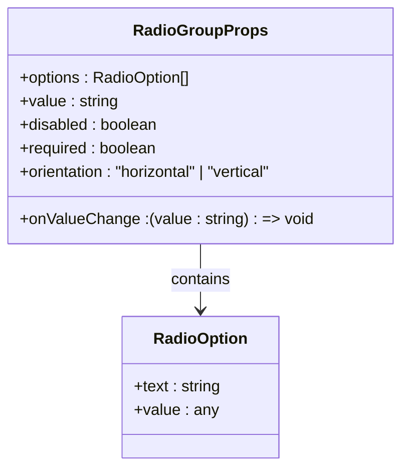
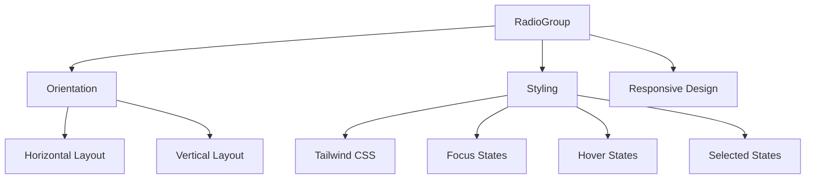
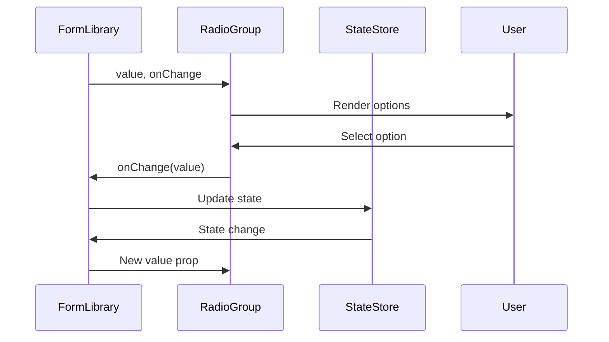
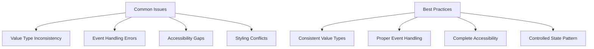
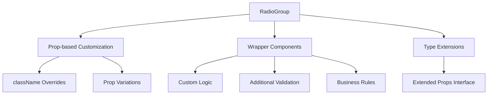

# RadioGroup

<cite>
**Referenced Files in This Document**   
- [RadioGroup.tsx](file://packages/ui/src/components/inputs/RadioGroup/RadioGroup.tsx)
- [index.tsx](file://packages/ui/src/components/inputs/RadioGroup/index.tsx)
- [RadioGroup.stories.tsx](file://packages/ui/src/components/inputs/RadioGroup/RadioGroup.stories.tsx)
</cite>

## Table of Contents
1. [Introduction](#introduction)
2. [Core Implementation](#core-implementation)
3. [Controlled State Management](#controlled-state-management)
4. [Accessibility Features](#accessibility-features)
5. [Props Documentation](#props-documentation)
6. [Styling and Layout](#styling-and-layout)
7. [Integration with Form Libraries](#integration-with-form-libraries)
8. [Common Issues and Best Practices](#common-issues-and-best-practices)
9. [Customization and Extension](#customization-and-extension)

## Introduction
The RadioGroup component is a reusable UI element designed to provide a consistent and accessible way to present multiple-choice options where users can select exactly one option from a set. This component is part of the shared UI library and is built on top of the NextUI RadioGroup component, enhanced with additional functionality for form integration and state management.

The component supports both controlled and MobX-integrated usage patterns, making it flexible for different application architectures. It provides comprehensive accessibility features, proper keyboard navigation, and integration with form libraries through the use of standardized props and patterns.

**Section sources**
- [RadioGroup.tsx](file://packages/ui/src/components/inputs/RadioGroup/RadioGroup.tsx#L1-L45)
- [index.tsx](file://packages/ui/src/components/inputs/RadioGroup/index.tsx#L1-L41)

## Core Implementation
The RadioGroup component is implemented as a wrapper around the NextUI RadioGroup component, providing an abstraction layer that standardizes the API and adds additional functionality. The core implementation consists of two main files: the base RadioGroup component and a MobX-integrated version.

The base component accepts an array of options, each with a text label and value, and renders them as individual radio inputs within a grouped container. It uses the NextUI RadioGroup component to handle the underlying radio group behavior, including proper grouping via the name attribute and keyboard navigation.



**Diagram sources**
- [RadioGroup.tsx](file://packages/ui/src/components/inputs/RadioGroup/RadioGroup.tsx#L1-L45)

**Section sources**
- [RadioGroup.tsx](file://packages/ui/src/components/inputs/RadioGroup/RadioGroup.tsx#L1-L45)

## Controlled State Management
The RadioGroup component implements controlled state management through the value and onValueChange props, following React's controlled component pattern. The component does not maintain internal state but instead relies on the parent component to manage the selected value.

When a user selects an option, the onValueChange callback is triggered with the value of the selected option. This allows the parent component to update its state accordingly and pass the new value back to the RadioGroup on subsequent renders, ensuring the component always reflects the current application state.

For MobX integration, a separate wrapper component is provided that connects the RadioGroup to MobX observables. This wrapper uses the useFormField hook to create a two-way binding between the component and the MobX store, automatically handling value updates and change notifications.



**Diagram sources**
- [RadioGroup.tsx](file://packages/ui/src/components/inputs/RadioGroup/RadioGroup.tsx#L19-L35)
- [index.tsx](file://packages/ui/src/components/inputs/RadioGroup/index.tsx#L18-L27)

**Section sources**
- [RadioGroup.tsx](file://packages/ui/src/components/inputs/RadioGroup/RadioGroup.tsx#L19-L35)
- [index.tsx](file://packages/ui/src/components/inputs/RadioGroup/index.tsx#L18-L27)

## Accessibility Features
The RadioGroup component includes comprehensive accessibility features to ensure it can be used effectively by all users, including those who rely on assistive technologies. The component implements the WAI-ARIA specification for radio groups, using the appropriate roles, states, and properties.

The component uses role="radiogroup" on the container element to identify it as a radio group to screen readers. Each individual radio input is properly labeled and associated with the group, allowing screen readers to announce the group context and the available options.

Keyboard navigation is fully supported, allowing users to navigate between options using arrow keys. The component handles focus management properly, ensuring that the currently focused option is visually indicated and that keyboard navigation follows the expected patterns for radio groups.

The component also supports labeling through the aria-labelledby attribute, allowing it to be properly associated with descriptive text or form labels. This ensures that screen readers can provide meaningful context for the radio group.

```mermaid
flowchart TD
A[RadioGroup] --> B[role="radiogroup"]
A --> C[aria-labelledby]
A --> D[Keyboard Navigation]
D --> E[Arrow Key Support]
D --> F[Focus Management]
A --> G[Screen Reader Support]
G --> H[Option Announcements]
G --> I[Group Context]
```

**Diagram sources**
- [RadioGroup.tsx](file://packages/ui/src/components/inputs/RadioGroup/RadioGroup.tsx#L37-L43)

**Section sources**
- [RadioGroup.tsx](file://packages/ui/src/components/inputs/RadioGroup/RadioGroup.tsx#L37-L43)

## Props Documentation
The RadioGroup component accepts a variety of props that control its behavior, appearance, and integration with the application. These props are designed to provide flexibility while maintaining a consistent API across different use cases.

The primary props include:
- options: An array of option objects, each with text and value properties
- value: The currently selected value (controlled component pattern)
- onValueChange: Callback function triggered when the selection changes
- disabled: Boolean flag to disable the entire group
- required: Boolean flag to indicate the field is required
- orientation: Controls layout direction (horizontal or vertical)

Additional props are inherited from the NextUI RadioGroup component, allowing for further customization of appearance and behavior. The component uses the Omit utility type to exclude conflicting props (value and onValueChange) from the inherited props, ensuring a clean and consistent API.



**Diagram sources**
- [RadioGroup.tsx](file://packages/ui/src/components/inputs/RadioGroup/RadioGroup.tsx#L7-L17)

**Section sources**
- [RadioGroup.tsx](file://packages/ui/src/components/inputs/RadioGroup/RadioGroup.tsx#L7-L17)

## Styling and Layout
The RadioGroup component uses Tailwind CSS for styling, providing a consistent visual appearance that aligns with the application's design system. The component's layout is controlled by the orientation prop, which determines whether options are arranged horizontally or vertically.

Each radio input is styled to provide clear visual feedback for different states, including default, hover, focus, and selected states. The focus state is particularly important for accessibility, providing a visible indicator for keyboard navigation.

The component's styling is designed to be responsive, adapting to different screen sizes and container dimensions. The spacing between options is consistent and follows the design system's spacing guidelines, ensuring a harmonious appearance when multiple RadioGroup components are used on the same page.

For custom styling requirements, the component accepts additional className props that are passed through to the underlying NextUI RadioGroup component, allowing for targeted overrides without modifying the core component.



**Diagram sources**
- [RadioGroup.tsx](file://packages/ui/src/components/inputs/RadioGroup/RadioGroup.tsx#L37-L43)

**Section sources**
- [RadioGroup.tsx](file://packages/ui/src/components/inputs/RadioGroup/RadioGroup.tsx#L37-L43)

## Integration with Form Libraries
The RadioGroup component is designed to integrate seamlessly with form libraries and state management systems. The MobX-integrated version of the component demonstrates this capability, showing how the component can be connected to observable state.

The wrapper component uses the useFormField hook to create a two-way binding between the RadioGroup and a MobX observable. This eliminates the need for manual value management and change handling, reducing boilerplate code and potential errors.

The component can also be used with other form libraries by following the standard controlled component pattern, passing the current value and onChange handler as props. This flexibility allows the component to be used in various architectural patterns without modification.



**Diagram sources**
- [index.tsx](file://packages/ui/src/components/inputs/RadioGroup/index.tsx#L14-L37)

**Section sources**
- [index.tsx](file://packages/ui/src/components/inputs/RadioGroup/index.tsx#L14-L37)

## Common Issues and Best Practices
When using the RadioGroup component, several common issues and best practices should be considered to ensure optimal functionality and user experience.

Value type consistency is critical - the value prop and option values should use the same data type to ensure proper comparison and selection. Mixing string and numeric values can lead to unexpected behavior where the selected option is not properly highlighted.

Event handling should follow the standard pattern of using onValueChange for the base component and onChange for the MobX-integrated version. Direct manipulation of the DOM or use of native event handlers should be avoided to maintain the controlled component pattern.

Accessibility compliance requires proper labeling and context. The component should always be associated with a descriptive label, either through implicit labeling or the aria-labelledby attribute. For required fields, the required prop should be used rather than relying solely on visual indicators.



**Diagram sources**
- [RadioGroup.tsx](file://packages/ui/src/components/inputs/RadioGroup/RadioGroup.tsx#L20-L35)
- [index.tsx](file://packages/ui/src/components/inputs/RadioGroup/index.tsx#L18-L27)

**Section sources**
- [RadioGroup.tsx](file://packages/ui/src/components/inputs/RadioGroup/RadioGroup.tsx#L20-L35)
- [index.tsx](file://packages/ui/src/components/inputs/RadioGroup/index.tsx#L18-L27)

## Customization and Extension
The RadioGroup component can be extended and customized to meet specific requirements while maintaining its core functionality. The component's architecture supports both simple prop-based customization and more complex extensions through wrapper components.

For simple styling changes, the className prop can be used to apply additional Tailwind CSS classes or custom styles. This approach allows for targeted modifications without affecting the component's behavior.

For more complex requirements, such as custom option rendering or additional validation logic, wrapper components can be created that build upon the base RadioGroup. These wrappers can add functionality like conditional option rendering, complex validation rules, or integration with specific business logic.

The component's type definitions are exported to facilitate type-safe extensions, allowing developers to extend the component's props interface while maintaining type safety throughout the application.



**Diagram sources**
- [RadioGroup.tsx](file://packages/ui/src/components/inputs/RadioGroup/RadioGroup.tsx#L12-L17)
- [index.tsx](file://packages/ui/src/components/inputs/RadioGroup/index.tsx#L10-L13)

**Section sources**
- [RadioGroup.tsx](file://packages/ui/src/components/inputs/RadioGroup/RadioGroup.tsx#L12-L17)
- [index.tsx](file://packages/ui/src/components/inputs/RadioGroup/index.tsx#L10-L13)