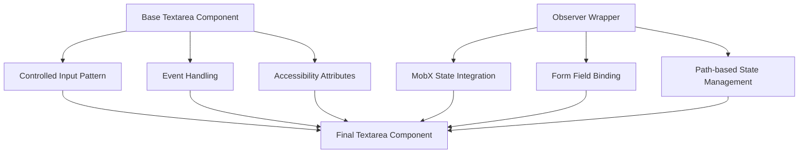
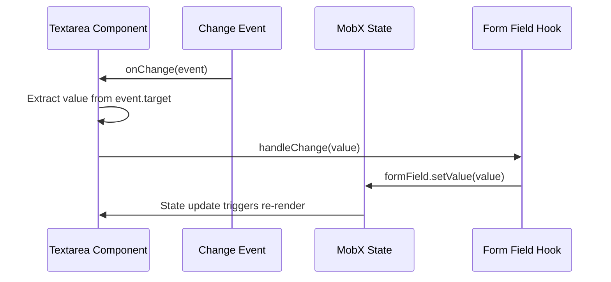
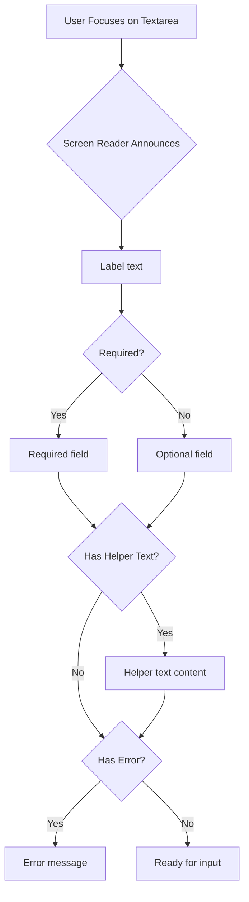

# Textarea

<cite>
**Referenced Files in This Document**   
- [Textarea.tsx](file://packages/ui/src/components/ui/inputs/Textarea/Textarea.tsx)
- [index.tsx](file://packages/ui/src/components/ui/inputs/Textarea/index.tsx)
- [Textarea.stories.tsx](file://packages/ui/src/components/ui/inputs/Textarea/Textarea.stories.tsx)
</cite>

## Table of Contents
1. [Introduction](#introduction)
2. [Core Components](#core-components)
3. [Controlled and Uncontrolled State Patterns](#controlled-and-uncontrolled-state-patterns)
4. [Props Documentation](#props-documentation)
5. [Accessibility Implementation](#accessibility-implementation)
6. [Styling and Tailwind CSS Integration](#styling-and-tailwind-css-integration)
7. [Form Integration and MobX Pattern](#form-integration-and-mobx-pattern)
8. [Auto-Resizing Behavior](#auto-resizing-behavior)
9. [Usage Examples](#usage-examples)
10. [Common Issues and Solutions](#common-issues-and-solutions)
11. [Extension and Customization](#extension-and-customization)

## Introduction
The Textarea component in the prj-core UI library provides a flexible and accessible multi-line text input element for user input. Built as a wrapper around the @heroui/react Textarea component, it offers both controlled and uncontrolled usage patterns, comprehensive accessibility support, and seamless integration with form state management systems. This documentation details the implementation, usage patterns, and integration capabilities of the Textarea component.

**Section sources**
- [Textarea.tsx](file://packages/ui/src/components/ui/inputs/Textarea/Textarea.tsx#L1-L20)
- [index.tsx](file://packages/ui/src/components/ui/inputs/Textarea/index.tsx#L1-L38)

## Core Components
The Textarea implementation consists of two primary files that work together to provide different usage patterns:

1. **Textarea.tsx**: The base component that handles the fundamental controlled state pattern and event handling
2. **index.tsx**: The observer-wrapped component that integrates with MobX for state management in form contexts

The architecture follows a wrapper pattern where the base Textarea component is enhanced with additional functionality in the exported component.



**Diagram sources**
- [Textarea.tsx](file://packages/ui/src/components/ui/inputs/Textarea/Textarea.tsx#L1-L20)
- [index.tsx](file://packages/ui/src/components/ui/inputs/Textarea/index.tsx#L1-L38)

**Section sources**
- [Textarea.tsx](file://packages/ui/src/components/ui/inputs/Textarea/Textarea.tsx#L1-L20)
- [index.tsx](file://packages/ui/src/components/ui/inputs/Textarea/index.tsx#L1-L38)

## Controlled and Uncontrolled State Patterns
The Textarea component supports both controlled and uncontrolled state management patterns through its dual implementation:

### Controlled Pattern
The base Textarea component (Textarea.tsx) implements a controlled pattern requiring explicit value and onChange props:

- Accepts `value?: string` prop for controlled state
- Requires `onChange?: (value: string) => void` callback for value updates
- Handles input change events by extracting the value from the event object
- Properly types the onChange event handler with React.ChangeEvent<HTMLInputElement>

### MobX Integration Pattern
The wrapped component (index.tsx) implements an uncontrolled pattern with automatic state synchronization:

- Uses `useFormField` hook to connect to MobX state
- Accepts `state` and `path` props to bind to specific state properties
- Automatically initializes with values from the state tree using `tools.get()`
- Updates state through the formField.setValue method
- Implements observer pattern for reactive updates



**Diagram sources**
- [Textarea.tsx](file://packages/ui/src/components/ui/inputs/Textarea/Textarea.tsx#L12-L18)
- [index.tsx](file://packages/ui/src/components/ui/inputs/Textarea/index.tsx#L20-L24)

**Section sources**
- [Textarea.tsx](file://packages/ui/src/components/ui/inputs/Textarea/Textarea.tsx#L5-L19)
- [index.tsx](file://packages/ui/src/components/ui/inputs/Textarea/index.tsx#L14-L34)

## Props Documentation
The Textarea component accepts a comprehensive set of props that control its appearance, behavior, and functionality:

### Core Props
- `value?: string`: The controlled value of the textarea
- `onChange?: (value: string) => void`: Callback function called when the value changes
- `rows?: number`: The number of visible text lines for the control
- `placeholder?: string`: Hint text to display when the textarea is empty
- `disabled?: boolean`: Whether the textarea is disabled
- `required?: boolean`: Whether the textarea is required
- `helperText?: string`: Additional text displayed below the textarea

### State and Validation Props
- `error?: boolean`: Indicates if the textarea has a validation error
- `success?: boolean`: Indicates if the textarea has passed validation
- `warning?: boolean`: Indicates a warning state

### Resize Behavior
- `resize?: 'none' | 'vertical' | 'horizontal' | 'both'`: Controls the resize behavior of the textarea

### Accessibility Props
- `aria-invalid?: boolean`: Indicates if the value is invalid
- `aria-describedby?: string`: ID of element containing descriptive text
- `label?: string`: Visible label for the textarea
- `id?: string`: Unique identifier for the textarea

**Section sources**
- [Textarea.tsx](file://packages/ui/src/components/ui/inputs/Textarea/Textarea.tsx#L5-L9)
- [index.tsx](file://packages/ui/src/components/ui/inputs/Textarea/index.tsx#L10-L12)

## Accessibility Implementation
The Textarea component includes comprehensive accessibility features to ensure usability for all users:

### ARIA Attributes
- `aria-invalid`: Dynamically set based on validation state to indicate errors to screen readers
- `aria-describedby`: Connects the textarea to helper text or error messages for additional context
- `aria-required`: Set when the required prop is true
- Proper labeling with `label` and `id` attributes for screen reader association

### Keyboard Navigation
- Full keyboard accessibility with tab navigation
- Proper focus states for visual indication
- Support for standard textarea keyboard interactions (Enter, Shift+Enter, etc.)

### Screen Reader Support
- Semantic HTML structure with proper form labeling
- Error and validation states announced to screen readers
- Helper text properly associated and announced



**Diagram sources**
- [Textarea.tsx](file://packages/ui/src/components/ui/inputs/Textarea/Textarea.tsx#L1-L20)
- [index.tsx](file://packages/ui/src/components/ui/inputs/Textarea/index.tsx#L1-L38)

**Section sources**
- [Textarea.tsx](file://packages/ui/src/components/ui/inputs/Textarea/Textarea.tsx#L1-L20)
- [index.tsx](file://packages/ui/src/components/ui/inputs/Textarea/index.tsx#L1-L38)

## Styling and Tailwind CSS Integration
The Textarea component leverages Tailwind CSS for styling with a utility-first approach:

### Base Styling
- Uses Tailwind's form input classes for consistent appearance
- Applies border, padding, and focus styles through utility classes
- Implements responsive design principles

### State-based Styling
- Different visual states for default, focus, error, success, and warning
- Focus rings with appropriate contrast
- Disabled state with reduced opacity and cursor

### Customization
- Supports additional className prop for custom styling
- Preserves existing Tailwind classes while allowing extension
- Consistent with the overall design system

**Section sources**
- [Textarea.tsx](file://packages/ui/src/components/ui/inputs/Textarea/Textarea.tsx#L18)
- [index.tsx](file://packages/ui/src/components/ui/inputs/Textarea/index.tsx#L27-L31)

## Form Integration and MobX Pattern
The Textarea component is designed for seamless integration with form systems, particularly MobX-based state management:

### MobX Integration
- Uses `observer` from mobx-react-lite for reactive updates
- Accepts `state` and `path` props to bind to specific state properties
- Utilizes `useFormField` hook for form field management
- Implements two-way binding between UI and state

### Form Field Management
- Initializes with values from the state tree
- Updates state through the formField API
- Handles edge cases like undefined or null values
- Provides type safety with generics

```mermaid
classDiagram
class Textarea {
+state : T
+path : string
+value : string
+onChange : (value : string) => void
-initialValue : string
-formField : FormField
-handleChange(value : string) : void
}
class FormField {
+state : { value : string }
+setValue(value : string) : void
+reset() : void
}
class useFormField {
+value : string
+state : T
+path : string
+returns : FormField
}
Textarea --> FormField : "uses"
Textarea --> useFormField : "calls"
useFormField --> FormField : "returns"
```

**Diagram sources**
- [index.tsx](file://packages/ui/src/components/ui/inputs/Textarea/index.tsx#L14-L34)

**Section sources**
- [index.tsx](file://packages/ui/src/components/ui/inputs/Textarea/index.tsx#L1-L38)

## Auto-Resizing Behavior
The Textarea component inherits auto-resizing behavior from the @heroui/react base component:

### Height Calculation
- Automatically adjusts height based on content
- Prevents unnecessary scrollbars when content fits
- Handles edge cases like empty values and placeholder text

### Scroll Behavior
- Smooth scrolling within the textarea
- Proper handling of keyboard navigation within scrollable content
- Prevention of layout shifts during resizing

### Performance Considerations
- Efficient resize calculations to minimize re-renders
- Debounced resize operations when appropriate
- Memory-efficient handling of large text content

**Section sources**
- [Textarea.tsx](file://packages/ui/src/components/ui/inputs/Textarea/Textarea.tsx#L18)

## Usage Examples
The Textarea component can be used in various contexts as demonstrated in the Storybook examples:

### Basic Usage
```typescript
<Textarea 
  label="Description" 
  placeholder="Enter a description..." 
/>
```

### With Initial Value
```typescript
const [value, setValue] = useState("Initial text");
<Textarea 
  label="Description"
  value={value} 
  onChange={setValue} 
/>
```

### In Form Context
```typescript
<Textarea 
  state={formState} 
  path="description"
  label="Description"
/>
```

### With Validation
```typescript
<Textarea 
  label="Description"
  error={hasError}
  helperText={errorMessage}
  required
/>
```

**Section sources**
- [Textarea.stories.tsx](file://packages/ui/src/components/ui/inputs/Textarea/Textarea.stories.tsx#L18-L37)

## Common Issues and Solutions
### Height Calculation Issues
- **Issue**: Textarea height not adjusting properly
- **Solution**: Ensure proper CSS reset and inherited font styles
- **Workaround**: Set explicit rows or use min-height utilities

### Value/onChange Handling
- **Issue**: Uncontrolled to controlled input warning
- **Solution**: Be consistent with controlled vs uncontrolled patterns
- **Best Practice**: Initialize state properly when using controlled components

### Scroll Behavior
- **Issue**: Unwanted scrollbars or scrolling issues
- **Solution**: Check CSS overflow properties and box-sizing
- **Fix**: Ensure proper resize behavior settings

### Form Integration
- **Issue**: State not updating in MobX context
- **Solution**: Verify state and path props are correct
- **Debug**: Check that the observer is properly wrapping the component

**Section sources**
- [Textarea.tsx](file://packages/ui/src/components/ui/inputs/Textarea/Textarea.tsx#L14-L16)
- [index.tsx](file://packages/ui/src/components/ui/inputs/Textarea/index.tsx#L22-L24)

## Extension and Customization
The Textarea component can be extended and customized for specific use cases:

### Custom Validation
- Implement custom validation logic in the onChange handler
- Use helperText to display validation feedback
- Combine with form validation libraries

### Styling Extensions
- Add custom className for additional styling
- Override specific Tailwind classes
- Create themed variants

### Behavior Customization
- Extend with additional event handlers (onFocus, onBlur, etc.)
- Implement character counting or word counting
- Add formatting or auto-correction features

### Integration with Form Libraries
- Wrap for use with React Hook Form
- Adapt for Formik or other form state management libraries
- Create higher-order components for specific use cases

**Section sources**
- [Textarea.tsx](file://packages/ui/src/components/ui/inputs/Textarea/Textarea.tsx#L11-L19)
- [index.tsx](file://packages/ui/src/components/ui/inputs/Textarea/index.tsx#L14-L34)