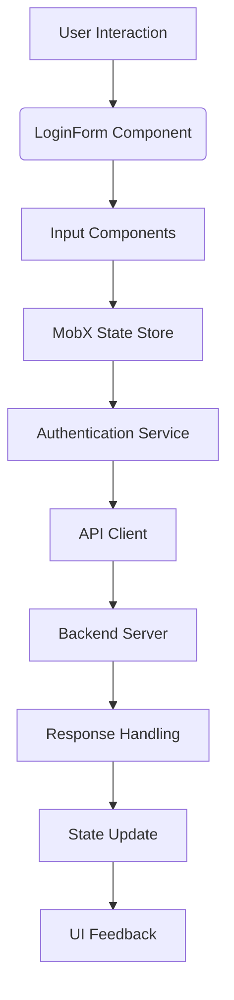
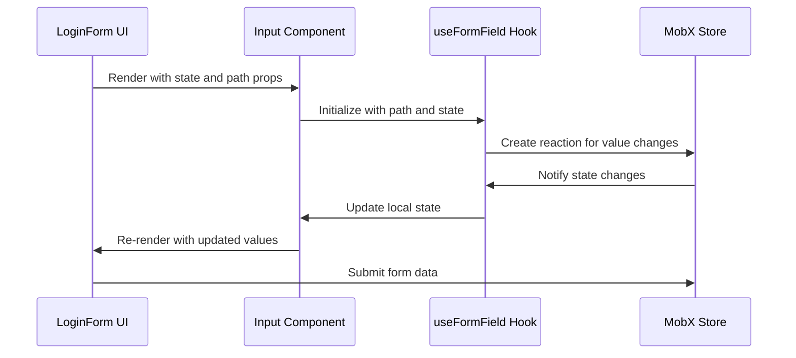
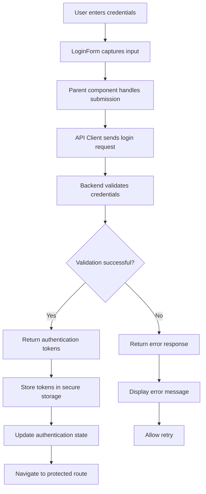
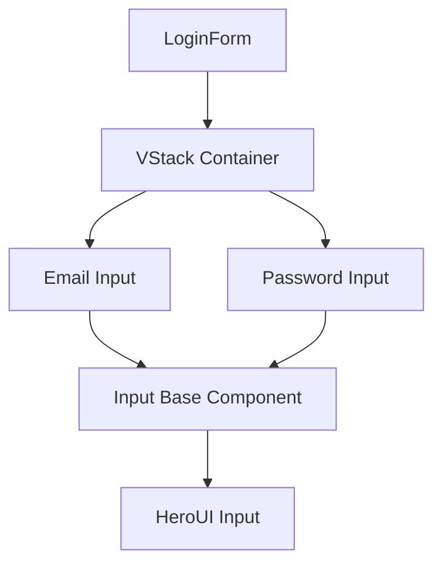
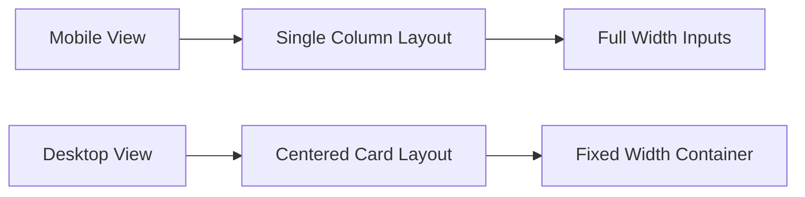
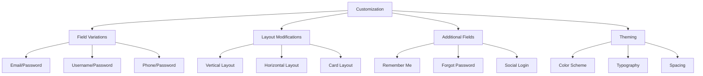

# LoginForm

<cite>
**Referenced Files in This Document**   
- [LoginForm.tsx](file://packages/ui/src/components/form/LoginForm/LoginForm.tsx)
- [LoginForm.stories.tsx](file://packages/ui/src/components/form/LoginForm/LoginForm.stories.tsx)
- [Input.tsx](file://packages/ui/src/components/inputs/Input/Input.tsx)
- [useAdminLoginRoute.ts](file://apps/admin/src/hooks/useAdminLoginRoute.ts)
- [AdminAuthLoginPage.tsx](file://packages/ui/src/components/page/AdminAuthLoginPage.tsx)
- [authStore.ts](file://packages/store/src/stores/authStore.ts)
- [useFormField.ts](file://packages/hooks/src/useFormField.ts)
- [index.ts](file://packages/types/src/index.ts)
</cite>

## Table of Contents
1. [Introduction](#introduction)
2. [Core Components](#core-components)
3. [Architecture Overview](#architecture-overview)
4. [Detailed Component Analysis](#detailed-component-analysis)
5. [State Management and MobX Integration](#state-management-and-mobx-integration)
6. [Authentication Flow Integration](#authentication-flow-integration)
7. [Form Composition and UI Structure](#form-composition-and-ui-structure)
8. [Props and Configuration](#props-and-configuration)
9. [Responsive Layout and Theming](#responsive-layout-and-theming)
10. [Common Issues and Solutions](#common-issues-and-solutions)
11. [Customization Guidelines](#customization-guidelines)
12. [Conclusion](#conclusion)

## Introduction
The LoginForm component is a core authentication interface within the prj-core's shared-frontend package, designed to provide a standardized login experience across applications. This documentation provides a comprehensive analysis of the component's implementation, covering its composition with Input and Button components, state management through MobX stores, and integration with authentication flows. The component serves as a critical entry point for user authentication, handling email and password submission with proper validation, loading states, and error handling mechanisms.

## Core Components
The LoginForm component is part of a larger authentication ecosystem that includes various supporting components and services. It works in conjunction with the Input component for field management, Button component for submission, and integrates with MobX stores for state management. The component is designed to be reusable across different applications within the prj-core monorepo, particularly in the admin and mobile applications.

**Section sources**
- [LoginForm.tsx](file://packages/ui/src/components/form/LoginForm/LoginForm.tsx)
- [AdminAuthLoginPage.tsx](file://packages/ui/src/components/page/AdminAuthLoginPage.tsx)

## Architecture Overview
The LoginForm operates within a well-defined architecture that separates concerns between presentation, state management, and business logic. The component follows a unidirectional data flow pattern where state is managed externally and passed down as props, while user interactions trigger callbacks that propagate changes upward.



**Diagram sources **
- [LoginForm.tsx](file://packages/ui/src/components/form/LoginForm/LoginForm.tsx)
- [authStore.ts](file://packages/store/src/stores/authStore.ts)

## Detailed Component Analysis

### LoginForm Implementation
The LoginForm component is a functional React component that renders a simple form with email and password input fields. It uses a VStack layout to vertically align the input components and applies consistent styling across the form elements.

#### Component Structure
```mermaid
classDiagram
class LoginForm {
+state : { email : string, password : string }
+render() : JSX.Element
}
class Input {
+path : string
+state : object
+variant : string
+type : string
+placeholder : string
+label : string
}
class VStack {
+fullWidth : boolean
+justifyContent : string
}
LoginForm --> Input : "composes"
LoginForm --> VStack : "uses"
```

**Diagram sources **
- [LoginForm.tsx](file://packages/ui/src/components/form/LoginForm/LoginForm.tsx)
- [Input.tsx](file://packages/ui/src/components/inputs/Input/Input.tsx)

**Section sources**
- [LoginForm.tsx](file://packages/ui/src/components/form/LoginForm/LoginForm.tsx)
- [LoginForm.stories.tsx](file://packages/ui/src/components/form/LoginForm/LoginForm.stories.tsx)

## State Management and MobX Integration
The LoginForm component leverages MobX for state management through a sophisticated pattern that connects form inputs to observable state objects. The integration is facilitated by the useFormField hook and MobX props system, enabling two-way data binding between the UI and state store.

### State Flow Mechanism


**Diagram sources **
- [useFormField.ts](file://packages/hooks/src/useFormField.ts)
- [index.ts](file://packages/types/src/index.ts)

The state management system uses a path-based addressing mechanism where each input field is bound to a specific path within the state object (e.g., "email" and "password"). The useFormField hook establishes bidirectional reactions between the component's local state and the MobX store, ensuring that changes in either direction are properly synchronized.

**Section sources**
- [useFormField.ts](file://packages/hooks/src/useFormField.ts)
- [index.ts](file://packages/types/src/index.ts)

## Authentication Flow Integration
The LoginForm is integrated into a comprehensive authentication flow that handles user login, token management, and navigation. The component itself is stateless and relies on its parent components to handle the authentication logic and state management.

### Authentication Workflow


**Diagram sources **
- [useAdminLoginRoute.ts](file://apps/admin/src/hooks/useAdminLoginRoute.ts)
- [authStore.ts](file://packages/store/src/stores/authStore.ts)

The integration with the authentication flow is demonstrated in the AdminAuthLoginPage component, which wraps the LoginForm and provides the necessary state and handlers for the login process. The onClickLogin handler in the useAdminLoginRoute hook manages the submission process, including API calls and error handling.

**Section sources**
- [useAdminLoginRoute.ts](file://apps/admin/src/hooks/useAdminLoginRoute.ts)
- [AdminAuthLoginPage.tsx](file://packages/ui/src/components/page/AdminAuthLoginPage.tsx)

## Form Composition and UI Structure
The LoginForm is composed of fundamental UI components that work together to create a cohesive user experience. The component uses a VStack container to organize the input fields vertically with proper spacing and alignment.

### Component Composition


**Diagram sources **
- [LoginForm.tsx](file://packages/ui/src/components/form/LoginForm/LoginForm.tsx)
- [Input.tsx](file://packages/ui/src/components/inputs/Input/Input.tsx)

The form composition follows a layered architecture where the LoginForm uses the Input component, which in turn wraps a base input component from the HeroUI library. This abstraction allows for consistent styling and behavior across all input fields while providing a clean API for the LoginForm.

**Section sources**
- [LoginForm.tsx](file://packages/ui/src/components/form/LoginForm/LoginForm.tsx)
- [Input.tsx](file://packages/ui/src/components/inputs/Input/Input.tsx)

## Props and Configuration
The LoginForm component accepts a single prop that defines its behavior and appearance. The component is designed to be simple and focused, with configuration options provided through the state object.

### Props Interface
```typescript
interface LoginFormProps {
    state: {
        email: string;
        password: string;
    };
}
```

The state prop contains the current values of the form fields and is used to bind the input components to the external state management system. This pattern allows parent components to control the form state and respond to changes as needed.

**Section sources**
- [LoginForm.tsx](file://packages/ui/src/components/form/LoginForm/LoginForm.tsx)

## Responsive Layout and Theming
The LoginForm is designed to be responsive and adaptable to different screen sizes and themes. While the component itself doesn't contain explicit responsive styling, it inherits these capabilities from its parent components and the underlying UI library.

### Layout Behavior


**Diagram sources **
- [AuthLayout.tsx](file://packages/ui/src/components/layout/Auth/AuthLayout.tsx)

The responsive behavior is primarily managed by the AuthLayout component, which adjusts the presentation based on screen size. On mobile devices, the form is displayed in a full-width layout, while on desktop devices, it appears in a centered card with additional content on the side.

**Section sources**
- [AuthLayout.tsx](file://packages/ui/src/components/layout/Auth/AuthLayout.tsx)

## Common Issues and Solutions
Several common issues may arise when implementing and using the LoginForm component. Understanding these issues and their solutions is crucial for maintaining a reliable authentication experience.

### Validation Feedback Timing
One potential issue is the timing of validation feedback. Since the LoginForm relies on external state management, validation errors may not appear immediately when the user interacts with the form. The solution is to ensure that validation reactions are properly established in the useFormField hook and that error states are propagated correctly from the MobX store.

### Password Visibility Toggling
The current implementation doesn't include a password visibility toggle, which could be a usability enhancement. This could be implemented by adding a button next to the password field that toggles the input type between "password" and "text".

### Social Login Button Integration
For applications requiring social login options, the LoginForm can be extended or supplemented with additional buttons for services like Google or Facebook. This would typically be handled by the parent component rather than the LoginForm itself.

**Section sources**
- [LoginForm.tsx](file://packages/ui/src/components/form/LoginForm/LoginForm.tsx)
- [useFormField.ts](file://packages/hooks/src/useFormField.ts)

## Customization Guidelines
The LoginForm component can be customized for different authentication scenarios while maintaining consistency across the application.

### Customization Options


**Diagram sources **
- [LoginForm.tsx](file://packages/ui/src/components/form/LoginForm/LoginForm.tsx)
- [AdminAuthLoginPage.tsx](file://packages/ui/src/components/page/AdminAuthLoginPage.tsx)

When customizing the LoginForm for different scenarios, it's recommended to create wrapper components rather than modifying the core LoginForm. This approach maintains consistency while allowing for application-specific variations.

**Section sources**
- [LoginForm.tsx](file://packages/ui/src/components/form/LoginForm/LoginForm.tsx)
- [AdminAuthLoginPage.tsx](file://packages/ui/src/components/page/AdminAuthLoginPage.tsx)

## Conclusion
The LoginForm component in prj-core's shared-frontend package provides a robust and flexible solution for user authentication. By leveraging MobX for state management and following a clean component composition pattern, the LoginForm offers a reliable foundation for authentication interfaces across the application ecosystem. The component's integration with the broader authentication flow, including API calls and navigation, demonstrates a well-architected approach to handling user login. With proper customization and extension, the LoginForm can serve a variety of authentication scenarios while maintaining consistency and usability.