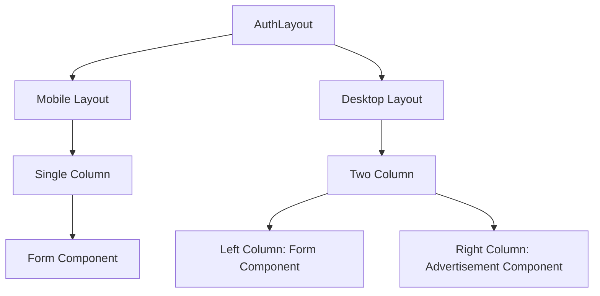
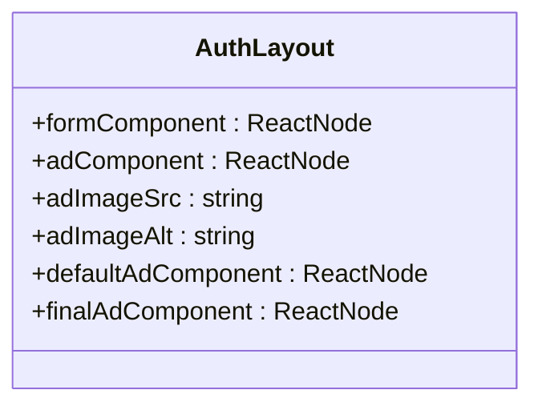
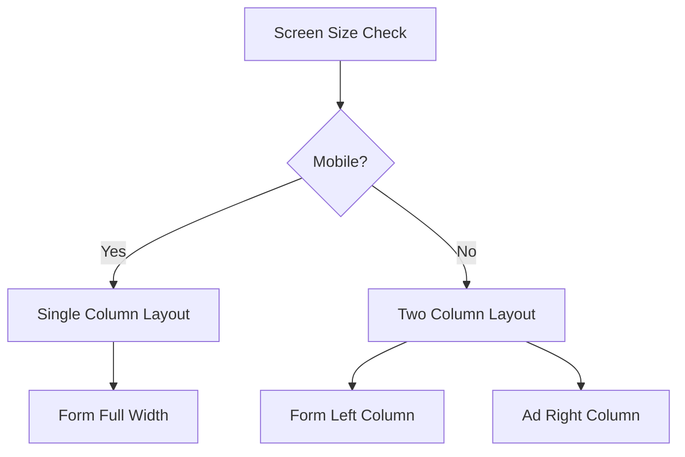

# Auth Layout

<cite>
**Referenced Files in This Document**   
- [AuthLayout.tsx](file://packages/ui/src/components/layout/Auth/AuthLayout.tsx)
- [AdminAuthLoginPage.tsx](file://packages/ui/src/components/page/AdminAuthLoginPage.tsx)
- [auth.tsx](file://apps/admin/src/routes/admin/auth.tsx)
- [index.ts](file://packages/ui/src/components/layout/index.ts)
- [AuthLayout.stories.tsx](file://packages/ui/src/components/layout/Auth/AuthLayout.stories.tsx)
</cite>

## Table of Contents
1. [Introduction](#introduction)
2. [Core Components](#core-components)
3. [Architecture Overview](#architecture-overview)
4. [Detailed Component Analysis](#detailed-component-analysis)
5. [Usage Patterns](#usage-patterns)
6. [Responsive Design Characteristics](#responsive-design-characteristics)
7. [Styling Approach](#styling-approach)
8. [Common Issues and Solutions](#common-issues-and-solutions)
9. [Conclusion](#conclusion)

## Introduction
The AuthLayout component in prj-core's shared-frontend package provides a consistent structure for authentication pages across the admin and mobile applications. This documentation details its implementation, purpose, interface, and usage patterns, with a focus on responsive design and integration with routing.

## Core Components
The AuthLayout component is a key structural element for authentication pages, designed to provide a consistent user experience across different devices and applications. It serves as a wrapper for login and tenant selection pages, offering a flexible layout that adapts to various screen sizes.

**Section sources**
- [AuthLayout.tsx](file://packages/ui/src/components/layout/Auth/AuthLayout.tsx)
- [AdminAuthLoginPage.tsx](file://packages/ui/src/components/page/AdminAuthLoginPage.tsx)

## Architecture Overview
The AuthLayout component follows a responsive design pattern that adapts its structure based on screen size. On mobile devices, it displays content in a single column, while on desktop devices, it splits the content into two columns with the form on the left and additional content on the right.



**Diagram sources**
- [AuthLayout.tsx](file://packages/ui/src/components/layout/Auth/AuthLayout.tsx)

## Detailed Component Analysis
The AuthLayout component is implemented as a React functional component that accepts several props to customize its behavior and appearance. It uses Tailwind CSS for styling and responsive design.

### Interface and Props
The AuthLayout component accepts the following props:
- `formComponent`: The main form component to be displayed (e.g., login form)
- `adComponent`: An optional component to be displayed alongside the form on desktop
- `adImageSrc`: An optional image source for a default advertisement component
- `adImageAlt`: Alternative text for the advertisement image (defaults to "Advertisement")

The component implements logic to create a default image component when `adImageSrc` is provided but no `adComponent` is specified.

#### Component Structure


**Diagram sources**
- [AuthLayout.tsx](file://packages/ui/src/components/layout/Auth/AuthLayout.tsx)

## Usage Patterns
The AuthLayout component is used in both the admin and mobile applications to provide a consistent authentication experience. It is typically integrated with routing to wrap authentication-related pages.

### Integration with Routing
In the admin application, the AuthLayout is used in conjunction with TanStack Router to wrap authentication routes. The routing configuration sets up a parent route for authentication pages, with the AuthLayout serving as the container for child routes like login and tenant selection.

```mermaid
graph TD
A[/admin/auth] --> B[/admin/auth/login]
A --> C[/admin/auth/tenant-select]
A --> D[AuthLayout]
D --> E[Login Form]
D --> F[Tenant Selection Form]
```

**Diagram sources**
- [auth.tsx](file://apps/admin/src/routes/admin/auth.tsx)
- [AuthLayout.tsx](file://packages/ui/src/components/layout/Auth/AuthLayout.tsx)

### Example Usage
The AuthLayout is used to wrap the AdminAuthLoginPage, which contains the actual login form. This separation of concerns allows for consistent layout while enabling customization of the form content.

**Section sources**
- [AdminAuthLoginPage.tsx](file://packages/ui/src/components/page/AdminAuthLoginPage.tsx)
- [auth.tsx](file://apps/admin/src/routes/admin/auth.tsx)

## Responsive Design Characteristics
The AuthLayout component implements responsive design principles to ensure optimal user experience across different devices.

### Mobile Layout
On mobile devices (screen width less than 768px), the component displays content in a single column with the form taking the full width of the screen. The mobile layout uses the `md:hidden` Tailwind CSS class to hide the desktop-specific elements.

### Desktop Layout
On desktop devices (screen width 768px and above), the component displays content in a two-column layout. The form is placed in the left column with a maximum width of `max-w-md`, while the advertisement or additional content occupies the right column.

### Responsive Behavior
The component uses Tailwind CSS's responsive prefixes (`md:`) to control the visibility and layout of elements based on screen size. The flexbox layout adapts from a column direction on mobile to a row direction on desktop.



**Diagram sources**
- [AuthLayout.tsx](file://packages/ui/src/components/layout/Auth/AuthLayout.tsx)

## Styling Approach
The AuthLayout component uses Tailwind CSS for styling, leveraging utility classes to create a responsive and consistent design.

### Tailwind CSS Implementation
The component relies heavily on Tailwind CSS classes for layout and styling:
- Flexbox utilities (`flex`, `flex-col`, `flex-row`) for layout
- Responsive prefixes (`md:`) for device-specific styling
- Spacing utilities (`p-6`, `p-10`, `p-4`) for padding
- Sizing utilities (`w-full`, `max-w-md`) for width control
- Height utilities (`min-h-screen`, `h-full`) for height control

### Design Principles
The styling approach follows several key principles:
- Mobile-first design with progressive enhancement for larger screens
- Consistent spacing and alignment across devices
- Flexible layout that adapts to content size
- Accessibility considerations through proper contrast and focus states

**Section sources**
- [AuthLayout.tsx](file://packages/ui/src/components/layout/Auth/AuthLayout.tsx)

## Common Issues and Solutions
### Form Alignment
One common issue is form alignment within the layout, particularly on larger screens where the form might appear too narrow or too wide. The solution is to use the `max-w-md` class to constrain the form width while allowing it to expand to fill available space on smaller screens.

### Mobile Responsiveness
Ensuring proper mobile responsiveness can be challenging, especially with complex forms. The AuthLayout addresses this by using a single-column layout on mobile devices and hiding the advertisement column with the `md:hidden` class.

### Accessibility Considerations
The component includes several accessibility features:
- Proper alt text for images (with a default value when not specified)
- Semantic HTML structure
- Keyboard navigation support through standard form elements
- Sufficient color contrast for text and interactive elements

**Section sources**
- [AuthLayout.tsx](file://packages/ui/src/components/layout/Auth/AuthLayout.tsx)
- [AuthLayout.stories.tsx](file://packages/ui/src/components/layout/Auth/AuthLayout.stories.tsx)

## Conclusion
The AuthLayout component provides a robust and flexible solution for authentication page layouts in the prj-core application. Its responsive design ensures a consistent user experience across devices, while its modular structure allows for easy customization and integration with routing. By leveraging Tailwind CSS and React's component model, the AuthLayout delivers a maintainable and scalable solution for authentication interfaces.