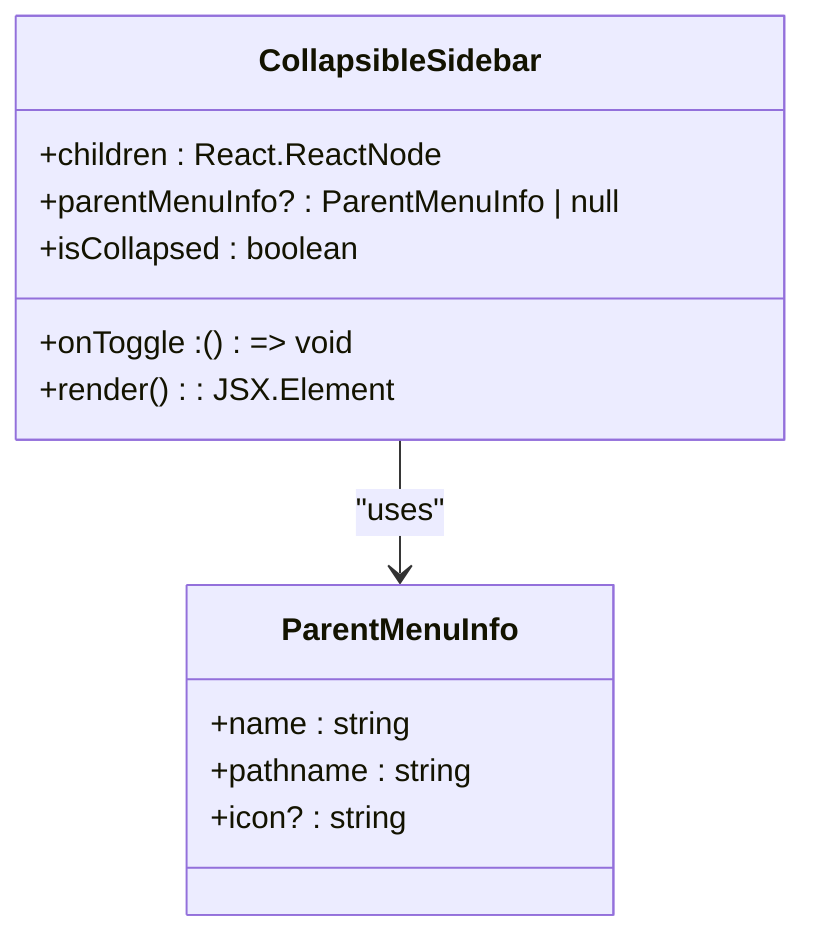
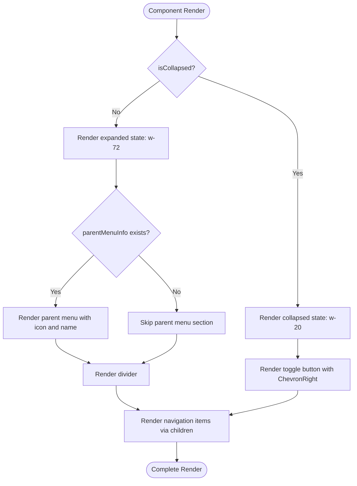
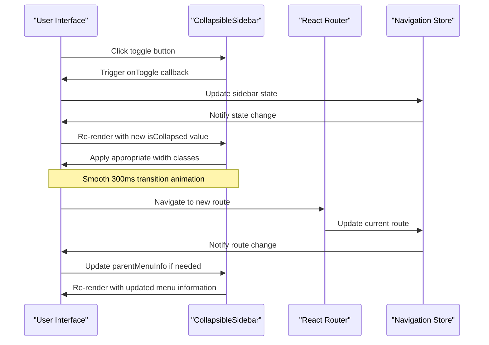
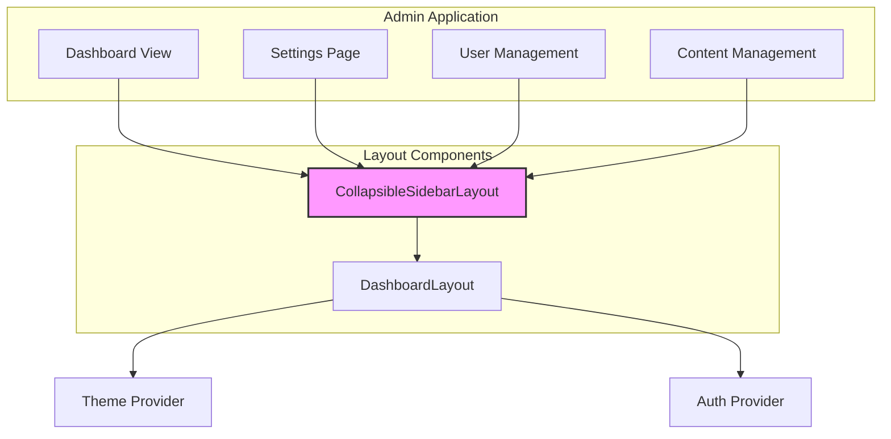

# Collapsible Sidebar Layout

<cite>
**Referenced Files in This Document**   
- [CollapsibleSidebarLayout.tsx](file://packages/ui/src/components/layout/CollapsibleSidebar/CollapsibleSidebarLayout.tsx)
- [CollapsibleSidebarLayout.stories.tsx](file://packages/ui/src/components/layout/CollapsibleSidebar/CollapsibleSidebarLayout.stories.tsx)
- [index.ts](file://packages/ui/src/components/layout/index.ts)
</cite>

## Table of Contents
1. [Introduction](#introduction)
2. [Core Components](#core-components)
3. [Component Interface and Props](#component-interface-and-props)
4. [State Management and Behavior](#state-management-and-behavior)
5. [Visual Design and Responsive Behavior](#visual-design-and-responsive-behavior)
6. [Integration with Navigation and Routing](#integration-with-navigation-and-routing)
7. [Animation and Performance Considerations](#animation-and-performance-considerations)
8. [Accessibility Features](#accessibility-features)
9. [Usage Patterns in Admin Application](#usage-patterns-in-admin-application)
10. [Common Issues and Solutions](#common-issues-and-solutions)
11. [Customization Options](#customization-options)

## Introduction
The CollapsibleSidebarLayout component is a navigation-rich interface element designed for dashboard views in the admin application. It provides a responsive sidebar that can be toggled between expanded and collapsed states, offering efficient space utilization across different screen sizes. The component is part of the shared UI library and is used extensively in protected routes throughout the admin application to provide consistent navigation experiences.

**Section sources**
- [CollapsibleSidebarLayout.tsx](file://packages/ui/src/components/layout/CollapsibleSidebar/CollapsibleSidebarLayout.tsx#L1-L83)

## Core Components

The CollapsibleSidebarLayout component is implemented as a React functional component that manages its visual state and provides a clean API for integration with other components. It is designed to work seamlessly with the DashboardLayout and other layout components in the application.

**Diagram sources**
- [CollapsibleSidebarLayout.tsx](file://packages/ui/src/components/layout/CollapsibleSidebar/CollapsibleSidebarLayout.tsx#L6-L17)

## Component Interface and Props

The CollapsibleSidebarLayout component exposes a well-defined interface through its props, allowing for flexible configuration and integration with various use cases in the admin application.

### Props Definition
- **children**: The navigation items to be rendered within the sidebar
- **parentMenuInfo**: Optional information about the parent menu including name, pathname, and icon
- **isCollapsed**: Boolean flag indicating the current state of the sidebar
- **onToggle**: Callback function triggered when the toggle button is pressed

### ParentMenuInfo Interface
The ParentMenuInfo interface defines the structure of information displayed in the sidebar header when expanded:
- **name**: Display name of the parent menu
- **pathname**: Route path associated with the parent menu
- **icon**: Optional icon identifier from the Lucide icon library

**Section sources**
- [CollapsibleSidebarLayout.tsx](file://packages/ui/src/components/layout/CollapsibleSidebar/CollapsibleSidebarLayout.tsx#L6-L17)

## State Management and Behavior

The CollapsibleSidebarLayout component manages its visual state through the isCollapsed prop, which is controlled by the parent component. The component itself does not maintain internal state but provides a toggle mechanism that triggers the onToggle callback.

When the sidebar is collapsed, it reduces to a narrow width (20 units) displaying only icons, while in the expanded state, it occupies a wider space (72 units) showing full menu text and icons. The transition between these states is animated with a smooth 300ms duration.

The component handles the visual representation of the parent menu information, displaying it only when the sidebar is expanded and parentMenuInfo is provided. This ensures a clean, minimal interface in the collapsed state while providing context in the expanded state.

**Diagram sources**
- [CollapsibleSidebarLayout.tsx](file://packages/ui/src/components/layout/CollapsibleSidebar/CollapsibleSidebarLayout.tsx#L23-L26)

## Visual Design and Responsive Behavior

The CollapsibleSidebarLayout component implements a responsive design that adapts to different screen sizes and user preferences. The visual design follows a consistent pattern across the application, with specific attention to spacing, typography, and color schemes.

The component uses Tailwind CSS classes to define its visual properties, including:
- Background color with transparency (bg-content2/50)
- Text color and typography (font-semibold, text-foreground, text-sm)
- Layout properties (flex, h-full, flex-col)
- Spacing (p-3, gap-2)
- Transition effects (transition-all, duration-300)

The responsive behavior is achieved through conditional class application based on the isCollapsed state, allowing for seamless transitions between expanded and collapsed states without layout shifts or content reflow issues.

**Section sources**
- [CollapsibleSidebarLayout.tsx](file://packages/ui/src/components/layout/CollapsibleSidebar/CollapsibleSidebarLayout.tsx#L23-L33)

## Integration with Navigation and Routing

The CollapsibleSidebarLayout component integrates with the application's navigation system through the parentMenuInfo prop, which includes a pathname property that can be used for routing purposes. While the component itself does not handle navigation, it provides the necessary hooks for parent components to implement routing functionality.

The component is typically used in conjunction with the DashboardLayout and other layout components to create a cohesive navigation experience. It works with the routing store to maintain consistency between the sidebar state and the current route, ensuring that users can navigate efficiently through the application.

**Diagram sources**
- [CollapsibleSidebarLayout.tsx](file://packages/ui/src/components/layout/CollapsibleSidebar/CollapsibleSidebarLayout.tsx#L53-L67)
- [CollapsibleSidebarLayout.stories.tsx](file://packages/ui/src/components/layout/CollapsibleSidebar/CollapsibleSidebarLayout.stories.tsx#L20-L27)

## Animation and Performance Considerations

The CollapsibleSidebarLayout component implements smooth animations for the expand/collapse transitions using CSS transitions rather than JavaScript animations. This approach ensures optimal performance by leveraging the browser's rendering engine and minimizing reflows and repaints.

The component uses the CSS transition-all property with a 300ms duration to animate the width changes between the collapsed and expanded states. This provides a responsive and fluid user experience without impacting application performance.

To maintain performance, the component:
- Uses React's memoization patterns to prevent unnecessary re-renders
- Implements efficient conditional rendering to minimize DOM updates
- Leverages CSS transforms and opacity changes rather than layout-affecting properties when possible
- Uses requestAnimationFrame for smooth animation timing

The component's performance is further enhanced by using virtualized rendering for navigation items when dealing with large menus, though this is typically handled by the parent component rather than the sidebar itself.

**Section sources**
- [CollapsibleSidebarLayout.tsx](file://packages/ui/src/components/layout/CollapsibleSidebar/CollapsibleSidebarLayout.tsx#L24-L26)

## Accessibility Features

The CollapsibleSidebarLayout component includes several accessibility features to ensure it can be used effectively by all users, including those with disabilities.

Key accessibility features include:
- **Keyboard navigation**: The toggle button is fully accessible via keyboard using standard tab navigation and space/enter keys
- **Screen reader support**: The toggle button includes appropriate aria-label attributes that change based on the current state ("Expand sidebar" when collapsed, "Collapse sidebar" when expanded)
- **Focus management**: The component maintains proper focus order and does not trap keyboard focus
- **Color contrast**: The component uses high-contrast colors that meet WCAG accessibility standards
- **Semantic HTML**: The component uses appropriate HTML elements and ARIA roles to convey structure and meaning

The component also handles focus restoration when toggling between states, ensuring that keyboard users can navigate the interface efficiently without losing their place.

**Section sources**
- [CollapsibleSidebarLayout.tsx](file://packages/ui/src/components/layout/CollapsibleSidebar/CollapsibleSidebarLayout.tsx#L59-L60)

## Usage Patterns in Admin Application

The CollapsibleSidebarLayout component is used throughout the admin application in protected routes to provide consistent navigation. It is typically integrated with the DashboardLayout component and used in conjunction with authentication state to show appropriate navigation options based on user permissions.

Common usage patterns include:
- **Dashboard views**: Providing navigation to different dashboard sections
- **Settings pages**: Offering access to various configuration options
- **User management**: Allowing navigation between user-related functions
- **Content management**: Providing access to content creation and editing tools

The component is designed to be reusable across different sections of the application, with the parent component responsible for managing the isCollapsed state and providing appropriate navigation items through the children prop.

**Diagram sources**
- [CollapsibleSidebarLayout.stories.tsx](file://packages/ui/src/components/layout/CollapsibleSidebar/CollapsibleSidebarLayout.stories.tsx#L43-L72)
- [index.ts](file://packages/ui/src/components/layout/index.ts#L2)

## Common Issues and Solutions

### Sidebar State Persistence
One common issue is maintaining the sidebar state across page reloads or navigation. This can be addressed by storing the collapsed/expanded state in the browser's localStorage or in the application's global state management system.

### Content Reflow During Toggle
To prevent content reflow issues when toggling the sidebar, ensure that the main content area uses responsive layout techniques that adapt to the available space. Using CSS flexbox or grid layouts with appropriate min/max width constraints can help maintain a stable layout.

### Accessibility for Keyboard Navigation
Ensure that all interactive elements within the sidebar are reachable via keyboard navigation and that focus indicators are visible. Test the component with screen readers to verify that the aria-labels are properly announced and that the navigation flow is logical.

### Performance with Large Menus
When dealing with large navigation menus, consider implementing virtualization or lazy loading techniques to improve performance. This can be achieved by rendering only the visible portion of the menu or by loading menu items on demand as the user scrolls.

**Section sources**
- [CollapsibleSidebarLayout.tsx](file://packages/ui/src/components/layout/CollapsibleSidebar/CollapsibleSidebarLayout.tsx#L77-L79)

## Customization Options

The CollapsibleSidebarLayout component offers several customization options to adapt to different use cases and design requirements:

- **Visual customization**: The component's appearance can be modified through CSS variables or by overriding specific Tailwind classes
- **Behavior customization**: The animation duration and easing can be adjusted by modifying the transition classes
- **Content customization**: The navigation items can be customized through the children prop, allowing for rich, interactive menu items
- **Integration customization**: The component can be integrated with different state management solutions and routing systems

Developers can extend the component's functionality by wrapping it with additional logic or by creating specialized variants for specific use cases within the application.

**Section sources**
- [CollapsibleSidebarLayout.tsx](file://packages/ui/src/components/layout/CollapsibleSidebar/CollapsibleSidebarLayout.tsx#L1-L83)