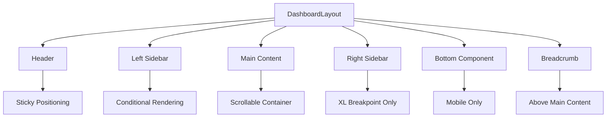
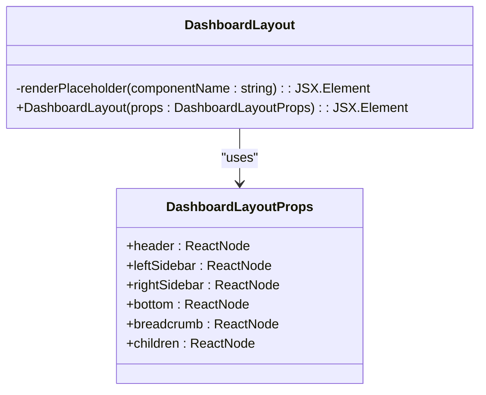
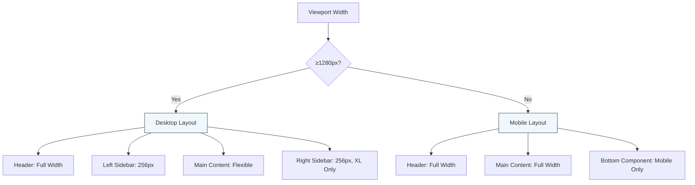
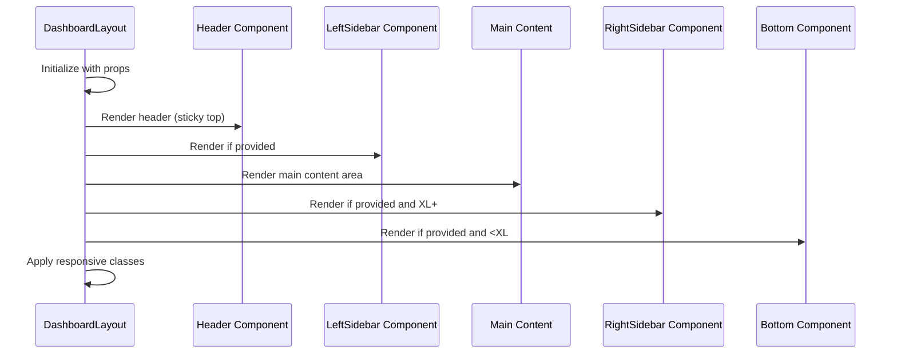
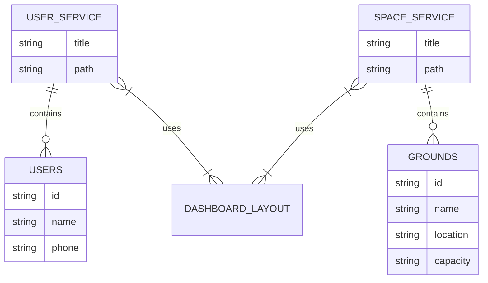
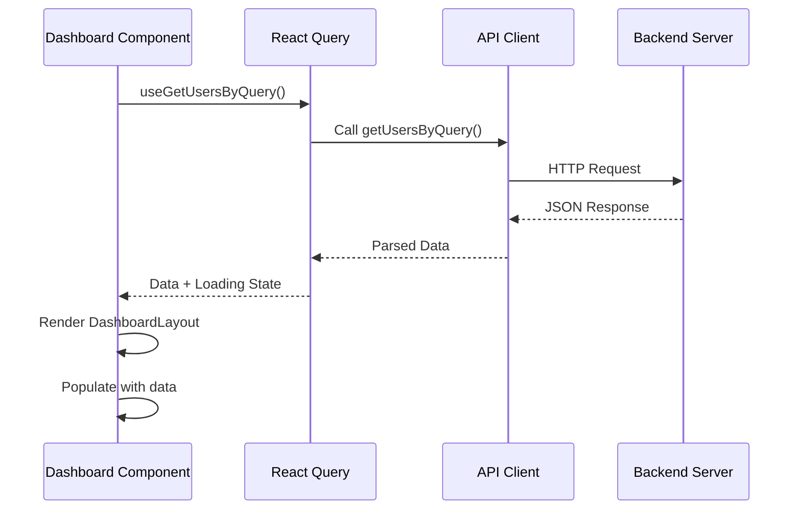

# Dashboard Layout

<cite>
**Referenced Files in This Document**   
- [DashboardLayout.tsx](file://packages/ui/src/components/layout/Dashboard/DashboardLayout.tsx)
- [DashboardLayout.stories.tsx](file://packages/ui/src/components/layout/Dashboard/DashboardLayout.stories.tsx)
- [README.md](file://packages/ui/src/components/layout/Dashboard/README.md)
- [dashboard.tsx](file://apps/admin/src/routes/admin/dashboard.tsx)
- [user-service.tsx](file://apps/admin/src/routes/admin/dashboard/user-service.tsx)
- [space-service.tsx](file://apps/admin/src/routes/admin/dashboard/space-service.tsx)
- [users.tsx](file://apps/admin/src/routes/admin/dashboard/user-service/users.tsx)
- [grounds.tsx](file://apps/admin/src/routes/admin/dashboard/space-service/grounds.tsx)
- [Providers.tsx](file://apps/admin/src/providers/Providers.tsx)
- [api-client/src/apis.ts](file://packages/api-client/src/apis.ts)
</cite>

## Table of Contents
1. [Introduction](#introduction)
2. [Core Architecture](#core-architecture)
3. [Component Interface and Props](#component-interface-and-props)
4. [Responsive Grid System](#responsive-grid-system)
5. [Integration with Header and Sidebar Components](#integration-with-header-and-sidebar-components)
6. [Breadcrumb Navigation System](#breadcrumb-navigation-system)
7. [Usage in Admin Dashboard Views](#usage-in-admin-dashboard-views)
8. [Data Integration and API Fetching](#data-integration-and-api-fetching)
9. [Common Issues and Solutions](#common-issues-and-solutions)
10. [Performance Considerations](#performance-considerations)
11. [Customization and Extension](#customization-and-extension)
12. [Testing and Development](#testing-and-development)

## Introduction

The DashboardLayout component is a foundational UI structure in the prj-core shared-frontend package, designed to provide a consistent and responsive framework for dashboard interfaces. This component serves as the architectural backbone for administrative and user-facing dashboards, offering a flexible layout system that adapts to various screen sizes and content requirements.

The DashboardLayout implements a sophisticated responsive design pattern that automatically adjusts its structure based on viewport width. On desktop devices (≥1280px), it presents a three-column layout with header, left sidebar, main content area, and right sidebar. On tablet and mobile devices (<1280px), it transitions to a simplified single-column layout with a bottom navigation component, optimizing the user experience across different device types.

This documentation provides comprehensive guidance on the implementation details, usage patterns, and integration strategies for the DashboardLayout component. It covers the component's interface, responsive behavior, integration with data visualization elements, and practical examples from the admin dashboard implementation for user and space services.

## Core Architecture

The DashboardLayout component is built with a modular and extensible architecture that prioritizes flexibility and reusability. At its core, the component functions as a container that orchestrates the placement and behavior of various UI elements according to responsive design principles.

The architecture follows a hierarchical structure with distinct regions:
- **Header**: Fixed at the top of the viewport with sticky positioning
- **Left Sidebar**: Optional navigation panel that appears on desktop
- **Main Content**: Primary area for dashboard widgets and data visualization
- **Right Sidebar**: Optional information panel for supplementary content
- **Bottom Component**: Mobile-only navigation or action bar

The component leverages CSS Flexbox for layout management, ensuring proper alignment and spacing across different screen sizes. It uses Tailwind CSS utility classes for styling, with specific attention to responsive breakpoints and accessibility features.



**Diagram sources**
- [DashboardLayout.tsx](file://packages/ui/src/components/layout/Dashboard/DashboardLayout.tsx#L49-L99)

**Section sources**
- [DashboardLayout.tsx](file://packages/ui/src/components/layout/Dashboard/DashboardLayout.tsx#L1-L104)

## Component Interface and Props

The DashboardLayout component exposes a well-defined interface through its props, allowing for flexible configuration and customization. The component accepts several optional and required props that control its appearance and behavior.

### DashboardLayoutProps Interface

| Prop | Type | Required | Description |
|------|------|----------|-------------|
| `children` | `ReactNode` | Yes | The main content to display in the center area |
| `header` | `ReactNode` | No | Optional header component |
| `leftSidebar` | `ReactNode` | No | Optional left sidebar component |
| `rightSidebar` | `ReactNode` | No | Optional right sidebar component |
| `bottom` | `ReactNode` | No | Optional bottom component (mobile only) |
| `breadcrumb` | `ReactNode` | No | Optional breadcrumb navigation component |

The component implements conditional rendering for optional elements, only including sidebars and the bottom component when their respective props are provided. When no custom component is provided for header, left sidebar, or right sidebar, the layout renders placeholder components with descriptive text, aiding in development and debugging.

For the header component specifically, it's important to note that it receives children as a prop. On mobile devices, the DashboardLayout passes a hamburger menu button as children to the header component, which must be rendered to ensure proper mobile navigation functionality.



**Diagram sources**
- [DashboardLayout.tsx](file://packages/ui/src/components/layout/Dashboard/DashboardLayout.tsx#L4-L11)

**Section sources**
- [DashboardLayout.tsx](file://packages/ui/src/components/layout/Dashboard/DashboardLayout.tsx#L4-L11)
- [README.md](file://packages/ui/src/components/layout/Dashboard/README.md#L48-L57)

## Responsive Grid System

The DashboardLayout implements a sophisticated responsive grid system that adapts to different screen sizes and device types. The layout behavior is controlled by CSS breakpoints, with the primary breakpoint at 1280px (XL in Tailwind CSS).

### Desktop Layout (≥1280px)

On desktop devices, the component displays a three-column layout:
- **Header**: Full-width at the top
- **Left Sidebar**: Fixed width of 256px (w-64 in Tailwind) with border on the right
- **Main Content**: Flexible middle section that takes remaining space
- **Right Sidebar**: Fixed width of 256px (w-72 in Tailwind) with border on the left, only visible on XL screens

The desktop layout uses CSS Flexbox with the following structure:
```
┌─────────────────────────────────────┐
│              Header                 │
├─────────┬─────────────────┬─────────┤
│   Left  │                 │  Right  │
│ Sidebar │   Main Content  │ Sidebar │
│ (256px) │                 │ (256px) │
└─────────┴─────────────────┴─────────┘
```

### Mobile Layout (<1280px)

On tablet and mobile devices, the layout simplifies to a single-column structure:
- **Header**: Full-width at the top
- **Main Content**: Full-width section below the header
- **Bottom Component**: Fixed at the bottom, only visible when provided

The mobile layout structure:
```
┌─────────────────────────────────────┐
│              Header                 │
├─────────────────────────────────────┤
│                                     │
│           Main Content              │
│         (Full Width)                │
│                                     │
├─────────────────────────────────────┤
│          Bottom Component           │
│        (Mobile Only)                │
└─────────────────────────────────────┘
```

The responsive behavior is implemented using Tailwind CSS classes:
- Left sidebar: Always visible when provided (`flex` on all screens)
- Right sidebar: Only visible on XL screens (`xl:flex`)
- Bottom component: Only visible on non-XL screens (`xl:hidden`)



**Diagram sources**
- [DashboardLayout.tsx](file://packages/ui/src/components/layout/Dashboard/DashboardLayout.tsx#L56-L98)
- [README.md](file://packages/ui/src/components/layout/Dashboard/README.md#L17-L43)

**Section sources**
- [DashboardLayout.tsx](file://packages/ui/src/components/layout/Dashboard/DashboardLayout.tsx#L56-L98)
- [README.md](file://packages/ui/src/components/layout/Dashboard/README.md#L7-L30)

## Integration with Header and Sidebar Components

The DashboardLayout component is designed to work seamlessly with header and sidebar components, providing a cohesive navigation experience across different views. The integration follows a composable pattern where the layout acts as a container for these UI elements.

### Header Integration

The header component is positioned at the top of the viewport with sticky positioning, ensuring it remains visible during scrolling. It receives special treatment in the component's implementation:

- Uses `sticky top-0 z-40` classes for fixed positioning
- Applies backdrop blur effect with `backdrop-blur-lg` for visual separation
- Renders a border at the bottom with `border-divider border-b`
- Passes children to the header component, which on mobile includes the hamburger menu

When implementing a custom header, it's crucial to render the children prop to ensure the mobile hamburger menu appears correctly. The header's height and padding are controlled by the layout, allowing custom headers to focus on content rather than structural styling.

### Sidebar Integration

The DashboardLayout supports both left and right sidebars with different visibility rules:

**Left Sidebar:**
- Always visible when provided
- Fixed width with `min-w-16` class
- Vertical flex layout with `flex-col`
- Scrollable content with `overflow-y-auto`
- Border on the right with `border-divider border-r`

**Right Sidebar:**
- Only visible on XL screens (≥1280px)
- Fixed width of 256px with `w-72` class
- Hidden on smaller screens with `xl:hidden` class
- Positioned after the main content in the DOM for accessibility

The sidebars use consistent styling with:
- Background color of `bg-content1`
- Padding of `p-4` (left sidebar) or `p-4` (right sidebar)
- Scrollable containers with `scrollbar-thin` class
- Proper z-index stacking for overlapping elements



**Diagram sources**
- [DashboardLayout.tsx](file://packages/ui/src/components/layout/Dashboard/DashboardLayout.tsx#L50-L98)

**Section sources**
- [DashboardLayout.tsx](file://packages/ui/src/components/layout/Dashboard/DashboardLayout.tsx#L46-L98)

## Breadcrumb Navigation System

The DashboardLayout component includes built-in support for breadcrumb navigation through the `breadcrumb` prop. This feature enhances user experience by providing contextual navigation and location awareness within the application hierarchy.

The breadcrumb component is rendered above the main content area with appropriate spacing, ensuring visual separation from both the content and any sidebar elements. It appears below the header and any sidebar content but above the primary dashboard widgets.

Key characteristics of the breadcrumb implementation:
- Positioned within the main content area
- Receives `mb-4 sm:mb-6` classes for responsive margin
- Only rendered when the `breadcrumb` prop is provided
- Maintains consistent styling with the overall design system
- Supports both custom breadcrumb components and automated breadcrumb builders

The breadcrumb system works in conjunction with the application's routing structure, particularly in the admin dashboard views. For example, in the user service and space service sections, breadcrumbs help users understand their current location within the administrative hierarchy.

When implementing breadcrumbs, developers can choose between:
1. **Manual Breadcrumb Components**: Custom implementations with specific navigation items
2. **BreadcrumbBuilder**: Automated component that generates breadcrumbs based on route structure
3. **Hybrid Approach**: Combination of manual and automated elements

The flexibility of the breadcrumb system allows for consistent navigation patterns across different dashboard views while accommodating specific requirements for each service area.

**Section sources**
- [DashboardLayout.tsx](file://packages/ui/src/components/layout/Dashboard/DashboardLayout.tsx#L73-L75)
- [README.md](file://packages/ui/src/components/layout/Dashboard/README.md#L56)

## Usage in Admin Dashboard Views

The DashboardLayout component is extensively used in the admin dashboard views for both user and space services. These implementations demonstrate practical applications of the component's features in real-world scenarios.

### User Service Implementation

In the user service section, the DashboardLayout structures the interface for managing user accounts. The implementation includes:

- **Header**: Displays "사용자 서비스" (User Service) as the section title
- **Main Content**: Contains a table of user information with name and phone number columns
- **Routing**: Integrated with TanStack Router for navigation between user management views

The user service route hierarchy follows a nested pattern:
- `/admin/dashboard/user-service` - Parent route with service title
- `/admin/dashboard/user-service/users` - Child route with user list table

This structure leverages the DashboardLayout to maintain consistent navigation and spacing while allowing each view to focus on its specific content.

### Space Service Implementation

The space service implementation uses the DashboardLayout to organize ground management functionality:

- **Header**: Displays "공간 서비스" (Space Service) as the section title
- **Main Content**: Contains a table of grounds with name, location, and capacity information
- **Nested Routes**: Supports additional views through Outlet components

The space service demonstrates the layout's ability to handle different types of data visualization, from user information to physical space management.

Both implementations follow the same architectural pattern:
1. Route component wraps content in DashboardLayout
2. Header displays section-specific title
3. Main content area contains service-specific data tables
4. Consistent styling and spacing throughout



**Diagram sources**
- [user-service.tsx](file://apps/admin/src/routes/admin/dashboard/user-service.tsx#L3-L12)
- [space-service.tsx](file://apps/admin/src/routes/admin/dashboard/space-service.tsx#L3-L12)
- [users.tsx](file://apps/admin/src/routes/admin/dashboard/user-service/users.tsx#L11-L38)
- [grounds.tsx](file://apps/admin/src/routes/admin/dashboard/space-service/grounds.tsx#L11-L57)

**Section sources**
- [user-service.tsx](file://apps/admin/src/routes/admin/dashboard/user-service.tsx#L3-L16)
- [space-service.tsx](file://apps/admin/src/routes/admin/dashboard/space-service.tsx#L3-L14)
- [users.tsx](file://apps/admin/src/routes/admin/dashboard/user-service/users.tsx#L1-L44)
- [grounds.tsx](file://apps/admin/src/routes/admin/dashboard/space-service/grounds.tsx#L1-L63)

## Data Integration and API Fetching

The DashboardLayout component integrates with the application's data fetching and state management systems, enabling dynamic content rendering in dashboard views. While the layout itself is presentation-focused, it works in conjunction with data fetching mechanisms to display real-time information.

### State Management Integration

The application uses React Query for data fetching and caching, with providers configured in the `Providers.tsx` file. This setup enables efficient data retrieval and state synchronization across dashboard components.

Key aspects of the data integration:
- **QueryClientProvider**: Wraps the application to provide React Query functionality
- **useQuery hooks**: Fetch data from API endpoints and cache results
- **Suspense support**: Handle loading states gracefully
- **Error boundaries**: Manage API errors and retries

### API Data Fetching Patterns

The shared API client generates type-safe hooks for all API endpoints, following the pattern:
- `useGetUsersByQuery` - For fetching user data
- `useGetGroupsByQuery` - For fetching group data
- `useGetSessionsByQuery` - For fetching session data
- `useGetSpacesByQuery` - For fetching space data

These hooks are used within dashboard components to retrieve data that populates tables, charts, and other visualization elements. The DashboardLayout provides the structural framework within which these data components are rendered.

### Data Visualization Integration

While the current examples show static data tables, the DashboardLayout is designed to accommodate various data visualization components:
- **Tables**: For structured data display
- **Charts**: For statistical and time-series data
- **Cards**: For key metrics and summaries
- **Forms**: For data entry and manipulation

The main content area's flexible design allows for complex dashboard layouts with multiple visualization components arranged in grids or custom layouts.



**Diagram sources**
- [Providers.tsx](file://apps/admin/src/providers/Providers.tsx#L1-L37)
- [api-client/src/apis.ts](file://packages/api-client/src/apis.ts#L2725-L8005)

**Section sources**
- [Providers.tsx](file://apps/admin/src/providers/Providers.tsx#L1-L37)
- [api-client/src/apis.ts](file://packages/api-client/src/apis.ts#L2725-L8005)
- [users.tsx](file://apps/admin/src/routes/admin/dashboard/user-service/users.tsx#L13-L18)
- [grounds.tsx](file://apps/admin/src/routes/admin/dashboard/space-service/grounds.tsx#L13-L32)

## Common Issues and Solutions

The DashboardLayout component, while robust, presents several common issues that developers may encounter during implementation. Understanding these issues and their solutions is crucial for effective dashboard development.

### Content Overflow in Dashboard Widgets

One frequent issue is content overflow within dashboard widgets, particularly when dealing with long text or large datasets. Solutions include:

- **Text Truncation**: Use `truncate`, `line-clamp`, or `text-ellipsis` classes
- **Scrollable Containers**: Wrap content in `overflow-auto` or `overflow-y-auto` containers
- **Responsive Typography**: Use relative units (em, rem) and viewport-based sizing
- **Conditional Rendering**: Show/hide content based on screen size

### Responsive Grid Behavior

Issues with responsive grid behavior often occur when custom styling conflicts with the layout's responsive classes. Common solutions:

- **Respect Breakpoints**: Ensure custom classes don't override XL breakpoint behavior
- **Use Tailwind Utilities**: Leverage existing responsive classes rather than custom CSS
- **Test on Multiple Devices**: Verify layout behavior across different screen sizes
- **Avoid Fixed Widths**: Use relative units and flex properties for better adaptability

### Header Children Prop

A critical issue is the improper handling of the header component's children prop. On mobile devices, the DashboardLayout passes a hamburger menu as children to the header. If the custom header doesn't render children, the mobile navigation will be broken.

**Correct Implementation:**
```tsx
const MyHeader = ({ children }) => (
  <div className="header-container">
    <h1>My App</h1>
    {children} {/* Hamburger menu appears here on mobile */}
  </div>
);
```

**Incorrect Implementation:**
```tsx
const MyHeader = () => (
  <div className="header-container">
    <h1>My App</h1>
    {/* No children rendered - hamburger menu missing */}
  </div>
);
```

### Sidebar Width Issues

Problems with sidebar width can occur when custom content exceeds the allocated space. Solutions include:

- **Left Sidebar**: Uses `min-w-16` to ensure minimum width
- **Right Sidebar**: Fixed at `w-72` (288px) on desktop
- **Content Wrapping**: Ensure text and elements wrap appropriately
- **Overflow Handling**: Use `overflow-hidden` or `overflow-auto` as needed

### Bottom Component Visibility

The bottom component has specific visibility rules that can cause confusion:
- Only visible on screens smaller than 1280px (XL breakpoint)
- Hidden on desktop with `xl:hidden` class
- Must be explicitly provided - no default content

Developers should test bottom component behavior across different screen sizes to ensure proper visibility and functionality.

**Section sources**
- [DashboardLayout.tsx](file://packages/ui/src/components/layout/Dashboard/DashboardLayout.tsx#L94-L97)
- [README.md](file://packages/ui/src/components/layout/Dashboard/README.md#L280-L299)
- [DashboardLayout.stories.tsx](file://packages/ui/src/components/layout/Dashboard/DashboardLayout.stories.tsx#L23-L40)

## Performance Considerations

When using the DashboardLayout component with multiple data components, several performance considerations should be addressed to ensure optimal user experience.

### Rendering Performance

The layout itself is lightweight, but performance can be impacted by the content rendered within it. Key considerations:

- **Virtualization**: For large datasets, implement virtual scrolling in tables and lists
- **Lazy Loading**: Load non-critical components only when needed
- **Memoization**: Use React.memo for expensive components that don't change frequently
- **Code Splitting**: Split large dashboard views into smaller, independently loaded chunks

### Data Fetching Optimization

Since dashboard views often require multiple API calls, efficient data fetching is crucial:

- **Query Caching**: Leverage React Query's caching to avoid redundant API calls
- **Stale-While-Revalidate**: Allow stale data to display while fetching fresh data
- **Batch Requests**: Combine related API calls when possible
- **Pagination**: Implement pagination for large datasets to reduce initial load

### Memory Management

Dashboard layouts with multiple components can consume significant memory:

- **Cleanup Effects**: Ensure useEffect cleanup functions properly dispose of resources
- **Event Listeners**: Remove event listeners when components unmount
- **Subscription Management**: Unsubscribe from observables and streams
- **Image Optimization**: Use appropriate image formats and sizes

### Bundle Size

The DashboardLayout and its dependencies contribute to the overall bundle size:

- **Tree Shaking**: Ensure unused components are eliminated during build
- **Dynamic Imports**: Load heavy visualization libraries only when needed
- **Code Splitting**: Split dashboard routes into separate bundles
- **Dependency Management**: Audit and minimize third-party dependencies

### Responsive Performance

The responsive nature of the layout requires attention to performance across devices:

- **Mobile Optimization**: Reduce complexity on smaller screens
- **Conditional Rendering**: Avoid rendering desktop-only components on mobile
- **Touch Optimization**: Ensure interactive elements are appropriately sized for touch
- **Network Awareness**: Adapt data fetching based on connection speed

**Section sources**
- [DashboardLayout.tsx](file://packages/ui/src/components/layout/Dashboard/DashboardLayout.tsx#L49-L99)
- [Providers.tsx](file://apps/admin/src/providers/Providers.tsx#L1-L37)
- [api-client/src/apis.ts](file://packages/api-client/src/apis.ts#L2725-L8005)

## Customization and Extension

The DashboardLayout component is designed to be highly customizable and extensible, allowing developers to adapt it to specific requirements while maintaining consistency with the overall design system.

### Region Customization

Each region of the layout can be customized independently:

- **Header**: Replace with custom header component that matches branding
- **Sidebars**: Implement custom navigation patterns or information panels
- **Main Content**: Apply custom spacing, padding, or background styles
- **Bottom Component**: Design mobile-specific navigation or action bars

### Styling Customization

The component supports styling customization through:

- **Tailwind Classes**: Override default classes with custom utility classes
- **CSS Variables**: Use CSS custom properties for theme consistency
- **Component Composition**: Wrap the DashboardLayout in higher-order components
- **Theme Integration**: Connect with application-wide theme providers

### Functional Extension

The layout can be extended with additional functionality:

- **Accessibility Enhancements**: Add ARIA labels and keyboard navigation
- **Animation Support**: Integrate entrance animations for content
- **Drag and Drop**: Enable widget repositioning in the main content area
- **Responsive Toggles**: Add controls to show/hide sidebars programmatically

### Integration Patterns

Common integration patterns include:

- **State-Driven Layouts**: Modify layout structure based on application state
- **Role-Based Views**: Show/hide components based on user permissions
- **Dynamic Content**: Load different components based on route parameters
- **Multi-Tenant Support**: Adapt layout for different tenant configurations

The DashboardLayout's composable design makes it suitable for a wide range of dashboard applications, from simple administrative interfaces to complex data visualization platforms.

**Section sources**
- [DashboardLayout.tsx](file://packages/ui/src/components/layout/Dashboard/DashboardLayout.tsx#L1-L104)
- [README.md](file://packages/ui/src/components/layout/Dashboard/README.md#L1-L373)

## Testing and Development

The DashboardLayout component includes comprehensive testing and development support to ensure reliability and ease of use.

### Storybook Integration

The component is fully integrated with Storybook, providing interactive examples for various configurations:

- **Default Story**: Full layout with all components
- **WithoutSidebars**: Layout with only header and main content
- **LeftSidebarOnly**: Layout with header, left sidebar, and main content
- **RightSidebarOnly**: Layout with header, right sidebar, and main content
- **MinimalLayout**: Layout with only main content and placeholder header

These stories allow developers to visualize different layout configurations and test component behavior in isolation.

### Development Workflow

The recommended development workflow includes:

1. **Storybook Testing**: Use Storybook to preview layout variations
2. **Responsive Testing**: Verify behavior across different screen sizes
3. **Accessibility Checks**: Ensure keyboard navigation and screen reader support
4. **Performance Monitoring**: Track rendering performance and bundle size
5. **Cross-Browser Testing**: Verify consistency across different browsers

### Debugging Strategies

When debugging layout issues, consider the following approaches:

- **Placeholder Components**: Use default placeholders to verify structure
- **Component Isolation**: Test components independently before integration
- **Console Warnings**: Pay attention to React warnings about prop types
- **Browser DevTools**: Inspect element structure and CSS classes
- **State Inspection**: Use React DevTools to examine component state

The comprehensive documentation and examples in the README.md file provide additional guidance for effective development and troubleshooting.

**Section sources**
- [DashboardLayout.stories.tsx](file://packages/ui/src/components/layout/Dashboard/DashboardLayout.stories.tsx#L1-L220)
- [README.md](file://packages/ui/src/components/layout/Dashboard/README.md#L357-L373)