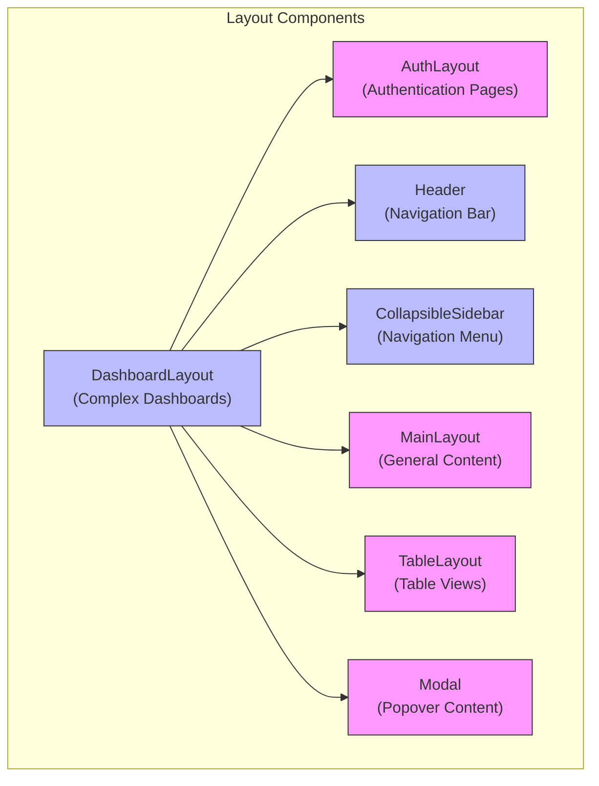
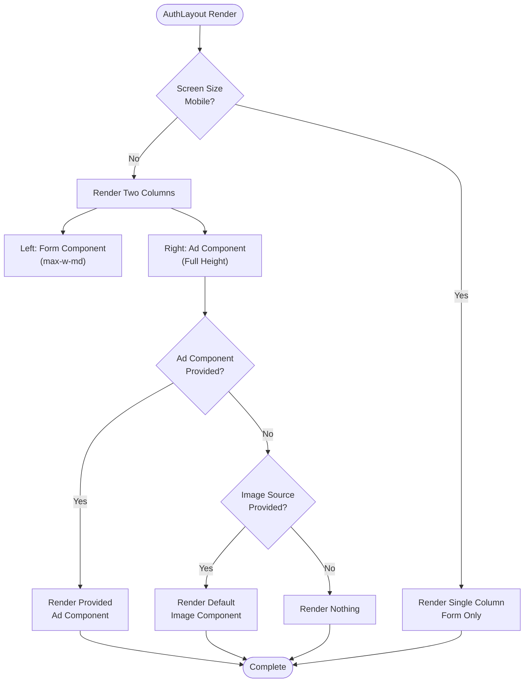
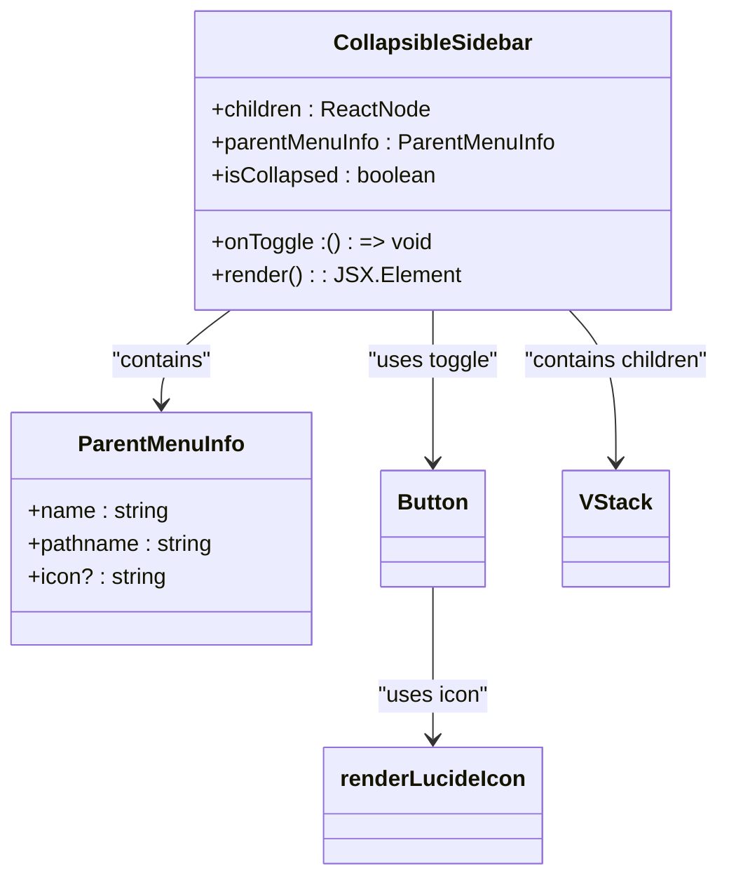
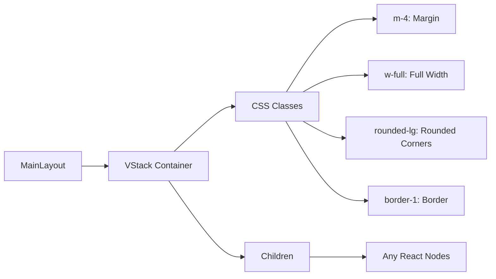
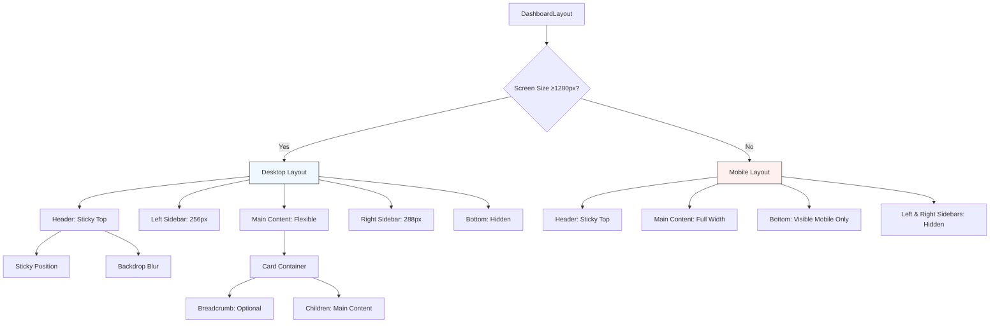
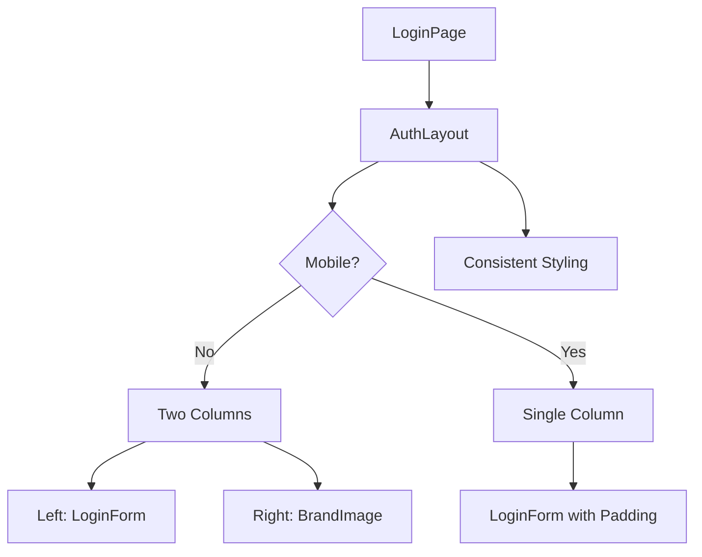
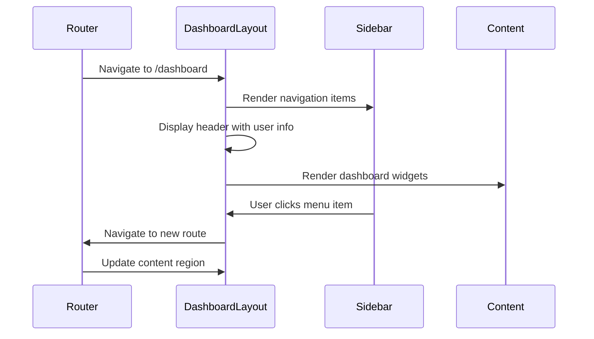

# Layout Components

<cite>
**Referenced Files in This Document**   
- [AuthLayout.tsx](file://packages/ui/src/components/layout/Auth/AuthLayout.tsx)
- [CollapsibleSidebarLayout.tsx](file://packages/ui/src/components/layout/CollapsibleSidebar/CollapsibleSidebarLayout.tsx)
- [DashboardLayout.tsx](file://packages/ui/src/components/layout/Dashboard/DashboardLayout.tsx)
- [Header.tsx](file://packages/ui/src/components/layout/Header/Header.tsx)
- [Main.tsx](file://packages/ui/src/components/layout/Main/Main.tsx)
- [Table.tsx](file://packages/ui/src/components/layout/Table/Table.tsx)
- [index.ts](file://packages/ui/src/components/layout/index.ts)
- [README.md](file://packages/ui/src/components/layout/Dashboard/README.md)
</cite>

## Table of Contents
1. [Introduction](#introduction)
2. [Core Layout Components](#core-layout-components)
3. [Architecture Overview](#architecture-overview)
4. [Detailed Component Analysis](#detailed-component-analysis)
5. [Responsive Design Patterns](#responsive-design-patterns)
6. [Integration with Routing](#integration-with-routing)
7. [Usage Examples](#usage-examples)
8. [Troubleshooting Guide](#troubleshooting-guide)
9. [Performance Considerations](#performance-considerations)
10. [Conclusion](#conclusion)

## Introduction
The layout components in the prj-core's shared-frontend package provide a consistent structural foundation across different views and routes within the application ecosystem. These components are designed to standardize the user interface while offering flexibility for various use cases, from authentication pages to complex dashboard interfaces. The layout system enables developers to create cohesive user experiences by encapsulating common structural patterns and responsive behaviors. This documentation provides comprehensive guidance on the available layout components, their architecture, implementation details, and practical usage patterns.

## Core Layout Components
The shared-frontend package offers several specialized layout components designed for different application contexts. These components include AuthLayout for authentication pages, CollapsibleSidebar for navigation-heavy interfaces, MainLayout for general content presentation, and DashboardLayout for complex dashboard interfaces with multiple content regions. Each layout component is built with responsiveness in mind, adapting to different screen sizes and device types. The components are designed to be composable, allowing developers to combine them as needed for specific use cases. They follow a consistent API pattern, accepting React nodes as props to render custom content in designated areas of the layout.

**Section sources**
- [index.ts](file://packages/ui/src/components/layout/index.ts#L1-L8)

## Architecture Overview

**Diagram sources**
- [index.ts](file://packages/ui/src/components/layout/index.ts#L1-L8)
- [DashboardLayout.tsx](file://packages/ui/src/components/layout/Dashboard/DashboardLayout.tsx#L1-L104)

## Detailed Component Analysis

### AuthLayout Analysis
The AuthLayout component is specifically designed for authentication pages such as login, registration, and password recovery screens. It implements a responsive two-column layout on desktop devices, with the form component displayed on the left and an advertisement or branding component on the right. On mobile devices, the layout switches to a single column with the form taking priority. The component accepts optional props for both the form and advertisement components, with a fallback to display an image if an image source is provided but no custom advertisement component is specified. This layout ensures that authentication flows are consistent across the application while allowing for branding and marketing content to be displayed alongside the core functionality.

**Diagram sources**
- [AuthLayout.tsx](file://packages/ui/src/components/layout/Auth/AuthLayout.tsx#L1-L49)

**Section sources**
- [AuthLayout.tsx](file://packages/ui/src/components/layout/Auth/AuthLayout.tsx#L1-L49)

### CollapsibleSidebarLayout Analysis
The CollapsibleSidebar component provides a navigation sidebar that can be toggled between collapsed and expanded states. It is designed to be used within dashboard layouts or other interfaces requiring persistent navigation. The component displays parent menu information including an optional icon and name when expanded, along with a toggle button that changes its chevron direction based on the current state. The sidebar content is rendered as children, allowing for flexible navigation item composition. The component uses CSS transitions to animate the width change between collapsed (20px) and expanded (288px) states, providing a smooth user experience. This layout is particularly useful for applications with deep navigation hierarchies that need to balance screen real estate with accessibility of navigation options.

**Diagram sources**
- [CollapsibleSidebarLayout.tsx](file://packages/ui/src/components/layout/CollapsibleSidebar/CollapsibleSidebarLayout.tsx#L1-L83)

**Section sources**
- [CollapsibleSidebarLayout.tsx](file://packages/ui/src/components/layout/CollapsibleSidebar/CollapsibleSidebarLayout.tsx#L1-L83)

### MainLayout Analysis
The MainLayout component serves as a basic wrapper for general content pages, providing a consistent visual treatment with padding, rounded corners, and a border. It uses a VStack (vertical stack) component to arrange its children in a column layout with appropriate spacing. This layout is suitable for content-heavy pages that don't require complex multi-region layouts. The simplicity of MainLayout makes it ideal for documentation pages, settings screens, or any content that follows a straightforward vertical flow. By standardizing the container style across these pages, it ensures visual consistency while requiring minimal configuration from developers implementing it.

**Diagram sources**
- [Main.tsx](file://packages/ui/src/components/layout/Main/Main.tsx#L1-L13)

**Section sources**
- [Main.tsx](file://packages/ui/src/components/layout/Main/Main.tsx#L1-L13)

### DashboardLayout Analysis
The DashboardLayout component provides a comprehensive, responsive layout system for complex dashboard interfaces. It supports multiple content regions including header, left sidebar, right sidebar, bottom component, and breadcrumb navigation, all of which are optional and conditionally rendered. The layout adapts to different screen sizes, displaying a full three-column layout (header, left sidebar, main content, right sidebar) on desktop devices (≥1280px), while switching to a mobile-optimized layout with only the header, main content, and bottom component on smaller screens. The right sidebar is hidden on mobile, and the bottom component is only visible on mobile devices, making it ideal for mobile navigation bars. The component includes placeholder rendering for any missing components, ensuring a consistent visual structure even when some regions are not populated.

**Diagram sources**
- [DashboardLayout.tsx](file://packages/ui/src/components/layout/Dashboard/DashboardLayout.tsx#L1-L104)
- [README.md](file://packages/ui/src/components/layout/Dashboard/README.md#L1-L373)

**Section sources**
- [DashboardLayout.tsx](file://packages/ui/src/components/layout/Dashboard/DashboardLayout.tsx#L1-L104)
- [README.md](file://packages/ui/src/components/layout/Dashboard/README.md#L1-L373)

## Responsive Design Patterns
The layout components implement responsive design patterns using CSS classes and conditional rendering based on screen size breakpoints. The primary breakpoint is 1280px, which determines the visibility of sidebars and the bottom navigation component in the DashboardLayout. On desktop screens (≥1280px), the full three-column layout is displayed with both left and right sidebars visible, while on mobile screens (<1280px), the layout simplifies to focus on the main content with a mobile-friendly bottom navigation component. The AuthLayout also adapts its structure, switching from a two-column desktop layout to a single-column mobile layout. These responsive patterns ensure optimal user experience across different device types, prioritizing content readability and navigation accessibility based on the available screen real estate.

**Section sources**
- [DashboardLayout.tsx](file://packages/ui/src/components/layout/Dashboard/DashboardLayout.tsx#L1-L104)
- [AuthLayout.tsx](file://packages/ui/src/components/layout/Auth/AuthLayout.tsx#L1-L49)

## Integration with Routing
The layout components integrate seamlessly with the application's routing system, allowing different layouts to be applied to different routes based on their purpose and content requirements. Authentication routes typically use the AuthLayout, while dashboard and administrative interfaces use the DashboardLayout with appropriate sidebar configurations. The routing integration is achieved through route-level component wrapping, where each route's component is wrapped with the appropriate layout component. This approach allows for consistent layout application across related routes while maintaining the flexibility to use different layouts for different sections of the application. The Header component can also receive route-specific content through its left, center, and right props, enabling dynamic header content based on the current route.

**Section sources**
- [DashboardLayout.tsx](file://packages/ui/src/components/layout/Dashboard/DashboardLayout.tsx#L1-L104)
- [Header.tsx](file://packages/ui/src/components/layout/Header/Header.tsx#L1-L37)

## Usage Examples

### Authentication Page Implementation

**Diagram sources**
- [AuthLayout.tsx](file://packages/ui/src/components/layout/Auth/AuthLayout.tsx#L1-L49)

### Dashboard Interface Implementation

**Diagram sources**
- [DashboardLayout.tsx](file://packages/ui/src/components/layout/Dashboard/DashboardLayout.tsx#L1-L104)

## Troubleshooting Guide
Common issues with layout components include content overflow, sidebar toggle functionality problems, and unexpected rendering on different screen sizes. For content overflow issues, ensure that parent containers have appropriate overflow properties set, particularly for the main content area in DashboardLayout which should have `overflow-y-auto` to enable scrolling. If the sidebar toggle functionality is not working, verify that the `isCollapsed` state and `onToggle` callback are properly connected to the parent component's state management. For responsive design issues, check that the correct breakpoint classes are applied and that mobile-specific components like the bottom navigation are only intended for mobile views. Performance issues with layout transitions can often be resolved by ensuring that the `transition-all duration-300` classes are applied correctly and that unnecessary re-renders are minimized through proper state management.

**Section sources**
- [CollapsibleSidebarLayout.tsx](file://packages/ui/src/components/layout/CollapsibleSidebar/CollapsibleSidebarLayout.tsx#L1-L83)
- [DashboardLayout.tsx](file://packages/ui/src/components/layout/Dashboard/DashboardLayout.tsx#L1-L104)

## Performance Considerations
The layout components are designed with performance in mind, using CSS transitions for smooth animations rather than JavaScript-based animation libraries. The collapsible sidebar uses CSS width transitions with a 300ms duration to provide a responsive feel without impacting performance. To optimize rendering performance, the components use conditional rendering to only include sidebar and bottom components when they are actually provided, reducing the DOM size when certain layout regions are not needed. The use of React's children prop for content insertion allows for efficient rendering of dynamic content without requiring the layout components to manage complex state. For applications with many nested layouts, it's recommended to minimize unnecessary re-renders by using React.memo or similar optimization techniques on the content components.

**Section sources**
- [CollapsibleSidebarLayout.tsx](file://packages/ui/src/components/layout/CollapsibleSidebar/CollapsibleSidebarLayout.tsx#L1-L83)
- [DashboardLayout.tsx](file://packages/ui/src/components/layout/Dashboard/DashboardLayout.tsx#L1-L104)

## Conclusion
The layout components in prj-core's shared-frontend package provide a robust foundation for creating consistent, responsive user interfaces across the application ecosystem. By offering specialized layouts for different use cases—from authentication pages to complex dashboards—these components enable developers to maintain visual consistency while adapting to various content requirements. The thoughtful implementation of responsive design patterns, conditional rendering, and smooth transitions ensures optimal user experience across device types. As the application evolves, these layout components can be extended or composed to meet new requirements while maintaining the established design language and user experience principles.