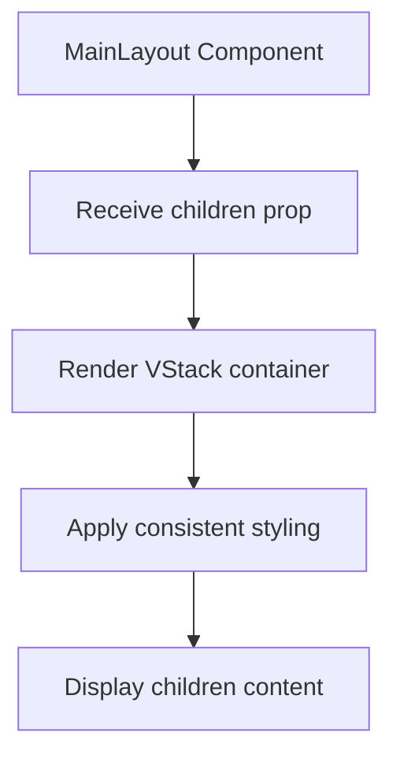
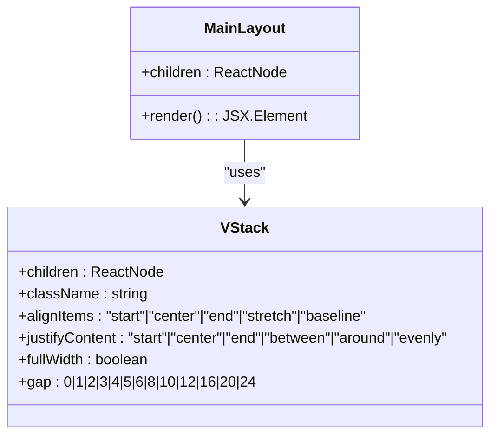
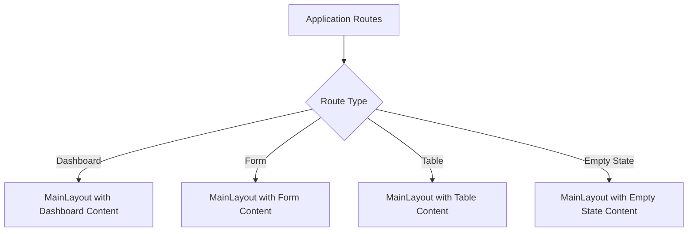

# Main Layout

<cite>
**Referenced Files in This Document**   
- [Main.tsx](file://packages/ui/src/components/layout/Main/Main.tsx)
- [Main.stories.tsx](file://packages/ui/src/components/layout/Main/Main.stories.tsx)
- [VStack.tsx](file://packages/ui/src/components/ui/VStack/VStack.tsx)
</cite>

## Table of Contents
1. [Introduction](#introduction)
2. [Core Implementation](#core-implementation)
3. [Props Interface](#props-interface)
4. [Layout Structure and Styling](#layout-structure-and-styling)
5. [Usage Patterns](#usage-patterns)
6. [Integration with Other Components](#integration-with-other-components)
7. [Responsive Behavior](#responsive-behavior)
8. [Common Use Cases](#common-use-cases)
9. [Performance Considerations](#performance-considerations)
10. [Troubleshooting Guide](#troubleshooting-guide)

## Introduction
The MainLayout component serves as the primary content wrapper for general application views in the prj-core's shared-frontend package. It provides a consistent container for non-authentication routes, ensuring uniform padding, max-width constraints, and responsive behavior across different views. This component is designed to be a simple yet effective wrapper that maintains visual consistency throughout the application while allowing flexibility in content presentation.

**Section sources**
- [Main.tsx](file://packages/ui/src/components/layout/Main/Main.tsx)

## Core Implementation
The MainLayout component is implemented as a straightforward wrapper that utilizes the VStack component to create a vertically oriented container. The implementation focuses on providing a clean, bordered container with consistent margins and rounded corners. The component accepts children as its primary prop and renders them within the structured layout container.



**Diagram sources**
- [Main.tsx](file://packages/ui/src/components/layout/Main/Main.tsx)

**Section sources**
- [Main.tsx](file://packages/ui/src/components/layout/Main/Main.tsx)

## Props Interface
The MainLayout component accepts a single prop interface that defines its expected input:

```typescript
export interface MainLayoutProps {
    children: ReactNode;
}
```

The component requires the `children` prop, which represents the content to be displayed within the main layout container. This prop accepts any valid React node, allowing for flexible content composition including text, components, and complex UI structures.

**Section sources**
- [Main.tsx](file://packages/ui/src/components/layout/Main/Main.tsx)

## Layout Structure and Styling
The MainLayout component creates a structured container with specific styling properties to ensure consistency across views. It utilizes the VStack component with the following CSS classes applied:

- `m-4`: Applies margin of 1rem on all sides
- `w-full`: Ensures the container takes full width of its parent
- `rounded-lg`: Applies large border radius for rounded corners
- `border-1`: Adds a thin border around the container

The VStack component provides the foundational flexbox layout with column direction, while the applied Tailwind CSS classes handle the specific visual styling and spacing requirements.



**Diagram sources**
- [Main.tsx](file://packages/ui/src/components/layout/Main/Main.tsx)
- [VStack.tsx](file://packages/ui/src/components/ui/VStack/VStack.tsx)

**Section sources**
- [Main.tsx](file://packages/ui/src/components/layout/Main/Main.tsx)
- [VStack.tsx](file://packages/ui/src/components/ui/VStack/VStack.tsx)

## Usage Patterns
The MainLayout component is designed for use across non-authentication routes where a consistent content wrapper is needed. It is typically used to wrap dashboard views, form pages, table displays, and other general application content. The component provides a clean container that separates content from surrounding layout elements like headers and sidebars.

Common usage patterns include wrapping dashboard content, form interfaces, and data display components. The component's simplicity allows it to be used in various contexts without imposing specific structural requirements on the content it contains.

**Section sources**
- [Main.stories.tsx](file://packages/ui/src/components/layout/Main/Main.stories.tsx)

## Integration with Other Components
The MainLayout component integrates seamlessly with other layout components in the system, particularly the Header and Sidebar components. It is designed to work within the overall layout hierarchy, serving as the primary content area between navigation elements and the application header.

When used in conjunction with the DashboardLayout component, MainLayout provides the central content area that adapts to the available space. The component's flexible design allows it to work with various content types while maintaining consistent visual properties.

**Section sources**
- [Main.tsx](file://packages/ui/src/components/layout/Main/Main.tsx)

## Responsive Behavior
The MainLayout component inherits responsive behavior from its underlying VStack component and Tailwind CSS classes. The container maintains its styling properties across different screen sizes, ensuring consistent appearance and spacing.

The component's width is set to full width of its parent container, allowing it to adapt to the available space. The margin and padding values are defined using Tailwind's responsive scale, ensuring appropriate spacing on different devices.

**Section sources**
- [Main.tsx](file://packages/ui/src/components/layout/Main/Main.tsx)

## Common Use Cases
The MainLayout component is used in various scenarios throughout the application:

- **Dashboard Views**: Wrapping dashboard content with statistics and data visualizations
- **Form Pages**: Containing form elements with consistent spacing and borders
- **Table Displays**: Providing a container for data tables and related controls
- **Empty States**: Displaying content when no data is available, with appropriate spacing and visual cues

The component's stories demonstrate these use cases with examples like dashboard content, form layouts, table layouts, and empty states, showing how the consistent wrapper enhances the user experience across different content types.



**Diagram sources**
- [Main.stories.tsx](file://packages/ui/src/components/layout/Main/Main.stories.tsx)

**Section sources**
- [Main.stories.tsx](file://packages/ui/src/components/layout/Main/Main.stories.tsx)

## Performance Considerations
The MainLayout component is optimized for performance with a simple implementation that avoids unnecessary re-renders. As a presentational component, it primarily focuses on rendering content with consistent styling.

The component's lightweight nature ensures minimal impact on application performance. By using the VStack component as a foundation, it leverages optimized layout calculations while maintaining flexibility in content presentation.

When integrating with larger applications, the component's simplicity helps reduce layout re-calculation overhead, particularly when content updates occur within the main area without affecting the surrounding layout structure.

**Section sources**
- [Main.tsx](file://packages/ui/src/components/layout/Main/Main.tsx)

## Troubleshooting Guide
When working with the MainLayout component, consider the following common issues and solutions:

- **Content Overflow**: If content exceeds the container bounds, ensure proper use of overflow properties in child components
- **Spacing Inconsistencies**: Verify that child components are not applying conflicting margin or padding values
- **Responsive Issues**: Check that parent containers are properly configured for responsive behavior
- **Visual Inconsistencies**: Ensure consistent use of the component across different views to maintain design uniformity

The component's straightforward implementation minimizes potential issues, but attention to content structure and styling within the container helps maintain optimal presentation.

**Section sources**
- [Main.tsx](file://packages/ui/src/components/layout/Main/Main.tsx)
- [Main.stories.tsx](file://packages/ui/src/components/layout/Main/Main.stories.tsx)