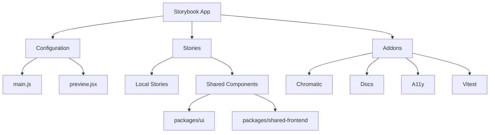
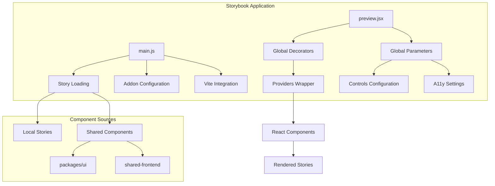
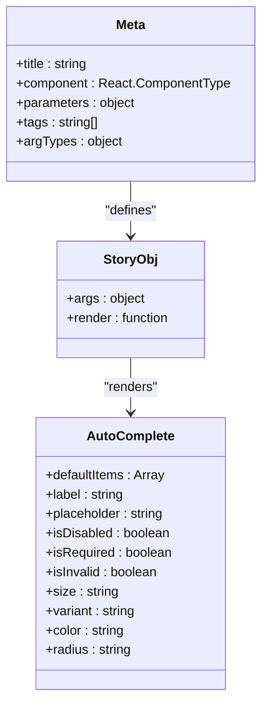
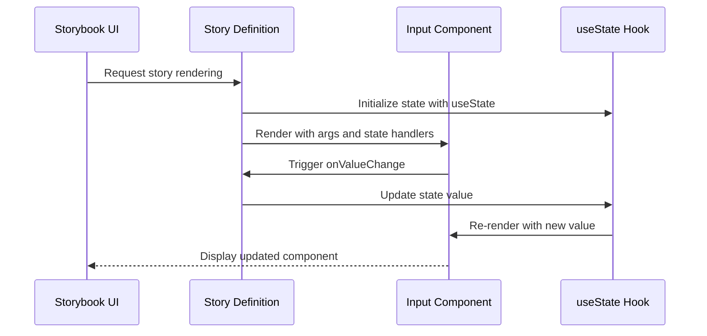
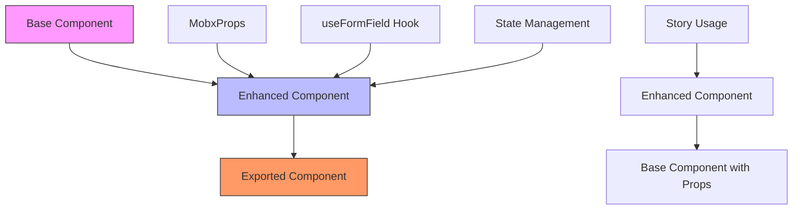

# Storybook Integration

<cite>
**Referenced Files in This Document**   
- [main.js](file://apps/storybook/.storybook/main.js)
- [preview.jsx](file://apps/storybook/.storybook/preview.jsx)
- [AutoComplete.stories.tsx](file://packages/ui/src/components/inputs/AutoComplete/AutoComplete.stories.tsx)
- [Input.stories.tsx](file://packages/ui/src/components/inputs/Input/Input.stories.tsx)
- [Providers.tsx](file://packages/providers/src/Providers.tsx)
- [AutoComplete.tsx](file://packages/ui/src/components/inputs/AutoComplete/index.tsx)
- [Input.tsx](file://packages/ui/src/components/inputs/Input/index.tsx)
- [tailwind.css](file://apps/storybook/tailwind.css)
- [package.json](file://apps/storybook/package.json)
</cite>

## Table of Contents
1. [Introduction](#introduction)
2. [Project Structure](#project-structure)
3. [Core Components](#core-components)
4. [Architecture Overview](#architecture-overview)
5. [Detailed Component Analysis](#detailed-component-analysis)
6. [Dependency Analysis](#dependency-analysis)
7. [Performance Considerations](#performance-considerations)
8. [Troubleshooting Guide](#troubleshooting-guide)
9. [Conclusion](#conclusion)

## Introduction
This document provides comprehensive documentation for the Storybook integration in the prj-core monorepo. It details the configuration setup, component story implementation, and development workflow for the shared-frontend components. The documentation covers how Storybook is configured to work with the shared component library, the relationship between component stories and their implementations, and best practices for using Storybook in the development process.

## Project Structure
The Storybook integration is located in the `apps/storybook` directory of the monorepo. This standalone Storybook application serves as a centralized component explorer for all shared UI components across the organization. The structure follows a monorepo pattern where shared components are developed in the `packages/ui` directory and consumed by various applications.

The Storybook configuration includes main.js for core configuration, preview.jsx for global decorators and parameters, and a package.json that defines the dependencies required for the Storybook environment. The stories are sourced from both local directories and the shared-frontend components in the packages directory.



**Diagram sources**
- [main.js](file://apps/storybook/.storybook/main.js)
- [package.json](file://apps/storybook/package.json)

**Section sources**
- [main.js](file://apps/storybook/.storybook/main.js)
- [package.json](file://apps/storybook/package.json)

## Core Components
The core components of the Storybook integration include the configuration files that define how stories are loaded, rendered, and enhanced with additional functionality. The main.js file configures the Storybook environment, including story loading patterns, addons, and framework settings. The preview.jsx file establishes the global rendering context through decorators and parameters that apply to all stories.

The integration leverages the monorepo structure by importing stories from both local directories and shared component packages. This allows teams to develop and document components in isolation while ensuring consistency across applications. The configuration also includes Vite-specific settings to support Tailwind CSS and JSX automatic transformation.

**Section sources**
- [main.js](file://apps/storybook/.storybook/main.js)
- [preview.jsx](file://apps/storybook/.storybook/preview.jsx)

## Architecture Overview
The Storybook architecture in prj-core follows a centralized approach where a dedicated Storybook application consumes components from shared packages. This architecture enables cross-team collaboration and ensures UI consistency across different applications in the monorepo.

The configuration uses Yarn PnP or monorepo-compatible path resolution to locate package dependencies. Stories are loaded from multiple sources, including local story files and shared component libraries. The preview configuration applies global decorators that wrap all stories with necessary provider components, ensuring that components render in a context that mimics the actual application environment.



**Diagram sources**
- [main.js](file://apps/storybook/.storybook/main.js)
- [preview.jsx](file://apps/storybook/.storybook/preview.jsx)

## Detailed Component Analysis

### Component Story Implementation
Component stories in the prj-core Storybook integration follow the modern Storybook CSF (Component Story Format) with TypeScript support. Stories are defined using Meta and StoryObj types from @storybook/react, providing type safety and autocompletion in development environments.

The stories are organized with a title that reflects the component's location in the design system hierarchy (e.g., "inputs/AutoComplete"). Each story includes parameters for layout and documentation, tags for automatic documentation generation, and argTypes that define the controls available in the Storybook controls panel.

#### AutoComplete Component Analysis
The AutoComplete component story demonstrates how shared components are documented and made interactive in Storybook. The story defines various argTypes that correspond to component props, allowing users to interactively modify the component's appearance and behavior through the controls panel.



**Diagram sources**
- [AutoComplete.stories.tsx](file://packages/ui/src/components/inputs/AutoComplete/AutoComplete.stories.tsx)

#### Input Component Analysis
The Input component story illustrates the use of the render function to create dynamic stories that maintain component state. This approach is necessary for components that manage internal state or require event handlers to function properly.



**Diagram sources**
- [Input.stories.tsx](file://packages/ui/src/components/inputs/Input/Input.stories.tsx)

### Shared Component Architecture
The shared component architecture in prj-core follows a pattern where components are wrapped with MobX integration and other cross-cutting concerns. The index.tsx files in component directories export enhanced versions of base components with state management integration.



**Diagram sources**
- [AutoComplete.tsx](file://packages/ui/src/components/inputs/AutoComplete/index.tsx)
- [Input.tsx](file://packages/ui/src/components/inputs/Input/index.tsx)

**Section sources**
- [AutoComplete.stories.tsx](file://packages/ui/src/components/inputs/AutoComplete/AutoComplete.stories.tsx)
- [Input.stories.tsx](file://packages/ui/src/components/inputs/Input/Input.stories.tsx)
- [AutoComplete.tsx](file://packages/ui/src/components/inputs/AutoComplete/index.tsx)
- [Input.tsx](file://packages/ui/src/components/inputs/Input/index.tsx)

## Dependency Analysis
The Storybook integration has dependencies on both Storybook-specific packages and application-level dependencies that ensure components render correctly in the Storybook environment. The configuration imports providers and components from shared packages, creating a dependency graph that mirrors the application architecture.

The main.js configuration resolves package paths using a custom getAbsolutePath function that works with Yarn PnP and monorepo setups. This ensures that addons and frameworks are correctly located regardless of the installation method.

```mermaid
graph TD
A[Storybook App] --> B[@storybook/react-vite]
A --> C[@chromatic-com/storybook]
A --> D[@storybook/addon-docs]
A --> E[@storybook/addon-a11y]
A --> F[@storybook/addon-vitest]
A --> G[@tailwindcss/vite]
A --> H[@cocrepo/providers]
A --> I[@cocrepo/ui]
H --> J[@tanstack/react-query]
H --> K[nuqs]
H --> L[@heroui/react]
I --> M[@heroui/react]
style A fill:#ff9900,stroke:#333
style B fill:#99ccff,stroke:#333
style C fill:#99ccff,stroke:#333
style D fill:#99ccff,stroke:#333
style E fill:#99ccff,stroke:#333
style F fill:#99ccff,stroke:#333
style G fill:#99ccff,stroke:#333
style H fill:#99ff99,stroke:#333
style I fill:#99ff99,stroke:#333
```

**Diagram sources**
- [main.js](file://apps/storybook/.storybook/main.js)
- [package.json](file://apps/storybook/package.json)
- [Providers.tsx](file://packages/providers/src/Providers.tsx)

**Section sources**
- [main.js](file://apps/storybook/.storybook/main.js)
- [package.json](file://apps/storybook/package.json)
- [Providers.tsx](file://packages/providers/src/Providers.tsx)

## Performance Considerations
The Storybook configuration in prj-core is optimized for development performance through the use of Vite as the build tool. The viteFinal function in main.js configures Tailwind CSS integration and JSX automatic transformation, leveraging Vite's fast development server capabilities.

The configuration avoids unnecessary plugins or transformations that could slow down the development experience. By using the catalog: version specifier in package.json for many dependencies, the configuration ensures that versions are consistent with the monorepo's dependency management, reducing potential conflicts and installation time.

The story loading pattern is designed to be efficient by using glob patterns to automatically discover stories without requiring manual registration. This approach scales well as the number of components grows, without requiring changes to the configuration.

## Troubleshooting Guide
When working with the Storybook integration in prj-core, several common issues may arise. This section provides solutions for the most frequent problems encountered during development.

### Style Loading Issues
If component styles are not appearing correctly in Storybook, ensure that the tailwind.css file is properly imported in preview.jsx. The current configuration imports this file at the top of the preview.jsx file, which applies global styles to all stories.

### Theme Context Errors
Components that depend on theme or provider contexts may fail to render if the necessary providers are not available. The Providers component from @cocrepo/providers wraps all stories through the decorator system in preview.jsx, ensuring that components have access to required contexts like React Query, Nuqs, and Toast providers.

### Missing Dependencies
When adding new component stories, ensure that all required dependencies are available in the Storybook package.json. The configuration uses catalog: version specifiers to inherit versions from the monorepo root, but new dependencies may need to be explicitly added.

### Story Loading Problems
If stories are not appearing in the Storybook interface, verify that the stories glob pattern in main.js includes the correct paths. The current configuration includes stories from both local directories and the shared-frontend components package.

**Section sources**
- [main.js](file://apps/storybook/.storybook/main.js)
- [preview.jsx](file://apps/storybook/.storybook/preview.jsx)
- [tailwind.css](file://apps/storybook/tailwind.css)

## Conclusion
The Storybook integration in prj-core provides a robust environment for developing, documenting, and testing shared UI components. The configuration leverages modern tools like Vite and Tailwind CSS while maintaining compatibility with the monorepo structure. By centralizing component documentation and providing an interactive development environment, Storybook enhances collaboration across teams and ensures UI consistency across applications.

The integration demonstrates best practices for Storybook configuration in a monorepo setting, including proper path resolution, global decorators for provider injection, and efficient build configurations. The use of TypeScript and modern React patterns ensures type safety and developer productivity throughout the component development process.