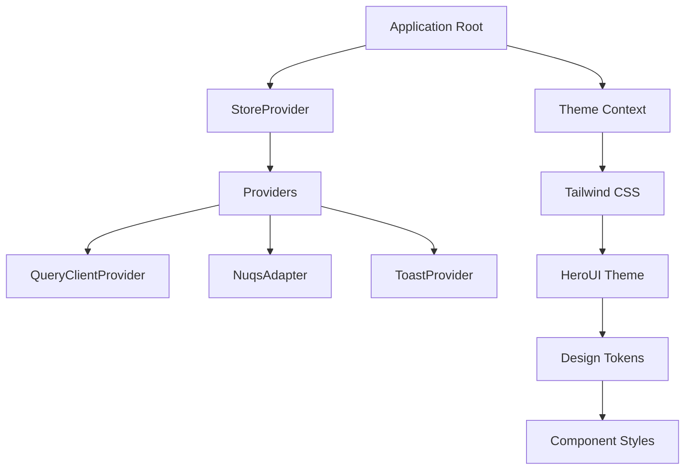
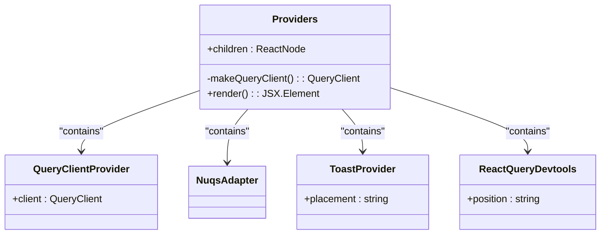
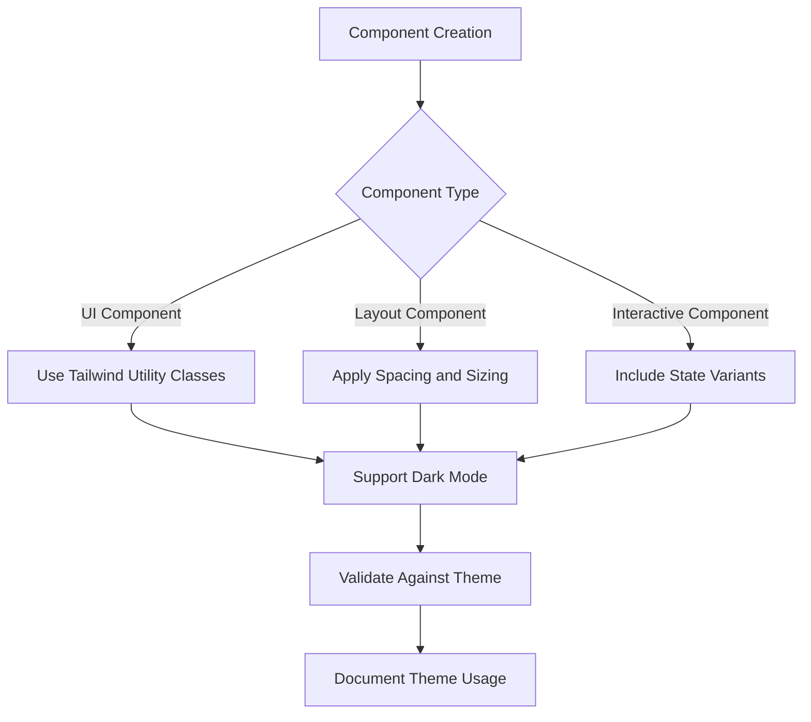

# Theming System

<cite>
**Referenced Files in This Document**   
- [Providers.tsx](file://packages/providers/src/Providers.tsx)
- [Providers.tsx](file://apps/admin/src/providers/Providers.tsx)
- [main.tsx](file://apps/admin/src/main.tsx)
- [tailwind.css](file://apps/admin/src/index.css)
- [hero.ts](file://apps/storybook/hero.ts)
- [constants/README.md](file://packages/constants/README.md)
- [Switch.tsx](file://packages/ui/src/components/inputs/Switch/Switch.tsx)
- [Switch/index.tsx](file://packages/ui/src/components/inputs/Switch/index.tsx)
</cite>

## Table of Contents
1. [Introduction](#introduction)
2. [Architecture Overview](#architecture-overview)
3. [Theme Object Structure](#theme-object-structure)
4. [UIProviders Wrapper Implementation](#uiproviders-wrapper-implementation)
5. [Theme Context Propagation](#theme-context-propagation)
6. [Consuming Theme Variables](#consuming-theme-variables)
7. [Creating Theme-Aware Components](#creating-theme-aware-components)
8. [DarkModeSwitch Implementation](#darkmodeswitch-implementation)
9. [Design Token Organization](#design-token-organization)
10. [Troubleshooting Guide](#troubleshooting-guide)

## Introduction

The theming system in prj-core's component library provides a centralized approach to maintain visual consistency across applications through a unified theme provider architecture. This system enables consistent styling, responsive design, and dark mode support across all applications in the monorepo. The theming solution combines Tailwind CSS with HeroUI's theme system and custom design tokens to create a cohesive visual language.

The core purpose of this theming system is to ensure that all applications share the same visual identity, including colors, typography, spacing, and component styles. This centralized approach eliminates style duplication, simplifies maintenance, and ensures that design updates are propagated consistently across all applications.

**Section sources**
- [constants/README.md](file://packages/constants/README.md#L1-L76)
- [Providers.tsx](file://packages/providers/src/Providers.tsx#L1-L37)

## Architecture Overview

The theming architecture in prj-core follows a layered approach with multiple providers that work together to establish the visual system. At the foundation is the UIProviders wrapper, which composes various context providers to create a unified application environment.



**Diagram sources **
- [Providers.tsx](file://packages/providers/src/Providers.tsx#L1-L37)
- [main.tsx](file://apps/admin/src/main.tsx#L1-L16)

**Section sources**
- [Providers.tsx](file://packages/providers/src/Providers.tsx#L1-L37)
- [main.tsx](file://apps/admin/src/main.tsx#L1-L16)

## Theme Object Structure

The theme object in prj-core follows a structured hierarchy that organizes design tokens into logical categories. The theme system leverages both Tailwind's configuration and HeroUI's theming capabilities to create a comprehensive design system.

The theme object includes the following top-level properties:
- **colors**: Color palette with semantic naming
- **spacing**: Spacing scale for consistent layout
- **typography**: Font sizes, weights, and line heights
- **breakpoints**: Responsive design breakpoints
- **zIndex**: Layering order for positioned elements
- **borderRadius**: Border radius values
- **shadows**: Shadow configurations

This structure ensures that all design decisions are centralized and can be easily modified across the entire application suite.

**Section sources**
- [constants/README.md](file://packages/constants/README.md#L58-L76)
- [tailwind.css](file://apps/admin/src/index.css#L1-L24)

## UIProviders Wrapper Implementation

The UIProviders wrapper is implemented as a composition of multiple provider components that establish the application's context. This wrapper is responsible for initializing the theming system and making theme values available throughout the component tree.

The implementation follows a specific order to ensure proper context propagation and avoid potential conflicts between providers. The Providers component from @cocrepo/providers serves as the central wrapper that combines various context providers.



**Diagram sources **
- [Providers.tsx](file://packages/providers/src/Providers.tsx#L1-L37)
- [Providers.tsx](file://apps/admin/src/providers/Providers.tsx#L1-L37)

**Section sources**
- [Providers.tsx](file://packages/providers/src/Providers.tsx#L1-L37)

## Theme Context Propagation

Theme context propagation in prj-core follows React's context API pattern, where theme values are provided at the root level and consumed by components throughout the application. The system uses Tailwind CSS's JIT compiler with HeroUI's theme integration to ensure that theme values are available at build time and runtime.

The theme context is established through the combination of Tailwind's @import directives and HeroUI's theme plugin. This approach allows for dynamic theme switching while maintaining optimal performance.

The context propagation flow follows this sequence:
1. Theme configuration is defined in tailwind.config.js
2. HeroUI theme plugin processes the configuration
3. Tailwind CSS generates utility classes
4. Providers wrapper establishes the context
5. Components consume theme values through utility classes or hooks

This multi-layered approach ensures that theme values are consistently applied across all components while allowing for runtime theme switching when needed.

**Section sources**
- [tailwind.css](file://apps/admin/src/index.css#L1-L24)
- [hero.ts](file://apps/storybook/hero.ts#L1-L5)

## Consuming Theme Variables

Consuming theme variables in prj-core can be accomplished through multiple approaches, depending on the use case and component type. The primary method is through Tailwind CSS utility classes, which provide direct access to theme values.

For components that require programmatic access to theme values, the system provides several patterns:

1. **Utility Classes**: Direct usage of Tailwind classes in JSX
```jsx
<div className="bg-primary-500 text-white p-4 rounded-lg">
  Themed Component
</div>
```

2. **CSS Variables**: Accessing theme values through CSS custom properties
```css
.themed-element {
  background-color: var(--color-primary-500);
  padding: var(--spacing-md);
}
```

3. **Design Token Imports**: Using constants from @cocrepo/constants
```tsx
import { COLORS, SPACING } from '@cocrepo/constants';

const styles = {
  backgroundColor: COLORS.primary[500],
  padding: SPACING.md
};
```

These approaches provide flexibility for different use cases while maintaining consistency with the overall theme system.

**Section sources**
- [constants/README.md](file://packages/constants/README.md#L58-L76)
- [tailwind.css](file://apps/admin/src/index.css#L1-L24)

## Creating Theme-Aware Components

Creating theme-aware components in prj-core involves following specific patterns to ensure proper integration with the theming system. Components should be designed to respect the established theme while providing appropriate customization options.

Key principles for creating theme-aware components:
- Use semantic class names that map to theme values
- Support both light and dark mode through appropriate class variants
- Accept theme-related props for customization
- Leverage Tailwind's responsive prefixes for adaptive layouts
- Use CSS custom properties for dynamic theme values

When implementing theme-aware components, developers should follow the established naming conventions and design patterns to ensure consistency across the component library.



**Diagram sources **
- [Switch.tsx](file://packages/ui/src/components/inputs/Switch/Switch.tsx#L1-L18)
- [Switch/index.tsx](file://packages/ui/src/components/inputs/Switch/index.tsx#L1-L35)

**Section sources**
- [Switch.tsx](file://packages/ui/src/components/inputs/Switch/Switch.tsx#L1-L18)
- [Switch/index.tsx](file://packages/ui/src/components/inputs/Switch/index.tsx#L1-L35)

## DarkModeSwitch Implementation

The DarkModeSwitch functionality is implemented as a specialized component that manages the application's color mode state. This component leverages the theme system's support for dark mode variants and provides a user interface for toggling between light and dark themes.

The implementation follows these key steps:
1. Detect user preference through system settings
2. Store user preference in localStorage
3. Apply appropriate classes to the root element
4. Provide a toggle interface for manual switching

The DarkModeSwitch component integrates with the theme system by using Tailwind's dark variant prefix and HeroUI's theme capabilities. This ensures seamless transitions between color modes and consistent styling across all components.

The component also respects user preferences by checking the system's color scheme setting and defaulting to the appropriate mode, while still allowing users to override this setting through the toggle.

**Section sources**
- [Providers.tsx](file://packages/providers/src/Providers.tsx#L1-L37)
- [tailwind.css](file://apps/admin/src/index.css#L5-L24)

## Design Token Organization

The design token organization in prj-core follows a systematic approach to ensure consistency and maintainability. Design tokens are categorized into logical groups that correspond to different aspects of the visual system.

The primary categories of design tokens include:

**Color Palette**
- **Primary**: Main brand colors
- **Secondary**: Supporting brand colors
- **Neutral**: Grayscale and background colors
- **Semantic**: Success, warning, error, info colors

**Spacing System**
- **Scale**: 0, xs, sm, md, lg, xl, 2xl, 3xl, 4xl, 5xl
- **Base Unit**: 4px grid system
- **Consistent Ratios**: 1.5x progression

**Typography Scales**
- **Font Sizes**: xs, sm, base, lg, xl, 2xl, 3xl, 4xl, 5xl
- **Line Heights**: Tight, snug, normal, relaxed, loose
- **Font Weights**: Thin, light, normal, medium, semibold, bold, extrabold

**Breakpoints**
- **Mobile**: Up to 768px
- **Tablet**: 768px to 1024px
- **Desktop**: 1024px and above

This organized approach to design tokens ensures that all visual elements follow consistent patterns and can be easily updated across the entire application suite.

**Section sources**
- [constants/README.md](file://packages/constants/README.md#L58-L76)
- [tailwind.css](file://apps/admin/src/index.css#L1-L24)

## Troubleshooting Guide

When working with the theming system in prj-core, developers may encounter various issues related to theme context, style inheritance, and performance. This section provides guidance for diagnosing and resolving common theming problems.

**Theme Context Not Available**
- **Symptoms**: Theme values not applying, fallback styles used
- **Causes**: 
  - UIProviders wrapper not properly implemented
  - Component rendered outside provider tree
  - Incorrect import paths
- **Solutions**:
  - Verify Providers wrapper is at the root level
  - Check component rendering context
  - Ensure proper import of theme-aware components

**Style Inheritance Problems**
- **Symptoms**: Unexpected styling, cascade issues
- **Causes**:
  - Conflicting CSS specificity
  - Improper use of !important
  - Global style conflicts
- **Solutions**:
  - Use Tailwind's utility-first approach
  - Avoid inline styles when possible
  - Leverage CSS custom properties for theming

**Performance Considerations**
- **Theme Updates**: Minimize re-renders by memoizing theme-related computations
- **Bundle Size**: Tree-shake unused theme values
- **Runtime Overhead**: Optimize theme context usage with useMemo and useCallback
- **CSS Generation**: Monitor Tailwind's JIT compilation output

**Debugging Tips**
- Use browser developer tools to inspect applied classes
- Check for console warnings related to theme context
- Verify theme configuration files are properly loaded
- Test theme switching functionality across different components

Following these troubleshooting guidelines will help ensure a smooth development experience with the theming system.

**Section sources**
- [Providers.tsx](file://packages/providers/src/Providers.tsx#L1-L37)
- [tailwind.css](file://apps/admin/src/index.css#L1-L24)
- [constants/README.md](file://packages/constants/README.md#L58-L76)