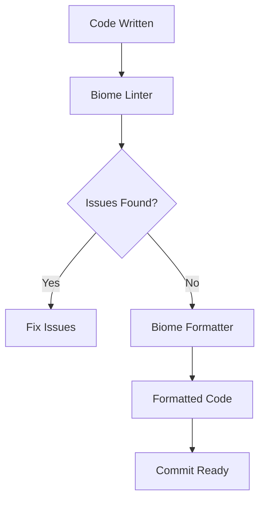

# Contribution Guidelines

<cite>
**Referenced Files in This Document**   
- [README.md](file://README.md)
- [biome.json](file://biome.json)
- [package.json](file://package.json)
- [turbo.json](file://turbo.json)
- [pnpm-workspace.yaml](file://pnpm-workspace.yaml)
- [apps/admin/package.json](file://apps/admin/package.json)
- [apps/server/package.json](file://apps/server/package.json)
</cite>

## Table of Contents
1. [Development Environment Setup](#development-environment-setup)
2. [Code Style and Formatting](#code-style-and-formatting)
3. [Branching Strategy](#branching-strategy)
4. [Commit Message Conventions](#commit-message-conventions)
5. [Pull Request Process](#pull-request-process)
6. [Versioning and Release Strategy](#versioning-and-release-strategy)
7. [Contribution Examples](#contribution-examples)
8. [Troubleshooting Common Issues](#troubleshooting-common-issues)
9. [Code Quality Best Practices](#code-quality-best-practices)

## Development Environment Setup

To contribute to prj-core, you need to set up your development environment with the required tools and dependencies. The project uses a monorepo architecture with Turborepo and pnpm workspace, which enables efficient code sharing and dependency management across multiple applications and packages.

First, ensure you have the prerequisite software installed:
- **Node.js**: Version 20.x or higher
- **pnpm**: Version 10.16.0 or higher
- **PostgreSQL**: Version 14.x or higher

After installing the prerequisites, clone the repository and install dependencies:

```bash
git clone https://github.com/your-org/prj-core.git
cd prj-core
pnpm install
```

Set up environment variables by copying the example file:

```bash
cp .env.example .env
```

Initialize the database by running migrations and seeding data:

```bash
cd packages/schema
pnpm prisma migrate dev
pnpm prisma db seed
```

Start the development servers for the main applications:

```bash
pnpm start:dev                    # All applications
pnpm start:server                 # Backend API only
pnpm start:admin                  # Admin web app only
```

The development environment includes hot reloading for both frontend and backend applications, allowing for rapid iteration during development.

**Section sources**
- [README.md](file://README.md#L215-L256)
- [package.json](file://package.json#L15-L18)

## Code Style and Formatting

The prj-core repository enforces a consistent code style using Biome, which serves as both a linter and formatter for TypeScript code. Biome is configured to ensure code quality and consistency across the entire codebase.

Key code style rules include:
- **Indentation**: Tab characters with width of 2 spaces
- **Quote style**: Double quotes for strings in JavaScript/TypeScript
- **File inclusion**: All TypeScript and TSX files in apps and packages directories
- **Import organization**: Automatic import sorting enabled

The Biome configuration disables certain rules that are considered too restrictive for the project's development workflow, such as:
- Explicit any type usage
- Unused variable detection
- Non-null assertion operator

To check and format your code before committing:

```bash
pnpm lint                    # Run linter
pnpm lint:fix               # Automatically fix lint issues
pnpm format                 # Format code according to style guide
```

The formatter should be run before each commit to ensure consistent code style across the repository. IDE integration is recommended to automatically format code on save.



**Diagram sources**
- [biome.json](file://biome.json#L1-L71)
- [package.json](file://package.json#L19-L21)

**Section sources**
- [biome.json](file://biome.json#L1-L71)
- [README.md](file://README.md#L362-L383)

## Branching Strategy

The prj-core repository follows a feature branch workflow with the main branch serving as the primary integration branch. This branching strategy enables parallel development while maintaining code stability.

The branching model consists of:
- **main**: Production-ready code, protected branch requiring pull request review
- **feature/\***: Feature branches for new functionality
- **fix/\***: Bug fix branches for addressing issues
- **release/\***: Release preparation branches (when needed)

When starting a new contribution, create a feature branch from main:

```bash
git checkout main
git pull origin main
git checkout -b feature/your-feature-name
```

For bug fixes, use the fix prefix:

```bash
git checkout main
git pull origin main
git checkout -b fix/issue-description
```

Feature branches should be kept focused on a single functionality or bug fix. Large features should be broken down into smaller, incremental changes that can be reviewed and merged independently.

All branches should be regularly synchronized with main to minimize merge conflicts:

```bash
git checkout feature/your-feature-name
git fetch origin
git rebase origin/main
```

**Section sources**
- [README.md](file://README.md#L442-L447)

## Commit Message Conventions

The prj-core repository follows conventional commit message formatting to ensure clear and consistent commit history. This convention enables automated changelog generation and semantic versioning.

Commit messages should follow this format:

```
<type>: <description>

[optional body]

[optional footer(s)]
```

The supported commit types are:
- **feat**: Introduce new features or functionality
- **fix**: Resolve bugs or issues
- **docs**: Update documentation
- **style**: Code formatting changes (white-space, formatting, etc.)
- **refactor**: Code changes that neither fix bugs nor add features
- **test**: Add or modify tests
- **chore**: Update build tasks, package manager configurations, etc.

Examples of properly formatted commit messages:

```
feat: implement user authentication API
fix: resolve null reference in session service
docs: update API documentation for user endpoints
style: format code according to Biome rules
refactor: extract utility functions to shared package
test: add unit tests for authentication service
chore: update dependencies to latest versions
```

Commit messages should be concise yet descriptive, clearly explaining what changed and why. For complex changes, include additional details in the commit body.

**Section sources**
- [README.md](file://README.md#L374-L383)

## Pull Request Process

The pull request process for prj-core ensures code quality through automated checks and peer review. All contributions must go through this process before being merged into the main branch.

To submit a pull request:
1. Push your feature branch to the remote repository
2. Create a pull request from your branch to main
3. Ensure all automated checks pass
4. Request review from appropriate team members
5. Address feedback and make necessary changes
6. Merge after approval

The automated checks include:
- **Type checking**: Ensures TypeScript type safety
- **Linting**: Validates code style with Biome
- **Testing**: Runs unit and integration tests
- **Building**: Verifies all applications and packages build successfully

Pull requests should include:
- Clear description of changes
- Reference to related issues (if applicable)
- Screenshots for UI changes (when relevant)
- Testing instructions

Reviewers will evaluate the code for:
- Functionality and correctness
- Code quality and maintainability
- Adherence to coding standards
- Test coverage
- Documentation updates

Once approved, the pull request can be merged. The repository uses a rebase and merge strategy to maintain a clean commit history.

**Section sources**
- [README.md](file://README.md#L442-L447)
- [turbo.json](file://turbo.json#L116-L124)

## Versioning and Release Strategy

The prj-core repository follows semantic versioning (SemVer) for package management and releases. The versioning strategy is designed to ensure backward compatibility and clear communication of changes.

Version numbers follow the format: MAJOR.MINOR.PATCH

- **MAJOR**: Breaking changes that are not backward compatible
- **MINOR**: New features that are backward compatible
- **PATCH**: Bug fixes and minor improvements that are backward compatible

The monorepo uses a coordinated versioning approach where related packages are versioned together to ensure compatibility. Package versions are managed through pnpm workspace and Turborepo.

To update package versions:

```bash
pnpm version:patch    # Increment patch version
pnpm version:minor    # Increment minor version
pnpm version:major    # Increment major version
```

Releases are automated through the release commands:

```bash
pnpm release:patch    # Patch release
pnpm release:minor    # Minor release
pnpm release:major    # Major release
```

These commands perform the following actions:
1. Update package versions
2. Build all packages
3. Publish packages to the registry
4. Update application dependencies

The release process includes automated testing and validation to ensure stability. Production releases are tagged and documented for traceability.

**Section sources**
- [package.json](file://package.json#L23-L37)
- [turbo.json](file://turbo.json#L69-L71)

## Contribution Examples

This section provides practical examples of different types of contributions to prj-core, demonstrating the complete workflow from setup to pull request.

### Bug Fix Contribution

To fix a bug in the authentication service:

1. Create a fix branch:
```bash
git checkout -b fix/auth-validation-error
```

2. Implement the fix in the server module:
```bash
# Edit apps/server/src/module/auth.module.ts
```

3. Add or update tests:
```bash
# Edit apps/server/test/auth.e2e-spec.ts
```

4. Verify the fix:
```bash
pnpm test:e2e
pnpm lint
pnpm format
```

5. Commit and push:
```bash
git add .
git commit -m "fix: resolve authentication validation error"
git push origin fix/auth-validation-error
```

6. Create a pull request with a description of the issue and solution.

### Feature Addition

To add a new feature like session reminders:

1. Create a feature branch:
```bash
git checkout -b feature/session-reminders
```

2. Design the database schema:
```bash
# Edit packages/schema/prisma/schema.prisma
```

3. Generate Prisma client:
```bash
pnpm prisma generate
```

4. Implement the backend service:
```bash
# Edit apps/server/src/module/sessions.module.ts
```

5. Create API endpoints:
```bash
# Edit apps/server/src/module/sessions.controller.ts
```

6. Implement frontend components:
```bash
# Edit apps/admin/src/components/session-reminder
```

7. Add documentation:
```bash
# Update README.md and API documentation
```

8. Commit with appropriate message:
```bash
git commit -m "feat: implement session reminder functionality"
```

### Documentation Update

To improve documentation:

1. Create a docs branch:
```bash
git checkout -b docs/update-api-guide
```

2. Update documentation files:
```bash
# Edit README.md and relevant documentation
```

3. Verify links and examples:
```bash
# Test all code examples
```

4. Commit changes:
```bash
git commit -m "docs: update API usage guide"
```

Each contribution type follows the same pull request review process to ensure quality and consistency.

**Section sources**
- [README.md](file://README.md#L238-L244)
- [turbo.json](file://turbo.json#L162-L164)

## Troubleshooting Common Issues

This section addresses common issues encountered during contribution to prj-core and provides solutions.

### Dependency Installation Issues

If pnpm install fails due to dependency conflicts:

1. Clear the pnpm store:
```bash
pnpm store prune
```

2. Remove node_modules and reinstall:
```bash
pnpm clean
pnpm install
```

3. Check for workspace version mismatches in pnpm-workspace.yaml

### Database Migration Problems

If Prisma migrations fail:

1. Check database connection in .env file
2. Verify PostgreSQL server is running
3. Reset the database if needed:
```bash
pnpm prisma migrate reset
```

4. Recreate migrations:
```bash
pnpm prisma migrate dev --name "fix_migration"
```

### Build Failures

If the build fails:

1. Check TypeScript errors:
```bash
pnpm type-check
```

2. Verify all dependencies are installed:
```bash
pnpm install
```

3. Clean and rebuild:
```bash
pnpm clean
pnpm build
```

4. Check Turborepo cache:
```bash
npx turbo clean
```

### Test Failures

If tests fail unexpectedly:

1. Run tests in isolation:
```bash
pnpm test --testNamePattern="specific test"
```

2. Check for flaky tests and add retries if needed
3. Verify test data and mocks
4. Run with coverage to identify untested code:
```bash
pnpm test:cov
```

### IDE Integration Issues

If Biome formatting doesn't work in your IDE:

1. Ensure Biome extension is installed
2. Verify Biome CLI is accessible in PATH
3. Check IDE settings for formatter configuration
4. Restart IDE after configuration changes

**Section sources**
- [README.md](file://README.md#L238-L244)
- [package.json](file://package.json#L13-L14)

## Code Quality Best Practices

Maintaining high code quality is essential for the long-term success of prj-core. This section outlines best practices for contributors.

### Testing Guidelines

- Write unit tests for all new functionality
- Aim for high test coverage (80%+)
- Use meaningful test names that describe behavior
- Test edge cases and error conditions
- Keep tests independent and deterministic
- Use appropriate test doubles (mocks, stubs) when needed

### Code Organization

- Follow the existing directory structure
- Keep files focused on a single responsibility
- Use descriptive names for variables, functions, and classes
- Group related functionality together
- Avoid deep nesting and complex dependencies

### Performance Considerations

- Optimize database queries to minimize round trips
- Use appropriate indexing for frequently queried fields
- Implement caching for expensive operations
- Avoid blocking operations in critical paths
- Monitor and optimize bundle sizes

### Security Practices

- Validate and sanitize all user input
- Use parameterized queries to prevent SQL injection
- Implement proper authentication and authorization
- Keep dependencies updated to address security vulnerabilities
- Follow secure coding practices for the specific technology stack

### Documentation Standards

- Document complex logic and algorithms
- Update API documentation for endpoint changes
- Add comments for non-obvious code decisions
- Maintain README files for modules and packages
- Use JSDoc for public APIs and interfaces

Following these best practices ensures that contributions maintain the high quality standards of the prj-core repository.

**Section sources**
- [README.md](file://README.md#L362-L383)
- [biome.json](file://biome.json#L1-L71)
- [turbo.json](file://turbo.json#L1-L167)