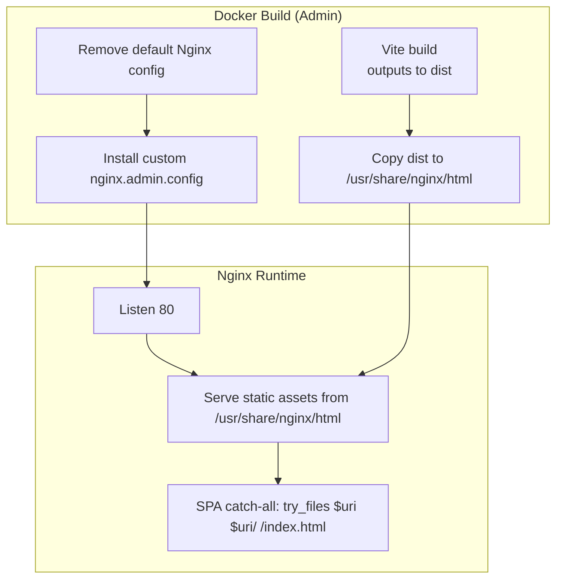
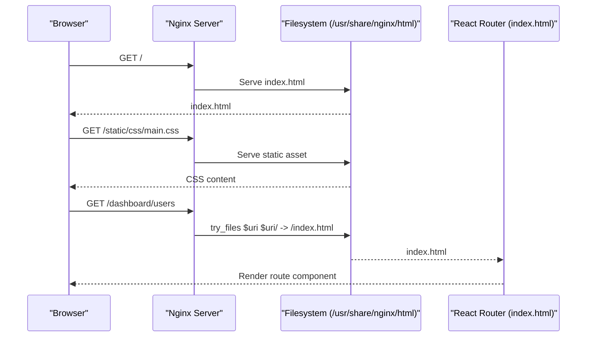
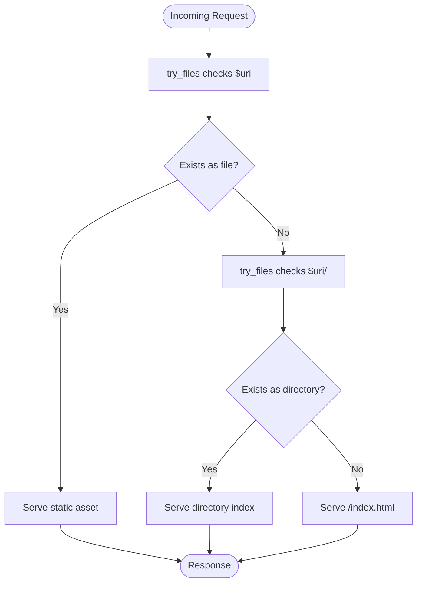
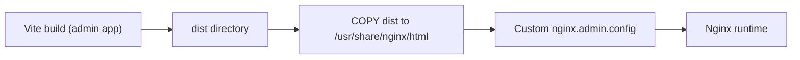

# Admin Frontend Nginx Configuration

<cite>
**Referenced Files in This Document**
- [nginx.admin.config](file://devops/nginx.admin.config)
- [Dockerfile.admin](file://devops/Dockerfile.admin)
- [vite.config.ts](file://apps/admin/vite.config.ts)
- [package.json](file://apps/admin/package.json)
- [index.html](file://apps/admin/index.html)
</cite>

## Table of Contents
1. [Introduction](#introduction)
2. [Project Structure](#project-structure)
3. [Core Components](#core-components)
4. [Architecture Overview](#architecture-overview)
5. [Detailed Component Analysis](#detailed-component-analysis)
6. [Dependency Analysis](#dependency-analysis)
7. [Performance Considerations](#performance-considerations)
8. [Troubleshooting Guide](#troubleshooting-guide)
9. [Conclusion](#conclusion)

## Introduction
This document explains the Nginx configuration used to serve the admin frontend application in prj-core. It covers the server block, listening port, static asset serving, SPA routing for React Router, and how the Vite-built assets are integrated into the Nginx container image. It also outlines the request flow, URL rewriting rules, and the containerization approach that places built assets under Nginx’s web root.

## Project Structure
The admin frontend is a Vite-built Single Page Application (SPA). During the Docker build process, Vite generates static assets that are copied into Nginx’s default web root directory. Nginx serves these assets and routes all non-file requests to index.html so that React Router can handle client-side routing.

**Diagram sources**
- [Dockerfile.admin](file://devops/Dockerfile.admin#L71-L89)
- [nginx.admin.config](file://devops/nginx.admin.config#L1-L16)

**Section sources**
- [Dockerfile.admin](file://devops/Dockerfile.admin#L71-L89)
- [nginx.admin.config](file://devops/nginx.admin.config#L1-L16)

## Core Components
- Nginx server block and listening port:
  - The server listens on port 80.
  - Access and error logs are configured.
- Static asset serving:
  - The web root is set to the Nginx default web root directory.
  - Index files are served for the root location.
- SPA routing:
  - A catch-all location directive routes unmatched requests to index.html for client-side routing.
- MIME types:
  - MIME types are included from the standard Nginx mime types file.

These behaviors are defined in the custom Nginx configuration file and enforced during the Docker build process.

**Section sources**
- [nginx.admin.config](file://devops/nginx.admin.config#L1-L16)
- [Dockerfile.admin](file://devops/Dockerfile.admin#L71-L89)

## Architecture Overview
The admin frontend is packaged inside a lightweight Nginx container. The Vite build outputs are copied into Nginx’s web root, and Nginx serves them statically. Requests that do not match existing files are routed to index.html so that React Router can resolve client-side routes.

**Diagram sources**
- [nginx.admin.config](file://devops/nginx.admin.config#L1-L16)
- [Dockerfile.admin](file://devops/Dockerfile.admin#L71-L89)

## Detailed Component Analysis

### Server Block and Listening Port
- The server block listens on port 80.
- Access and error logs are configured for operational visibility.

Operational notes:
- Ensure the container exposes port 80 to the host network.
- Verify log paths exist in the container filesystem.

**Section sources**
- [nginx.admin.config](file://devops/nginx.admin.config#L1-L16)

### Static Asset Serving and Web Root
- The web root is set to the Nginx default web root directory.
- The Dockerfile copies Vite’s build output (dist) into this directory.
- Index files are configured for the root location.

Asset placement and serving:
- During build, Vite emits static assets (CSS, JS, images, etc.) into the dist directory.
- The Dockerfile copies dist into the Nginx web root, making them directly accessible under the configured root.

**Section sources**
- [Dockerfile.admin](file://devops/Dockerfile.admin#L71-L89)
- [nginx.admin.config](file://devops/nginx.admin.config#L1-L16)

### SPA Routing with Catch-All Location
- The root location block uses a try_files directive that:
  - Checks if the requested URI corresponds to an existing file.
  - Checks if the requested URI corresponds to an existing directory.
  - Falls back to serving index.html for all other requests.
- This enables React Router to handle client-side routing.

Request flow:
- Requests for static assets are served directly.
- Requests for non-existent files are routed to index.html, allowing the SPA to render the appropriate route.

**Diagram sources**
- [nginx.admin.config](file://devops/nginx.admin.config#L1-L16)

**Section sources**
- [nginx.admin.config](file://devops/nginx.admin.config#L1-L16)

### MIME Types and File Extensions
- MIME types are included from the standard Nginx mime types file.
- This ensures appropriate Content-Type headers for CSS, JS, images, and other static resources.

Implications:
- Proper MIME types improve browser caching and rendering behavior.
- Ensure that any custom static assets placed under the web root are recognized by the included mime types.

**Section sources**
- [nginx.admin.config](file://devops/nginx.admin.config#L1-L16)

### Vite-Built Assets Integration
- Vite configuration defines development server behavior and proxy settings for local development.
- Production builds are performed by the admin app’s build script, producing the dist directory.
- The Dockerfile copies the dist directory into Nginx’s web root.

Key points:
- The admin app’s build script triggers Vite to produce static assets.
- The Dockerfile installs dependencies, runs the Vite build, and copies the output into the Nginx web root.
- The Nginx configuration expects assets to be present under the configured web root.

**Section sources**
- [vite.config.ts](file://apps/admin/vite.config.ts#L1-L36)
- [package.json](file://apps/admin/package.json#L1-L69)
- [Dockerfile.admin](file://devops/Dockerfile.admin#L64-L89)

### Hostname Handling
- The provided Nginx configuration does not explicitly set a server_name directive.
- If a specific hostname is required, add a server_name directive in the server block to bind the server to a particular domain or subdomain.

[No sources needed since this section provides general guidance]

### Security Headers, CORS, and Performance Optimizations
- The provided Nginx configuration does not include explicit security headers, CORS configuration, or performance optimizations such as gzip compression or long-term caching policies.
- For production deployments, consider adding:
  - Security headers (e.g., Content-Security-Policy, Strict-Transport-Security, X-Frame-Options, X-Content-Type-Options, Referrer-Policy).
  - CORS headers if the admin app is accessed cross-origin.
  - gzip compression and caching headers for static assets.
  - Optionally, configure SSL/TLS termination or reverse proxy upstream to HTTPS.

[No sources needed since this section provides general guidance]

## Dependency Analysis
The runtime behavior depends on the interplay between the Docker build steps and the Nginx configuration.

**Diagram sources**
- [Dockerfile.admin](file://devops/Dockerfile.admin#L64-L89)
- [nginx.admin.config](file://devops/nginx.admin.config#L1-L16)

**Section sources**
- [Dockerfile.admin](file://devops/Dockerfile.admin#L64-L89)
- [nginx.admin.config](file://devops/nginx.admin.config#L1-L16)

## Performance Considerations
- Static asset delivery:
  - Place assets under the configured web root so Nginx can serve them efficiently.
  - Ensure hashed filenames or cache-busting strategies are used by Vite to maximize cache effectiveness.
- Compression:
  - Enable gzip compression for text-based assets (HTML, CSS, JS) to reduce payload sizes.
- Caching:
  - Configure long cache TTLs for immutable assets (e.g., hashed filenames).
  - Short cache TTLs for index.html to reflect updates quickly.
- Logging:
  - Monitor access and error logs to detect routing issues or missing assets.

[No sources needed since this section provides general guidance]

## Troubleshooting Guide
Common issues and resolutions:
- 404 for static assets:
  - Verify that the dist directory was copied into the Nginx web root during the Docker build.
  - Confirm the web root path in the Nginx configuration matches the mounted path.
- Blank page or route not found:
  - Ensure the catch-all location directive is present and active.
  - Confirm that index.html is being served for non-file requests.
- Incorrect MIME types:
  - Ensure the standard mime types include is present in the Nginx configuration.
- Proxy and development server:
  - The Vite development server configuration is for local development only and does not affect the production Nginx container.

**Section sources**
- [Dockerfile.admin](file://devops/Dockerfile.admin#L71-L89)
- [nginx.admin.config](file://devops/nginx.admin.config#L1-L16)
- [vite.config.ts](file://apps/admin/vite.config.ts#L1-L36)

## Conclusion
The admin frontend is served by Nginx with a minimal configuration that sets the web root, enables SPA routing via a catch-all directive, and includes standard MIME types. The Dockerfile integrates Vite’s build output into the Nginx web root, enabling efficient static asset delivery. For production readiness, consider adding security headers, CORS configuration, gzip compression, and caching policies tailored to the SPA’s asset strategy.