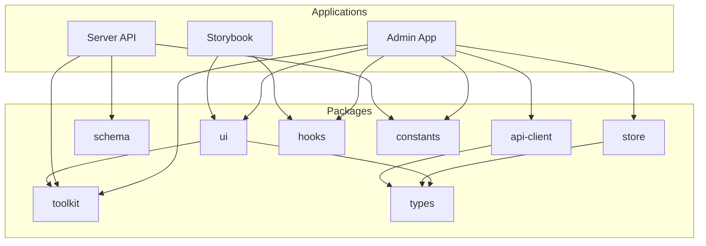
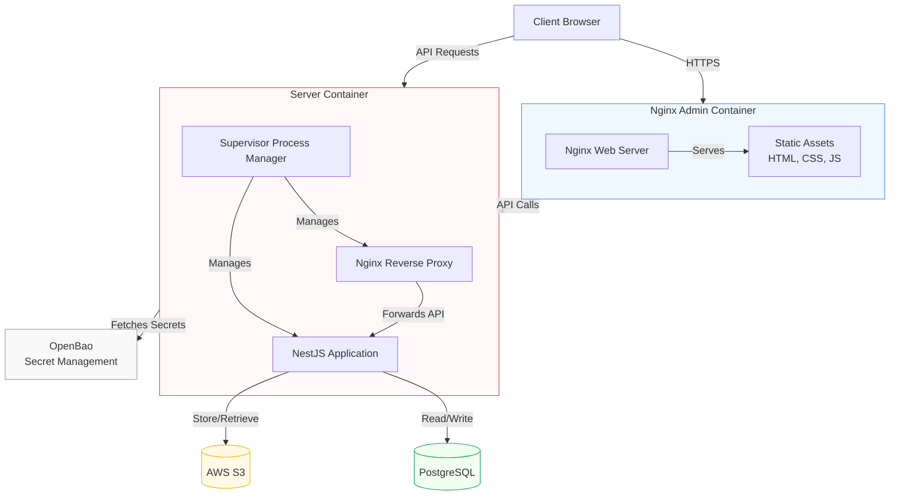
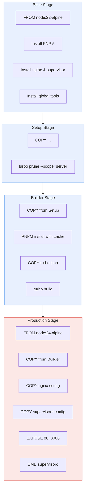
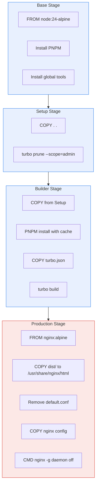
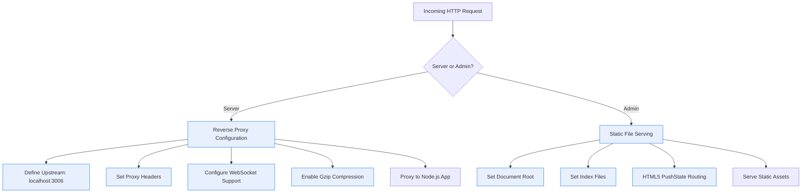
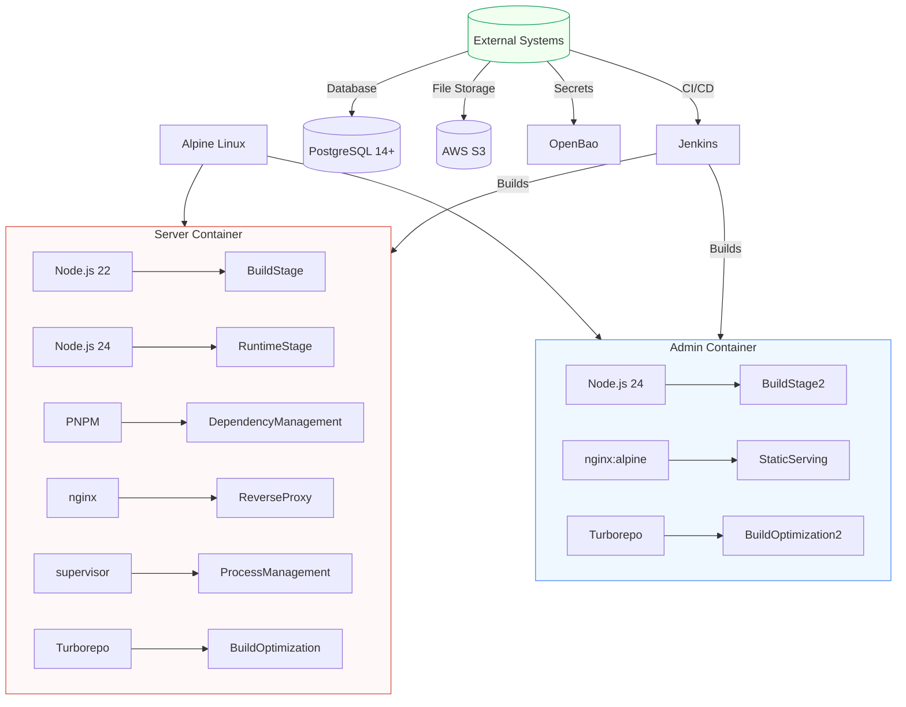

# Deployment Configuration

<cite>
**Referenced Files in This Document**   
- [docker-compose.yaml](file://docker-compose.yaml)
- [Dockerfile.server](file://devops/Dockerfile.server)
- [Dockerfile.admin](file://devops/Dockerfile.admin)
- [nginx.server.config](file://devops/nginx.server.config)
- [nginx.admin.config](file://devops/nginx.admin.config)
- [supervisord.conf](file://devops/supervisord.conf)
- [Jenkinsfile.server](file://devops/Jenkinsfile.server)
- [Jenkinsfile.admin](file://devops/Jenkinsfile.admin)
- [README.md](file://README.md)
</cite>

## Table of Contents
1. [Introduction](#introduction)
2. [Project Structure](#project-structure)
3. [Core Components](#core-components)
4. [Architecture Overview](#architecture-overview)
5. [Detailed Component Analysis](#detailed-component-analysis)
6. [Dependency Analysis](#dependency-analysis)
7. [Performance Considerations](#performance-considerations)
8. [Troubleshooting Guide](#troubleshooting-guide)
9. [Conclusion](#conclusion)

## Introduction
This document provides comprehensive architectural documentation for the deployment configuration of prj-core, a modern full-stack reservation platform built as a monorepo architecture. The deployment design leverages containerization with Docker and orchestration through docker-compose, following a microservices-inspired pattern with multiple applications and shared packages. The system is designed for multi-domain fitness and service reservation, supporting Pilates, gym, yoga, and other service types with extensibility for additional domains.

The deployment infrastructure utilizes a sophisticated multi-stage Docker build process optimized for monorepo architecture using Turborepo, with separate containers for the backend API server and frontend administrative interface. The backend is built on NestJS with Node.js 20+, while the frontend uses React with Vite. The architecture incorporates modern DevOps practices including CI/CD pipelines via Jenkins, secret management through OpenBao in Kubernetes environments, and efficient build optimization through PNPM and Turborepo.

This documentation details the high-level deployment design, component interactions between containers, data flows, integration patterns with external systems, technical decisions, trade-offs, and constraints of the deployment approach. It also covers infrastructure requirements, scalability considerations, deployment topology, cross-cutting concerns like environment variables and health checks, technology stack, third-party dependencies, and version compatibility for the deployment infrastructure.

**Section sources**
- [README.md](file://README.md#L1-L461)

## Project Structure
The prj-core repository follows a monorepo architecture using Turborepo and pnpm workspace, organized into applications and shared packages. The project structure is divided into two main directories: `apps` and `packages`. The `apps` directory contains three primary applications: `admin` (React/Vite web application for administration), `server` (NestJS backend API), and `storybook` (UI component documentation). The `packages` directory contains reusable shared components including `shared-api-client` (automatically generated API client), `shared-frontend` (shared UI components), `shared-hooks` (reusable React hooks), `shared-schema` (Prisma schema and DTOs), `shared-types` (shared TypeScript types), `shared-utils` (utility functions), and `shared-vars` (endpoints and route names).

The deployment configuration is primarily managed in the `devops` directory, which contains Dockerfiles, nginx configurations, and supervisor configuration. The root directory includes essential configuration files such as `docker-compose.yaml`, `biome.json` (linter configuration), `pnpm-workspace.yaml` (package manager workspace settings), `turbo.json` (Turborepo configuration), and `package.json` (root package configuration). This structure enables code reuse, independent deployment of applications, and centralized management of shared resources while maintaining separation of concerns between different parts of the system.



**Diagram sources**
- [README.md](file://README.md#L166-L203)

**Section sources**
- [README.md](file://README.md#L117-L203)

## Core Components
The deployment configuration of prj-core centers around two primary containerized applications: the backend server and the frontend admin interface. The backend server, implemented as a NestJS application, serves as the API layer handling business logic, database operations, authentication, and integration with external services like AWS S3 for file storage. It is containerized using a multi-stage Docker build process that optimizes the final image size and build efficiency by leveraging Turborepo's capabilities to create a minimal dependency tree specific to the server application.

The frontend admin interface is a React application built with Vite, providing a web-based administrative interface for managing reservations, users, and system configuration. This application is also containerized with a multi-stage build process, but unlike the server, it produces static assets that are served by an Nginx web server in the final container. The two applications communicate via REST APIs, with the admin interface consuming endpoints exposed by the server application. Both containers are designed to work together in a production environment, with Nginx acting as a reverse proxy for the server API and serving static assets for the admin interface.

Additional core components include the database (PostgreSQL 14+), which persists application data, and external services such as AWS S3 for file storage and OpenBao for secret management in Kubernetes environments. The architecture also incorporates process management through supervisor, which allows both nginx and the Node.js application to run simultaneously within the server container, enabling the reverse proxy pattern where nginx handles incoming requests and forwards API calls to the NestJS application running on a different port.

**Section sources**
- [README.md](file://README.md#L26-L461)
- [Dockerfile.server](file://devops/Dockerfile.server#L1-L110)
- [Dockerfile.admin](file://devops/Dockerfile.admin#L1-L89)

## Architecture Overview
The deployment architecture of prj-core follows a containerized microservices-inspired pattern with two primary containers orchestrated through docker-compose: the server container and the admin container. The server container runs a Node.js application built on NestJS, serving as the backend API that handles business logic, database operations, authentication, and integration with external services. This container uses a multi-process architecture managed by supervisor, running both an nginx reverse proxy and the Node.js application simultaneously. Nginx listens on port 80 and forwards API requests to the Node.js application running on port 3006, while also handling WebSocket connections for real-time functionality.

The admin container runs an Nginx web server serving static assets generated from the React/Vite frontend application. This container is optimized for serving static content with minimal overhead, using a lightweight nginx:alpine base image. The two containers communicate through HTTP requests, with the admin interface consuming REST APIs exposed by the server container. In a production Kubernetes environment, environment variables and secrets are managed through OpenBao, which injects configuration at deployment time, enhancing security by avoiding hardcoded credentials.

The architecture incorporates a multi-stage Docker build process for both applications, leveraging Turborepo's `prune` command to create optimized dependency trees specific to each application. This approach significantly reduces build times and final image sizes by eliminating unnecessary dependencies from the monorepo. The build process consists of three stages: base (setting up the environment), setup (analyzing dependencies), and builder (compiling the application), with the final production stage creating minimal runtime images.



**Diagram sources**
- [Dockerfile.server](file://devops/Dockerfile.server#L1-L110)
- [Dockerfile.admin](file://devops/Dockerfile.admin#L1-L89)
- [nginx.server.config](file://devops/nginx.server.config#L1-L74)
- [nginx.admin.config](file://devops/nginx.admin.config#L1-L16)

## Detailed Component Analysis

### Server Container Analysis
The server container is implemented through the Dockerfile.server and represents the backend API component of the prj-core application. It follows a multi-stage build process optimized for monorepo architecture, beginning with a base stage that sets up Node.js 22 on Alpine Linux, installs PNPM, and configures essential system dependencies including nginx and supervisor. The base image uses Alpine Linux for its small footprint, reducing the final image size and attack surface.

The setup stage copies the entire project and uses Turborepo's `prune` command with the `--scope=server` flag to create an optimized dependency tree containing only the packages and files necessary for the server application. This optimization is critical in a monorepo context, as it prevents the inclusion of frontend-specific dependencies and irrelevant packages, significantly reducing build times and final image size.

The builder stage installs dependencies using PNPM with cache mounting for performance optimization and executes `turbo build` to compile the NestJS application. The final production stage uses a Node.js 24 Alpine image, copies the built application, configures nginx with a custom server-specific configuration, and sets up supervisor to manage both nginx and the Node.js application processes. This dual-process architecture allows nginx to act as a reverse proxy and handle static assets while forwarding API requests to the NestJS application on port 3006.



**Diagram sources**
- [Dockerfile.server](file://devops/Dockerfile.server#L1-L110)

**Section sources**
- [Dockerfile.server](file://devops/Dockerfile.server#L1-L110)

### Admin Container Analysis
The admin container is implemented through the Dockerfile.admin and serves as the frontend component of the prj-core application, hosting the administrative web interface. Unlike the server container, the admin container follows a different architectural pattern optimized for serving static assets. The multi-stage build process begins with a base stage similar to the server container, setting up Node.js 22 on Alpine Linux with PNPM and global tools, but without installing nginx or supervisor since they are not needed in the build phase.

The setup stage copies the entire project and uses Turborepo's `prune` command with the `--scope=admin` flag to create an optimized dependency tree containing only the packages and files necessary for the admin application. This ensures that backend-specific dependencies and irrelevant packages are excluded from the build process, improving efficiency.

The builder stage installs dependencies with PNPM cache optimization and executes `turbo build` to generate the static assets (HTML, CSS, JavaScript) for the React/Vite application. The final production stage uses an nginx:alpine image, which is specifically designed for serving static content with minimal overhead. This stage copies the built static assets to the Nginx web root directory, removes the default Nginx configuration, and applies a custom admin-specific configuration that enables HTML5 routing with the `try_files` directive to support client-side routing.



**Diagram sources**
- [Dockerfile.admin](file://devops/Dockerfile.admin#L1-L89)

**Section sources**
- [Dockerfile.admin](file://devops/Dockerfile.admin#L1-L89)

### Nginx Configuration Analysis
The nginx configuration for the prj-core deployment consists of two specialized configuration files: nginx.server.config for the backend API container and nginx.admin.config for the frontend admin container. The server configuration implements a reverse proxy pattern, defining an upstream server group that points to the NestJS application running on localhost:3006. The server block listens on port 80 and proxies all incoming requests to the backend application, preserving important request headers such as Host, X-Real-IP, X-Forwarded-For, and X-Forwarded-Proto to ensure the backend application receives accurate client information.

A key feature of the server configuration is its support for WebSocket connections, which are essential for real-time functionality in the application. This is achieved through specific headers (Upgrade and Connection) that enable the HTTP upgrade mechanism required for WebSocket communication. The configuration also includes Gzip compression settings to optimize bandwidth usage by compressing text-based responses, with appropriate MIME type filtering to avoid compressing already-compressed content like images.

In contrast, the admin configuration is optimized for serving static assets and client-side routing. It includes a simple server block that serves files from the Nginx web root directory, with an index directive pointing to index.html and index.htm. The most critical aspect of this configuration is the `try_files` directive, which enables HTML5 pushState routing by attempting to serve the requested file, then the directory, and finally falling back to index.html for client-side routing. This allows the React application to handle routing internally without requiring server-side route configuration for each possible URL.



**Diagram sources**
- [nginx.server.config](file://devops/nginx.server.config#L1-L74)
- [nginx.admin.config](file://devops/nginx.admin.config#L1-L16)

**Section sources**
- [nginx.server.config](file://devops/nginx.server.config#L1-L74)
- [nginx.admin.config](file://devops/nginx.admin.config#L1-L16)

### Process Management Analysis
The process management in the prj-core server container is handled by supervisor, a process control system that allows multiple processes to be managed within a single container. This is necessary because the server container runs both nginx (as a reverse proxy) and the Node.js application (the NestJS backend) simultaneously. The supervisord.conf configuration file defines two programs: nginx and node-app, each with specific command directives, auto-start settings, auto-restart policies, and logging configurations.

The nginx program is configured to run the nginx web server in the foreground with the "daemon off" directive, which is essential for Docker containers to prevent the process from forking into the background. The node-app program runs the compiled NestJS application from the dist/main entry point. Both programs have their standard output and error streams redirected to /dev/stdout and /dev/stderr respectively, with unlimited log file sizes (maxbytes=0), ensuring that logs are captured by Docker's logging system and can be monitored externally.

This dual-process architecture represents a trade-off between the microservices principle of "one process per container" and practical considerations for deployment simplicity and resource efficiency. By running both processes in a single container, the architecture reduces the complexity of inter-container communication and service discovery while maintaining the separation of concerns between the reverse proxy (handling SSL termination, static assets, and request routing) and the application server (handling business logic).

```mermaid
classDiagram
class Supervisord{
+nodaemon : true
+user : root
+start()
+stop()
+restart()
+status()
}
class Program{
+name : string
+command : string
+directory : string
+autostart : boolean
+autorestart : boolean
+stdout_logfile : string
+stdout_logfile_maxbytes : string
+stderr_logfile : string
+stderr_logfile_maxbytes : string
}
class NginxProgram{
+name : "nginx"
+command : "nginx -g \"daemon off;\""
+autostart : true
+autorestart : true
+stdout_logfile : "/dev/stdout"
+stderr_logfile : "/dev/stderr"
}
class NodeAppProgram{
+name : "node-app"
+command : "node /app/apps/server/dist/main"
+directory : "/app"
+autostart : true
+autorestart : true
+stdout_logfile : "/dev/stdout"
+stderr_logfile : "/dev/stderr"
}
Supervisord --> Program : "manages"
Program <|-- NginxProgram
Program <|-- NodeAppProgram
note right of Supervisord
Runs as root user in foreground mode
Central process manager for container
end
note right of NginxProgram
Reverse proxy for API requests
Serves static assets if needed
Handles WebSocket connections
end
note right of NodeAppProgram
Main NestJS application
Handles business logic
Processes API requests
end
```

**Diagram sources**
- [supervisord.conf](file://devops/supervisord.conf#L1-L23)

**Section sources**
- [supervisord.conf](file://devops/supervisord.conf#L1-L23)

## Dependency Analysis
The deployment infrastructure of prj-core has a well-defined dependency structure that reflects its monorepo architecture and containerization strategy. At the base layer, both containers depend on Alpine Linux as the lightweight operating system foundation, chosen for its small footprint and security benefits. The server container has a more complex dependency graph, requiring Node.js 22 for the build stage and Node.js 24 for the runtime, PNPM as the package manager, nginx as the reverse proxy, and supervisor as the process manager. These dependencies are installed through the Alpine package manager (apk) and configured to minimize the attack surface while providing necessary functionality.

The admin container has a simpler dependency structure, requiring only Node.js 24 for the build stage and nginx:alpine for the runtime. This reflects its role as a static asset server, eliminating the need for process management tools like supervisor. Both containers leverage Turborepo's dependency optimization capabilities through the `prune` command, which analyzes the monorepo structure and creates application-specific dependency trees, significantly reducing the number of unnecessary packages included in each container.

External dependencies include PostgreSQL 14+ for data persistence, AWS S3 for file storage, and OpenBao for secret management in production Kubernetes environments. The architecture also depends on CI/CD infrastructure through Jenkins, with Jenkinsfile.server and Jenkinsfile.admin defining the build and deployment pipelines for each application. These Jenkinsfiles likely integrate with the multi-stage Docker builds and Turborepo optimization to create efficient deployment processes.



**Diagram sources**
- [Dockerfile.server](file://devops/Dockerfile.server#L1-L110)
- [Dockerfile.admin](file://devops/Dockerfile.admin#L1-L89)

**Section sources**
- [Dockerfile.server](file://devops/Dockerfile.server#L1-L110)
- [Dockerfile.admin](file://devops/Dockerfile.admin#L1-L89)

## Performance Considerations
The deployment configuration of prj-core incorporates several performance optimization strategies at multiple levels. The most significant optimization is the use of multi-stage Docker builds combined with Turborepo's `prune` command, which dramatically reduces build times and final image sizes by creating application-specific dependency trees. This is particularly important in a monorepo context where the complete dependency tree would otherwise include unnecessary packages from other applications, leading to longer build times, larger images, and increased attack surface.

The choice of Alpine Linux as the base image for all containers contributes to performance by providing a minimal operating system footprint, resulting in smaller image sizes that can be pulled and deployed more quickly. The separation of build and runtime stages allows for the inclusion of build tools and dependencies only in the builder containers, while the final runtime containers contain only the essential components needed to run the application, further reducing image size and attack surface.

For the server container, the use of nginx as a reverse proxy provides several performance benefits, including efficient handling of static assets (if any), connection pooling, and Gzip compression of responses to reduce bandwidth usage. The WebSocket support configuration ensures efficient real-time communication with minimal overhead. The admin container is optimized for static asset serving with nginx's high-performance HTTP server, which can handle thousands of concurrent connections with minimal memory usage.

The process management approach using supervisor in the server container represents a performance trade-off. While running multiple processes in a single container can lead to resource contention, it eliminates the network overhead of inter-container communication between nginx and the Node.js application, potentially improving request latency. The configuration of unlimited log file sizes (maxbytes=0) ensures that no logging is lost due to rotation, but could lead to disk space issues if not monitored.

**Section sources**
- [Dockerfile.server](file://devops/Dockerfile.server#L1-L110)
- [Dockerfile.admin](file://devops/Dockerfile.admin#L1-L89)
- [nginx.server.config](file://devops/nginx.server.config#L1-L74)

## Troubleshooting Guide
When troubleshooting the prj-core deployment configuration, several common issues may arise related to the containerized architecture. For the server container, issues may occur with the supervisor process management system. If the container fails to start, check the supervisor configuration in supervisord.conf to ensure the commands for nginx and the Node.js application are correct and that the application has been properly built and is available at the expected path (/app/apps/server/dist/main). Log output can be examined through Docker logs to identify which process is failing to start.

Build issues may occur due to the multi-stage Docker process and Turborepo optimization. If the `turbo prune` command fails, verify that the scope parameter (server or admin) matches the application name in the turbo.json configuration. Dependency installation issues may arise from the PNPM cache mounting; if dependencies fail to install, try building without the cache mount or clearing the build cache.

For the admin container, routing issues may occur if the nginx configuration is not properly set up for client-side routing. If navigating directly to routes other than the homepage results in 404 errors, verify that the `try_files` directive in nginx.admin.config is correctly configured to fall back to index.html. Additionally, ensure that the static assets have been properly built and copied to the expected location (/usr/share/nginx/html).

Network connectivity issues between containers may occur if the docker-compose configuration is not properly set up. Verify that the server container exposes the correct ports (80 and 3006) and that the admin container can reach the server's API endpoints. Environment variable issues may arise, particularly in production environments where OpenBao is used for secret management; ensure that all required environment variables are properly injected and accessible to the applications.

**Section sources**
- [Dockerfile.server](file://devops/Dockerfile.server#L1-L110)
- [Dockerfile.admin](file://devops/Dockerfile.admin#L1-L89)
- [nginx.server.config](file://devops/nginx.server.config#L1-L74)
- [nginx.admin.config](file://devops/nginx.admin.config#L1-L16)
- [supervisord.conf](file://devops/supervisord.conf#L1-L23)

## Conclusion
The deployment configuration of prj-core demonstrates a sophisticated containerization strategy optimized for a monorepo architecture using modern DevOps practices. The design leverages Docker multi-stage builds combined with Turborepo's dependency optimization to create efficient, minimal runtime images for both the backend API server and frontend admin interface. The architecture makes strategic trade-offs, such as running multiple processes in the server container via supervisor, to balance the principles of microservices with practical deployment considerations.

Key strengths of the deployment approach include the use of Alpine Linux for minimal image sizes, nginx as a high-performance reverse proxy and static asset server, and comprehensive CI/CD integration through Jenkins. The incorporation of OpenBao for secret management in production environments enhances security by centralizing and protecting sensitive configuration data. The separation of concerns between the server container (handling API requests and business logic) and the admin container (serving static assets) allows for independent scaling and deployment of each component.

The architecture is well-suited for its intended purpose as a multi-domain reservation platform, with extensibility built into both the technical and business domains. Future enhancements could include migrating to a Kubernetes-native approach with separate pods for nginx and the Node.js application, implementing health checks and liveness probes, and adding monitoring and observability tools to the deployment infrastructure. Overall, the deployment configuration represents a robust, scalable foundation for the prj-core application that balances performance, security, and maintainability.