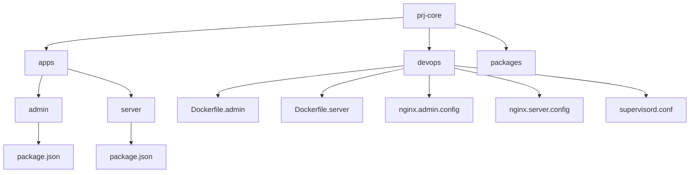
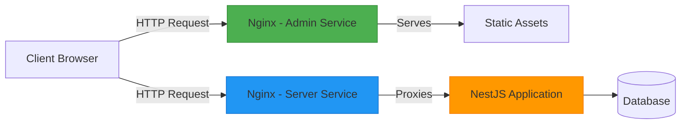
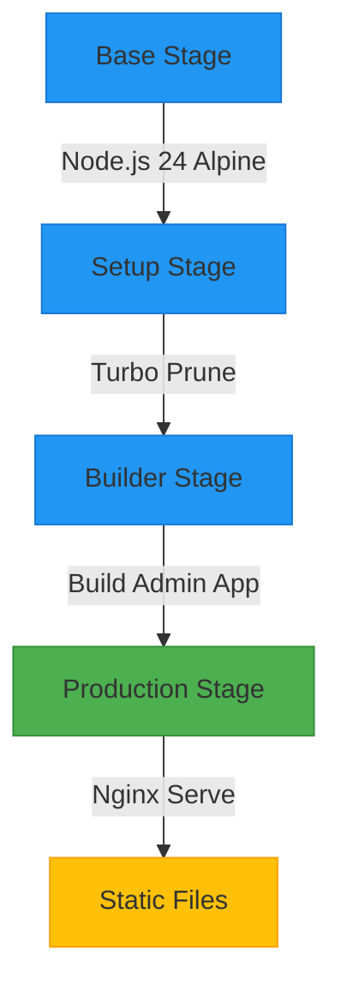
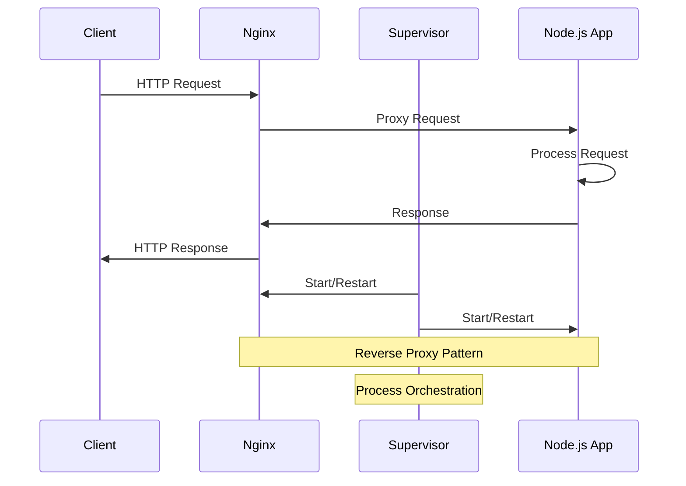
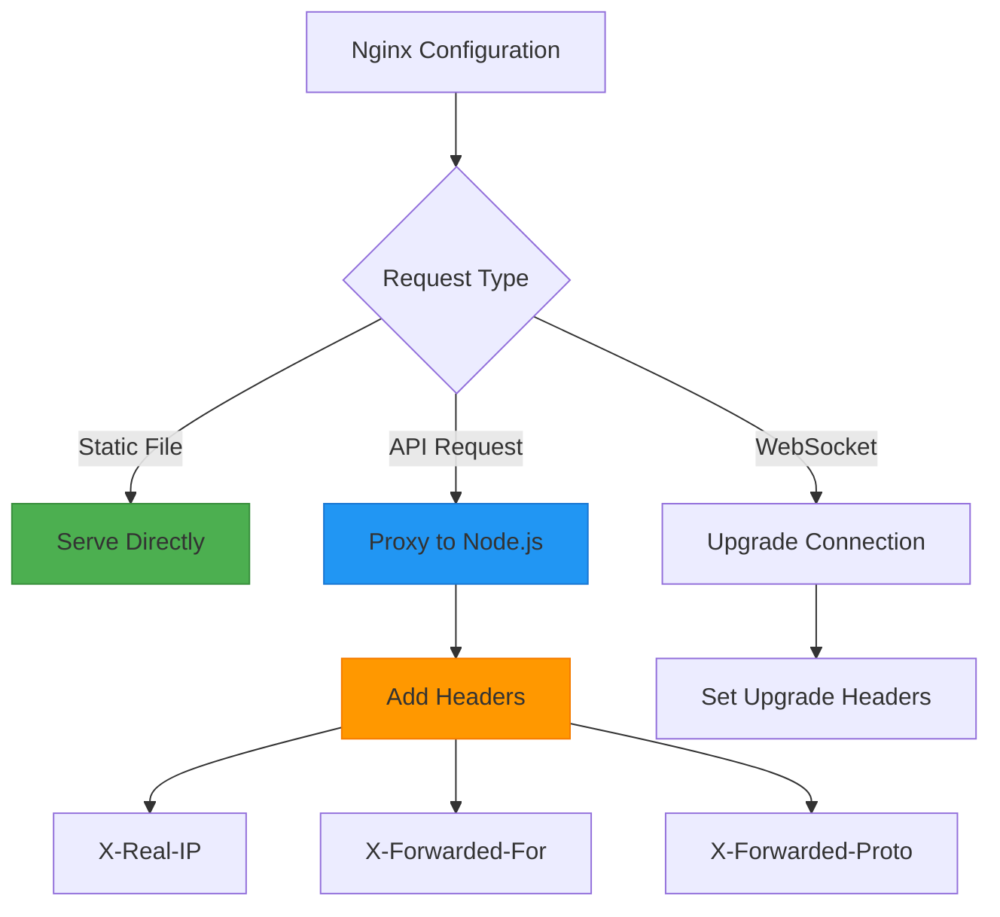
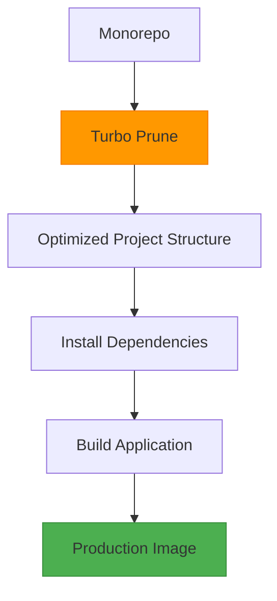

# Docker Compose Orchestration

<cite>
**Referenced Files in This Document**   
- [devops/Dockerfile.admin](file://devops/Dockerfile.admin)
- [devops/Dockerfile.server](file://devops/Dockerfile.server)
- [devops/nginx.admin.config](file://devops/nginx.admin.config)
- [devops/nginx.server.config](file://devops/nginx.server.config)
- [devops/supervisord.conf](file://devops/supervisord.conf)
- [apps/admin/package.json](file://apps/admin/package.json)
- [apps/server/package.json](file://apps/server/package.json)
</cite>

## Table of Contents
1. [Introduction](#introduction)
2. [Project Structure](#project-structure)
3. [Core Components](#core-components)
4. [Architecture Overview](#architecture-overview)
5. [Detailed Component Analysis](#detailed-component-analysis)
6. [Dependency Analysis](#dependency-analysis)
7. [Performance Considerations](#performance-considerations)
8. [Troubleshooting Guide](#troubleshooting-guide)
9. [Conclusion](#conclusion)

## Introduction
This document provides comprehensive documentation for the Docker orchestration setup in the prj-core repository. The system is designed to containerize and orchestrate two primary applications: a server API built with NestJS and an admin frontend application built with React. The orchestration leverages multi-stage Docker builds for optimization, Nginx for serving static assets and reverse proxying, and supervisor for managing multiple processes within containers. Although a docker-compose.yaml file is not present in the root directory, the infrastructure is fully containerized with Dockerfiles and configuration files located in the devops directory that would typically be referenced by such a compose file.

## Project Structure
The project follows a monorepo structure with applications separated into distinct directories under the apps folder. The server application is a NestJS backend API, while the admin application is a React-based frontend interface. Both applications have their own Docker build configurations in the devops directory, which contain multi-stage Dockerfiles for optimized production builds. The build process leverages Turbo for monorepo optimization, ensuring only relevant dependencies are included in each container. Nginx configuration files are provided for both applications, with the server using Nginx as a reverse proxy in front of the Node.js application, and the admin application using Nginx to serve static files.

**Diagram sources**
- [devops/Dockerfile.admin](file://devops/Dockerfile.admin)
- [devops/Dockerfile.server](file://devops/Dockerfile.server)
- [apps/admin/package.json](file://apps/admin/package.json)
- [apps/server/package.json](file://apps/server/package.json)

**Section sources**
- [devops/Dockerfile.admin](file://devops/Dockerfile.admin)
- [devops/Dockerfile.server](file://devops/Dockerfile.server)

## Core Components
The core components of the Docker orchestration system include two Dockerfiles for building container images, Nginx configuration files for web serving and reverse proxy functionality, and a supervisord configuration for process management. The Dockerfiles implement multi-stage builds to optimize image size and build efficiency, using Turbo to prune unnecessary dependencies from the monorepo structure. The admin application is built as a static site served by Nginx, while the server application runs as a Node.js process behind an Nginx reverse proxy. Supervisor is used in the server container to manage both the Nginx process and the Node.js application simultaneously.

**Section sources**
- [devops/Dockerfile.admin](file://devops/Dockerfile.admin#L1-L89)
- [devops/Dockerfile.server](file://devops/Dockerfile.server#L1-L110)
- [devops/supervisord.conf](file://devops/supervisord.conf#L1-L23)

## Architecture Overview
The architecture consists of two main services that would be defined in a docker-compose.yaml file: an admin frontend service and a server API service. The admin service builds a React application into static files and serves them via Nginx on port 80. The server service runs a NestJS application on port 3006 internally, with Nginx acting as a reverse proxy on port 80 to handle incoming HTTP requests and forward them to the Node.js application. This setup provides benefits such as improved security, better performance through static file serving and gzip compression, and WebSocket support through proper header forwarding.

**Diagram sources**
- [devops/nginx.admin.config](file://devops/nginx.admin.config#L1-L16)
- [devops/nginx.server.config](file://devops/nginx.server.config#L1-L74)
- [devops/Dockerfile.server](file://devops/Dockerfile.server#L81-L110)

## Detailed Component Analysis

### Admin Frontend Service Analysis
The admin frontend service is configured through the Dockerfile.admin and nginx.admin.config files. The build process uses a multi-stage approach with four distinct stages: base environment setup, dependency analysis, application building, and production serving. The base stage establishes a Node.js 24 Alpine environment with PNPM package management. The setup stage uses Turbo to analyze dependencies and create an optimized project structure containing only files relevant to the admin application. The builder stage installs dependencies and compiles the React application into static files. Finally, the production stage uses an Nginx Alpine image to serve the static files, copying the build output to Nginx's web root directory and applying the custom nginx.admin.config configuration.

**Diagram sources**
- [devops/Dockerfile.admin](file://devops/Dockerfile.admin#L1-L89)

**Section sources**
- [devops/Dockerfile.admin](file://devops/Dockerfile.admin#L1-L89)
- [devops/nginx.admin.config](file://devops/nginx.admin.config#L1-L16)

### Server API Service Analysis
The server API service is more complex, requiring the coordination of multiple processes within a single container. The Dockerfile.server implements a multi-stage build similar to the admin service but with additional complexity for runtime process management. After building the NestJS application, the production stage uses supervisor to run both Nginx and the Node.js application simultaneously. Nginx listens on port 80 and acts as a reverse proxy, forwarding requests to the Node.js application running on port 3006. The nginx.server.config file includes advanced configuration for WebSocket support, gzip compression, and proper header forwarding to ensure the backend application receives accurate client information. The supervisord.conf file defines both the nginx and node-app programs, ensuring they start automatically and restart if they fail.

**Diagram sources**
- [devops/Dockerfile.server](file://devops/Dockerfile.server#L1-L110)
- [devops/nginx.server.config](file://devops/nginx.server.config#L1-L74)
- [devops/supervisord.conf](file://devops/supervisord.conf#L1-L23)

**Section sources**
- [devops/Dockerfile.server](file://devops/Dockerfile.server#L1-L110)
- [devops/nginx.server.config](file://devops/nginx.server.config#L1-L74)
- [devops/supervisord.conf](file://devops/supervisord.conf#L1-L23)

### Environment Configuration Analysis
The environment configuration for both services is managed through the Docker build process and runtime configuration files. The admin service uses a straightforward configuration with Nginx serving static files and handling client-side routing through the try_files directive, which enables client-side routing by serving index.html for any route not matching a static file. The server service has more complex configuration requirements, with Nginx configured to forward important headers such as X-Real-IP, X-Forwarded-For, and X-Forwarded-Proto to ensure the Node.js application has access to accurate client information. The configuration also includes gzip compression settings to improve performance by reducing the size of text-based responses.

**Diagram sources**
- [devops/nginx.admin.config](file://devops/nginx.admin.config#L1-L16)
- [devops/nginx.server.config](file://devops/nginx.server.config#L1-L74)

**Section sources**
- [devops/nginx.admin.config](file://devops/nginx.admin.config#L1-L16)
- [devops/nginx.server.config](file://devops/nginx.server.config#L1-L74)

## Dependency Analysis
The dependency management strategy leverages Turbo's monorepo capabilities to optimize the Docker build process. Both Dockerfiles use the "turbo prune" command to analyze the dependency graph and create a minimal project structure containing only the files and dependencies required for each specific application. This approach significantly reduces build times and image sizes by eliminating unnecessary files from the build context. The base images use Alpine Linux for minimal footprint, and package installation is optimized with cache mounting to avoid re-downloading dependencies on subsequent builds. The final images contain only the necessary runtime dependencies, with build-time dependencies excluded through the multi-stage build process.

**Diagram sources**
- [devops/Dockerfile.admin](file://devops/Dockerfile.admin#L30-L45)
- [devops/Dockerfile.server](file://devops/Dockerfile.server#L34-L46)

**Section sources**
- [devops/Dockerfile.admin](file://devops/Dockerfile.admin#L30-L45)
- [devops/Dockerfile.server](file://devops/Dockerfile.server#L34-L46)

## Performance Considerations
The Docker orchestration setup includes several performance optimizations. The multi-stage builds ensure minimal image sizes by separating build and runtime environments. The use of Alpine Linux base images reduces the attack surface and decreases download times. For the server application, Nginx provides gzip compression for text-based responses, reducing bandwidth usage and improving load times. The admin application benefits from Nginx's efficient static file serving capabilities, with proper caching headers and MIME type handling. The build process uses cache mounting for PNPM dependencies, significantly speeding up subsequent builds. Additionally, the use of Turbo for dependency pruning ensures that only relevant code is included in each container, reducing the attack surface and improving startup times.

**Section sources**
- [devops/Dockerfile.admin](file://devops/Dockerfile.admin#L55-L59)
- [devops/Dockerfile.server](file://devops/Dockerfile.server#L62-L66)
- [devops/nginx.server.config](file://devops/nginx.server.config#L58-L73)

## Troubleshooting Guide
When troubleshooting issues with the Docker containers, several key areas should be examined. For the admin service, verify that the build process completes successfully and that static files are correctly copied to the Nginx web root directory. Check the nginx.admin.config file to ensure the try_files directive is properly configured for client-side routing. For the server service, verify that supervisor is correctly managing both the Nginx and Node.js processes by checking the supervisord.conf file. Ensure that Nginx is properly forwarding requests to the Node.js application on port 3006 and that all necessary headers are being passed through. Network connectivity issues can often be traced to incorrect port mappings or firewall rules. Log files for both Nginx and the Node.js application should be checked for error messages, with supervisor configured to output logs to stdout and stderr for easy container log access.

**Section sources**
- [devops/supervisord.conf](file://devops/supervisord.conf#L1-L23)
- [devops/nginx.server.config](file://devops/nginx.server.config#L1-L74)
- [devops/Dockerfile.server](file://devops/Dockerfile.server#L108-L109)

## Conclusion
The Docker orchestration setup for prj-core demonstrates a sophisticated approach to containerizing a monorepo application with multiple services. By leveraging multi-stage builds, Turbo for dependency optimization, and Nginx for both static file serving and reverse proxy functionality, the system achieves a balance of performance, security, and maintainability. The absence of a docker-compose.yaml file in the root directory suggests that container orchestration may be managed through alternative means such as Kubernetes, custom scripts, or CI/CD pipeline configurations. The architecture provides a solid foundation for scaling the application, with clear separation of concerns between the frontend and backend services and robust configuration for production deployment.