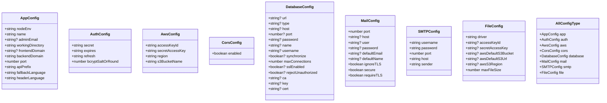

# Environment Configuration Management

<cite>
**Referenced Files in This Document**   
- [app.config.ts](file://apps/server/src/shared/config/app.config.ts)
- [auth.config.ts](file://apps/server/src/shared/config/auth.config.ts)
- [aws.config.ts](file://apps/server/src/shared/config/aws.config.ts)
- [cors.config.ts](file://apps/server/src/shared/config/cors.config.ts)
- [database.config.ts](file://apps/server/src/shared/config/database.config.ts)
- [mail.config.ts](file://apps/server/src/shared/config/mail.config.ts)
- [smtp.config.ts](file://apps/server/src/shared/config/smtp.config.ts)
- [file.config.ts](file://apps/server/src/shared/config/file.config.ts)
- [config.type.ts](file://apps/server/src/shared/config/config.type.ts)
- [index.ts](file://apps/server/src/shared/config/index.ts)
- [main.ts](file://apps/server/src/main.ts)
- [Dockerfile](file://apps/server/Dockerfile)
</cite>

## Table of Contents
1. [Introduction](#introduction)
2. [Configuration Architecture](#configuration-architecture)
3. [Core Configuration Domains](#core-configuration-domains)
4. [Type Safety and Validation](#type-safety-and-validation)
5. [Environment Variable Loading Process](#environment-variable-loading-process)
6. [Docker Integration](#docker-integration)
7. [Configuration Module Registration](#configuration-module-registration)
8. [Accessing Configuration Values](#accessing-configuration-values)
9. [Environment-Specific Settings](#environment-specific-settings)
10. [Best Practices](#best-practices)

## Introduction

The environment configuration management system in prj-core implements a hierarchical, type-safe approach to managing application settings across different environments. Built on NestJS ConfigModule, this system provides a structured way to separate configuration concerns across domains such as database, authentication, AWS services, CORS, logging, and mail. The configuration system ensures type safety, validates environment variables at startup, and supports default values with required parameter enforcement.

**Section sources**
- [app.config.ts](file://apps/server/src/shared/config/app.config.ts#L1-L57)
- [config.type.ts](file://apps/server/src/shared/config/config.type.ts#L1-L109)

## Configuration Architecture

The configuration system follows a modular architecture with domain-specific configuration files that are aggregated into a unified configuration object. Each configuration domain is isolated in its own file, promoting separation of concerns and maintainability.


**Diagram sources**
- [app.config.ts](file://apps/server/src/shared/config/app.config.ts)
- [auth.config.ts](file://apps/server/src/shared/config/auth.config.ts)
- [aws.config.ts](file://apps/server/src/shared/config/aws.config.ts)
- [cors.config.ts](file://apps/server/src/shared/config/cors.config.ts)
- [database.config.ts](file://apps/server/src/shared/config/database.config.ts)
- [mail.config.ts](file://apps/server/src/shared/config/mail.config.ts)
- [smtp.config.ts](file://apps/server/src/shared/config/smtp.config.ts)
- [file.config.ts](file://apps/server/src/shared/config/file.config.ts)

**Section sources**
- [index.ts](file://apps/server/src/shared/config/index.ts#L1-L23)
- [config.type.ts](file://apps/server/src/shared/config/config.type.ts#L1-L109)

## Core Configuration Domains

The system separates configuration concerns into distinct domains, each handling a specific aspect of the application's configuration:

### Application Configuration
Manages core application settings including environment, name, ports, domains, and API prefixes.

**Section sources**
- [app.config.ts](file://apps/server/src/shared/config/app.config.ts#L1-L57)

### Authentication Configuration
Handles JWT authentication settings including secrets, token expiration times, and bcrypt salt rounds.

**Section sources**
- [auth.config.ts](file://apps/server/src/shared/config/auth.config.ts#L1-L40)

### AWS Configuration
Manages AWS service credentials and settings including access keys, region, and S3 bucket configuration.

**Section sources**
- [aws.config.ts](file://apps/server/src/shared/config/aws.config.ts#L1-L30)

### CORS Configuration
Controls cross-origin resource sharing settings, enabling or disabling CORS based on environment.

**Section sources**
- [cors.config.ts](file://apps/server/src/shared/config/cors.config.ts#L1-L18)

### Database Configuration
Handles database connection parameters including host, port, credentials, and SSL settings.

**Section sources**
- [database.config.ts](file://apps/server/src/shared/config/database.config.ts#L1-L42)

### Mail and SMTP Configuration
Manages email service settings for both general mail configuration and specific SMTP server settings.

**Section sources**
- [mail.config.ts](file://apps/server/src/shared/config/mail.config.ts#L1-L32)
- [smtp.config.ts](file://apps/server/src/shared/config/smtp.config.ts#L1-L34)

### File Storage Configuration
Handles file storage settings including storage driver (local or S3), AWS credentials, and file size limits.

**Section sources**
- [file.config.ts](file://apps/server/src/shared/config/file.config.ts#L1-L36)

## Type Safety and Validation

The configuration system implements robust type safety and validation mechanisms to ensure configuration integrity.

### Type Definitions
All configuration domains are defined with TypeScript interfaces in config.type.ts, providing compile-time type checking.



**Diagram sources**
- [config.type.ts](file://apps/server/src/shared/config/config.type.ts#L1-L109)

### Validation Mechanism
Each configuration file implements validation using class-validator decorators to ensure environment variables meet required criteria before application startup.


**Diagram sources**
- [app.config.ts](file://apps/server/src/shared/config/app.config.ts#L6-L39)
- [auth.config.ts](file://apps/server/src/shared/config/auth.config.ts#L6-L18)
- [aws.config.ts](file://apps/server/src/shared/config/aws.config.ts#L6-L17)
- [cors.config.ts](file://apps/server/src/shared/config/cors.config.ts#L6-L8)

**Section sources**
- [app.config.ts](file://apps/server/src/shared/config/app.config.ts#L1-L57)
- [auth.config.ts](file://apps/server/src/shared/config/auth.config.ts#L1-L40)
- [aws.config.ts](file://apps/server/src/shared/config/aws.config.ts#L1-L30)
- [cors.config.ts](file://apps/server/src/shared/config/cors.config.ts#L1-L18)

## Environment Variable Loading Process

The configuration system follows a systematic process for loading and processing environment variables.

### Loading Sequence
1. Application starts and loads environment variables from the environment
2. Each configuration file validates its required environment variables
3. Configuration values are processed and transformed as needed
4. Default values are applied for optional parameters
5. Configuration object is registered with NestJS ConfigModule
6. Configuration is made available for dependency injection

### Value Transformation
The system applies various transformations to environment variables:
- String to number conversion for port values
- Boolean conversion for flag values
- URL validation for domain settings
- Enum validation for categorical values

**Section sources**
- [app.config.ts](file://apps/server/src/shared/config/app.config.ts#L41-L56)
- [auth.config.ts](file://apps/server/src/shared/config/auth.config.ts#L20-L39)
- [aws.config.ts](file://apps/server/src/shared/config/aws.config.ts#L20-L28)

## Docker Integration

The configuration system is designed to work seamlessly with Docker, allowing environment variables to be injected at container runtime.

### Docker Environment Variables
The system expects specific environment variables to be provided when running in Docker containers:


**Diagram sources**
- [Dockerfile](file://apps/server/Dockerfile)
- [app.config.ts](file://apps/server/src/shared/config/app.config.ts)
- [auth.config.ts](file://apps/server/src/shared/config/auth.config.ts)
- [aws.config.ts](file://apps/server/src/shared/config/aws.config.ts)
- [cors.config.ts](file://apps/server/src/shared/config/cors.config.ts)
- [smtp.config.ts](file://apps/server/src/shared/config/smtp.config.ts)

### Default Values and Required Parameters
The system implements a clear distinction between required and optional parameters:
- Required parameters throw errors if not provided
- Optional parameters have sensible defaults
- Default values are documented and predictable

**Section sources**
- [app.config.ts](file://apps/server/src/shared/config/app.config.ts#L45-L56)
- [auth.config.ts](file://apps/server/src/shared/config/auth.config.ts#L23-L32)
- [aws.config.ts](file://apps/server/src/shared/config/aws.config.ts#L24-L27)

## Configuration Module Registration

The configuration system uses NestJS ConfigModule for module registration and dependency injection.

### Module Setup
Configuration modules are registered in the application's main module, making them available throughout the application.


**Diagram sources**
- [main.ts](file://apps/server/src/main.ts)
- [app.config.ts](file://apps/server/src/shared/config/app.config.ts)
- [auth.config.ts](file://apps/server/src/shared/config/auth.config.ts)
- [aws.config.ts](file://apps/server/src/shared/config/aws.config.ts)
- [cors.config.ts](file://apps/server/src/shared/config/cors.config.ts)
- [smtp.config.ts](file://apps/server/src/shared/config/smtp.config.ts)

**Section sources**
- [main.ts](file://apps/server/src/main.ts)
- [index.ts](file://apps/server/src/shared/config/index.ts#L1-L7)

## Accessing Configuration Values

Configuration values can be accessed throughout the application using NestJS dependency injection.

### Dependency Injection Pattern
Components inject the ConfigService to access configuration values in a type-safe manner.

```mermaid
classDiagram
class ConfigService {
+get<T>(propertyPath : string) : T
+getOrThrow<T>(propertyPath : string) : T
}
class AppController {
-configService : ConfigService
+getAppInfo() : object
}
class AuthService {
-configService : ConfigService
+generateToken() : string
}
class AwsService {
-configService : ConfigService
+uploadFile() : Promise<string>
}
class MailService {
-configService : ConfigService
+sendEmail() : Promise<void>
}
ConfigService <|-- AppController : "dependency"
ConfigService <|-- AuthService : "dependency"
ConfigService <|-- AwsService : "dependency"
ConfigService <|-- MailService : "dependency"
note right of AppController
Uses configService.get('app.name')
and configService.get('app.port')
end note
note right of AuthService
Uses configService.get('auth.secret')
and configService.get('auth.expires')
end note
note right of AwsService
Uses configService.get('aws.accessKeyId')
and configService.get('aws.s3BucketName')
end note
note right of MailService
Uses configService.get('smtp.host')
and configService.get('smtp.port')
end note
```

**Diagram sources**
- [app.config.ts](file://apps/server/src/shared/config/app.config.ts)
- [auth.config.ts](file://apps/server/src/shared/config/auth.config.ts)
- [aws.config.ts](file://apps/server/src/shared/config/aws.config.ts)
- [smtp.config.ts](file://apps/server/src/shared/config/smtp.config.ts)

### Access Patterns
Configuration values are accessed using dot notation to navigate the configuration hierarchy:

- `configService.get('app.name')` - Application name
- `configService.get('auth.secret')` - JWT secret
- `configService.get('aws.region')` - AWS region
- `configService.get('cors.enabled')` - CORS enabled flag
- `configService.get('smtp.port')` - SMTP port

**Section sources**
- [app.config.ts](file://apps/server/src/shared/config/app.config.ts)
- [auth.config.ts](file://apps/server/src/shared/config/auth.config.ts)
- [aws.config.ts](file://apps/server/src/shared/config/aws.config.ts)
- [cors.config.ts](file://apps/server/src/shared/config/cors.config.ts)
- [smtp.config.ts](file://apps/server/src/shared/config/smtp.config.ts)

## Environment-Specific Settings

The configuration system supports different settings for development, staging, and production environments.

### Environment Variables by Environment
| Environment | NODE_ENV | APP_PORT | CORS_ENABLED | Required Parameters |
|-----------|----------|----------|--------------|-------------------|
| Development | development | 3006 | true | Minimal |
| Staging | staging | 3006 | true | All required |
| Production | production | 3006 | true | All required with strict validation |

**Section sources**
- [app.config.ts](file://apps/server/src/shared/config/app.config.ts#L6-L10)
- [cors.config.ts](file://apps/server/src/shared/config/cors.config.ts#L15-L16)

### Best Practices for Environment Management
1. Use environment-specific .env files for local development
2. Store sensitive credentials in secure secrets management systems
3. Never commit sensitive information to version control
4. Use consistent naming conventions for environment variables
5. Document all required environment variables
6. Implement comprehensive validation for production environments

## Best Practices

### Configuration Design Principles
- **Separation of Concerns**: Each configuration domain has its own file
- **Type Safety**: All configuration values are strongly typed
- **Validation**: Environment variables are validated at startup
- **Default Values**: Sensible defaults are provided for optional parameters
- **Error Handling**: Clear error messages for missing required parameters

### Security Considerations
- Never hardcode sensitive information
- Use environment variables for secrets
- Validate and sanitize all configuration inputs
- Implement strict validation in production
- Rotate secrets regularly

### Maintenance Guidelines
- Document all configuration options
- Use consistent naming conventions
- Group related configuration options
- Keep configuration files focused on their domain
- Regularly review and update configuration requirements

**Section sources**
- [app.config.ts](file://apps/server/src/shared/config/app.config.ts)
- [auth.config.ts](file://apps/server/src/shared/config/auth.config.ts)
- [aws.config.ts](file://apps/server/src/shared/config/aws.config.ts)
- [cors.config.ts](file://apps/server/src/shared/config/cors.config.ts)
- [smtp.config.ts](file://apps/server/src/shared/config/smtp.config.ts)
- [config.type.ts](file://apps/server/src/shared/config/config.type.ts)