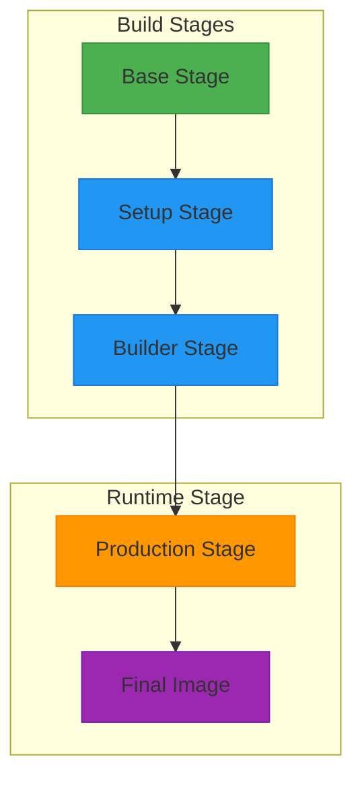
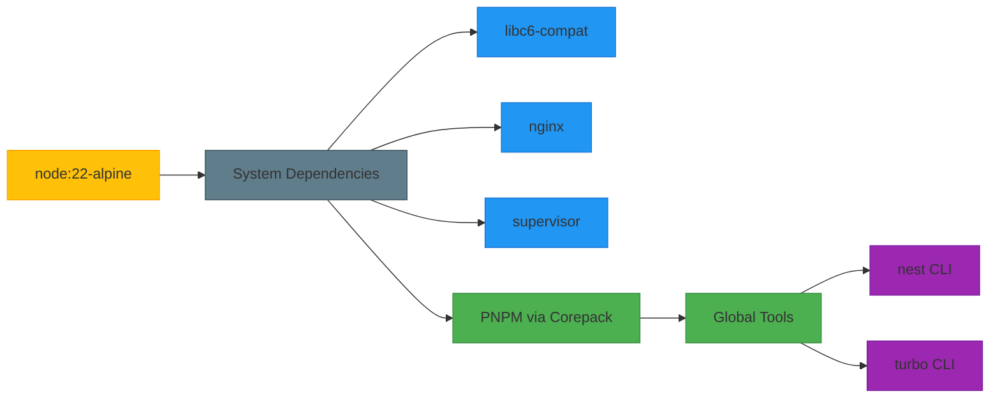
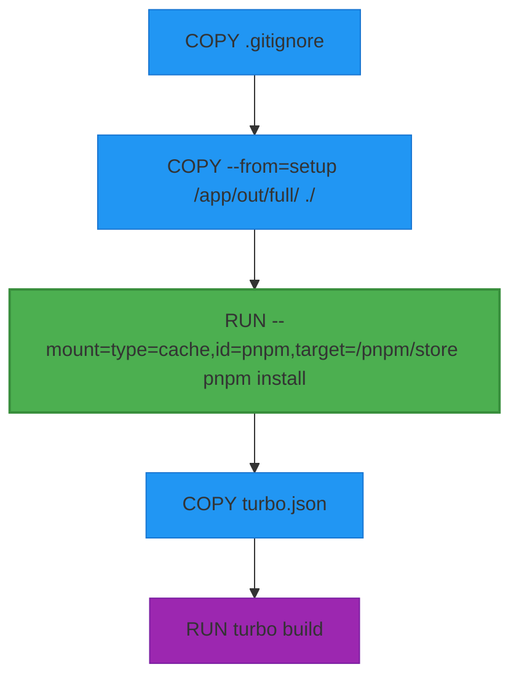
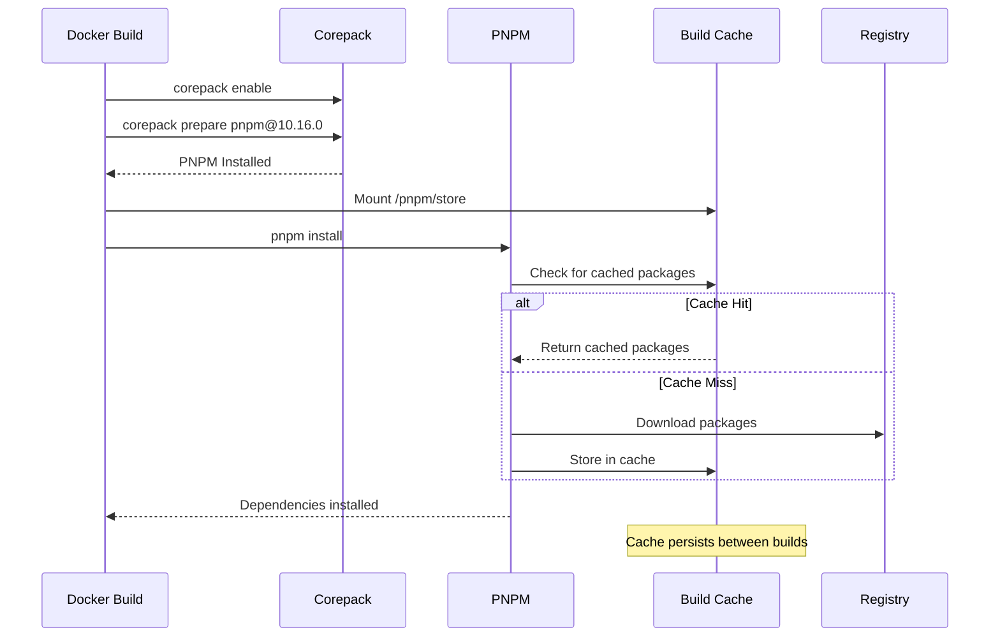
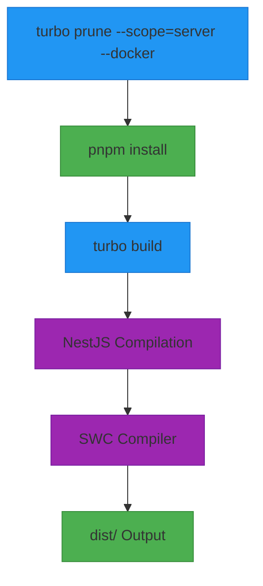
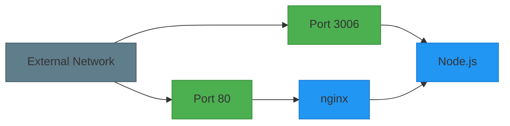

# Server Docker Configuration

<cite>
**Referenced Files in This Document**   
- [Dockerfile.server](file://devops/Dockerfile.server)
- [nginx.server.config](file://devops/nginx.server.config)
- [supervisord.conf](file://devops/supervisord.conf)
- [main.ts](file://apps/server/src/main.ts)
- [setNestApp.ts](file://apps/server/src/setNestApp.ts)
- [nest-cli.json](file://apps/server/nest-cli.json)
- [tsconfig.json](file://apps/server/tsconfig.json)
- [tsconfig.build.json](file://apps/server/tsconfig.build.json)
- [package.json](file://apps/server/package.json)
- [turbo.json](file://turbo.json)
</cite>

## Table of Contents
1. [Introduction](#introduction)
2. [Multi-Stage Docker Build Process](#multi-stage-docker-build-process)
3. [Base Image Selection and Environment Setup](#base-image-selection-and-environment-setup)
4. [Layer Optimization and Caching Strategies](#layer-optimization-and-caching-strategies)
5. [Build Context and Working Directory Configuration](#build-context-and-working-directory-configuration)
6. [Dependency Management with PNPM](#dependency-management-with-pnpm)
7. [Source Code Copying Patterns](#source-code-copying-patterns)
8. [Production Build Process with Turborepo](#production-build-process-with-turborepo)
9. [Runtime Configuration and Process Management](#runtime-configuration-and-process-management)
10. [Port Exposure and Network Configuration](#port-exposure-and-network-configuration)
11. [Container Security Considerations](#container-security-considerations)
12. [Best Practices for Containerizing NestJS Applications](#best-practices-for-containerizing-nestjs-applications)

## Introduction
This document provides comprehensive documentation for the NestJS server Docker configuration within the prj-core monorepo. The configuration implements a sophisticated multi-stage build process optimized for production deployment, leveraging Turborepo for efficient monorepo builds and Alpine Linux for minimal image size. The Docker setup is designed to containerize a NestJS application with optimal performance, security, and maintainability in a monorepo environment.

**Section sources**
- [Dockerfile.server](file://devops/Dockerfile.server#L1-L110)

## Multi-Stage Docker Build Process
The Docker configuration implements a four-stage build process designed to optimize both build efficiency and runtime performance:

1. **Base Stage**: Establishes the foundational environment with Node.js, PNPM, and essential tools
2. **Setup Stage**: Analyzes the monorepo structure and prunes unnecessary dependencies
3. **Builder Stage**: Installs dependencies and compiles the application
4. **Production Stage**: Creates the final runtime image with minimal footprint

This multi-stage approach ensures that build-time dependencies and tooling are excluded from the final image, significantly reducing attack surface and image size.



**Diagram sources**
- [Dockerfile.server](file://devops/Dockerfile.server#L2-L110)

**Section sources**
- [Dockerfile.server](file://devops/Dockerfile.server#L2-L110)

## Base Image Selection and Environment Setup
The Docker configuration uses `node:22-alpine` as the base image for the build stages and `node:24-alpine` for development, providing several key advantages:

- **Minimal Size**: Alpine Linux is significantly smaller than standard Debian-based images
- **Security**: Reduced attack surface due to minimal package installation
- **Performance**: Faster image pulls and reduced storage requirements

The base stage installs essential system dependencies including `libc6-compat` for Node.js native module compatibility, `nginx` for reverse proxy capabilities, and `supervisor` for process management. PNPM is installed globally via Corepack for consistent package management across the monorepo.



**Diagram sources**
- [Dockerfile.server](file://devops/Dockerfile.server#L5-L30)

**Section sources**
- [Dockerfile.server](file://devops/Dockerfile.server#L5-L30)

## Layer Optimization and Caching Strategies
The Docker configuration implements advanced layer optimization techniques to maximize build cache efficiency:

- **Cache Mounts**: PNPM store is mounted as a cache volume to preserve dependency downloads between builds
- **Layer Ordering**: Immutable layers (dependencies) are created before mutable layers (application code)
- **Multi-Stage Pruning**: Unnecessary files and dependencies are excluded from the final image

The build process leverages Docker's build cache by strategically ordering operations to minimize rebuild times when only application code changes.



**Diagram sources**
- [Dockerfile.server](file://devops/Dockerfile.server#L52-L76)

**Section sources**
- [Dockerfile.server](file://devops/Dockerfile.server#L52-L76)

## Build Context and Working Directory Configuration
The Docker build process establishes a consistent working directory structure and manages build context efficiently:

- **Working Directory**: `/app` is used as the primary working directory across all stages
- **Context Management**: The entire repository is initially copied, but Turborepo's pruning capability creates a minimal context
- **File Organization**: Configuration files are organized in the `devops` directory for separation of concerns

The setup stage uses `turbo prune` to create a minimal project structure containing only files necessary for the server application, significantly reducing the build context size.

**Section sources**
- [Dockerfile.server](file://devops/Dockerfile.server#L31-L45)

## Dependency Management with PNPM
The Docker configuration uses PNPM as the package manager with several optimization strategies:

- **Global Installation**: PNPM is installed globally via Corepack for consistent version management
- **Cache Optimization**: Build cache is leveraged for PNPM store to avoid re-downloading dependencies
- **Monorepo Support**: PNPM workspaces enable efficient dependency management across the monorepo

The configuration specifies PNPM version 10.16.0 as an argument, allowing for version control and consistency across environments.



**Diagram sources**
- [Dockerfile.server](file://devops/Dockerfile.server#L8-L16)
- [Dockerfile.server](file://devops/Dockerfile.server#L66)

**Section sources**
- [Dockerfile.server](file://devops/Dockerfile.server#L8-L16)
- [Dockerfile.server](file://devops/Dockerfile.server#L66)

## Source Code Copying Patterns
The Docker configuration implements strategic source code copying patterns to optimize build performance:

- **Selective Copying**: `.gitignore` is copied first to exclude unnecessary files
- **Pruned Context**: `turbo prune` creates a minimal context with only required files
- **Layered Approach**: Configuration files are copied after dependencies to leverage caching

The pattern ensures that dependency installation (the most time-consuming step) is cached when only application code changes, significantly reducing rebuild times.

**Section sources**
- [Dockerfile.server](file://devops/Dockerfile.server#L52-L60)

## Production Build Process with Turborepo
The build process leverages Turborepo for efficient monorepo builds:

- **Dependency Pruning**: `turbo prune --scope=server --docker` creates a minimal dependency tree
- **Parallel Builds**: Turborepo orchestrates parallel builds of interdependent packages
- **Cache Utilization**: Build outputs are cached according to the turbo.json configuration

The build process compiles the NestJS application using the configuration specified in `nest-cli.json`, which configures SWC (Speedy Web Compiler) for faster TypeScript compilation.



**Diagram sources**
- [Dockerfile.server](file://devops/Dockerfile.server#L45)
- [Dockerfile.server](file://devops/Dockerfile.server#L76)
- [nest-cli.json](file://apps/server/nest-cli.json#L7-L11)
- [turbo.json](file://turbo.json#L54-L66)

**Section sources**
- [Dockerfile.server](file://devops/Dockerfile.server#L45)
- [Dockerfile.server](file://devops/Dockerfile.server#L76)
- [nest-cli.json](file://apps/server/nest-cli.json#L7-L11)
- [turbo.json](file://turbo.json#L54-L66)

## Runtime Configuration and Process Management
The production stage configures the runtime environment with multiple services:

- **Process Manager**: Supervisor manages both nginx and Node.js processes
- **Reverse Proxy**: nginx handles incoming requests and proxies to the Node.js application
- **Configuration Files**: Custom nginx and supervisor configurations are copied to appropriate locations

The container runs as root to manage system services but could be optimized to use non-root users for enhanced security.

```mermaid
flowchart TD
A["CMD [\"/usr/bin/supervisord\", \"-c\", \"/etc/supervisor/supervisord.conf\"]"] --> B["supervisord"]
B --> C["nginx Process"]
B --> D["Node.js Process"]
C --> E["Port 80: Reverse Proxy"]
D --> F["Port 3006: Node.js Application"]
E --> G["Proxy to Node.js"]
style A fill:#9C27B0,stroke:#7B1FA2
style B fill:#FF9800,stroke:#F57C00
style C fill:#2196F3,stroke:#1976D2
style D fill:#2196F3,stroke:#1976D2
style E fill:#4CAF50,stroke:#388E3C
style F fill:#4CAF50,stroke:#388E3C
style G fill:#4CAF50,stroke:#388E3C
```

**Diagram sources**
- [Dockerfile.server](file://devops/Dockerfile.server#L109)
- [supervisord.conf](file://devops/supervisord.conf)
- [nginx.server.config](file://devops/nginx.server.config)

**Section sources**
- [Dockerfile.server](file://devops/Dockerfile.server#L81-L109)
- [supervisord.conf](file://devops/supervisord.conf)
- [nginx.server.config](file://devops/nginx.server.config)

## Port Exposure and Network Configuration
The Docker container exposes multiple ports for different services:

- **Port 80**: Exposed for nginx reverse proxy (HTTP)
- **Port 3006**: Exposed for direct Node.js application access

The nginx configuration routes incoming requests to the Node.js application running on port 3006, providing an additional layer of security and performance optimization.



**Diagram sources**
- [Dockerfile.server](file://devops/Dockerfile.server#L102-L103)

**Section sources**
- [Dockerfile.server](file://devops/Dockerfile.server#L102-L103)

## Container Security Considerations
The Docker configuration includes several security considerations:

- **Minimal Base Image**: Alpine Linux reduces attack surface
- **Process Isolation**: Supervisor manages processes with appropriate permissions
- **Configuration Hardening**: nginx and supervisor configurations are customized for security

Potential security improvements include running as a non-root user, implementing stricter nginx security headers, and using read-only filesystems where possible.

**Section sources**
- [Dockerfile.server](file://devops/Dockerfile.server#L105-L106)
- [nginx.server.config](file://devops/nginx.server.config)
- [supervisord.conf](file://devops/supervisord.conf)

## Best Practices for Containerizing NestJS Applications
Based on the analysis of this Docker configuration, the following best practices are recommended for containerizing NestJS applications in a monorepo context:

1. **Use Multi-Stage Builds**: Separate build and runtime environments to minimize image size
2. **Leverage Monorepo Tools**: Use Turborepo or similar tools to optimize dependency management
3. **Implement Layer Caching**: Strategically order Docker layers to maximize cache utilization
4. **Use Lightweight Base Images**: Alpine Linux or distroless images reduce attack surface
5. **Configure Proper Health Checks**: Implement liveness and readiness probes for production
6. **Manage Environment Variables**: Use Docker secrets or environment files for sensitive data
7. **Optimize Build Context**: Exclude unnecessary files using .dockerignore
8. **Monitor Image Size**: Regularly audit image size and dependencies

The configuration demonstrated in this repository serves as a robust template for containerizing NestJS applications in complex monorepo environments.

**Section sources**
- [Dockerfile.server](file://devops/Dockerfile.server#L1-L110)
- [main.ts](file://apps/server/src/main.ts#L14-L88)
- [setNestApp.ts](file://apps/server/src/setNestApp.ts#L1-L49)